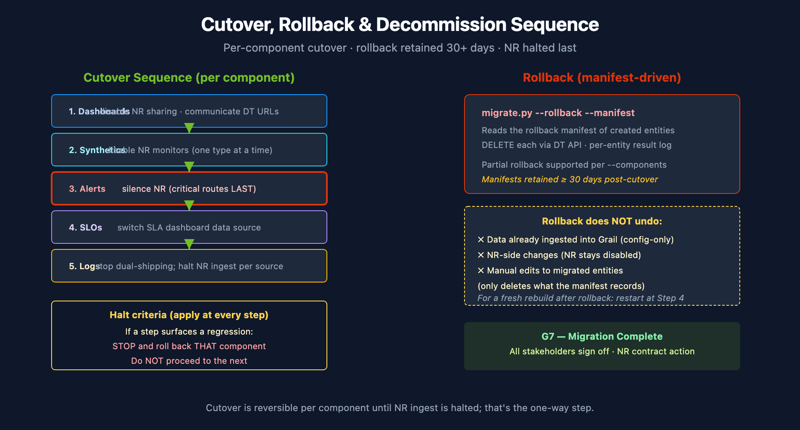

# NR2DT-09: Step 9 — Cutover, Rollback & Decommission

> **Series:** NR2DT | **Notebook:** 9 of 10 | **Created:** April 2026 | **Last Updated:** 04/17/2026

## Overview

**Goal of this step:** complete the cutover from NR to DT. Halt NR ingest, archive NR artifacts, and confirm DT is the sole source of truth. Rollback plan stays valid for 30+ days.

Procedural — see **NRLC-08** (rollback manifest mechanics) and **NRLC-09** (toolchain reference) for depth.

---

## Table of Contents

1. [Cutover Sequence](#cutover)
2. [Rollback Plan](#rollback)
3. [Decommission NR](#decommission)
4. [Step Exit Criteria](#gate)

---

## Prerequisites

| Requirement | Details |
|-------------|----------|
| **Audience** | Migration lead + assigned engineer for this step |
| **Completed** | NR2DT-08 — Validate |
| **Format** | Procedural step — use as a runbook; defer to NRLC for depth |
| **NRLC deep dives** | NRLC-08 (rollback), NRLC-09 (toolchain) |

<a id="cutover"></a>
## 1. Cutover Sequence

Cutover is per-component, sequenced.

| Order | Component | Cutover Action |
|-------|-----------|----------------|
| 1 | Dashboards | Disable NR dashboard sharing; communicate DT URLs to consumers |
| 2 | Synthetics | Disable NR synthetic monitors (one type at a time) |
| 3 | Alerts | Silence remaining NR alert policies (last to silence: critical incident routes) |
| 4 | SLOs | Disable NR SLO reports; switch SLA dashboard data source to DT |
| 5 | Logs | Stop dual-shipping; NR log ingest disabled per source |

**Halt criteria:** if any cutover step surfaces a regression, **stop and roll back that component**. Don't proceed to the next.




<!-- MARKDOWN_TABLE_ALTERNATIVE
| Step | Cutover Action |
|------|----------------|
| 1 | Dashboards — disable NR sharing |
| 2 | Synthetics — disable NR monitors |
| 3 | Alerts — silence NR (critical routes LAST) |
| 4 | SLOs — switch SLA dashboard data source |
| 5 | Logs — halt NR ingest per source |

Rollback manifests retained ≥ 30 days post-cutover.
For environments where SVG doesn't render
-->

<a id="rollback"></a>
## 2. Rollback Plan

Every migration run produced a rollback manifest. Retain for **at least 30 days** post-cutover.

### Rollback command

```bash
python3 migrate.py migrate --rollback run-2026-04-14.json
```

The rollback:

1. Reads the manifest of created entities
2. Calls DELETE on each via DT API
3. Logs each deletion (succeeded / failed / skipped)
4. Produces a rollback report

**Partial rollback:** roll back one component only by filtering the manifest:

```bash
python3 migrate.py migrate --rollback run-2026-04-14.json --components dashboards
```

**What rollback DOES NOT undo:**

- Data already ingested into Grail (configuration-only rollback)
- NR-side changes (NR dashboards stay disabled even after rollback)
- Manual edits to migrated entities (only deletes what the manifest records)

If you need a full rebuild after rollback, treat it as a fresh migration starting from Step 4 (translation is still valid).

<a id="decommission"></a>
## 3. Decommission NR

Final-stage cleanup. Sequenced for safety.

| Order | Action | Reversible? |
|-------|--------|-------------|
| 1 | Disable NR alert routing (Workflows / channels) | Yes — re-enable in NR UI |
| 2 | Set NR dashboards to private / read-only | Yes |
| 3 | Halt NR ingest per source (uninstall / reconfigure agents) | Yes (reinstall) |
| 4 | Export NR account snapshot for archive | One-way |
| 5 | Cancel NR contract / reduce seat count | Per contract terms |

**Decommission gate G9:** all stakeholders sign off that DT is operational and NR is no longer needed.

<a id="gate"></a>
## 4. Step Exit Criteria

**G9 — Migration Complete**

- [ ] All components cut over to DT
- [ ] Rollback manifests retained per retention policy (≥ 30 days)
- [ ] NR alert routing disabled
- [ ] NR dashboards archived / set to read-only
- [ ] NR ingest halted at all sources
- [ ] NR account snapshot exported and stored
- [ ] All stakeholders signed off on completion

**Next step:** **NR2DT-99 — Best Practice Summary** (post-mortem and ongoing best practices).

---

<sub>*This notebook was AI-generated from community-submitted and publicly available sources, including the open-source [Dynatrace-NewRelic](https://github.com/timstewart-dynatrace/Dynatrace-NewRelic), [nrql-engine](https://github.com/timstewart-dynatrace/nrql-engine), and [nrql-translator](https://github.com/timstewart-dynatrace/nrql-translator) projects. This notebook series is not officially supported by Dynatrace or New Relic. Always verify information against the official [Dynatrace documentation](https://docs.dynatrace.com/docs) and [New Relic documentation](https://docs.newrelic.com).*</sub>
