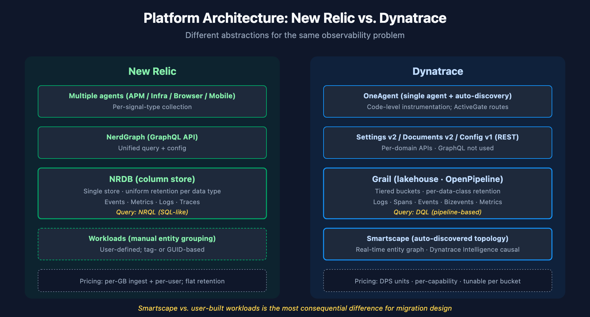

# NRLC-01: New Relic vs. Dynatrace — Platform Comparison

> **Series:** NRLC — New Relic to Dynatrace Migration Deep Dives | **Notebook:** 1 of 9 | **Created:** April 2026 | **Last Updated:** 04/15/2026

## Overview

This deep dive establishes the conceptual foundation for migrating from New Relic to Dynatrace. Before any tooling, queries, or transformations, a clear understanding of how the two platforms differ in **architecture, ingest model, query language, entity hierarchy, IAM, and pricing** prevents the most common migration mistakes — those that come from assuming the platforms are functionally equivalent.

Use this notebook as the conceptual reference; the procedural sequence for executing a migration lives in the companion **NR2DT** series.

### Sprint 1.337 (April 2026) Updates

Three sprint-1.337 changes affect the NR→DT component conversion patterns:

1. **OTel `service.name` enrichment** — Dynatrace now uses the OpenTelemetry `service.name` resource attribute to enrich the existing service entity (Smartscape displays `service.name (detected name)`; new `dt.service.name` field). NR services that emit OTel via the New Relic Collector → Dynatrace path map cleanly without two-services-per-process duplication.
2. **OneAgent primary fields/tags at the source** (`dt.security_context`, `dt.cost.costcenter`, `dt.cost.product` + customer-defined primary tags) — top-level on all signals. Reduces parse-processor work for migrated NR data.
3. **Entity API: `attributes` removed** + **Event API: `metadata` removed from `GET /events`** (sprint-337 Dynatrace API). Update any conversion-engine code (Dynatrace-NewRelic / nrql-engine / nrql-translator) that parses these properties — see [reference_nr_migration_tools memory entry] for the engine repos.

The Authorization scheme by token prefix rule documented in NRLC-05 remains correct and is reinforced by sprint-337's broader Platform-token push.

---

---

## Table of Contents

1. [Architectural Models](#architecture)
2. [Data Ingest & Storage](#ingest)
3. [Query Languages: NRQL vs. DQL](#queries)
4. [Entity Hierarchy](#entities)
5. [Identity, Access & Multi-Tenancy](#iam)
6. [Pricing Models](#pricing)
7. [Concept Mapping Reference](#mapping)

---

## Prerequisites

| Requirement | Details |
|-------------|----------|
| **Audience** | Architects, platform engineers, SRE leads evaluating or executing a NR→Dynatrace migration |
| **Familiarity** | Working knowledge of one platform; this notebook bridges to the other |
| **Companion** | NR2DT-01 — Discover (procedural counterpart) |

## Engine Support (Phase 11–24)

The open-source `Dynatrace-NewRelic` engine covers the cross-platform concepts this notebook introduces. Key transformers you'll hear about again in later notebooks:

| Topic | Transformer / Subcommand | Phase |
|-------|--------------------------|-------|
| APM agent swap per language (Java / .NET / Node / Python / Ruby / PHP / Go) | `agents/` + `migrate.py agents --language <lang>` | 16 |
| `newrelic.*()` SDK call scanner | `custom_instrumentation_translator` + `migrate.py scan-instrumentation` | 16 |
| Browser RUM app config | `browser_rum_transformer` | 16 |
| Mobile RUM app (8 platforms) | `mobile_rum_transformer` | 16 |
| Users / Teams / Roles / SAML / SCIM | `identity_transformer` | 17 |
| Cloud (AWS 16 / Azure 8 / GCP 8) | `cloud_integration_transformer` | 18 |
| Kubernetes → DynaKube | `kubernetes_transformer` | 18 |
| Tenant Gen3 API probe | `migrate.py preflight` | 14 |

See **NRLC-09** for the full 42-transformer + 14-subcommand inventory and [COVERAGE-MATRIX.md](../docs/COVERAGE-MATRIX.md) for the end-to-end NR-surface → DT-equivalent map.

<a id="architecture"></a>
## 1. Architectural Models

**New Relic** is built around a unified telemetry data platform (NRDB) where every signal — metrics, events, logs, traces — is stored as discrete events in a columnar database. Agents (APM, Infrastructure, Browser, Mobile, OpenTelemetry collector) push data via HTTP. NerdGraph (GraphQL) is the unified API for both data queries and configuration.

**Dynatrace** is built around **Smartscape topology + Dynatrace Intelligence + Grail data lakehouse**. OneAgent does deep instrumentation including code-level discovery; ActiveGate handles routing. Configuration lives in Settings (v2) and Documents (v2) APIs; data lives in Grail (queried via DQL). The platform infers entity relationships automatically (Smartscape) and applies causal AI to detect root cause.

| Aspect | New Relic | Dynatrace |
|--------|-----------|-----------|
| Storage backend | NRDB (column store) | Grail (lakehouse: logs, spans, events, bizevents, metrics) |
| Agent model | Multiple agents per signal type | Single OneAgent (auto-discovery) + ActiveGate routing |
| Topology | User-built workloads, manual entity grouping | Smartscape (auto-discovered, real-time) |
| AI model | NRDB anomaly detection + APM Proactive Detection | Dynatrace Intelligence causal engine + adaptive baselines |
| Configuration API | NerdGraph (GraphQL) | Settings v2, Documents v2, Config v1 (REST) |
| Query language | NRQL (SQL-like) | DQL (pipeline-based) |

The most consequential difference: **Dynatrace infers entity relationships automatically; New Relic relies on user-defined workloads.** This affects how dashboards, alerts, and SLOs scope their target entities.




<!-- MARKDOWN_TABLE_ALTERNATIVE
| Aspect | New Relic | Dynatrace |
|--------|-----------|-----------|
| Storage | NRDB column store | Grail lakehouse, tiered buckets |
| Agent | Multiple per signal | OneAgent + ActiveGate |
| Topology | User workloads | Smartscape (auto) |
| AI | NRDB anomaly + APM Proactive | Dynatrace Intelligence causal + adaptive baselines |
| API | NerdGraph (GraphQL) | Settings/Documents/Config (REST) |
| Query | NRQL (SQL-like) | DQL (pipeline) |
For environments where SVG doesn't render
-->

<a id="ingest"></a>
## 2. Data Ingest & Storage

### New Relic
- **Single ingest endpoint per data type** (Metric, Event, Log, Trace APIs)
- All data lands in NRDB; retention is account-wide (typically 8 days for events, 30+ for metrics)
- Drop rules and parsing rules apply at ingest
- **No data tiering** — retention is uniform per data type

### Dynatrace
- **OneAgent + ActiveGate + OpenPipeline + Grail** — multiple ingest paths
- Data routed to **named buckets** with tiered retention (14d / 30d / 365d depending on use case)
- OpenPipeline performs parse, mask, enrich, route, and metric extraction *before* storage
- Per-bucket pricing: "Retain with Included Queries" or "Usage-based"

**Migration implication:** New Relic's flat retention maps poorly to Dynatrace's tiered buckets. Plan retention per data class during migration design (see **ORGNZ-02 — Understanding Grail Buckets** and **ORGNZ-99 — Best Practice Summary** for the recommended bucket strategy template).

<a id="queries"></a>
## 3. Query Languages: NRQL vs. DQL

**NRQL** is SQL-like with `SELECT ... FROM ... WHERE ... FACET ... TIMESERIES`. Single statement, declarative.

**DQL** is pipeline-based: `fetch <source> | filter ... | summarize ... | sort ... | limit N`. Each `|` is a stage that transforms the previous stage's output.

### Side-by-Side Translation

**NRQL:**
```sql
SELECT count(*), average(duration) FROM Transaction
WHERE appName = 'checkout-service' SINCE 1 hour ago
FACET host.hostname TIMESERIES 5 minutes
```

**Equivalent DQL:**
```
fetch spans, from:-1h
| filter service.name == "checkout-service"
| makeTimeseries count = count(), avg_dur = avg(duration), interval:5m, by:{host.name}
```

Key conceptual differences:
- **Source resolution:** NRQL's `FROM Transaction` is a NRDB event class; DQL's `fetch spans` is a Grail data object. The translation maps NR event classes to DT data objects.
- **Time:** NRQL uses `SINCE` / `UNTIL`; DQL uses `from:` / `to:` parameters on `fetch` / `timeseries`.
- **Facets:** NRQL `FACET x` becomes DQL `by:{x}` inside `summarize` or `makeTimeseries`.
- **Timeseries:** NRQL `TIMESERIES N minutes` becomes DQL `makeTimeseries ..., interval:Nm`.

See **NRLC-02: NRQL→DQL Translation** for the full translation surface (292 patterns), confidence scoring, and the open-source [`nrql-engine`](https://github.com/timstewart-dynatrace/nrql-engine) compiler.

<a id="entities"></a>
## 4. Entity Hierarchy

### New Relic
Entities are typed objects (APM Application, Host, Synthetic Monitor, Browser App, Mobile App, etc.) identified by **GUID**. Relationships are explicit but limited — often inferred from APM instrumentation. Workloads group entities manually.

### Dynatrace
Smartscape automatically discovers and connects entities:

**Process → Process Group → Host → Host Group**

Plus: Service → Service Group, Application → Application Group, custom entities, Kubernetes entities (Pod, Cluster, Namespace, Workload).

| New Relic Entity | Dynatrace Equivalent | Notes |
|------------------|----------------------|-------|
| APM Application | Service | Auto-detected by OneAgent code instrumentation |
| Host | Host | Auto-discovered; assigned to host groups |
| Container | Container Group | K8s container / pod-aware |
| Workload | OpenPipeline enrichment + IAM policy condition on enriched attribute | Manual definition; rules-based selectors |
| Synthetic Monitor | HTTP/Browser Monitor | Direct mapping for ping; scripts need adaptation |
| Browser App | RUM Application | OneAgent JS injection or manual tag |
| Mobile App | Mobile Application | Native SDK |
| Lambda Function | AWS Lambda | Cloud integration |

**Migration implication:** NR's GUID references in dashboards and alert conditions don't map 1:1 to DT entity IDs. Use **entity selectors** (`type(SERVICE),entityName("checkout")`) for portability.

<a id="iam"></a>
## 5. Identity, Access & Multi-Tenancy

### New Relic
- **Account / Sub-account** structure with role-based permissions per account
- Users get roles: Admin, Standard User, Restricted User
- Permissions per category (Alerts, APM, Infrastructure, Insights/Dashboards)

### Dynatrace
- **Tenant** (single environment) with **Groups** ↔ **Policies** ↔ **Permissions** model
- IAM policies use ALLOW-WHERE statements with conditions on `storage:bucket-name`, `storage:table`, and DQL attribute filters
- **Bucket routing** + **OpenPipeline enrichment** define the data boundaries; IAM scopes access to those boundaries
- **Policy boundaries** (DT Gen3) constrain what conditions a policy can include

| NR Concept | DT Equivalent | Mapping |
|-----------|--------------|---------|
| Sub-account isolation | Tenant + OpenPipeline-enriched data + IAM policy bucket/attribute condition | Soft isolation via data-level attribute scoping |
| Restricted User | Policy with bucket scope + DQL-attribute conditions | Fine-grained per-resource (Gen3 pattern) |
| Admin role | Tenant admin policy | Full tenant access |

**Migration implication:** A NR multi-account setup typically becomes a single DT tenant + an attribute taxonomy applied via OpenPipeline enrichment + bucket-scoped IAM policies. See **FAQ-01 — Host Group Naming Strategy**, **ORGNZ-02 / ORGNZ-99** (Grail bucket strategy), and the **IAM** series (especially IAM-04 / IAM-05 / IAM-11 WORKSHOP) for the design patterns.

<a id="pricing"></a>
## 6. Pricing Models

### New Relic
- **Usage-based**: per GB of ingested data + per user (Full / Core / Basic)
- Single rate across all data types
- No retention tier discount

### Dynatrace
- **Dynatrace Platform Subscription (DPS)**: consumption units (DPS) tied to specific capability use
- Different DPS rates per capability: log ingest, log retention with included queries, log usage-based queries, full-stack monitoring (host hours), detected problem analysis, etc.
- **Bucket pricing tiers** allow optimization: keep hot data with included queries, cold data on usage-based

| Cost Driver | New Relic | Dynatrace |
|-------------|-----------|-----------|
| Log ingest | $/GB | DPS per GB ingested |
| Log retention | Bundled in retention period | Separate DPS rate; tunable per bucket |
| Log queries | Free within retention | DPS per query (usage-based buckets) or included (RWIQ) |
| Hosts | Per user (full-stack indirectly) | DPS per host hour (FSM) |
| Synthetics | Per check | DPS per execution |

**Migration implication:** NR's flat rate often appears cheaper at small scale but doesn't scale efficiently. DT's tiered model lets you right-size cost per data class. A 30–60% reduction is typical when an OpenPipeline + tiered bucket strategy replaces NR's flat ingest. See **NRLC-07 Logs/Tags/Drops** for cost-optimization patterns.

<a id="mapping"></a>
## 7. Concept Mapping Reference

Quick-reference table for every major concept this series touches:

| New Relic | Dynatrace | Deep Dive |
|-----------|-----------|-----------|
| NRQL | DQL | NRLC-02 |
| Dashboard (multi-page) | Document (single-page × N) | NRLC-03 |
| Alert Policy | Workflow (Gen3) | NRLC-04 |
| NRQL Alert Condition | Metric Event | NRLC-04 |
| APM Condition | Adaptive Baseline (Dynatrace Intelligence) | NRLC-04 |
| Synthetic Ping | HTTP Monitor | NRLC-05 |
| Synthetic Browser | Browser Monitor | NRLC-05 |
| Synthetic API | HTTP Monitor (multi-step) | NRLC-05 |
| Synthetic Step Monitor | Browser Monitor (clickpath) | NRLC-05 |
| SLO | SLO (v2) | NRLC-06 |
| Workload | OpenPipeline enrichment + IAM policy condition on enriched attribute | NRLC-06 |
| Tag | Tag (entity / Grail dimension) | NRLC-07 |
| Drop Rule | OpenPipeline filter | NRLC-07 |
| Notification Channel (Email/Slack/PD) | Notification (built-in / webhook) | NRLC-04 |
| Log Parsing Rule | OpenPipeline DPL parser | NRLC-07 |
| Sub-account | Bucket + OpenPipeline enrichment + IAM | NRLC-01 §5 |
| User Role | IAM Policy + Group | NRLC-01 §5 |

## Summary

The two platforms solve the same observability problem with very different abstractions. Migration succeeds when each NR concept is mapped to its closest DT equivalent and remaining gaps are closed with intentional design — not by trying to make DT behave like NR.

Continue to **NR2DT-01 Discover** for the procedural wave plan + discovery runbook, or jump to a specific topic deep dive via the table above.

---

<sub>*This notebook was AI-generated from community-submitted and publicly available sources, including the open-source [Dynatrace-NewRelic](https://github.com/timstewart-dynatrace/Dynatrace-NewRelic), [nrql-engine](https://github.com/timstewart-dynatrace/nrql-engine) (planned future home: the [`dynatrace-dma`](https://github.com/dynatrace-dma) Dynatrace Migration Assistant organization), and [nrql-translator](https://github.com/timstewart-dynatrace/nrql-translator) projects. This notebook series is not officially supported by Dynatrace or New Relic. Always verify information against the official [Dynatrace documentation](https://docs.dynatrace.com/docs) and [New Relic documentation](https://docs.newrelic.com).*</sub>
