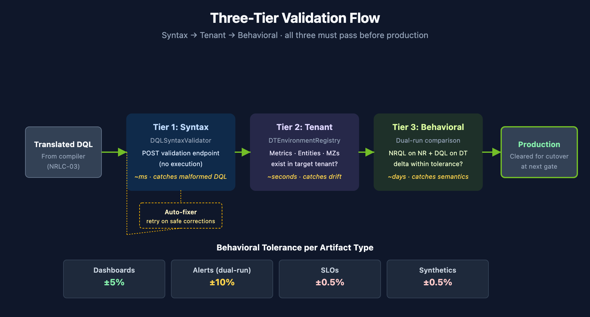

# NRLC-08: Validation, Diff & Rollback

> **Series:** NRLC — New Relic to Dynatrace Migration Deep Dives | **Notebook:** 8 of 9 | **Created:** April 2026 | **Last Updated:** 04/17/2026

## Overview

Validation is what separates a real migration from "we hope this works." This deep dive covers DQL syntax validation, live tenant validation against the DT Environment Registry, diff against existing DT configuration, the rollback manifest pattern, and conversion-quality reports. These are the safety nets the migration runs through before each cutover gate.

---

## Table of Contents

1. [Three-Tier Validation Model](#tiers)
2. [DQL Syntax Validation](#syntax)
3. [Live Tenant Validation (DTEnvironmentRegistry)](#tenant)
4. [Behavioral Validation (Dual Run)](#behavioral)
5. [Diff Against Live Config](#diff)
6. [Rollback Manifests](#rollback)
7. [Conversion Quality Reports](#reports)

---

## Prerequisites

| Requirement | Details |
|-------------|----------|
| **Audience** | Migration leads, QA engineers, SRE doing cutover sign-off |
| **Tooling** | `Dynatrace-NewRelic` validators + `migration/` modules; `nrql-engine`'s `DQLSyntaxValidator` and `DTEnvironmentRegistry` |
| **Required reading** | NRLC-02 (validation depends on the compiler's confidence scoring) |

<a id="tiers"></a>
## 1. Three-Tier Validation Model

Every migrated artifact passes through three tiers of validation:

| Tier | What It Checks | Tool | Speed | Catches |
|------|---------------|------|-------|---------|
| **Tier 1: Syntax** | DQL parses; no malformed JSON | `DQLSyntaxValidator` | Fast | Compiler bugs, malformed translations |
| **Tier 2: Tenant** | Referenced metrics, entities, buckets, enrichment attributes exist | `DTEnvironmentRegistry` | Medium | Environment-specific drift, missing prerequisites |
| **Tier 3: Behavioral** | Same data shape and magnitudes as NR | Dual-run + DQL diff | Slow (days) | Semantic translation errors |

All three tiers must pass before an artifact is production-ready. Skipping Tier 3 is the most common mistake — syntactically valid DQL can still produce wrong numbers.




<!-- MARKDOWN_TABLE_ALTERNATIVE
| Tier | What it checks | Speed |
|------|---------------|-------|
| 1. Syntax | DQL parses (DQLSyntaxValidator) | ms |
| 2. Tenant | Referenced metrics/entities/MZs exist (DTEnvRegistry) | seconds |
| 3. Behavioral | Same data shape/values as NR (dual-run diff) | days |

Tolerance: dashboards ±5%, alerts ±10%, SLOs ±0.5%, synthetics ±0.5%
For environments where SVG doesn't render
-->

<a id="syntax"></a>
## 2. DQL Syntax Validation

The `DQLSyntaxValidator` posts each DQL query to the DT validation endpoint without executing it:

```
POST /api/v2/settings/objects
body: { schemaId: "builtin:problem.metric.events", value: { ...query: "<DQL>" } }
```

DT responds with parser errors if the DQL is invalid. Common issues caught:

- Unknown DQL functions
- Misuse of named parameters (e.g., `round(value, 2)` instead of `round(value, decimals: 2)`)
- Array-vs-scalar type errors on `timeseries` results
- Reserved keyword as field name (must be backtick-quoted)
- Missing time range on `fetch` (warning, not error)

### Auto-Fix Loop

When syntax validation fails, the engine attempts safe corrections via `DQLFixer`:

1. Try applying known fix patterns (named parameters, operator normalization, etc.)
2. Re-validate
3. If still failing, return failure with original DQL + attempted fix + error message

Applied fixes are returned in `result.fixes[]` for transparency.

<a id="tenant"></a>
## 3. Live Tenant Validation (DTEnvironmentRegistry)

Syntax validation only confirms the DQL parses. Tenant validation confirms the DQL refers to things that exist in *your* tenant.

The `DTEnvironmentRegistry` lazy-loads tenant inventory:

| Lookup | Source API | Validates |
|--------|------------|-----------|
| Metric keys (`dt.host.cpu.usage`, etc.) | `GET /api/v2/metrics` | Metric exists; displayName, unit |
| Entity types and IDs | `GET /api/v2/entities` | Entity present; resolves names ↔ IDs |
| Existing dashboards | `GET /platform/document/v1/documents` | Avoids duplicate creation |
| OpenPipeline enrichment rules | `GET /api/v2/settings/objects?schemaIds=builtin:openpipeline.logs.pipelines` (and `.routing`, `.ingest-sources` per scope) | Enrichment rule exists; produces expected attribute values on ingested data |
| Buckets | `GET /platform/storage/management/v1/bucket-definitions` | Bucket exists with expected retention; routing rule targets it correctly |
| Synthetic locations | `GET /api/v2/synthetic/locations` | NR location → DT location lookup |
| Notifications | `GET /api/v2/settings/objects?schemaIds=builtin:problem.notifications` | No duplicate notification objects |

> **Note — OpenPipeline API deprecation:** The direct `GET/PUT /platform/openpipeline/v1/configurations` endpoints are deprecated (SaaS 1.327, EoL **June 29, 2026**). Read and manage OpenPipeline configuration through Settings 2.0 with the `builtin:openpipeline.<scope>.routing`, `builtin:openpipeline.<scope>.pipelines`, and `builtin:openpipeline.<scope>.ingest-sources` schemas. See the official [API deprecation guide](https://docs.dynatrace.com/docs/dynatrace-api/basics/deprecation-migration-guides).

Common failures caught here:

- Migrated alert references `dt.host.cpu.usage` but tenant only ingests `dt.host.cpu.user` (and OOTB metric naming changed in DT version)
- DQL attribute filter references an attribute value not produced by any OpenPipeline enrichment (rule not yet applied or typo)
- Entity name lookup returns multiple matches — ambiguous selector
- Synthetic location `AWS_US_EAST_1` not enabled in target tenant

<a id="behavioral"></a>
## 4. Behavioral Validation (Dual Run)

Both platforms produce numbers from the same underlying world. Validate they agree.

### Dual-Run Pattern

1. Configure NR and DT both ingesting from the same source (during the dual-run window)
2. For each migrated artifact, run the original NRQL against NR and the translated DQL against DT for the **same time window**
3. Compare the result shape and magnitudes
4. Investigate any discrepancy > acceptable tolerance (typically 1–5% depending on artifact type)

### Comparison Tooling

The `Dynatrace-NewRelic` CLI includes `migrate.py audit`, which drives the drift-audit comparison against a captured baseline:

```bash
python3 migrate.py audit --baseline baseline-counts.json
```

Output:

```
NR result:  count = 4823
DT result:  count = 4798
Delta:      0.52%  ✅ within tolerance
```

> The baseline file is produced by a prior export + capture step; the audit command compares current DT output against the baseline values.

### Tolerance by Artifact Type

| Artifact | Tolerance |
|---------|-----------|
| Dashboard count widgets | ±5% (display) |
| Alert thresholds | ±10% during dual-alert tuning |
| SLO SLI values | ±0.5% |
| Synthetic availability | ±0.5% |
| Log volumes | ±5% |

<a id="diff"></a>
## 5. Diff Against Live Config

Before importing migrated artifacts, diff them against what already exists in the target DT tenant. This avoids:

- Duplicating dashboards that already exist (e.g., from a previous partial migration)
- Overwriting tenant admin's customized Workflows
- Recreating notifications when an existing one matches

```bash
python3 migrate.py migrate --diff --components dashboards,alerts
```

Output classifies each migrated entity:

| Status | Action |
|--------|--------|
| `NEW` | Will be created |
| `EXISTING_MATCH` | No-op (identical to existing) |
| `EXISTING_DRIFT` | Existing entity differs — manual review (do not auto-overwrite) |
| `DUPLICATE_NAME` | Different entity with same name — rename or skip |
| `MIGRATION_TAG_MATCH` | Already migrated by a previous run — update or skip |

Always run `migrate --diff` in dry-run before any full import.

<a id="rollback"></a>
## 6. Rollback Manifests

Every migration run generates a **rollback manifest** — a JSON record of every entity created, with enough metadata to reverse the operation.

```json
{
  "runId": "2026-04-14_18-22-05_uuid",
  "createdAt": "2026-04-14T18:22:05Z",
  "entities": [
    {
      "type": "dashboard",
      "dtId": "<document-id>",
      "sourceGuid": "<nr-guid>",
      "createdBy": "migration-token-abc",
      "name": "Checkout — Overview"
    },
    ...
  ]
}
```

### Rollback Command

```bash
python3 migrate.py migrate --rollback run-2026-04-14.json
```

The rollback:

1. Reads the manifest
2. For each entity, calls the appropriate DELETE endpoint
3. Logs each deletion with timestamp + result
4. Produces a rollback report (succeeded / failed / skipped)

**Always retain manifests for at least the dual-run window + 30 days.** Rollback at hour 71 of dual-run is rare but not theoretical.

<a id="reports"></a>
## 7. Conversion Quality Reports

After each migration phase, generate a quality report:

```bash
python3 migrate.py migrate --report --output report.html
```

Report sections:

| Section | Content |
|---------|---------|
| **Summary** | Counts: total / migrated / skipped / failed |
| **By component** | Per-type breakdown: dashboards N/M, alerts N/M, etc. |
| **NRQL conversion** | HIGH / MEDIUM / LOW counts; LOW queries listed |
| **Failed translations** | Each failure with reason and source query |
| **Manual review queue** | APM conditions, scripted browsers, LOW-confidence DQL |
| **Rollback eligibility** | Time-bounded list of recently-migrated entities |

Reports are the migration's audit trail — attach them to your change-management ticket for each phase.

## Summary

Validation is the migration's safety net. Three tiers — syntax, tenant, behavioral — must pass before any artifact is production-ready. Diff and rollback give you reversibility. Conversion-quality reports give you the audit trail.

Continue to **NRLC-09 Toolchain Reference & End-to-End Runbook**.

---

<sub>*This notebook was AI-generated from community-submitted and publicly available sources, including the open-source [Dynatrace-NewRelic](https://github.com/timstewart-dynatrace/Dynatrace-NewRelic), [nrql-engine](https://github.com/timstewart-dynatrace/nrql-engine) (planned future home: the [`dynatrace-dma`](https://github.com/dynatrace-dma) Dynatrace Migration Assistant organization), and [nrql-translator](https://github.com/timstewart-dynatrace/nrql-translator) projects. This notebook series is not officially supported by Dynatrace or New Relic. Always verify information against the official [Dynatrace documentation](https://docs.dynatrace.com/docs) and [New Relic documentation](https://docs.newrelic.com).*</sub>
