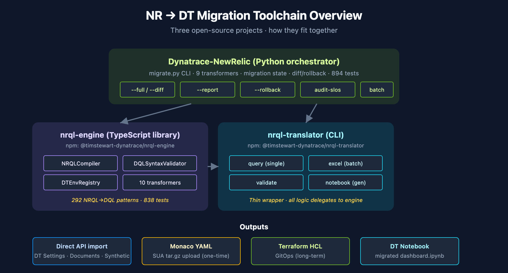

# NRLC-09: Toolchain Reference & End-to-End Runbook

> **Series:** NRLC | **Notebook:** 9 of 9 | **Created:** April 2026 | **Last Updated:** 04/17/2026

## Overview

The master reference for the open-source toolchain that powers every preceding notebook in this series. This deep dive covers how `Dynatrace-NewRelic`, `nrql-engine`, and `nrql-translator` fit together, how to operate the orchestrating CLI, the configuration surface, the export formats (Monaco v2 YAML, Terraform HCL), and a complete end-to-end runbook.

**As of 2026-04-15** the Python orchestrator ships **40+ transformers** across 9 phase batches (Phase 11 foundation + Phases 16–24 expansion), **1,200+ unit tests**, and **292 NRQL translation patterns** pinned to the TypeScript `nrql-engine` via the Phase 19b regression suite. It emits **Gen3 Dynatrace by default** (Workflows, anomaly detectors, Segments, OpenPipeline, Document API); use `--legacy` only for the 8 Gen2-only capabilities or for tenants without Gen3 features.

---

## Table of Contents

1. [The Three Projects — How They Fit](#projects)
2. [Installation & Configuration](#install)
3. [`migrate.py` CLI Reference](#cli)
4. [Component Selection](#components)
5. [Export Formats — Monaco & Terraform](#exports)
6. [End-to-End Runbook](#runbook)
7. [CI/CD Integration Patterns](#cicd)

---

## Prerequisites

| Requirement | Details |
|-------------|----------|
| **Audience** | Engineers operating the migration end-to-end |
| **Required reading** | All preceding NRLC notebooks (this is the operational reference) |
| **Access** | NR API key + DT API token; both with appropriate scopes (see §2) |

<a id="projects"></a>
## 1. The Three Projects — How They Fit

```
┌─────────────────────────────────────────────────────────────┐
│        Dynatrace-NewRelic (Python orchestrator)        │
│  - migrate.py CLI (13 subcommands)                      │
│  - 40+ entity transformers (Phases 11 + 16–24)          │
│  - migration/state, canary, audit, diff, retry, rollback│
│  - exporters/monaco (v2), exporters/terraform           │
└───────────────┬────────────────┴────────────────────────┐
                │ (uses)                            (uses)
                ↓                                     ↓
     ┌────────────────────────┐    ┌─────────────────────────┐
     │  nrql-engine (TS lib)  │    │  Dynatrace + NR APIs    │
     │  - 292 NRQL patterns   │    │                          │
     │  - DQL validator       │    └──────────────────────────┘
     │  - TS↔Python parity    │
     │    pinned via Phase 19b│
     └─────┬─────────────────┘
           │ (wrapped by)
           ↓
     ┌─────────────────────────┐
     │  nrql-translator CLI    │
     │  - single query         │
     │  - batch Excel          │
     │  - notebook gen         │
     └─────────────────────────┘
```

| Use Case | Tool |
|----------|------|
| End-to-end NR→DT migration | `Dynatrace-NewRelic` (`migrate.py`) |
| Embed translation in your own tool/web app | `nrql-engine` |
| One-off NRQL→DQL on the command line | `nrql-translator` |
| Translate a batch of dashboard queries | `nrql-translator excel` or `migrate.py batch` |
| Generate a DT notebook from translated queries | `nrql-translator notebook` |




<!-- MARKDOWN_TABLE_ALTERNATIVE
| Tool | Form | Use Case |
|------|------|----------|
| Dynatrace-NewRelic | Python orchestrator | End-to-end migration via migrate.py (40+ transformers, 13 subcommands) |
| nrql-engine | TS library | Embed translation (292 patterns; TS↔Python parity pinned via Phase 19b CI) |
| nrql-translator | TS CLI | Single query, batch Excel, notebook gen |

Outputs: direct API import, Monaco v2 YAML, Terraform HCL, DT notebook
For environments where SVG doesn't render
-->

### Upstream Home: Dynatrace Migration Assistant (`dynatrace-dma`)

The official Dynatrace migration tooling lives under the [`dynatrace-dma`](https://github.com/dynatrace-dma) GitHub organization — the **Dynatrace Migration Assistant** project. Existing repos in the org:

| Repo | Source Platform | Status |
|------|-----------------|--------|
| [`splunk-to-dynatrace`](https://github.com/dynatrace-dma/splunk-to-dynatrace) | Splunk | Active |
| [`datadog-to-dynatrace`](https://github.com/dynatrace-dma/datadog-to-dynatrace) | Datadog | Active |
| `newrelic-to-dynatrace` *(planned)* | New Relic | `nrql-engine` planned to relocate here; pre-staged sweep command in [ENGINE-LINKS.md](../docs/ENGINE-LINKS.md) |

When the New Relic engine relocates, the recommended install path will become the `dynatrace-dma` repo. Until then, `timstewart-dynatrace/nrql-engine` is canonical.

<a id="install"></a>
## 2. Installation & Configuration

### Dynatrace-NewRelic (Python)

```bash
git clone https://github.com/timstewart-dynatrace/Dynatrace-NewRelic
cd Dynatrace-NewRelic
pip install -r requirements.txt
cp .env.example .env
# Edit .env with NR + DT credentials
```

> **Future home note:** The `nrql-engine` underlying this orchestrator is planned to relocate to the [`dynatrace-dma`](https://github.com/dynatrace-dma) (**Dynatrace Migration Assistant**) organization, joining the existing `splunk-to-dynatrace` and `datadog-to-dynatrace` repos. Track that org for the official Dynatrace-supported install going forward.

### Required NR API Token Scopes

- `read:dashboards`, `read:alerts`, `read:nrql`, `read:synthetics`, `read:slo`, `read:workloads`, `read:logs`

### Required DT API Token Scopes

- `dashboards.read` + `dashboards.write` (or Documents v2: `documents:read`, `documents:write`)
- `metrics.read`
- `entities.read`
- `settings:objects.read` + `settings:objects.write`
- `slo.read` + `slo.write`
- `synthetic.read` + `synthetic.write`
- `notifications.write`
- `iam-policies.read` (for IAM policy + OpenPipeline configuration validation)

> **Note:** These are Classic API token scopes (the `<area>.<action>` style). **Platform Tokens use policy-based permissions** instead and are the recommended default on Gen3 tenants — see Dynatrace IAM docs for the equivalent policy statements. OAuth clients follow the Classic scope style for programmatic access.

### Configuration File (`.env`)

```bash
NR_API_KEY=NRAK-...
NR_ACCOUNT_ID=1234567
NR_REGION=US           # or EU

DT_TENANT_URL=https://abc12345.live.dynatrace.com
DT_API_TOKEN=dt0c01.XXXX...

# Optional
MIGRATION_OUTPUT_DIR=./output
DRY_RUN=false
LOG_LEVEL=INFO
```

Settings are loaded via Pydantic; missing required values fail fast with descriptive errors.

<a id="cli"></a>
## 3. `migrate.py` CLI Reference

### Subcommand inventory (post-Phase-24)

The `migrate.py` entry point registers **13 subcommands**:

`agents, archive, audit, audit-slos, batch, compile, convert, export-monaco, export-terraform, migrate, preflight, reference, scan-instrumentation`

| Subcommand | Purpose |
|---|---|
| `migrate` | Full pipeline (export → transform → import). Accepts `--full`, `--export-only`, `--import-only`, `--dry-run`, `--components`, `--rollback <file>`, `--retry <file>`, `--resume`, `--incremental`, `--report`, `--diff`, `--legacy`, `--canary <pct>`, `--canary-auto-proceed` |
| `compile` | Single NRQL → DQL compilation. Flags: `--interactive`, `--file`, `--validate`, `--output` |
| `convert` | NRQL → DQL with post-processing + auto-fix (wraps `compile` + `DQLFixer`) |
| `batch` | CSV / Excel batch compile (NRQL column) |
| `reference` | Print NRQL → DQL reference table; `--mappings` for full mapping tables (230 metrics + 72 attributes + 90+ aggregations + 34 event types) |
| **`preflight`** | **Phase 14.** Probe target DT tenant for Gen3 API availability (Settings 2.0 / Document / Automation). Suggests `--legacy` if any surface is missing. |
| **`agents`** | **Phase 16.** Per-language APM agent migration action plans (Java / .NET / Node.js / Python / Ruby / PHP / Go). Flags: `--language <lang>`, `--phase`, `--dry-run`. |
| **`scan-instrumentation`** | **Phase 16.** Scan source tree for `newrelic.*()` SDK calls; emit DT/OTel replacement suggestions (side-effect-free; manual apply). |
| **`archive`** | **Phase 17.** Pre-decommission NRDB snapshot (resumable JSONL per event type). |
| **`audit`** | **Phase 20.** Drift detection vs live tenant (also the drift-audit command for baseline-vs-current comparison). Reports RENAMED / DELETED / MODIFIED / EXTRA. Exits 1 on drift. |
| `audit-slos` | Validate DT SLOs against live metrics for missing/invalid keys (Phase 11 + Phase 20 enrichment). |
| `export-monaco` | Emit Monaco v2 project YAML (Gen3 default; `--legacy` for Gen2 shapes). |
| `export-terraform` | Emit Terraform HCL with `dynatrace-oss/dynatrace` provider (Gen3 default; `--legacy` for Gen2 shapes). |

> **Note:** Behavioral validation (running NRQL on NR and DQL on DT and diffing results) is handled via the `audit` subcommand using a captured baseline, not a separate `compare` subcommand.

### Common flags

| Flag | Purpose |
|------|---------|
| `--components <list>` | Restrict to specific entity types |
| `--filter <pattern>` | Filter entities by name regex |
| `--output <dir>` | Override output directory |
| `--log-level <level>` | DEBUG / INFO / WARN / ERROR |
| `--no-color` | Disable colored output (CI-friendly) |
| `--legacy` | Gen2 output path — emits Alerting Profiles / Management Zones / Auto-Tags / Config v1 dashboards instead of Gen3 equivalents. **Always warns at startup.** |
| `--canary <pct>` | Phase 20. Two-wave import — import N% first, await approval, then import remainder |
| `--canary-auto-proceed` | Promote canary to full import automatically if drift audit passes |
| `--report` | Emit enriched conversion report (confidence_score, warning_codes, runbook_url per entry) |

### Transformer coverage

`migrate.py` orchestrates 40+ entity transformers across 9 phase batches. See [COVERAGE-MATRIX.md](../docs/COVERAGE-MATRIX.md) for the complete NR-surface → transformer mapping. High-level summary:

| Phase | Transformers added |
|---|---|
| **11** (foundation) | alert, dashboard, synthetic, slo, workload, infrastructure, log_parsing, tag, drop_rule |
| **16** (P0 coverage) | agents/ orchestrators (7 languages), lambda, browser_rum, mobile_rum, custom_instrumentation_translator |
| **17** (P1 alerts + data + identity) | non_nrql_alert, baseline_alert, lookup_table, maintenance_window, change_tracking, custom_event_ingest, identity, log_obfuscation, tools/nrdb_archive |
| **18** (specialized products) | cloud_integration, kubernetes, aiops, vulnerability, npm, ai_monitoring, prometheus |
| **19** (dashboard widget parity) | funnel / honeycomb / event-feed / cascading vars / saved views / permissions uplift |
| **19b** (nrql-engine parity) | compiler/shorthands, K8s metric + entity-field overrides, 24 DQL fixer methods |
| **20** (operational safety) | migration/canary, migration/audit, DynatraceClient.delete_entity, enriched ConversionReport |
| **23** (second-wave parity) | key_transaction, otel_metrics, statsd, cloudwatch_metric_streams, metric_transform plugin, transformers/mappings/ |
| **24** (third-wave parity) | database_monitoring (10 engines), on_host_integration (12 techs), security_signals, custom_entity, log_archive, metric_normalization, synthetic_specialized (cert-check + broken-links), saved_filter_notebook, otel_collector, legacy/error_inbox_v1, legacy/request_naming_v1 |

<a id="components"></a>
## 4. Component Selection

Migrating one entity type at a time is the safe pattern. The `--components` flag accepts a comma-separated list:

| Component | Migrates | Transformer |
|-----------|----------|-------------|
| `dashboards` | NR Dashboards → DT Documents (one per page), including funnel / honeycomb / event-feed / cascading variables / saved views | `dashboard_transformer` (Phase 11 + Phase 19 widget parity) |
| `alerts` | NR NRQL conditions → `builtin:davis.anomaly-detectors` + Workflow | `alert_transformer` (Phase 11 + Phase 17 extensions) |
| `baseline_alerts` | NR baseline / outlier NRQL conditions → Dynatrace Intelligence adaptive detectors | `baseline_alert_transformer` (Phase 17) |
| `non_nrql_alerts` | Infrastructure / Synthetic / Browser / Mobile / External-service / Multi-location-synthetic conditions | `non_nrql_alert_transformer` (Phase 17) |
| `lookup_tables` | NR `WHERE IN` lookups → Resource Store JSONL + DQL `lookup` subquery | `lookup_table_transformer` (Phase 17) |
| `maintenance_windows` | NR scheduled + recurring maintenance + mute rules → DT Maintenance Windows + detector filters | `maintenance_window_transformer` (Phase 17) |
| `change_tracking` | NR deployment markers → DT events API (`CUSTOM_DEPLOYMENT`, `CUSTOM_CONFIGURATION`) | `change_tracking_transformer` (Phase 17) |
| `custom_event_ingest` | NR custom events → bizevent CloudEvent payloads | `custom_event_ingest_transformer` (Phase 17) |
| `synthetics` | NR Ping / Browser / Scripted API / Scripted Browser → `builtin:synthetic_test` | `synthetic_transformer` (Phase 11) |
| `synthetics_specialized` | CERT_CHECK + BROKEN_LINKS | `synthetic_specialized_transformer` (Phase 24) |
| `slos` | NR SLOs (v1 / v2) → `builtin:monitoring.slo` | `slo_transformer` (Phase 11) |
| `key_transactions` | NR Key Transactions → SLO + OpenPipeline enrichment + Workflow bundle | `key_transaction_transformer` (Phase 23) |
| `workloads` | NR Workloads → `builtin:segment` + bucket-scoped IAM | `workload_transformer` (Phase 11, Gen3 default) |
| `tags` | NR tag rules → OpenPipeline enrichment (`builtin:openpipeline.*`) | `tag_transformer` (Phase 11, Gen3 default) |
| `logs` | NR log forwarding configs → DT ingest or OneAgent log collection runbook | `log_parsing_transformer` + runbook (Phase 11) |
| `drops` | NR drop rules → OpenPipeline filter processors | `drop_rule_transformer` (Phase 11) |
| `parsing` | NR Grok parsing → OpenPipeline DPL `parse` processors | `log_parsing_transformer` (Phase 11) |
| `log_obfuscation` | NR PII / PAN masking → OpenPipeline `mask` processors (7 presets + regex) | `log_obfuscation_transformer` (Phase 17) |
| `log_archive` | NR Log Live Archive → Grail bucket + OpenPipeline egress (S3/GCS/Azure Blob) | `log_archive_transformer` (Phase 24) |
| `notifications` | NR Notification Channels → Workflow action tasks (email/slack/pagerduty/webhook first-class; Jira/ServiceNow/OpsGenie/xMatters/VictorOps/Teams via `http-function` fallback or `--legacy` typed shapes) | folded into `alert_transformer` (Phase 11 + 17) |
| `identity` | NR Users / Teams / Roles / SAML → `builtin:iam.*` + SCIM runbook | `identity_transformer` (Phase 17) |
| `cloud_integrations` | AWS (16 services) / Azure (8 resources) / GCP (8 services) | `cloud_integration_transformer` (Phase 18) |
| `kubernetes` | NR K8s → DynaKube (full-stack / host-only) + Helm values | `kubernetes_transformer` (Phase 18) |
| `aiops` | NR AI Workflows + enrichments + decisions → DT automation + Dynatrace Intelligence detectors | `aiops_transformer` (Phase 18) |
| `vulnerability` | NR Vuln Mgmt → RVA alerting + per-CVE muting | `vulnerability_transformer` (Phase 18) |
| `npm` | SNMP devices + NetFlow collector (secrets redacted) | `npm_transformer` (Phase 18) |
| `ai_monitoring` | Model registry + inference NRQL→DQL mapping | `ai_monitoring_transformer` (Phase 18) |
| `prometheus` | NR Prometheus → DT scrape + OTLP remote-write + relabel filters | `prometheus_transformer` (Phase 18) |
| `otel_metrics` | NR OTLP metrics ingest → `builtin:otel.ingest.metrics` + collector YAML | `otel_metrics_transformer` (Phase 23) |
| `otel_collector` | NR OTel collector (traces + metrics + logs + 5 processor kinds) | `otel_collector_transformer` (Phase 24) |
| `statsd` | NR StatsD → ActiveGate `builtin:statsd.metrics` + tag-mapping translation | `statsd_transformer` (Phase 23) |
| `cloudwatch_metric_streams` | NR Firehose path → `builtin:aws.metric-streams` + Terraform snippet | `cloudwatch_metric_streams_transformer` (Phase 23) |
| `database_monitoring` | 10 DB engines (MySQL / Postgres / MSSQL / Oracle / MongoDB / Redis / Cassandra / MariaDB / DB2 / HANA) → `builtin:dynatrace.extension.db.*` | `database_monitoring_transformer` (Phase 24) |
| `on_host_integrations` | 12 integrations (NGINX / HAProxy / Kafka / RabbitMQ / Elasticsearch / Memcached / Couchbase / Consul / Apache / etcd / Varnish / Zookeeper) → DT extensions | `on_host_integration_transformer` (Phase 24) |
| `security_signals` | NR Security Signals / IAST → AppSec envelope + per-signature OpenPipeline enrichment | `security_signals_transformer` (Phase 24) |
| `custom_entity` | NR custom entities → DT custom-device POST payload + enrichment matcher | `custom_entity_transformer` (Phase 24) |
| `metric_normalization` | NR rename / aggregate / drop rules → OpenPipeline metric processors | `metric_normalization_transformer` (Phase 24) |
| `saved_filter_notebook` | NR Data Apps → Document API `type=='notebook'` with markdown + DQL cells | `saved_filter_notebook_transformer` (Phase 24) |

**Recommended order:** `workloads,tags` first (foundations), then `dashboards,synthetics`, then `alerts,notifications,baseline_alerts,non_nrql_alerts,maintenance_windows`, then `slos,key_transactions`, then `logs,drops,parsing,log_obfuscation,log_archive`, then specialized (`cloud_integrations`, `kubernetes`, `prometheus`, `database_monitoring`, `on_host_integrations`, `vulnerability`, `security_signals`, `ai_monitoring`, `otel_metrics`, `otel_collector`, `statsd`, `cloudwatch_metric_streams`, `npm`, `custom_entity`, `metric_normalization`, `saved_filter_notebook`).

<a id="exports"></a>
## 5. Export Formats — Monaco & Terraform

Beyond direct API import, `Dynatrace-NewRelic` can emit **config-as-code** in two formats:

### Monaco YAML

```bash
python3 migrate.py export-monaco --input ./output --output ./monaco-project
```

Output: a Monaco v2 project (`manifest.yaml` + per-config-type directories with `config.yaml` + JSON templates). Suitable for the SaaS Upgrade Assistant tar.gz upload pattern (see ENBR-90).

### Terraform HCL

```bash
python3 migrate.py export-terraform --input ./output --output ./terraform-project
```

Output: HCL files using the `dynatrace-oss/dynatrace` provider. Resources include `dynatrace_dashboard`, `dynatrace_alerting`, `dynatrace_metric_event`, `dynatrace_slo`, `dynatrace_openpipeline`, etc.

### Why both formats

- **Monaco** is best for one-time bootstrap and bulk upload via SUA
- **Terraform** is best for ongoing GitOps-style management

Per ADR-016 in the USFOODS series, **Terraform is the long-term tool**; Monaco is for export and one-time deploys.

<a id="runbook"></a>
## 6. End-to-End Runbook

This is the operational sequence to run a complete NR→DT migration.

### Prerequisites

- [ ] NR API key + account ID configured
- [ ] DT Platform Token configured (OAuth / Classic tokens supported but Platform Token is the recommended default)
- [ ] Bucket strategy in place (USFOODS-G.02)
- [ ] Host group strategy in place (USFOODS-G.01)
- [ ] Stakeholders identified per wave

### Phase 0 — Preflight (new in Phase 14; always do this first)

```bash
python3 migrate.py preflight
```

Probes the target tenant for Settings 2.0 / Document API / Automation API availability. If any Gen3 surface is missing, the command suggests `--legacy` and exits non-zero — catch this before burning a run.

### Phase 1 — Discover (pair with NR2DT-01)

```bash
python3 migrate.py migrate --export-only --output ./inventory
python3 migrate.py migrate --report --input ./inventory
```

Review `inventory/exports/newrelic_export.json`, enriched conversion-quality report (`confidence_score`, `warning_codes`, `runbook_url` per entry), and gap analysis. Stakeholder sign-off on wave plan.

**Pre-decommission archive (Phase 17):**

```bash
python3 migrate.py archive --event-types Transaction,Log,SyntheticCheck --output ./nrdb-archive
```

Historical NRDB data is **not migratable to Grail** — archive as JSONL before decommissioning NR. Resumable per-event-type cursors let you interrupt and restart safely.

### Phase 2 — Translate & Stage

```bash
# Translate NRQL inventory
# Extract NRQL from the export (produces inventory/all-nrql.txt + .csv)
python3 migrate.py extract-nrql --input ./inventory --output ./inventory/all-nrql.txt
python3 migrate.py extract-nrql --input ./inventory --output ./inventory/all-nrql.csv

# Translate — compile for plain DQL; batch for a CSV with confidence scores
python3 migrate.py compile --file inventory/all-nrql.txt --output translated.dql
python3 migrate.py batch   --file inventory/all-nrql.csv --output translated.csv

# Instrumentation scan for newrelic.*() SDK calls (Phase 16)
python3 migrate.py scan-instrumentation --src-root ./app-source --output ./instrumentation-todos.json

# APM agent plan per language (Phase 16)
python3 migrate.py agents --language java --dry-run
python3 migrate.py agents --language nodejs --dry-run

# Transform each component (dry-run)
python3 migrate.py migrate --transform-only --components workloads,tags --dry-run
```

### Phase 3 — Wave-by-Wave Import (Gen3 default)

**Use `migrate --diff` dry-run and `--canary` for production tenants.**

```bash
# Wave 0 (foundations)
python3 migrate.py migrate --import-only --components workloads,tags --diff
python3 migrate.py migrate --import-only --components workloads,tags --canary 10 --canary-auto-proceed

# Wave 1 (dashboards — read-only impact)
python3 migrate.py migrate --import-only --components dashboards --diff
python3 migrate.py migrate --import-only --components dashboards

# Wave 2 (synthetics, including cert-check + broken-links — Phase 24)
python3 migrate.py migrate --import-only --components synthetics

# Wave 3 (alerts — dual-alert window!)
python3 migrate.py migrate --import-only --components alerts,notifications
# ... wait 1–2 weeks dual-alert ...

# Wave 4 (SLOs + key transactions — Phase 23)
python3 migrate.py migrate --import-only --components slos,key_transactions
python3 migrate.py audit-slos

# Wave 5 (logs/drops/obfuscation/archive — Phase 17 + 24)
python3 migrate.py migrate --import-only --components logs,drops,parsing,log_obfuscation,log_archive

# Wave 6 (specialized — Phase 18 + 24)
python3 migrate.py migrate --import-only --components cloud_integrations,kubernetes,prometheus
python3 migrate.py migrate --import-only --components database_monitoring,on_host_integrations
python3 migrate.py migrate --import-only --components vulnerability,security_signals,ai_monitoring
```

### Phase 4 — Validate & Cutover (NRLC-08)

Per-wave validation gates:

```bash
# Drift audit against captured baseline (Phase 20)
python3 migrate.py audit --baseline ./output

# SLO math-equivalence audit
python3 migrate.py audit-slos

# Behavioral sample validation (drift audit drives the NR-vs-DT comparison via baseline)
python3 migrate.py audit --baseline ./output
```

Sign-off per wave.

### Phase 5 — Decommission NR

Disable NR alert routes; archive dashboards; halt NR ingest. Retain rollback manifests for 30+ days. `DynatraceClient.delete_entity` (Phase 20) now dispatches unified Gen3 deletes — rollback actually executes.

<a id="cicd"></a>
## 7. CI/CD Integration Patterns

Once the migration is run, ongoing config can live in CI:

### GitOps with Terraform

```yaml
# .github/workflows/dt-config.yml
name: dt-config
on: [push]
jobs:
  apply:
    runs-on: ubuntu-latest
    steps:
      - uses: actions/checkout@v4
      - uses: hashicorp/setup-terraform@v3
      - run: terraform init
      - run: terraform plan -out=tfplan
      - run: terraform apply tfplan
        env:
          DT_TOKEN: ${{ secrets.DT_TOKEN }}
```

### Translation in CI

Run the compiler in CI to validate any committed DQL:

```yaml
      - run: npx nrql-translator validate --file ./queries.nrql
      - run: |
          if [[ $(jq '.confidence' result.json) == "LOW" ]]; then
            echo "::error::LOW-confidence translation — manual review required"
            exit 1
          fi
```

### Drift Detection

Schedule a daily drift audit to detect manual DT changes that drifted from the GitOps source of truth — Phase 20 `migrate.py audit`:

```bash
python3 migrate.py audit --baseline ./output --output drift.json
if [[ $(jq '.driftCount' drift.json) -gt 0 ]]; then
  alert_team "DT config drift detected"
fi
```

## Summary

The toolchain is open-source, modular, and CI-friendly. `Dynatrace-NewRelic` orchestrates; `nrql-engine` translates; `nrql-translator` exposes the engine on the CLI. Together they cover discovery, translation, transformation, validation, drift audit, canary promotion, and rollback. Pair them with the bucket strategy (USFOODS-G.02) and host grouping strategy (USFOODS-G.01) for a complete migration foundation.

## Series Complete

You've reached the end of the NRLC deep-dive series. For the procedural step-by-step migration walkthrough, see the **NR2DT** series (9 procedural steps + NR2DT-99 summary). For reference, NRLC covers:

| # | Topic |
|---|-------|
| 01 | Platform Comparison |
| 02 | NRQL → DQL Translation |
| 03 | Dashboard Migration |
| 04 | Alert & Workflow Migration |
| 05 | Synthetic Monitor Migration |
| 06 | SLO & Workload Migration |
| 07 | Logs, Tags & Drop Rules |
| 08 | Validation, Diff & Rollback |
| 09 | Toolchain Reference & End-to-End Runbook |

---

<sub>*This notebook was AI-generated from community-submitted and publicly available sources, including the open-source [Dynatrace-NewRelic](https://github.com/timstewart-dynatrace/Dynatrace-NewRelic), [nrql-engine](https://github.com/timstewart-dynatrace/nrql-engine) (planned future home: the [`dynatrace-dma`](https://github.com/dynatrace-dma) Dynatrace Migration Assistant organization), and [nrql-translator](https://github.com/timstewart-dynatrace/nrql-translator) projects. This notebook series is not officially supported by Dynatrace or New Relic. Always verify information against the official [Dynatrace documentation](https://docs.dynatrace.com/docs) and [New Relic documentation](https://docs.newrelic.com).*</sub>
