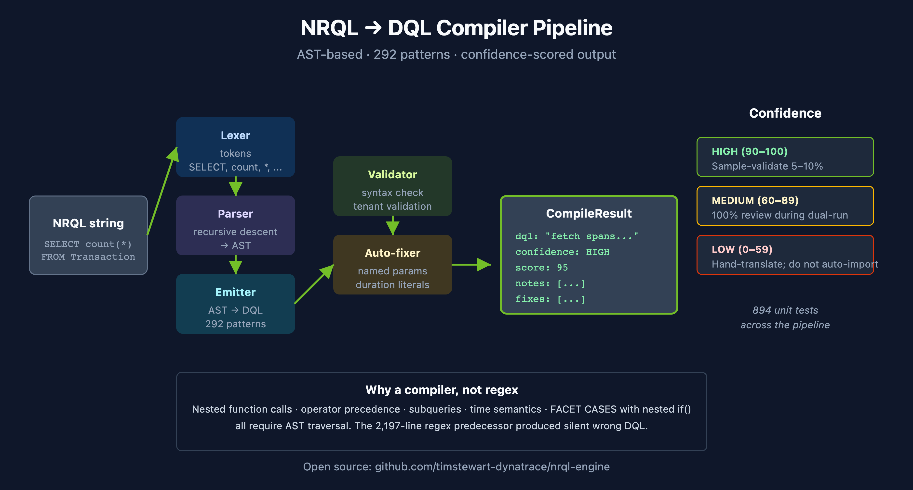

# NRLC-02: NRQL → DQL Translation

> **Series:** NRLC | **Notebook:** 2 of 9 | **Created:** April 2026 | **Last Updated:** 04/15/2026

## Overview

Query translation is the technical core of any New Relic → Dynatrace migration. NRQL is SQL-like and declarative; DQL is pipeline-based. A direct string substitution doesn't work — the structure, source resolution, and time semantics all differ. This deep dive covers the **architecture and behavior of the open-source [`nrql-engine`](https://github.com/timstewart-dynatrace/nrql-engine) compiler** (292 tested patterns, AST-based), the translation surface it covers, the confidence scoring it produces, the gaps it flags for manual review, and the patterns to recognize when reading its output.

The TypeScript `nrql-engine` and the Python compiler in `Dynatrace-NewRelic/compiler/` are **pinned to each other via the Phase 19b regression suite** (`test_phase19b_engine_parity.py` in CI) — drift on either side trips the test. Both expose the same 292-pattern surface with identical confidence scoring.

---

## Table of Contents

1. [Why a Compiler, Not Regex](#why-compiler)
2. [Compiler Pipeline](#pipeline)
3. [Translation Surface](#surface)
4. [Confidence Scoring](#confidence)
5. [Pattern Library — Worked Examples](#patterns)
6. [Source-Class Mapping (FROM clause)](#source-mapping)
7. [Function Mapping (Aggregations)](#function-mapping)
8. [Time Expression Mapping](#time-mapping)
9. [Unsupported NRQL — What to Do](#gaps)
10. [Tooling: Engine, Translator, CLI](#tooling)
11. [Validation Loop](#validation)

---

## Prerequisites

| Requirement | Details |
|-------------|----------|
| **Audience** | Engineers translating NRQL queries; reviewers of automated translations |
| **Recommended** | NRLC-01 (platform comparison); familiarity with both NRQL and DQL syntax |
| **Companion projects** | [`nrql-engine`](https://github.com/timstewart-dynatrace/nrql-engine), [`nrql-translator`](https://github.com/timstewart-dynatrace/nrql-translator), [`Dynatrace-NewRelic`](https://github.com/timstewart-dynatrace/Dynatrace-NewRelic) |

## Engine Support (Phase 19b)

The compiler is exposed through three projects (all pinned to the same 292-pattern surface via Phase 19b):

| Surface | Module / CLI |
|---------|--------------|
| Single NRQL query | `migrate.py compile "<nrql>"` or `nrql-translator query` |
| Batch translation | `migrate.py batch --file queries.csv` or `nrql-translator excel` |
| Translate + auto-fix + post-processing | `migrate.py convert --file queries.txt` (wraps compile + DQLFixer + Phase 19 apdex/compare/rate/percentage uplift) |
| Validate syntax only | `migrate.py compile --validate` |
| Shorthand pre-expand (`Distributed*`, `Mobile*`, `Lambda*`, etc.) | `compiler/shorthands.py` (9 patterns; Phase 19b) |
| DQL auto-fix rules | `validators/dql_fixer.py` (24 methods; Phase 19b one-to-one with TS `dql-fixer.ts`) |

See [COVERAGE-MATRIX.md §1 APM](../docs/COVERAGE-MATRIX.md) for the full NRQL event-class → DT data-object mapping (Transaction, Span, Log, Metric, SystemSample, PageView, MobileSession, SyntheticCheck, and custom event types).

<a id="why-compiler"></a>
## 1. Why a Compiler, Not Regex

Early translation tools used regular expressions: find `SELECT count(*)`, replace with `summarize count = count()`. This breaks fast:

| Failure mode | Why regex fails |
|--------------|------------------|
| Nested function calls | `percentage(count(*), WHERE status = 200)` requires recursion, not pattern match |
| `FACET CASES` with nested `if()` | Requires understanding the AST to emit nested DQL |
| Subqueries / `SELECT ... FROM (SELECT ...)` | Regex can't track scope |
| Time expressions | `SINCE 1 day ago UNTIL 1 hour ago` vs. `SINCE bin(now(), 24h)` need semantic awareness |
| Compound `WHERE` with mixed operators | Operator precedence requires a parser |

[`nrql-engine`](https://github.com/timstewart-dynatrace/nrql-engine) replaced an early 2,197-line regex translator with a proper compiler. The result: 292 tested translation patterns, **1,209 unit tests in the Python orchestrator (post-Phase-24)**, and the ability to translate complex queries that the regex tool silently produced wrong DQL for. Phase 19b added a CI parity job (`test_phase19b_engine_parity.py`) that pins the Python compiler to the TS `nrql-engine` — drift on either side trips the test.

<a id="pipeline"></a>
## 2. Compiler Pipeline

```
NRQL string
    ↓
  Lexer       → token stream
    ↓
  Parser      → AST (recursive descent)
    ↓
  Emitter     → DQL string + CompileResult
    ↓
  Validator   → syntactically valid? against tenant?
    ↓
  Auto-fixer  → attempt safe corrections (operator normalization, duration literals)
    ↓
Output: { dql, confidence, notes[], warnings[], fixes[] }
```

Each stage lives in a separate module: `compiler/lexer.py`, `compiler/parser.py`, `compiler/ast_nodes.py`, `compiler/emitter.py` (Python project), or `src/compiler/*.ts` (TypeScript engine).

The `CompileResult` is the contract every consumer uses:

```typescript
interface CompileResult {
  success: boolean;
  dql: string;
  confidence: 'HIGH' | 'MEDIUM' | 'LOW';
  confidenceScore: number;     // 0-100
  ast?: NRQLNode;
  notes: TranslationNotes;     // structured guidance
  warnings: string[];
  fixes: string[];             // applied auto-fixes
}
```




<!-- MARKDOWN_TABLE_ALTERNATIVE
| Stage | Output |
|-------|--------|
| Lexer | tokens |
| Parser | AST |
| Emitter | DQL string |
| Validator | syntax + tenant check |
| Auto-fixer | safe corrections |
| Result | { dql, confidence: HIGH/MED/LOW, score: 0-100, notes, fixes } |
For environments where SVG doesn't render
-->

<a id="surface"></a>
## 3. Translation Surface

**Supported NRQL clauses:** `SELECT`, `FROM`, `WHERE`, `FACET`, `TIMESERIES`, `LIMIT`, `ORDER BY`, `COMPARE WITH`, `SLIDE BY`, `SINCE`, `UNTIL`

**Supported aggregations:** `count`, `average`/`avg`, `sum`, `min`, `max`, `uniqueCount`, `percentile`, `latest`, `earliest`, `uniques`, `median`, `stddev`, `rate`, `percentage`, `cdfPercentage`, `filter`, `histogram`, `funnel`, `apdex` (with caveats)

**Supported expressions:**
- Arithmetic between aggregations (`sum(a) / count()`)
- Nested `if()` for conditional faceting
- Time grouping (`hourOf`, `dateOf`, `weekOf`)
- Subqueries via `lookup` patterns
- `WHERE` with `AND` / `OR` / `NOT` / `IN` / `LIKE` / regex

**Partial / produces warnings:**
- `apdex()` — emits DQL with TODO marker; threshold needs config
- `bytecountestimate()` — no DQL equivalent; recommend reformulation
- `funnel()` — multi-stage; emitted as nested append/join with manual review note

**Not supported:**
- `cohort()` — retention analysis is a different DT capability (Davis or custom DQL)
- Custom event types not present in DT (manual mapping required)
- Some metric streaming integrations — routed through OneAgent or OTLP instead

<a id="confidence"></a>
## 4. Confidence Scoring

Every translation gets a confidence label and a 0–100 score. The scoring is rule-based, not heuristic:

| Confidence | Score | Meaning |
|-----------|-------|---------|
| **HIGH** | 90–100 | Pattern fully covered; structural and semantic equivalence |
| **MEDIUM** | 60–89 | Translation correct in common case; edge cases (NULLs, empty sets, time boundaries) need spot-check |
| **LOW** | 0–59 | Manual review required; one or more constructs lack a direct equivalent |

### What lowers confidence

| Construct | Confidence Impact |
|-----------|-------------------|
| Use of `apdex()` | LOW (threshold not portable) |
| Use of `funnel()` | LOW (multi-stage; manual review) |
| Subquery with `lookup` | MEDIUM (correctness depends on lookup data) |
| `SLIDE BY` | MEDIUM (DT supports but rarely-used path) |
| Nested `if()` in `FACET CASES` | MEDIUM (emits nested DQL; review structure) |
| `COMPARE WITH` | MEDIUM (emits append + time-shift; verify alignment) |
| Standard `SELECT count(*) FROM X WHERE Y FACET Z TIMESERIES` | HIGH |

### Acting on Confidence

- **HIGH** → trust the translation; sample-validate 5–10% during dual-run
- **MEDIUM** → 100% review during dual-run; verify edge cases
- **LOW** → hand-translate or reformulate the requirement; do not auto-import

<a id="patterns"></a>
## 5. Pattern Library — Worked Examples

### Simple aggregation with FACET

**NRQL:**
```sql
SELECT count(*), average(duration) FROM Transaction
WHERE appName = 'checkout' SINCE 1 hour ago FACET host
```

**DQL:**
```
fetch spans, from:-1h
| filter service.name == "checkout"
| summarize count = count(), average_duration = avg(duration), by:{host.name}
```

Confidence: **HIGH (100)**

### Percentage with conditional

**NRQL:**
```sql
SELECT percentage(count(*), WHERE status = 200) FROM Transaction
```

**DQL:**
```
fetch spans
| summarize success_pct = 100.0 * countIf(status == 200) / count()
```

Confidence: **HIGH (95)** — produces the same numeric result; column name differs.

### Rate (decomposed)

**NRQL:**
```sql
SELECT rate(count(*), 1 minute) FROM Transaction
```

**DQL:**
```
timeseries count = count(), interval:1m
```

Confidence: **HIGH (90)** — NRQL `rate(count, N)` is structurally a per-interval count, which DQL expresses as a `timeseries`.

### COMPARE WITH (time-shifted append)

**NRQL:**
```sql
SELECT count(*) FROM Transaction COMPARE WITH 1 week ago SINCE 1 day ago
```

**DQL:**
```
fetch spans, from:-1d
| summarize current_count = count()
| append [
    fetch spans, from:-192h, to:-168h
    | summarize previous_count = count()
  ]
```

Confidence: **MEDIUM (75)** — verify the time alignment; DT default behavior on `append` may need a join for visualization.

### Subquery via lookup

**NRQL:**
```sql
SELECT count(*) FROM PageView WHERE userAgent IN (SELECT name FROM BotList)
```

**DQL:**
```
fetch logs
| filter dt.entity.application_method == "PageView"
| lookup [fetch logs | filter dt.entity.application_method == "BotList" | fields name],
    sourceField: userAgent, lookupField: name
| filter isNotNull(name)
| summarize count()
```

Confidence: **MEDIUM (70)** — correctness depends on whether the bot list exists as a lookupable Grail data source.

<a id="source-mapping"></a>
## 6. Source-Class Mapping (FROM clause)

NRQL's `FROM` references NR event classes; DQL's `fetch` references Grail data objects.

| NRQL FROM | DQL fetch | Notes |
|-----------|-----------|-------|
| `Transaction` | `fetch spans` (filter `span.kind == "server"`) | APM transactions become server spans |
| `TransactionError` | `fetch spans` + `filter isNotNull(error)` | Error spans |
| `Span` | `fetch spans` | Direct |
| `Log` | `fetch logs` | Direct |
| `Metric` | `timeseries <agg>(<metric.key>)` | NRQL metrics → DT metrics |
| `SystemSample` | `timeseries avg(dt.host.cpu.usage)` (etc.) | Infrastructure host metrics |
| `ProcessSample` | `timeseries ... by:{dt.entity.process_group_instance}` | Process metrics |
| `K8sContainerSample` | `timeseries ... by:{k8s.container.name}` | K8s container metrics |
| `PageView` | `fetch logs` (RUM page views) or `fetch events` | Depends on RUM ingest path |
| `BrowserInteraction` | `fetch events` (filter rum events) | RUM-specific |
| `MobileSession` | `fetch events` (filter mobile rum) | Mobile RUM |
| `SyntheticCheck` | `fetch events` (filter synthetic.* events) | Synthetic results |
| Custom event type | `fetch bizevents` or `fetch events` | Depends on ingest mapping |

The compiler picks the right `fetch` source based on a built-in lookup; you can override via the `--source-hint` CLI flag if your NR custom event has a non-default DT mapping.

<a id="function-mapping"></a>
## 7. Function Mapping (Aggregations)

| NRQL | DQL | Notes |
|------|-----|-------|
| `count(*)` | `count()` | |
| `count(field)` | `count(field)` | counts non-null |
| `uniqueCount(field)` | `countDistinct(field)` | |
| `average(field)` / `avg(field)` | `avg(field)` | |
| `sum(field)` | `sum(field)` | |
| `min(field)` / `max(field)` | `min(field)` / `max(field)` | |
| `percentile(field, 95)` | `percentile(field, 95)` | DQL uses positional; NRQL uses positional |
| `median(field)` | `median(field)` | |
| `stddev(field)` | `stddev(field)` | |
| `latest(field)` | `takeLast(field)` | with `sort timestamp desc` if needed |
| `earliest(field)` | `takeFirst(field)` | |
| `uniques(field)` | `collectDistinct(field)` | |
| `rate(count(*), 1 minute)` | `timeseries count(), interval:1m` | structural rewrite |
| `percentage(count(*), WHERE x)` | `100.0 * countIf(x) / count()` | |
| `filter(count(*), WHERE x)` | `countIf(x)` | |
| `histogram(field, ...)` | `summarize ..., by:{bin(field, width:N)}` | bucket-based |
| `apdex(field, t:N)` | flagged TODO; manual config | DT uses Apdex via Davis or custom DQL |
| `funnel(...)` | flagged; nested append/join skeleton | manual review |
| `cohort(...)` | unsupported | use Davis or custom DQL |

<a id="time-mapping"></a>
## 8. Time Expression Mapping

| NRQL | DQL |
|------|-----|
| `SINCE 1 hour ago` | `from:-1h` |
| `SINCE 1 day ago UNTIL 1 hour ago` | `from:-1d, to:-1h` |
| `SINCE '2026-04-14 00:00:00'` | `from:"2026-04-14T00:00:00Z"` |
| `TIMESERIES 5 minutes` | `interval:5m` |
| `TIMESERIES MAX` | `interval: auto` |
| `SLIDE BY 1 minute` | not directly supported — use `bin(timestamp, 1m)` for similar shape |
| `COMPARE WITH 1 week ago` | second `fetch` with `from:-2w, to:-1w` plus shift |

The compiler normalizes all time expressions to absolute or relative DQL forms. A common gotcha: NRQL's default time window (1 hour) differs from DQL's defaults; the compiler always emits an explicit `from:` to avoid this.

<a id="gaps"></a>
## 9. Unsupported NRQL — What to Do

When the compiler emits LOW confidence or a TODO marker:

| Symptom | Cause | Action |
|---------|-------|--------|
| Translation contains `// TODO: APDEX_THRESHOLD` | NRQL `apdex(field, t:0.5)` — threshold doesn't translate | Configure DT Apdex calculation separately or use Davis SLO with target value |
| Translation contains `// TODO: FUNNEL_STAGES` | Multi-stage funnel | Emit per-stage metrics + custom DQL with `lookup` chain |
| Compiler returns `success: false` | Unparseable NRQL (likely malformed or uses a private NR feature) | Hand-translate; capture in gap-analysis |
| LOW confidence on subquery | `lookup` target not validated against Grail | Check that the looked-up data exists as queryable Grail content |
| LOW confidence on custom event type | Source mapping unknown | Add a source mapping override or route the data via OpenPipeline first |

**Document gaps in the migration's gap-analysis artifact** (NR2DT-01 Discover §6). LOW-confidence queries are a planned cost, not a surprise.

<a id="tooling"></a>
## 10. Tooling: Engine, Translator, CLI

Three projects expose the same compiler in different shapes:

| Tool | Form | Use Case |
|------|------|----------|
| **[`nrql-engine`](https://github.com/timstewart-dynatrace/nrql-engine)** | TypeScript library (`npm install @timstewart-dynatrace/nrql-engine`) | Embed in your own tool, web app, or CI — **planned future home: [`dynatrace-dma`](https://github.com/dynatrace-dma) (Dynatrace Migration Assistant)** |
| **[`nrql-translator`](https://github.com/timstewart-dynatrace/nrql-translator)** | Thin CLI around the engine | Single query, batch Excel, validation, notebook generation |
| **[`Dynatrace-NewRelic`](https://github.com/timstewart-dynatrace/Dynatrace-NewRelic)** | Python CLI orchestrating full migration | End-to-end NR→DT including all entity transformers |

### Single-query CLI

```bash
# Using nrql-translator
nrql-translator query "SELECT count(*) FROM Transaction FACET host"

# Or Dynatrace-NewRelic Python CLI
python3 migrate.py compile "SELECT count(*) FROM Transaction FACET host"
```

### Batch translation

```bash
# CSV in, CSV out (with confidence column)
python3 migrate.py batch --file all-queries.csv

# Excel batch (preserves dashboard mapping)
nrql-translator excel --in dashboards.xlsx --out dashboards-dql.xlsx
```

### Notebook output

The translator can emit a Dynatrace notebook directly from a batch:

```bash
nrql-translator notebook --in dashboard-queries.csv --out migrated-dashboard.ipynb
```


### Dynatrace Migration Assistant (`dynatrace-dma`) Home

The [`dynatrace-dma`](https://github.com/dynatrace-dma) GitHub organization is the upstream **Dynatrace Migration Assistant** home for source-platform migration tooling. It already hosts:

- [`splunk-to-dynatrace`](https://github.com/dynatrace-dma/splunk-to-dynatrace) — Splunk → Dynatrace migration resources
- [`datadog-to-dynatrace`](https://github.com/dynatrace-dma/datadog-to-dynatrace) — Datadog configuration extraction scripts

The NRQL engine is planned to relocate here under a `newrelic-to-dynatrace` repo following the same pattern. Until the move, the engine remains canonical at `timstewart-dynatrace/nrql-engine`; track `dynatrace-dma` for the official Dynatrace-supported version going forward.

<a id="validation"></a>
## 11. Validation Loop

Translation alone doesn't guarantee correctness. The full loop is:

```
NRQL → [compile] → DQL → [syntax validate] → [tenant validate] → [behavioral validate]
```

1. **Syntax validate** — the engine's `DQLSyntaxValidator` posts the DQL to `/api/v2/settings/objects` for parser-level validation. No data executes.
2. **Tenant validate** — `DTEnvironmentRegistry` checks that referenced metrics, entities, buckets, and OpenPipeline enrichment attributes actually exist in the target tenant.
3. **Behavioral validate** — run both NRQL (against NR) and translated DQL (against DT) over the same time window and compare result shape and magnitudes.

### Auto-fix

When syntax validation fails, the engine attempts safe corrections before reporting failure:

- Operator normalization (`>` becomes `>=` if NRQL was inclusive)
- Duration literal correction (`1m` → `1m` ensures `m` suffix lowercase)
- Field name normalization (camelCase ↔ snake_case for known mappings)

Applied fixes are returned in `result.fixes[]` so reviewers can see what changed.

## Summary

NRQL→DQL translation is a compiler problem, not a string-replace problem. The open-source `nrql-engine` covers 292 patterns with confidence scoring; LOW-confidence queries are flagged for manual review rather than silently emitted as wrong DQL. Pair the translator with the validation loop, treat MEDIUM confidence as a review obligation, and keep an explicit gap-analysis for the genuinely unsupported constructs.

Continue to **NRLC-03 Dashboard Migration** to see how translated queries flow into Dynatrace dashboard artifacts.

---

<sub>*This notebook was AI-generated from community-submitted and publicly available sources, including the open-source [Dynatrace-NewRelic](https://github.com/timstewart-dynatrace/Dynatrace-NewRelic), [nrql-engine](https://github.com/timstewart-dynatrace/nrql-engine) (planned future home: the [`dynatrace-dma`](https://github.com/dynatrace-dma) Dynatrace Migration Assistant organization), and [nrql-translator](https://github.com/timstewart-dynatrace/nrql-translator) projects. This notebook series is not officially supported by Dynatrace or New Relic. Always verify information against the official [Dynatrace documentation](https://docs.dynatrace.com/docs) and [New Relic documentation](https://docs.newrelic.com).*</sub>
