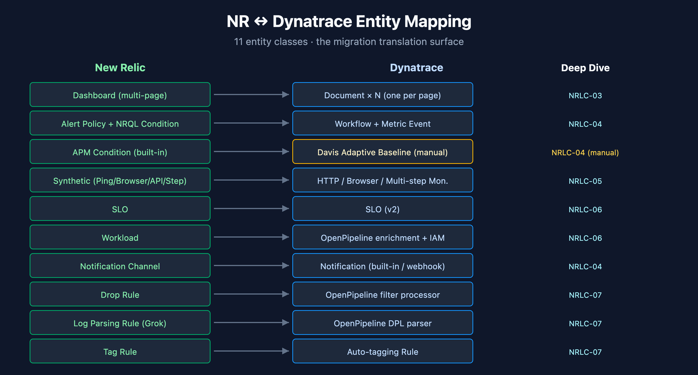

# NRLC-03: Dashboard Migration

> **Series:** NRLC | **Notebook:** 3 of 9 | **Created:** April 2026 | **Last Updated:** 04/15/2026

## Overview

Dashboards are the highest-volume migration artifact and the most user-visible. This deep dive covers the structural differences between NR dashboards and DT documents, the conversion behavior of the `DashboardTransformer`, the widget-level translation pipeline, the gaps you should plan for (variables, dynamic content), and the validation pattern.

**Phase 19 widget parity** — funnel composites (`countIf` per stage + `funnelEmulation: true`), native honeycomb for heatmap, event-feed table with canonical sort + `eventFeedMode`, cascading variables with `dependsOn`, dashboard permissions (public read / public read-write / private), and saved filter sets via `savedViews` all land automatically via `migrate.py --components dashboards`. **Phase 24** added `saved_filter_notebook_transformer` for NR Data Apps → DT `type=='notebook'` Documents (markdown + DQL cells).

---

## Table of Contents

1. [NR Dashboard Model](#nr-model)
2. [DT Dashboard Model (Documents v2)](#dt-model)
3. [DashboardTransformer Behavior](#transformer)
4. [Widget-Level Translation](#widgets)
5. [Multi-Page Dashboards](#multi-page)
6. [Variables & Dynamic Content](#variables)
7. [Layout Preservation](#layout)
8. [Validation Strategy](#validation)

---

## Prerequisites

| Requirement | Details |
|-------------|----------|
| **Audience** | Engineers migrating dashboards; UX reviewers comparing NR ↔ DT visualizations |
| **Standalone** | This notebook is self-contained for dashboard migration. No required prerequisite reading. |
| **Optional depth** | NRLC-02 (full NRQL→DQL compiler), NRLC-08 (validation reference), NRLC-09 (toolchain reference) |
| **Tooling** | `Dynatrace-NewRelic` `DashboardTransformer` (Python) or `nrql-engine` `DashboardTransformer` (TypeScript) |

<a id="translation-ctx"></a>
## Embedded Translation Context — Dashboard Query Patterns

Every dashboard widget contains a query. These are the NRQL→DQL patterns that show up in 95% of dashboard widgets — enough to migrate dashboards without consulting the full NRLC-02 compiler reference.

### Simple aggregation
```sql
-- NRQL
SELECT count(*), average(duration) FROM Transaction
WHERE appName = 'checkout' SINCE 1 hour ago FACET host
```
```
-- DQL
fetch spans, from:-1h
| filter service.name == "checkout"
| summarize count = count(), avg_dur = avg(duration), by:{host.name}
```

### Time series widget
```sql
-- NRQL
SELECT count(*) FROM Transaction TIMESERIES 5 minutes
```
```
-- DQL
fetch spans
| makeTimeseries count = count(), interval:5m
```

### Percentage widget
```sql
-- NRQL
SELECT percentage(count(*), WHERE httpResponseCode = 200) FROM Transaction
```
```
-- DQL
fetch spans
| summarize success_pct = 100.0 * countIf(http.status_code == 200) / count()
```

### COMPARE WITH (week-over-week)
```sql
-- NRQL
SELECT count(*) FROM Transaction COMPARE WITH 1 week ago SINCE 1 day ago
```
```
-- DQL
fetch spans, from:-1d
| summarize current = count()
| append [
    fetch spans, from:-192h, to:-168h
    | summarize previous = count()
  ]
```

### Translation Confidence

| Widget pattern | Confidence | Notes |
|---------------|-----------|-------|
| Simple count / average / sum | HIGH | Direct mapping |
| Aggregation with FACET | HIGH | `by:{...}` syntax |
| TIMESERIES with interval | HIGH | `makeTimeseries interval:Nm` |
| Percentage / filter aggregation | HIGH | `countIf(condition)` |
| COMPARE WITH | MEDIUM | Verify time alignment after migration |
| Subquery with `lookup` | MEDIUM | Check looked-up data exists |
| `apdex()` widget | LOW | Configure DT Apdex separately |
| `funnel()` widget | LOW | Manual reformulation |

<a id="nr-model"></a>
## 1. NR Dashboard Model

An NR dashboard is a hierarchical structure:

```
Dashboard
  ├─ Page (multiple per dashboard)
  │   ├─ Widget
  │   │   ├─ visualization (line, bar, table, billboard, ...)
  │   │   ├─ NRQL query
  │   │   └─ layout (row, column, width, height)
  │   └─ ...
  └─ permissions (per dashboard)
```

Key fields exposed via NerdGraph (`DashboardEntity`):
- `name`, `description`, `permissions`
- `pages[]` — each with `name`, `widgets[]`
- `widgets[].rawConfiguration` — JSON containing `nrqlQueries[]`, `colors`, `axis`, `thresholds`, etc.
- `widgets[].title`, `widgets[].layout`
- `widgets[].visualization.id` — identifies widget type

<a id="dt-model"></a>
## 2. DT Dashboard Model (Documents v2)

Dynatrace Gen3 dashboards are stored as **Documents** in the Documents v2 API. Each dashboard is a single-page JSON document:

```json
{
  "version": 13,
  "variables": [],
  "tiles": {
    "<tile-id>": {
      "type": "data",
      "title": "...",
      "query": "fetch logs | filter ...",
      "visualization": "lineChart",
      "visualizationSettings": { ... }
    }
  },
  "layouts": {
    "<tile-id>": { "x": 0, "y": 0, "w": 8, "h": 6 }
  }
}
```

Critical structural differences from NR:

| Aspect | NR | DT |
|--------|----|----|
| Pages | Multiple per dashboard | One per document (multi-page → multiple documents) |
| Query language | NRQL | DQL |
| Layout grid | Row-based, fixed widths | Free grid (`x, y, w, h`) |
| Widget identity | UUIDs in raw config | Tile IDs in `tiles` map |
| Storage | Account-scoped | Document with sharing settings (private/shared/public) |

<a id="transformer"></a>
## 3. DashboardTransformer Behavior

The transformer (in both `Dynatrace-NewRelic/transformers/dashboard_transformer.py` and `nrql-engine/src/transformers/dashboard.ts`) handles the full conversion pipeline:

```
NR Dashboard JSON
      ↓
  for each page:
      ↓
    [Convert page name → document name]
      ↓
    for each widget:
        [Translate NRQL → DQL via NRQLCompiler]
        [Map widget.visualization.id → DT visualization type]
        [Convert layout (row/col) → (x, y, w, h)]
        [Convert thresholds, colors, axis settings]
      ↓
  Emit one DT Document per page
```

**Output:** N documents per source dashboard (where N = number of NR pages). Each document has:
- A name like `<dashboard-name> — <page-name>` (avoids name collisions)
- Tags: `migrated-from-nr`, `nr-dashboard-guid:<guid>`, `nr-page:<page-name>`
- A migration-metadata tile (optional) with the source GUID for traceability

<a id="widgets"></a>
## 4. Widget-Level Translation

| NR Widget Type | DT Visualization | Phase 19 Notes |
|---------------|------------------|------|
| `viz.line` | `lineChart` | direct |
| `viz.area` | `areaChart` | direct |
| `viz.bar` | `barChart` | direct |
| `viz.pie` | `pieChart` | direct |
| `viz.table` | `table` | direct |
| `viz.billboard` | `singleValue` | direct |
| `viz.heatmap` | **`honeycomb` (native)** | Phase 19 — upgraded from table fallback |
| `viz.histogram` | `histogram` | direct |
| `viz.markdown` | `markdown` | direct (no query) |
| `viz.json` | `code` (DQL block) | direct |
| `viz.event-feed` | **`table` with canonical timestamp sort + `eventFeedMode`** | Phase 19 — upgraded from table fallback |
| `viz.funnel` | **`barChart` composite with `countIf` per stage + `funnelEmulation: true`** | Phase 19 — upgraded from markdown placeholder |
| Custom Nerdpack widget | not portable | document in gap analysis / see OUT-OF-SCOPE.md |

Each translation preserves the title; data thresholds (red/yellow/green) map to DT `visualizationSettings.thresholds`.

Visualization-specific settings (axis labels, color overrides, sort order) are converted where DT has an equivalent. Some NR-specific settings (e.g., `nullValues: zero` semantics) emit a translation note rather than failing silently.




<!-- MARKDOWN_TABLE_ALTERNATIVE
| NR | DT | Notes |
|----|----|-------|
| Dashboard (multi-page) | Document × N | one per page |
| Alert Policy + Condition | Workflow + Metric Event (Gen3) | decoupled |
| APM Condition | Davis Adaptive Baseline | manual review |
| Synthetic (4 types) | HTTP/Browser/Multi-step (3 types) | scripted browser is manual |
| SLO | SLO v2 | metric expression must match |
| Workload | OpenPipeline enrichment + IAM policy condition on enriched attribute | rules-based |
| Drop Rule | OpenPipeline filter | NRQL → DPL |
For environments where SVG doesn't render
-->

<a id="multi-page"></a>
## 5. Multi-Page Dashboards

NR's multi-page dashboards become **N separate DT documents**. There's no native multi-page concept in DT Gen3 documents.

**Naming pattern (default):** `<dashboard-name> — <page-name>`

**Tag pattern (for grouping):**
```
migrated-from-nr
nr-dashboard-guid:<original-guid>
nr-page-index:<0,1,2,...>
```

Users can create a Dynatrace **launchpad** that lists all related documents with the `nr-dashboard-guid:<x>` tag, restoring the multi-page navigation pattern.

### Cross-page links

If an NR widget linked to another page, the transformer emits a markdown tile in the target document with a hyperlink (`open in DT → <document URL>`). Cross-page link metadata is preserved.

<a id="variables"></a>
## 6. Variables & Dynamic Content

NR dashboards support `variables` (dropdowns, text inputs, query-driven lists). DT documents also support variables but with a different schema.

| NR Variable Type | DT Variable | Conversion |
|------------------|-------------|------------|
| `enum` (static list) | `csv` variable | direct |
| `nrql` (query-driven) | `query` variable | NRQL→DQL via translator |
| `string` (free text) | `text` variable | direct |
| `default value` | `defaultValue` field | direct |

**Gotchas:**

- **Cascading variables** (variable B depends on variable A) work in DT but the dependency chain must be re-declared explicitly.
- **Multi-select variables** translate, but the DQL must use `in()` filter syntax instead of NRQL's `IN`.
- **Variable interpolation in queries** changes from `{{varName}}` (NRQL) to `$varName` or `$(varName)` (DT — schema-version dependent).

The transformer handles all three patterns; complex interpolation cases emit a MEDIUM-confidence translation note.

<a id="layout"></a>
## 7. Layout Preservation

NR uses a **row-based** layout (12-column grid implied). DT uses a **free grid** with explicit `x, y, w, h` per tile.

The transformer's layout conversion:

1. Walk NR widgets in display order
2. Maintain a `currentX` cursor and `currentRowY`
3. For each widget: emit `{x: currentX, y: currentRowY, w: widget.column, h: widget.row}`
4. Advance `currentX += w`; wrap to next row when `currentX >= 12`
5. Track tallest widget in row to advance `currentRowY` correctly

**Result:** visually equivalent in 90%+ of cases; the remainder needs manual touch-up (typically dashboards with nonstandard widget aspect ratios). Document this as a MEDIUM-effort review item per dashboard.

<a id="validation"></a>
## 8. Validation Strategy

After migration, validate dashboards with a three-tier check:

| Tier | Method | What It Catches |
|------|--------|-----------------|
| **Tier 1: Syntax** | DT API rejects malformed documents | Invalid JSON, missing required fields |
| **Tier 2: Query validity** | `DQLSyntaxValidator` posts each tile's DQL | Bad DQL syntax, references to nonexistent fields |
| **Tier 3: Visual diff** | Open NR dashboard side-by-side with DT document | Layout drift, missing data, color/axis mismatches |

**Recommended:** run Tier 3 on a 10–20% sample of dashboards. Full visual review is rarely cost-justified; sampling catches systemic issues (transformer bugs) without exhaustive manual work.

## Summary

Dashboard migration is mostly mechanical — the transformer handles widgets, layout, variables, and queries. The non-mechanical work is:

- Splitting multi-page dashboards into multiple documents (and rebuilding navigation)
- Reviewing variable cascades and interpolation
- Validating visual fidelity on a sample
- Documenting MEDIUM-confidence translations for follow-up

Continue to **NRLC-04 Alert & Notification Migration** for the higher-stakes work (alerts directly affect on-call).

<a id="tooling-dashboards"></a>
## Tooling for Dashboard-Only Migration

End-to-end commands for migrating only dashboards — no other components touched.

```bash
# 1. Inventory NR dashboards
python3 migrate.py --export-only --components dashboards --output ./dashboards-export

# 2. Translate widget queries with confidence report
python3 migrate.py --transform-only --components dashboards --report

# 3. Diff against existing DT documents (avoid duplicate creation)
python3 migrate.py --diff --components dashboards

# 4a. Direct API import
python3 migrate.py --import-only --components dashboards

# 4b. Or export as Terraform for GitOps management
python3 migrate.py export-terraform --components dashboards --output ./tf-dashboards

# 5. Rollback if needed (within the rollback retention window)
python3 migrate.py --rollback --manifest ./output/run-<timestamp>.json
```

**Single-query translation** for an ad-hoc widget:

```bash
nrql-translator query "SELECT count(*) FROM Transaction FACET host"
```

**Batch Excel translation** (for very large dashboard portfolios):

```bash
nrql-translator excel --in dashboards-queries.xlsx --out dashboards-dql.xlsx
```

---

<sub>*This notebook was AI-generated from community-submitted and publicly available sources, including the open-source [Dynatrace-NewRelic](https://github.com/timstewart-dynatrace/Dynatrace-NewRelic), [nrql-engine](https://github.com/timstewart-dynatrace/nrql-engine) (planned future home: the [`dynatrace-dma`](https://github.com/dynatrace-dma) Dynatrace Migration Assistant organization), and [nrql-translator](https://github.com/timstewart-dynatrace/nrql-translator) projects. This notebook series is not officially supported by Dynatrace or New Relic. Always verify information against the official [Dynatrace documentation](https://docs.dynatrace.com/docs) and [New Relic documentation](https://docs.newrelic.com).*</sub>
