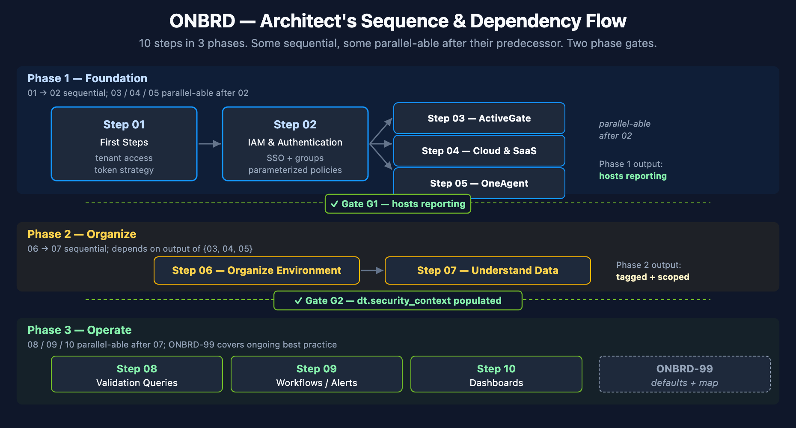
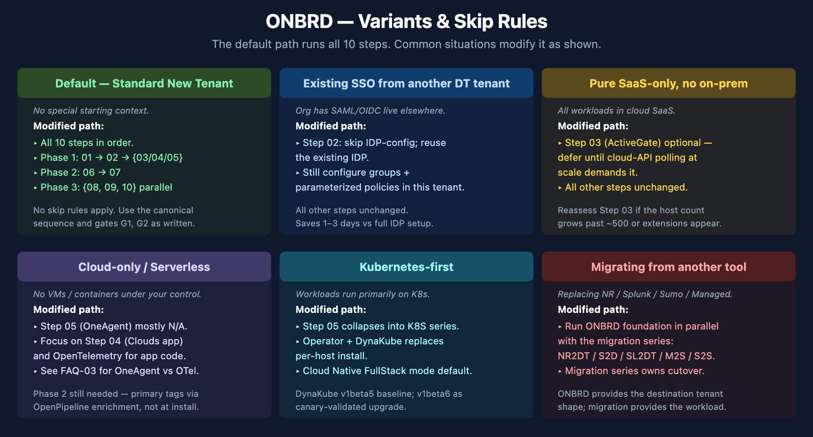

# ONBRD-00: Architect's Sequence & Dependency Runbook

> **Series:** ONBRD — Dynatrace Onboarding | **Reference:** 00 — Architect's Sequence & Dependency Runbook | **Created:** May 2026 | **Last Updated:** 07/01/2026

## Overview

Sequence-and-dependency runbook for an architect or experienced tenant lead onboarding a new Dynatrace tenant in 2026. Assumes you have onboarded a tenant before — this is order, dependencies, decisions, not a GUI tour.

Per-domain depth lives in the canonical series (linked at each step). For recommended defaults, the decision matrix, validation DQL, anti-patterns, and the cross-series next-steps map, see [ONBRD-99](-[ONBRD]-99-best-practice-summary.ipynb).

---

## Table of Contents

1. [The Sequence](#the-sequence)
2. [Phase 1 — Foundation](#phase-1-foundation)
3. [Phase 2 — Organize](#phase-2-organize)
4. [Phase 3 — Operate](#phase-3-operate)
5. [Phase Checkpoints](#phase-checkpoints)
6. [Common Variants & Skip Rules](#common-variants)
7. [After ONBRD](#after-onbrd)

---

## Prerequisites

| Requirement | Details |
|---|---|
| Tenant URL + admin credentials | from procurement / account team |
| Account-level decisions in place | tenant region, SaaS vs Managed, account hierarchy. If not yet decided, see [NR2DT-00 § Step 0 prerequisites](../../nr2dt/notebooks/-[NR2DT]-00-step-0-prerequisites.ipynb) — the same checklist generalizes beyond New Relic migrations. |
| Reading time | 30–45 minutes for the runbook; the actual onboarding is 1–4 weeks depending on scope and skip rules applied. |

## 1. The Sequence

ONBRD is 10 steps grouped into 3 phases. Some are sequential, some parallel-able after their predecessor. Two phase gates separate the phases.

<!-- MARKDOWN_TABLE_ALTERNATIVE
| Phase | Steps | Pattern |
|---|---|---|
| Foundation | 01 → 02 → {03, 04, 05} | 01 and 02 are sequential. 03/04/05 are parallel-able after 02. |
| Organize | 06 → 07 | Sequential. Both depend on output of {03, 04, 05}. |
| Operate | {08, 09, 10} | All three are parallel-able after 07. |
For environments where SVG doesn't render
-->

| Phase | Steps | Phase Output |
|---|---|---|
| **Phase 1 — Foundation** | 01 → 02 → {03, 04, 05} | Hosts reporting; tenant lead can query data |
| **Phase 2 — Organize** | 06 → 07 | Entities tagged and scoped; `dt.security_context` populated |
| **Phase 3 — Operate** | {08, 09, 10} | Validation DQL set + at least one workflow + at least one dashboard |

## 2. Phase 1 — Foundation

### Step 01 — First Steps

- **Decision:** Confirm access; record tenant URL; plan token strategy for downstream automation.
- **Depends on:** procurement complete, tenant provisioned.
- **2026 specifics:** Plan for Platform Tokens (`dt0s16`, `Authorization: Bearer`) as the default for new automation per sprint-1.337. Settings v2 / Configuration as Code (Terraform / Monaco) over Configuration API for new work. Extensions 3rd-gen for any custom integrations.
- **Output:** confirmed tenant access; first Platform Token decision recorded.
- **Deep dive:** [ONBRD-99 § 1 Recommended Defaults](-[ONBRD]-99-best-practice-summary.ipynb) for the 2026 token / API / extension stack.

### Step 02 — IAM and Authentication

- **Decision:** SSO method (SAML / OIDC); initial group structure; first parameterized policies.
- **Depends on:** Step 01 (access confirmed).
- **2026 specifics:** Issue the first Platform Token (`dt0s16`, `Authorization: Bearer`) — Classic API Tokens (`dt0c01`) only for legacy installer-download paths. Use parameterized policies bound to groups via binding parameters; the `dt.security_context` field is the standardized boundary for Gen3 IAM scoping (configured fully in Step 06). Sprint-1.338 ActiveGate token schema changed — review upgrade-notes for any AG-token-issuing automation.
- **Output:** SSO live; admin group + first parameterized policy in place; first Platform Token issued.
- **Deep dive:** [IAM series](../../iam/) for full IAM administration (13 notebooks); [FAQ-02](../../faq/notebooks/-[FAQ]-02-tagging-sources-standards-strategy.ipynb) for `dt.security_context` strategy.

### Step 03 — ActiveGate (parallel-able with 04 + 05 after 02)

- **Decision:** Need ActiveGate? Required for >500 hosts, hybrid / on-prem, or cloud-API polling at scale. Defer if pure SaaS-only with no on-prem footprint.
- **Depends on:** Step 02 (Platform Token to register AG).
- **2026 specifics:** Sprint-1.338 ActiveGate Docker image-template uses the `_-image-_` pattern. Sizing baseline 10–20 GB; 2–3 AGs per zone for load distribution + failover. OneAgent attribute enrichment (1.331+) emits primary fields on every signal at ingest — verify AG version supports it.
- **Output:** at least one AG registered; cluster connectivity verified; AG visible in Deployment Status.
- **Deep dive:** [CLOUD series](../../cloud/) for AG-routed cloud integrations; [AUTOM series](../../autom/) for AG config-as-code.

### Step 04 — Cloud & SaaS Integrations (parallel-able with 03 + 05 after 02)

- **Decision:** Which clouds (AWS / Azure / GCP) and integration mechanism per cloud.
- **Depends on:** Step 02 (Platform Token); optionally Step 03 (AG for legacy paths).
- **2026 specifics:** Clouds app for AWS (GA), Azure (preview); GCP not yet in Clouds app — use legacy GCP integration via AG. AWS Lambda primary-tag propagation via `DT_TAGS` env var (sprint-1.337). IAM Role pattern for production multi-account.
- **Output:** cloud entities visible in Smartscape; cloud tags arriving as `aws.tag.*` / `azure.tag.*` / `gcp.label.*`.
- **Deep dive:** [CLOUD series](../../cloud/) for per-provider depth; [FAQ-02](../../faq/notebooks/-[FAQ]-02-tagging-sources-standards-strategy.ipynb) for cross-cloud tag normalization.

### Step 05 — OneAgent Deployment (parallel-able with 03 + 04 after 02)

- **Decision:** Deployment method (direct, package manager, Operator for K8s); initial scope (pilot or full); host-tag taxonomy.
- **Depends on:** Step 02 (Platform Token for installer download).
- **2026 specifics:** **Set primary fields/tags at install** via the single `--set-host-tag` form the June-2026 tags hub documents for both: `oneagentctl --set-host-tag="primary_tags.<key>=<value>"` (prefix written explicitly — it is never added automatically) and `oneagentctl --set-host-tag="dt.security_context=<value>"` — not retroactively. Primary tags emit on every signal (metrics / spans / logs / events) at ingest. Kubernetes: Dynatrace Operator + **Cloud Native FullStack** mode (Classic FullStack deprecated for new deployments). DynaKube **v1beta5** baseline; **v1beta6** as canary-validated upgrade. Sprint-1.338 Windows OneAgent uses **Npcap** for network insight (replaces WinPcap).
- **Output:** OneAgent installed on at least one host group; primary tags propagating to every signal at ingest.
- **Deep dive:** [K8S series](../../k8s/) for DynaKube + Cloud Native FullStack; [FAQ-01](../../faq/notebooks/-[FAQ]-01-host-group-naming-strategy.ipynb) for host-group naming; [FAQ-02](../../faq/notebooks/-[FAQ]-02-tagging-sources-standards-strategy.ipynb) for primary-fields strategy; [FAQ-03](../../faq/notebooks/-[FAQ]-03-oneagent-vs-otel-decision-framework.ipynb) for OneAgent vs OTel decision.

## 3. Phase 2 — Organize

### Step 06 — Organizing Your Environment

- **Decision:** Tag taxonomy (env / team / app / compliance / cost-center dimensions); host-group naming convention; bucket strategy; segment definitions.
- **Depends on:** Step 05 (OneAgent hosts reporting); Step 04 (cloud tags arriving) if cross-cloud normalization is needed.
- **2026 specifics:** Primary fields/tags via `oneagentctl --set-host-tag="primary_tags.<key>=<value>"` and `--set-host-tag="dt.security_context=<value>"` (June-2026 tags-hub form; the oneagentctl reference still documents the older `--set-host-property` form for `dt.*` keys). Use **Segments + `dt.security_context`** for data scoping — *not* legacy Management Zones. **MZ-on-calculated-metrics** is on the May-2026 deprecation list. Bucket strategy: `dt.security_context` is the default for general data access; buckets only for compliance / retention / hard cost / hostile multi-tenancy.
- **Output:** entities grouped meaningfully; `dt.security_context` populated on signals; segments defined for primary scopes; bucket strategy documented.
- **Deep dive:** [ORGNZ series](../../orgnz/) — buckets, segments, `dt.security_context` (full depth, 11 notebooks); [IAM series](../../iam/) — parameterized policies bound to `dt.security_context`; [FAQ-01](../../faq/notebooks/-[FAQ]-01-host-group-naming-strategy.ipynb) — host-group naming; [FAQ-02](../../faq/notebooks/-[FAQ]-02-tagging-sources-standards-strategy.ipynb) — tagging strategy.

### Step 07 — Understanding Your Data

- **Decision:** Which signals matter for the workloads in scope (spans / logs / metrics / events / business events). Confirm primary fields propagate.
- **Depends on:** Step 06 (entities grouped); Step 05 (OneAgent producing signals).
- **2026 specifics:** OneAgent attribute enrichment (1.331+) emits primary fields on every signal at ingest — spot-check `dt.security_context` on logs / spans / metrics with the validation DQL in [ONBRD-99 § 3](-[ONBRD]-99-best-practice-summary.ipynb).
- **Output:** confirmed which signal types are flowing; one validation DQL per signal type saved.
- **Deep dive:** [SPANS series](../../spans/), [OPLOGS series](../../oplogs/), [OPIPE series](../../opipe/), [OPMIG series](../../opmig/) — per-signal-type depth.

## 4. Phase 3 — Operate

### Step 08 — Validation Queries (parallel-able with 09 + 10 after 07)

- **Decision:** Which canonical queries become the deployment's validation set (host count, service inventory, log volume per source, primary-field propagation).
- **Depends on:** Step 07 (signals understood); Step 06 (entities grouped).
- **Output:** validation DQL set saved as a notebook or dashboard (the architect's smoke-test for the tenant).
- **Deep dive:** [ONBRD-99 § 3 Validation Queries](-[ONBRD]-99-best-practice-summary.ipynb) for the canonical set; [SPANS](../../spans/), [DBMON](../../dbmon/), [WEBRUM](../../webrum/), [BIZEV](../../bizev/) for per-domain DQL patterns.

### Step 09 — Workflows & Alerts (parallel-able with 08 + 10 after 07)

- **Decision:** Which Davis-detected problems become workflows; which custom anomaly detectors are needed; notification targets; on-call routing.
- **Depends on:** Step 07 (data flowing); Step 06 (entities grouped for scoping).
- **2026 specifics:** Workflows over Alerting Profiles. Davis Anomaly Detectors over legacy metric-events (where the signal is supported).
- **Output:** at least one workflow with notification target; first alert fires.
- **Deep dive:** [WFLOW series](../../wflow/) — workflows + notifications; [AIOPS series](../../aiops/) — Davis problems + anomaly detection + Davis CoPilot.

### Step 10 — Dashboards (parallel-able with 08 + 09 after 07)

- **Decision:** Tier strategy (Executive / Operations / Engineering); per-tier dashboard structure; sharing model.
- **Depends on:** Step 07 (data understood); Step 06 (entities grouped for filters).
- **Output:** at least one dashboard per tier in scope; shared with the right groups.
- **Deep dive:** [DASH series](../../dash/) — dashboard strategy + executive reporting + tile-type decision.

## 5. Phase Checkpoints

Verify before moving from one phase to the next. The DQL queries in [ONBRD-99 § 3 Validation Queries](-[ONBRD]-99-best-practice-summary.ipynb) make these gates concrete.

### G1 — Foundation → Organize

The tenant has at least one host reporting and the tenant lead role can query that data.

- *Verify:* `smartscapeNodes "HOST"` returns host count > 0; tenant lead role can run that query.
- *If not:* stay in Phase 1 — most likely OneAgent installer didn't run, or the Platform Token used by the installer lacks `InstallerDownload` scope.

### G2 — Organize → Operate

Entities are grouped meaningfully and `dt.security_context` is populated on signals.

- *Verify:* `fetch logs, from:-1h | summarize count(), by:{dt.security_context}` returns at least one non-null value.
- *If not:* OneAgent install or OpenPipeline enrichment didn't propagate the field — fix before Phase 3 (filter scoping in dashboards / alerts will not work without it).

### After Phase 3 — exit ONBRD

ONBRD ends. The next checkpoint is *"do you need a deeper series for the domains in scope?"* — see [ONBRD-99 § 5 Where to Go Deeper](-[ONBRD]-99-best-practice-summary.ipynb) for the 28-series cross-reference map.

## 6. Common Variants & Skip Rules

<!-- MARKDOWN_TABLE_ALTERNATIVE
| Situation | Modified path |
|---|---|
| Default — Standard new tenant | All 10 steps in order |
| Existing SSO from another DT tenant | Skip IDP-config part of Step 02; configure groups + parameterized policies |
| Pure SaaS-only, no on-prem | Step 03 (ActiveGate) optional; defer until cloud-API polling demands it |
| Cloud-only / Serverless | Step 05 mostly N/A; focus on Step 04 + OTel; see FAQ-03 |
| Kubernetes-first | Step 05 collapses into K8S series (Operator + DynaKube + Cloud Native FullStack) |
| Migrating from another tool | Run ONBRD foundation in parallel with NR2DT / S2D / SL2DT / M2S / S2S |
For environments where SVG doesn't render
-->

| Variant | When | What to do |
|---|---|---|
| Existing SSO already configured | New tenant for an org with SAML/OIDC live on another Dynatrace tenant | Skip the IDP-config part of Step 02; reuse the existing IDP. Still configure groups + parameterized policies in the new tenant. |
| Pure SaaS-only, no on-prem | All workloads in cloud; no private/on-prem footprint | Step 03 (ActiveGate) is optional — defer until cloud-API polling demands it. |
| Cloud-only, no hosts | Serverless / managed services only; no VMs or containers under your control | Step 05 (OneAgent) is mostly inapplicable — focus on Step 04 (cloud integrations) and OpenTelemetry for application code. See [FAQ-03](../../faq/notebooks/-[FAQ]-03-oneagent-vs-otel-decision-framework.ipynb). |
| Kubernetes-first | Workloads run primarily on K8s | Step 05 collapses into [K8S series](../../k8s/) — Operator + DynaKube replaces per-host install. |
| Migrating from another tool | Replacing New Relic / Splunk / Sumo Logic / managed Dynatrace | Run ONBRD foundation in parallel with the migration series ([NR2DT](../../nr2dt/), [S2D](../../s2d/), [SL2DT](../../sl2dt/), [M2S](../../m2s/), [S2S](../../s2s/)). |
| Multi-tenant org | Several Dynatrace tenants for different BUs / environments | Step 02 expands — see [IAM-08 Multi-Environment](../../iam/) for cross-tenant patterns. |

## 7. After ONBRD

ONBRD ends after Phase 3. The next set of decisions is per-domain — observability, automation, AI/Davis, dashboards-at-scale, etc.

Reference points to keep open:

- [**ONBRD-99**](-[ONBRD]-99-best-practice-summary.ipynb) — the architect's reference card: recommended defaults, decision matrix, validation queries, anti-patterns, and the **28-series cross-reference map** for what to do after ONBRD.
- [**`topics/-START-HERE-/04-foundation.md`**](../../-START-HERE-/04-foundation.md) — cross-series Foundation Module reading order (ONBRD + ORGNZ + IAM in parallel) with priorities and skip rules.
- [**`topics/-START-HERE-/01-net-new.md`**](../../-START-HERE-/01-net-new.md) — doorway selection for greenfield vs migration paths (Sub-Paths A–E).
- [**ADOPT series**](../../adopt/) — overall maturity and adoption roadmap once ONBRD is complete.

---

*This notebook was AI-generated from community-submitted and publicly available sources. This notebook series is not officially supported by Dynatrace. Always verify information against the current [Dynatrace documentation](https://docs.dynatrace.com/docs).*
