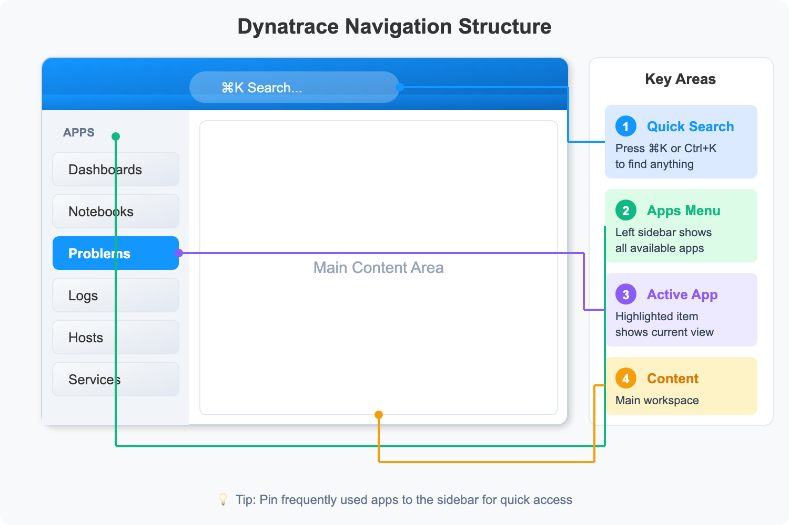

# ONBRD-01: Getting Started: Your First Steps in Dynatrace

> **Series:** ONBRD — Dynatrace Onboarding | **Notebook:** 1 of 10 | **Created:** December 2025 | **Last Updated:** 06/10/2026

## Finding Your Way Around
Welcome to Dynatrace. This notebook helps you get oriented in your new environment—where to find things, how to navigate, and what to do first.

---

## Table of Contents

1. [Accessing Your Environment](#accessing-your-environment)
2. [Understanding the Navigation](#understanding-the-navigation)
3. [Key Areas to Know](#key-areas-to-know)
4. [Your Environment ID and URLs](#your-environment-id-and-urls)
5. [Checking What's Already There](#checking-whats-already-there)

---

## Prerequisites

- Access credentials for your Dynatrace tenant
- A modern web browser (Chrome, Firefox, Edge, Safari)

### Sprint 1.337 (April 2026): Defaults for New Customers

Three sprint-1.337 changes establish what "new customer onboarding" should default to in 2026:

1. **Platform tokens (`dt0s16` / `dt0s01`) with `Authorization: Bearer …`** — recommended default for all new automation. Classic `dt0c01` (`Authorization: Api-Token …`) still works for legacy paths but should not be the default for new pipelines. Wrong scheme returns `401 Unsupported authorization scheme` even when scopes are correct (covered in ONBRD-02 IAM and Authentication).
2. **Settings v2 (Environment API v2)** — new automation should target Settings v2 paths. Sprint 1.337 SaaS announced that many remaining Configuration API endpoints now have Settings v2 equivalents. Plan onboarding tooling around Settings v2 (Terraform `dynatrace_settings`, Monaco v2). See ONBRD-06 (Organizing Your Environment) and ONBRD-09 (Setting Up Alerts) for the schema-id patterns to use.
3. **Extensions 3rd-gen API** (managed via Dynatrace API Application → Extensions) — **the only recommended path for new customers adopting custom Extensions.** Existing customers may continue with 2nd-gen, but advocate 3rd-gen as the default in any onboarding conversation.

Also: **OneAgent primary fields/tags at the source** (Latest Dynatrace) means new customers should be told to design their tag taxonomy with primary tags first-class — set during OneAgent install via `oneagentctl --set-host-tag="primary_tags.<key>=<value>"` — the `primary_tags.` prefix must be written explicitly. Covered in ONBRD-05 (Deploying OneAgent) and ONBRD-06 (Organizing Your Environment).

---

<a id="accessing-your-environment"></a>
## 1. Accessing Your Environment
Your Dynatrace environment is accessed via a URL specific to your tenant:

```
https://{tenant-id}.apps.dynatrace.com
```

### Finding Your Tenant ID

Your tenant ID is the first part of your Dynatrace URL. For example:
- URL: `https://abc12345.apps.dynatrace.com`
- Tenant ID: `abc12345`

**Write down your tenant ID**—you'll need it for API tokens, OneAgent deployment, and integrations.

### First Login

1. Navigate to your tenant URL
2. Enter your credentials (local user or SSO)
3. Complete any MFA requirements
4. You'll land on the default home screen

> **Note:** If your organization is setting up SAML/SSO, see **ONBRD-02: IAM and Authentication** before inviting additional users.

<a id="understanding-the-navigation"></a>
## 2. Understanding the Navigation
Dynatrace uses a left-hand navigation menu organized by function. The platform is built around **Apps**—each capability is an app you can launch.


<!-- MARKDOWN_TABLE_ALTERNATIVE
| Area | Description |
|------|-------------|
| Search (Cmd+K) | Quick access to anything |
| Apps Menu | Platform capabilities (Dashboards, Notebooks, Problems, etc.) |
| Main Content | Workspace for analysis and monitoring |
| Settings | Configuration options |
| Account Management | Users, tokens, permissions |
-->

### Quick Search

Press **Cmd+K** (Mac) or **Ctrl+K** (Windows/Linux) to open the quick search. Type anything:
- Entity names (hosts, services)
- App names
- Keywords like "logs" or "problems"

### The App Launcher

Click the grid icon to see all available apps. You can:
- Pin frequently used apps to your sidebar
- Discover new apps in the Dynatrace Hub
- Install apps from the Hub to extend functionality

<a id="key-areas-to-know"></a>
## 3. Key Areas to Know
### Hosts App

The Hosts app shows all monitored infrastructure:
- Host health and resource utilization
- Running processes and services
- Host properties and metadata

### Problems App

DAVIS AI automatically detects problems and correlates related events. This is where you'll see:
- Active issues requiring attention
- Root cause analysis
- Affected entities
- Problem timeline and resolution

### Logs & Events App

Explore all log data ingested into Dynatrace:
- Full-text search across logs
- Filter by source, severity, content
- Correlate logs with traces and metrics

### Notebooks App

Interactive analysis environment (you're using one now!):
- Write and execute DQL queries
- Document investigations
- Share findings with your team

### Workflows App

Automation and alerting for the modern platform:
- Create automated responses to problems
- Configure notifications (Slack, email, PagerDuty, etc.)
- Build custom automation logic

<a id="your-environment-id-and-urls"></a>
## 4. Your Environment ID and URLs
Several URLs are important to bookmark:

| Purpose | URL Pattern |
|---------|-------------|
| **Main UI** | `https://{tenant-id}.apps.dynatrace.com` |
| **Platform API** | `https://{tenant-id}.apps.dynatrace.com/platform/` |
| **Account Management** | `https://account.dynatrace.com` |

### API Access

Modern Dynatrace platform access uses three credential types — choose based on the integration:

| Token Type | Prefix | When to Use |
|------------|--------|-------------|
| **Platform Token** *(recommended default)* | `dt0s16` / `dt0s01` | New automation, Workflows, MCP integrations, OpenPipeline configuration |
| **OAuth Client** | (client ID + secret) | External SaaS integrations, account-admin automation |
| **Classic API Token** *(legacy phase-out)* | `dt0c01` | Existing scripts; migrate to Platform Token where possible |

For OneAgent and ActiveGate deployment, installer downloads use a **PaaS / installer token** generated in Account Management. Token management depth lives in **ONBRD-02**.

<a id="checking-whats-already-there"></a>
## 5. Checking What's Already There
Before deploying OneAgent, check if any data is already flowing. Run these queries to see what exists in your environment.

```dql
// Count entities by type - see what's been discovered
fetch dt.entity.host
| summarize host_count = count()

// Alternative: Smartscape on Grail (entity.name → name)
// smartscapeNodes HOST
// | summarize host_count = count()

```

```dql
// List all discovered hosts
fetch dt.entity.host
| fields entity.name, state, monitoringMode
| sort entity.name
| limit 50
```

```dql
// Check for any services
fetch dt.entity.service
| fields entity.name, serviceType
| sort entity.name
| limit 50

// Alternative: Smartscape on Grail (entity.name → name)
// smartscapeNodes SERVICE
// | fields name, serviceType
// | sort name
// | limit 50

```

```dql
// Check for recent log data
fetch logs, from: now() - 1h
| summarize log_count = count()
```

```dql
// Check for recent problems
fetch dt.davis.problems, from: now() - 7d
| fields timestamp, display_id, title, event.status
| sort timestamp desc
| limit 10
```

### Interpreting Results

| Result | What It Means | Next Step |
|--------|--------------|----------|
| **Hosts found** | OneAgent or cloud integration active | Explore the Hosts app |
| **No hosts** | No monitoring deployed yet | Deploy OneAgent (ONBRD-05) |
| **Services found** | Application-level monitoring working | Review service mapping |
| **Logs found** | Log ingestion configured | Explore Logs & Events app |
| **Problems found** | DAVIS is detecting issues | Review problem details |

## 6. Next Steps

Now that you're oriented in the Dynatrace UI, proceed based on your priorities:

### Recommended Path

1. **ONBRD-02: IAM and Authentication** - Set up SAML/SSO, Platform Tokens, and user permissions before inviting your team
2. **ONBRD-03: Deploying ActiveGate** - Set up network routing (if needed)
3. **ONBRD-04: Cloud & SaaS Integrations** - Connect AWS / Azure / GCP and SaaS data sources
4. **ONBRD-05: Deploying OneAgent** - Start getting infrastructure and application data
5. **ONBRD-06: Organizing Your Environment** - Set up tags, segments, and naming conventions

### Migrating from Another Platform?

If you're migrating from another APM tool, the deep-dive translation series cover concept mapping, query translation, and cutover patterns:

- **NRLC** (NR → Dynatrace component deep dives) + **NR2DT** (procedural runbook) for New Relic
- **SL2DT** for Sumo Logic logs/dashboards/monitors
- **S2D** for Splunk
- **M2S** for Managed-to-SaaS Dynatrace migrations

Pair the migration series with this **ONBRD** series for the platform-fundamentals foundation.

### Key Tasks Before Moving On

- [ ] Bookmark your tenant URL
- [ ] Note your tenant ID
- [ ] Explore the App Launcher
- [ ] Open the Hosts app (even if empty)
- [ ] Find Account Management for tokens and users

---

## Summary

In this notebook, you learned:

- How to access your Dynatrace environment
- The app-based navigation structure
- Key apps: Hosts, Problems, Logs & Events, Notebooks, Workflows
- Important URLs for your tenant
- How to check what data already exists

---

## References

- [Get Started with Dynatrace](https://docs.dynatrace.com/docs/discover-dynatrace/get-started)
- [Navigate the Dynatrace Platform](https://docs.dynatrace.com/docs/discover-dynatrace/get-started/dynatrace-ui)
- [Dynatrace Community - Start with Dynatrace](https://community.dynatrace.com/t5/Start-with-Dynatrace/bd-p/GetStarted)

---

<sub>*This notebook was AI-generated from community-submitted and publicly available sources. This notebook series is not officially supported by Dynatrace. Always verify information against official Dynatrace documentation.*</sub>
