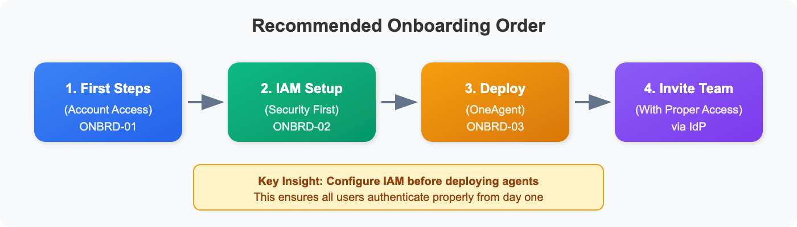
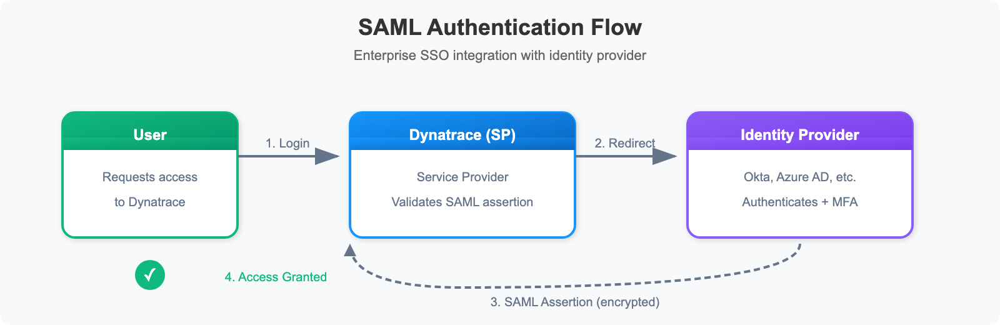
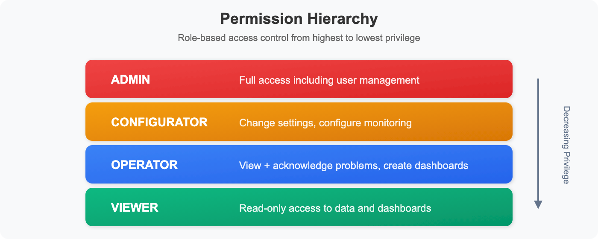
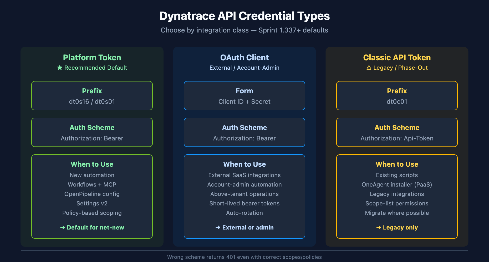

# ONBRD-02: IAM and Authentication

> **Series:** ONBRD — Dynatrace Onboarding | **Notebook:** 2 of 10 | **Created:** December 2025 | **Last Updated:** 05/06/2026

## Setting Up Secure Access
Before inviting your team, configure authentication and permissions properly. This notebook covers SAML/SSO setup, API tokens, and the modern permission model.

---

## Table of Contents

1. [Why IAM First?](#why-iam-first)
2. [Authentication Options](#authentication-options)
3. [Configuring SAML SSO](#configuring-saml-sso)
4. [User Groups and Permissions](#user-groups-and-permissions)
5. [API Token and OAuth Management](#api-token-and-oauth-management)
6. [Verification Queries](#verification-queries)

---

## Prerequisites

- Account owner or admin access
- Identity provider details (for SSO)
- Understanding of your organization's access requirements

<a id="why-iam-first"></a>
## 1. Why IAM First?
Setting up IAM before deploying OneAgent or inviting users ensures:

| Benefit | Why It Matters |
|---------|----------------|
| **Consistent access** | Users authenticate the same way from day one |
| **Proper permissions** | No accidental admin access for viewers |
| **Audit trail** | All access tied to corporate identity |
| **Offboarding** | Disabling IdP account revokes Dynatrace access |
| **Compliance** | Meet security requirements from the start |


<!-- MARKDOWN_TABLE_ALTERNATIVE
| Step | Description |
|------|-------------|
| 1. First Steps | Account access (ONBRD-01) |
| 2. IAM Setup | Security configuration (ONBRD-02) |
| 3. Deploy ActiveGate | Network routing (ONBRD-03) |
| 4. Deploy OneAgent | Start monitoring (ONBRD-05) |
| 5. Invite Team | Users join with proper access via IdP |
-->

<a id="authentication-options"></a>
## 2. Authentication Options
Dynatrace supports multiple authentication methods:

| Method | Description | Best For |
|--------|-------------|----------|
| **Local Users** | Built-in user accounts | Small teams, testing, break-glass accounts |
| **SAML 2.0** | Enterprise SSO integration | Most organizations |
| **OIDC** | OpenID Connect integration | Modern identity providers |

### Authentication Flow


<!-- MARKDOWN_TABLE_ALTERNATIVE
| Step | Description |
|------|-------------|
| 1. Login | User requests access to Dynatrace |
| 2. Redirect | Dynatrace redirects to Identity Provider |
| 3. Auth + MFA | User authenticates with IdP |
| 4. SAML Assertion | IdP sends encrypted assertion to Dynatrace |
| 5. Access Granted | User is logged in |
-->

### Common Identity Providers

- **Azure Active Directory (Entra ID)** - Microsoft environments
- **Okta** - Cloud-native identity
- **OneLogin** - Enterprise identity
- **PingFederate** - On-premises/hybrid
- **Google Workspace** - Google-centric organizations

<a id="configuring-saml-sso"></a>
## 3. Configuring SAML SSO
### Step 1: Access Account Management

**Location:** Account Management → Identity & access management → Single sign-on

You'll need these values for your IdP configuration:

| Field | Description |
|-------|-------------|
| **Entity ID** | Unique identifier for Dynatrace |
| **ACS URL** | Assertion Consumer Service URL |
| **Relay State** | Where users land after login |

### Step 2: Configure Your Identity Provider

In your IdP, create a new SAML application with:

1. **ACS URL** from Dynatrace
2. **Entity ID** from Dynatrace
3. **Name ID Format:** Email address (recommended)
4. **Required Attributes:**
   - `email` - User's email address
   - `firstName` - User's first name
   - `lastName` - User's last name

### Step 3: Configure Dynatrace

**Location:** Account Management → Identity & access management → Single sign-on

1. Upload or paste the IdP metadata XML
2. Or manually configure:
   - **IdP Entity ID** - From your IdP
   - **SSO URL** - Login endpoint
   - **Certificate** - IdP signing certificate
3. Configure attribute mappings
4. Save and test

### Step 4: Test SSO

Before enabling SSO for all users:

1. Open an incognito/private browser window
2. Navigate to your tenant URL (`https://{tenant-id}.apps.dynatrace.com`)
3. Select "Sign in with SSO"
4. Complete IdP authentication
5. Verify you land in Dynatrace with correct permissions

> **Warning:** Keep at least one local admin account as a break-glass option in case SSO fails.

<a id="user-groups-and-permissions"></a>
## 4. User Groups and Permissions
### Permission Model

Dynatrace uses a policy-based access control model with the following permission levels:


<!-- MARKDOWN_TABLE_ALTERNATIVE
| Level | Access |
|-------|--------|
| Admin | Full access including user management |
| Configurator | Change settings, configure monitoring |
| Operator | View + acknowledge problems, create dashboards |
| Viewer | Read-only access to data and dashboards |
-->

### Recommended Groups

| Group | Role | Use Case |
|-------|------|----------|
| **Platform Admins** | Admin | Platform team, IAM management |
| **SRE Team** | Configurator | Workflow setup, monitoring config |
| **Developers** | Operator | Problem response, dashboards |
| **Stakeholders** | Viewer | Reports, read-only access |

### Creating Groups

**Location:** Account Management → Identity & access management → Groups

1. Click "Create group"
2. Name the group (e.g., "SRE-Team")
3. Add a description
4. Assign policies (permissions)
5. Optionally link to IdP groups for automatic membership

### Scoping Access with Policies

The modern platform uses **policies** to control what users can access:

| Policy Type | Purpose |
|-------------|--------|
| **Environment policies** | Access to specific environments |
| **Account policies** | Account-level management |
| **Data policies** | Access to specific data (via segments + `dt.security_context`) |

### Parameterized Policies (Strongly Recommended)

Prefer **one parameterized policy bound to multiple groups via binding parameters** over many copies of the same policy with hardcoded scope values:

```text
ALLOW storage:logs:read WHERE storage:dt.security_context = $bindingParameter("team")
```

Bind the policy to `team-payments`, `team-checkout`, `team-fraud`, etc., varying only the `team` parameter — one policy, N bindings. The parameter shape is load-bearing: design once, change rarely.

The **`dt.security_context`** field is the standardized boundary for Gen3 IAM scoping across both data and configurations. Without it, cross-entity-type policies cannot be written. Decide your `dt.security_context` value space before tagging anything (covered in **ONBRD-06**).

### Where to Go Deeper

- **IAM-04 / IAM-05** — Designing effective policies and boundary conditions
- **IAM-11 (WORKSHOP)** — Hands-on policy and persona design
- **IAM-99** — IAM best-practice summary and DQL reference
- **FAQ-02** — Tagging sources, standards, and strategy (`dt.security_context` design)
- **ORGNZ-06 / ORGNZ-07** — Security context for data and configuration scoping

> **Note:** For data filtering, use **Segments + `dt.security_context`** (covered in ONBRD-06) rather than the legacy Management Zones.

<a id="api-token-and-oauth-management"></a>
## 5. API Token and OAuth Management

The modern platform supports three credential types — pick based on the integration:


<!-- MARKDOWN_TABLE_ALTERNATIVE
| Token Type | Prefix | Auth Scheme | When to Use |
|------------|--------|-------------|-------------|
| Platform Token (recommended default, sprint-1.337+) | dt0s16 / dt0s01 | Authorization: Bearer | New automation, Workflows, MCP, OpenPipeline, Settings v2 |
| OAuth Client | client ID + secret | Authorization: Bearer | External SaaS integrations, account-admin automation |
| Classic API Token (legacy phase-out) | dt0c01 | Authorization: Api-Token | Existing scripts; OneAgent installer (PaaS); migrate to Platform Token |
For environments where SVG doesn't render
-->

| Credential | Prefix / Form | When to Use |
|------------|---------------|-------------|
| **Platform Token** *(recommended default for new automation)* | `dt0s16` / `dt0s01` | New automation, Workflows, MCP integrations, OpenPipeline configuration, Settings v2 |
| **OAuth 2.0 Client** | client ID + secret | External SaaS integrations, account-admin automation |
| **Classic API Token** *(legacy phase-out)* | `dt0c01` | Existing scripts; migrate to Platform Token where possible |

### Platform Tokens (Recommended Default — Sprint 1.337+)

Platform Tokens are the standard for new automation as of sprint-337. They:

- Use **policy-based permissions** (same Gen3 model as user groups) — no scope-list to maintain per token
- Are bound to a single user identity (or service identity) for traceability
- Should be the default unless you have a specific reason to choose OAuth or Classic

**Location:** Account Management → Access tokens → "Generate Platform Token"

```bash
# Authorization scheme by token prefix:
#   dt0s16 / dt0s01  →  Authorization: Bearer <token>
#   dt0c01           →  Authorization: Api-Token <token>
# Wrong scheme returns 401 even with correct scopes/policies.
```

### OAuth 2.0 Clients

Use for **external system integrations** or **account-admin automation** that operates above the tenant level.

**Location:** Account Management → OAuth clients

1. Create an OAuth client
2. Use client credentials flow to obtain bearer tokens
3. Tokens are short-lived and automatically rotated

### Classic API Tokens (Legacy)

Existing scripts and OneAgent installer downloads still use Classic API tokens. Migrate to Platform Tokens during routine refresh cycles. Classic tokens use the `Api-Token` Authorization scheme (not `Bearer`).

**Location:** Account Management → Access tokens

| Common Use | Required Scope |
|------------|---------------|
| **OneAgent Installer Download** | `InstallerDownload` |
| **Metric Ingestion** | `metrics.ingest` |
| **Log Ingestion** | `logs.ingest` |

> **Sprint 1.338 ActiveGate token note:** ActiveGate token schema changed in sprint-338 — review the upgrade-notes for any AG-token-issuing automation before upgrading.

### Token Best Practices

| Practice | Why |
|----------|-----|
| **Minimal scope / least-privilege policy** | Limit blast radius if compromised |
| **Descriptive names** | Know what each token is for |
| **Expiration dates** | Force rotation, reduce risk |
| **Separate tokens per use** | Revoke one without affecting others |
| **Never commit to code** | Use environment variables or secrets managers |
| **Prefer Platform Tokens for new work** | Aligned with the Gen3 IAM model |

### Where to Go Deeper

- **IAM series** — Token management, lifecycle, audit patterns

<a id="verification-queries"></a>
## 6. Verification Queries
After configuring IAM, verify your setup with these queries.

```dql
// Check recent audit log entries for user access
fetch logs, from: now() - 24h
| filter matchesPhrase(log.source, "audit")
| fields timestamp, content
| sort timestamp desc
| limit 50
```

```dql
// Check for authentication events (if audit logs enabled)
fetch logs, from: now() - 7d
| filter matchesPhrase(content, "login") or matchesPhrase(content, "authentication")
| fields timestamp, content
| sort timestamp desc
| limit 25
```

### Manual Verification Checklist

| Item | How to Verify |
|------|---------------|
| **SSO working** | Login via IdP in incognito window |
| **Groups created** | Check Account Management → Groups |
| **Permissions assigned** | Test with a viewer account |
| **Break-glass account** | Local admin login still works |
| **API tokens** | OneAgent deployment token ready |

## 7. Next Steps

With IAM configured, you're ready to:

1. **ONBRD-03: Deploying ActiveGate** — Set up network routing (if needed for restricted networks)
2. **ONBRD-04: Cloud & SaaS Integrations** — Connect AWS / Azure / GCP and SaaS sources
3. **ONBRD-05: Deploying OneAgent** — Start collecting infrastructure and application data
4. **ONBRD-06: Organizing Your Environment** — Set up tags, segments, and `dt.security_context`
5. Invite team members via your IdP
6. Create additional Platform Tokens or OAuth clients as needed

### IAM Tasks Before Moving On

- [ ] SAML/SSO configured and tested
- [ ] Break-glass local admin account documented
- [ ] User groups created for major roles
- [ ] Parameterized policy shape decided; group → policy bindings drafted
- [ ] `dt.security_context` value space planned (deeper in ONBRD-06 / FAQ-02)
- [ ] Platform Token issued for migration / automation tooling
- [ ] OneAgent installer (PaaS) token generated
- [ ] Token naming conventions established

### Where to Go Deeper

- **IAM series** (13 notebooks) — full IAM administration depth
- **FAQ-02** — Tagging sources, standards, and strategy
- **ORGNZ series** — Bucket strategy, segments, security context

---

## Summary

In this notebook, you learned:

- Why IAM should be configured before deploying agents
- Authentication options (Local, SAML, OIDC)
- How to configure SAML SSO
- Permission levels, group structure, and parameterized policies
- The three credential types (Platform Token, OAuth, Classic API Token) and when to use each
- `dt.security_context` as the standardized boundary field for Gen3 IAM
- How to verify IAM configuration

---

## References

- [Identity and Access Management](https://docs.dynatrace.com/docs/manage/identity-access-management)
- [Platform Tokens](https://docs.dynatrace.com/docs/manage/identity-access-management/access-tokens-and-oauth-clients/platform-tokens)
- [SAML Configuration](https://docs.dynatrace.com/docs/manage/identity-access-management/single-sign-on/saml-configuration)
- [OIDC Configuration](https://docs.dynatrace.com/docs/manage/identity-access-management/single-sign-on/configure-oidc)
- [Access Tokens](https://docs.dynatrace.com/docs/manage/access-control/access-tokens)
- [OAuth Clients](https://docs.dynatrace.com/docs/manage/identity-access-management/oauth-clients)

---

<sub>*This notebook was AI-generated from community-submitted and publicly available sources. This notebook series is not officially supported by Dynatrace. Always verify information against official Dynatrace documentation.*</sub>
