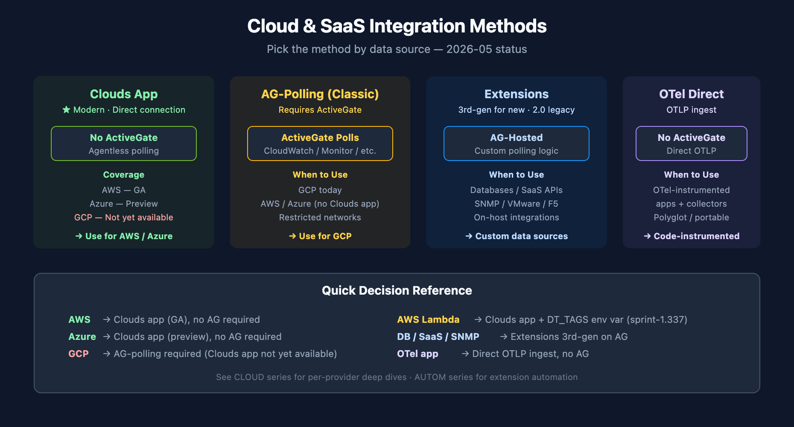
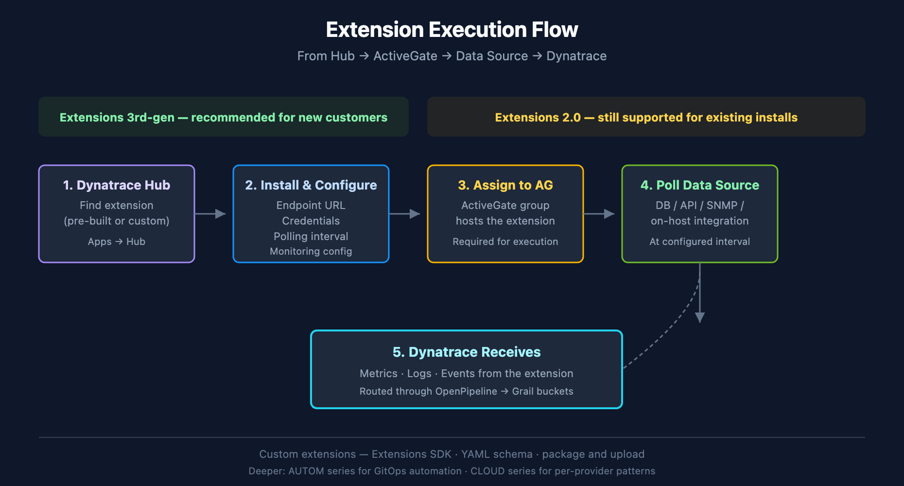

# ONBRD-04: Cloud & SaaS Integrations

> **Series:** ONBRD — Dynatrace Onboarding | **Notebook:** 4 of 10 | **Created:** January 2026 | **Last Updated:** 05/06/2026

## Extending Visibility Beyond OneAgent
While OneAgent provides deep application and infrastructure monitoring, many organizations need visibility into cloud services and SaaS platforms that can't run an agent. This notebook covers how to integrate AWS, Azure, GCP, and third-party SaaS tools into Dynatrace.

---

## Table of Contents

1. [Integration Overview](#integration-overview)
2. [AWS Integration](#aws-integration)
3. [Azure Integration](#azure-integration)
4. [GCP Integration](#gcp-integration)
5. [Extensions Framework](#extensions-20-framework)
6. [Dynatrace Hub](#dynatrace-hub)
7. [Common SaaS Integrations](#common-saas-integrations)
8. [Verifying Integrations](#verifying-integrations)
9. [Next Steps](#next-steps)

---

## Prerequisites

- Dynatrace environment with admin access
- **ActiveGate** deployed where required — Extensions and GCP polling still need an AG; AWS (Clouds app GA) and Azure (Clouds app preview) can use direct connections without AG
- Cloud provider admin access (for AWS/Azure/GCP)
- API credentials for SaaS platforms

<a id="integration-overview"></a>
## 1. Integration Overview

Dynatrace offers multiple integration methods depending on the data source:


<!-- MARKDOWN_TABLE_ALTERNATIVE
| Method | When to Use | Requires AG? |
|--------|-------------|--------------|
| Clouds App | AWS (GA) / Azure (preview) — direct connection | No |
| AG-Polling (Classic) | GCP today; AWS/Azure without Clouds app; restricted networks | Yes |
| Extensions (3rd-gen / 2.0) | Custom data sources, SaaS APIs, SNMP, on-host integrations | Yes |
| OTel Direct | OTel-instrumented apps and collectors | No (OTLP) |
For environments where SVG doesn't render
-->

| Method | Use Case | Requires ActiveGate? |
|--------|----------|---------------------|
| **Clouds App (recommended where supported)** | AWS (GA), Azure (preview); GCP not yet available | No (direct connection) |
| **Cloud Integrations (Classic / AG-polling)** | GCP today; AWS / Azure where Clouds app is not used | Yes |
| **Extensions 3rd-gen *(recommended for new customers)*** | Custom data sources, SaaS APIs, on-host integrations | Yes (AG-hosted) |
| **Extensions 2.0 *(legacy / existing installs)*** | Pre-existing Extension 2.0 packages | Yes |
| **OpenTelemetry** | OTel-instrumented apps | No (direct OTLP ingest) |
| **Log Ingest** | External log sources | Optional (AG can route) |
| **Metrics Ingest** | Custom metrics via API | No |

### Decision Rule (Quick Reference)

| Source | Default Method (2026-05) |
|--------|--------------------------|
| **AWS** | Clouds app (GA) — direct connection |
| **Azure** | Clouds app (preview) — direct connection |
| **GCP** | AG-based polling (Clouds app not yet available); review Azure Native and GCP push-based as alternatives |
| **AWS Lambda** | Clouds app + DT_TAGS env var (sprint-1.337) for tag propagation |
| **Custom DB / SaaS / SNMP** | Extensions 3rd-gen on AG |
| **OTel-instrumented app** | OTLP ingest direct to Dynatrace |

### Why Integrate Before OneAgent?

| Benefit | Description |
|---------|-------------|
| **Infrastructure context** | See cloud resources before deploying agents |
| **Dependency mapping** | Understand managed services (RDS, Lambda, etc.) |
| **Cost visibility** | Cloud cost data available immediately |
| **Complete topology** | Smartscape includes cloud services from day one |

> **Where to go deeper:** the **CLOUD series** (9 notebooks) covers per-provider deep dives (AWS, Azure, GCP). The **AUTOM series** covers GitOps/Terraform automation for extension deployment at scale.

<a id="aws-integration"></a>
## 2. AWS Integration
The AWS integration pulls metrics from CloudWatch and discovers AWS resources.

### Supported Services

| Category | Services |
|----------|----------|
| **Compute** | EC2, Lambda, ECS, EKS, Fargate |
| **Database** | RDS, DynamoDB, ElastiCache, DocumentDB |
| **Storage** | S3, EBS, EFS |
| **Networking** | ELB, ALB, NLB, API Gateway, CloudFront |
| **Messaging** | SQS, SNS, Kinesis, MSK |
| **Other** | Step Functions, Secrets Manager, and more |

### Setup Methods

| Method | Best For | Complexity |
|--------|----------|------------|
| **IAM Role (recommended)** | Production, multi-account | Medium |
| **Access Key** | Quick testing | Low |
| **CloudFormation** | Automated setup | Low |

### IAM Role Setup

1. Create an IAM role with CloudWatch read permissions
2. Add trust relationship for Dynatrace's AWS account
3. Configure in Dynatrace: Settings → Cloud and virtualization → AWS

**Required IAM Policy:**

```json
{
  "Version": "2012-10-17",
  "Statement": [
    {
      "Effect": "Allow",
      "Action": [
        "cloudwatch:GetMetricData",
        "cloudwatch:GetMetricStatistics",
        "cloudwatch:ListMetrics",
        "tag:GetResources",
        "tag:GetTagKeys",
        "tag:GetTagValues",
        "ec2:DescribeInstances",
        "ec2:DescribeVolumes",
        "rds:DescribeDBInstances",
        "lambda:ListFunctions",
        "lambda:GetFunction"
      ],
      "Resource": "*"
    }
  ]
}
```

### Configuration Location

**Path:** Settings → Cloud and virtualization → AWS

| Setting | Recommendation |
|---------|----------------|
| **Polling interval** | 5 minutes (default) |
| **Services to monitor** | Start with core services, expand as needed |
| **Regions** | Only regions where you have resources |
| **Resource tags** | Use tags to filter monitored resources |

<a id="azure-integration"></a>
## 3. Azure Integration
The Azure integration uses Azure Monitor to collect metrics and discover resources.

### Supported Services

| Category | Services |
|----------|----------|
| **Compute** | Virtual Machines, App Service, Functions, AKS |
| **Database** | SQL Database, Cosmos DB, Redis Cache |
| **Storage** | Blob, Files, Queues, Tables |
| **Networking** | Load Balancer, Application Gateway, VNet |
| **Messaging** | Service Bus, Event Hubs, Event Grid |

### Setup via App Registration

1. Create an App Registration in Azure AD
2. Grant **Reader** role on subscriptions to monitor
3. Create a client secret
4. Configure in Dynatrace with:
   - Tenant ID
   - Client ID
   - Client Secret
   - Subscription IDs

**Configuration Location:** Settings → Cloud and virtualization → Azure

<a id="gcp-integration"></a>
## 4. GCP Integration

The GCP integration uses Cloud Monitoring (formerly Stackdriver) APIs.

> **Status note (2026-05):** GCP is **not yet available** in the Clouds app — direct/agentless connection is not supported. Today, GCP integration requires an **ActiveGate** for polling. Review the **CLOUD series** for per-provider detail and watch the Dynatrace release notes for Clouds-app GCP availability.

### Supported Services

| Category | Services |
|----------|----------|
| **Compute** | Compute Engine, GKE, Cloud Run, Cloud Functions |
| **Database** | Cloud SQL, Cloud Spanner, Firestore, Bigtable |
| **Storage** | Cloud Storage |
| **Networking** | Load Balancing, Cloud CDN |
| **Messaging** | Pub/Sub |

### Setup via Service Account

1. Create a Service Account in GCP
2. Grant **Monitoring Viewer** role
3. Generate and download JSON key
4. Configure in Dynatrace

**Configuration Location:** Settings → Cloud and virtualization → Google Cloud Platform

<a id="extensions-20-framework"></a>
## 5. Extensions Framework

Extensions are Dynatrace's framework for integrating any data source — databases, SaaS platforms, network devices, on-host integrations, and more.

> **Recommendation for new customers:** start with **Extensions 3rd-gen** (the current generation). Extensions 2.0 is still supported for existing installs but Extensions 3rd-gen is the default path for net-new integrations.


<!-- MARKDOWN_TABLE_ALTERNATIVE
| Step | Component | Action |
|------|-----------|--------|
| 1 | Dynatrace Hub | Find extension (pre-built or custom) |
| 2 | Monitoring Config | Set endpoint, credentials, polling interval |
| 3 | ActiveGate | Assign extension to AG group; AG hosts and executes |
| 4 | Data Source | AG polls DB / API / SNMP at configured interval |
| 5 | Dynatrace | Metrics / logs / events arrive via OpenPipeline → Grail |
For environments where SVG doesn't render
-->

### How Extensions Work

| Component | Role |
|-----------|------|
| **Extension Package** | Code + metadata defining what to collect |
| **ActiveGate** | Hosts and executes the extension; polls data sources |
| **Monitoring Configuration** | Instance-specific settings (endpoints, credentials) |
| **Dynatrace** | Receives metrics, logs, events from the extension |

### Extension Categories

| Category | Examples |
|----------|----------|
| **Database** | Oracle, SQL Server, PostgreSQL, MongoDB, Redis, Cassandra, MariaDB, DB2, HANA |
| **On-host integrations** | NGINX, HAProxy, Kafka, RabbitMQ, Elasticsearch, Memcached, Couchbase, Consul, Apache, etcd, Varnish, Zookeeper |
| **Infrastructure** | VMware, SNMP devices, F5, NetApp |
| **SaaS** | Salesforce, ServiceNow, Jira, Confluent |
| **Custom** | Any REST API, custom protocols |

### Installing an Extension

1. **Find the extension** in Dynatrace Hub
2. **Install** to your environment
3. **Configure** with endpoint and credentials
4. **Assign** to an ActiveGate group
5. **Verify** data is flowing

### Extension Configuration Example

```yaml
# Example: Generic REST API extension configuration
enabled: true
description: "My SaaS API"
endpoints:
  - url: "https://api.example.com/metrics"
    authentication:
      type: "bearer"
      token: "${SAAS_API_TOKEN}"
    polling_interval: 60
activeGate:
  group: "saas-integrations"
```

### Creating Custom Extensions

For SaaS platforms without a pre-built extension, you can build a custom extension:

1. Use the Extensions SDK (3rd-gen for new development)
2. Define metrics schema in YAML
3. Write the polling logic
4. Package and upload to Dynatrace

**SDK Documentation:** [Extensions Development](https://docs.dynatrace.com/docs/extend-dynatrace/extensions20)

<a id="dynatrace-hub"></a>
## 6. Dynatrace Hub
The Dynatrace Hub is your marketplace for extensions, integrations, and apps.

### Accessing the Hub

**Path:** Apps → Dynatrace Hub

Or use quick search: **Cmd+K** → "Hub"

### Hub Categories

| Category | Examples |
|----------|----------|
| **Cloud** | AWS, Azure, GCP, Kubernetes |
| **Database** | Oracle, SQL Server, PostgreSQL |
| **Infrastructure** | VMware, SNMP, NetApp |
| **Messaging** | Kafka, RabbitMQ, IBM MQ |
| **Observability** | OpenTelemetry, Prometheus |
| **Security** | Snyk, SonarQube |
| **ITSM** | ServiceNow, Jira, PagerDuty |

### Installing from Hub

1. Search for the integration you need
2. Click **Install** or **Add to environment**
3. Follow the configuration wizard
4. Verify data appears in Dynatrace

<a id="common-saas-integrations"></a>
## 7. Common SaaS Integrations
### Messaging Platforms

| Platform | Integration Method | Key Metrics |
|----------|-------------------|-------------|
| **Confluent Cloud** | Extensions 2.0 | Consumer lag, throughput, partitions |
| **Amazon MSK** | AWS Integration | Broker metrics, topic metrics |
| **RabbitMQ** | Extensions 2.0 | Queue depth, message rates |

### CRM & Business Apps

| Platform | Integration Method | Key Metrics |
|----------|-------------------|-------------|
| **Salesforce** | Extensions 2.0 / API | API calls, response times, limits |
| **ServiceNow** | Extensions 2.0 | Incident metrics, workflow times |

### DevOps Tools

| Platform | Integration Method | Key Metrics |
|----------|-------------------|-------------|
| **GitHub** | Webhooks | Deployment events, commit info |
| **GitLab** | Webhooks | Pipeline events, deployments |
| **ArgoCD** | Extensions 2.0 | Sync status, app health |

### Database-as-a-Service

| Platform | Integration Method | Key Metrics |
|----------|-------------------|-------------|
| **MongoDB Atlas** | Extensions 2.0 | Connections, ops/sec, replication lag |
| **AWS DocumentDB** | AWS Integration | CloudWatch metrics |
| **Snowflake** | Extensions 2.0 | Query performance, warehouse usage |

<a id="verifying-integrations"></a>
## 8. Verifying Integrations
After configuring integrations, verify data is flowing into Dynatrace.

```dql
// Check for AWS Lambda functions (modern Smartscape topology query)
smartscapeNodes "AWS_LAMBDA_FUNCTION"
| fields name, id
| limit 20

// Legacy alternative (deprecated dt.entity.* — still works on hybrid tenants):
// fetch dt.entity.aws_lambda_function
// | fields entity.name, id
// | limit 20

```

```dql
// Check for Azure VMs (modern Smartscape topology query)
smartscapeNodes "AZURE_VM"
| fields name, id
| limit 20

// Legacy alternative (deprecated dt.entity.* — still works on hybrid tenants):
// fetch dt.entity.azure_vm
// | fields entity.name, id
// | limit 20

```

```dql
// Check for cloud-sourced metrics
// Note: There is no "metrics" starting command in DQL.
// Use timeseries to query a specific cloud metric, for example:
timeseries avg(dt.cloud.aws.lambda.duration), from:-24h
// Or browse available cloud metrics in the Dynatrace Metrics browser:
// Observe & Explore → Metrics → search for "cloud" or "aws" / "azure" / "gcp"
```

```dql
// Check Extensions 2.0 status
// Note: "dt.entity.extensions:extension" is not a valid entity type for DQL fetch.
// Use the Extensions API v2 instead:
//   GET /api/v2/extensions
// Or check installed extensions in the Dynatrace Hub:
//   Apps → Dynatrace Hub → Installed
// To list extension-reported entities, query a known extension entity type:
fetch dt.entity.host
| fieldsKeep entity.name, id
| limit 10

// Alternative: Smartscape on Grail (entity.name → name)
// smartscapeNodes HOST
// | fieldsKeep name, id
// | limit 10

```

### Troubleshooting Integration Issues

| Issue | Common Cause | Solution |
|-------|--------------|----------|
| **No data appearing** | Credentials invalid | Verify IAM role/service account |
| **Partial data** | Permissions incomplete | Check required permissions list |
| **Delayed data** | Polling interval | CloudWatch has 5-min delay by design |
| **Extension not running** | ActiveGate issue | Check AG logs, verify assignment |
| **Metrics but no entities** | Tag configuration | Ensure resources are tagged correctly |

<a id="next-steps"></a>
## 9. Next Steps

With cloud and SaaS integrations configured:

1. **ONBRD-05: Deploying OneAgent** — Add deep application monitoring
2. **ONBRD-06: Organizing Your Environment** — Tag and segment integrated resources; design `dt.security_context`
3. Explore the topology in Smartscape to see cloud services
4. Create dashboards combining cloud metrics with application data

### Where to Go Deeper

- **CLOUD series** (9 notebooks) — Per-provider integration deep dives (AWS, Azure, GCP)
- **AUTOM series** (11 notebooks) — GitOps / Terraform / Monaco automation for extension deployment
- **OPLOGS / OPMIG / OPIPE** — OpenPipeline routing for ingested cloud and SaaS data
- **OTEL series** — OpenTelemetry as the alternative ingest path

### Integration Checklist

- [ ] AWS / Azure / GCP integration configured (Clouds app where supported, AG polling for GCP)
- [ ] Required cloud permissions granted
- [ ] ActiveGate assigned for Extensions
- [ ] Extensions 3rd-gen evaluated as default for net-new integrations
- [ ] Key SaaS platforms identified for integration
- [ ] Extensions installed from Hub
- [ ] Data verified flowing into Dynatrace

---

## Summary

In this notebook, you learned:

- The integration method matrix (Clouds app / AG polling / Extensions / OTel / Ingest APIs)
- Per-provider status (AWS GA, Azure preview, GCP not-yet-Clouds-app)
- AWS, Azure, and GCP setup paths
- Extensions framework with 3rd-gen as the new-customer default
- Dynatrace Hub for discovery
- Common SaaS integration patterns
- DQL queries to verify integrations are landing in topology

---

## References

- [Cloud Platforms](https://docs.dynatrace.com/docs/platform-modules/infrastructure-monitoring/cloud-platform-monitoring)
- [Clouds App](https://docs.dynatrace.com/docs/platform-modules/infrastructure-monitoring/cloud-platform-monitoring)
- [AWS Monitoring](https://docs.dynatrace.com/docs/platform-modules/infrastructure-monitoring/cloud-platform-monitoring/aws-monitoring)
- [Azure Monitoring](https://docs.dynatrace.com/docs/platform-modules/infrastructure-monitoring/cloud-platform-monitoring/azure-monitoring)
- [Google Cloud Monitoring](https://docs.dynatrace.com/docs/platform-modules/infrastructure-monitoring/cloud-platform-monitoring/google-cloud-monitoring)
- [Extensions Framework](https://docs.dynatrace.com/docs/extend-dynatrace/extensions20)
- [Dynatrace Hub](https://docs.dynatrace.com/docs/manage/hub)

---

<sub>*This notebook was AI-generated from community-submitted and publicly available sources. This notebook series is not officially supported by Dynatrace. Always verify information against official Dynatrace documentation.*</sub>
