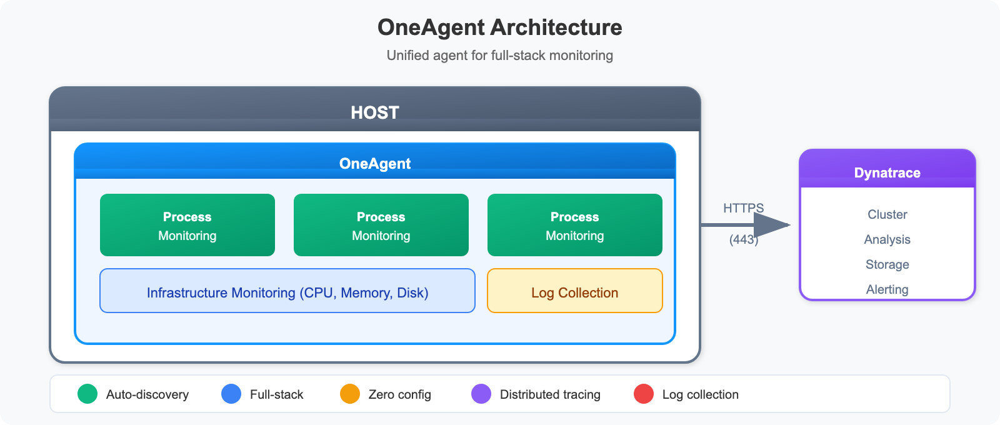
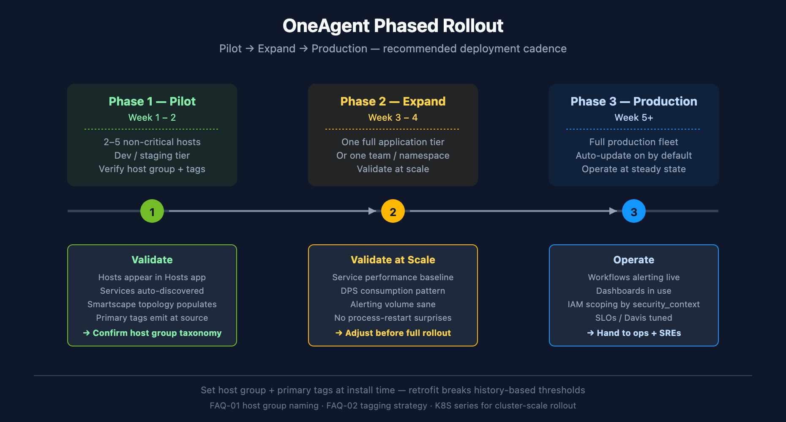
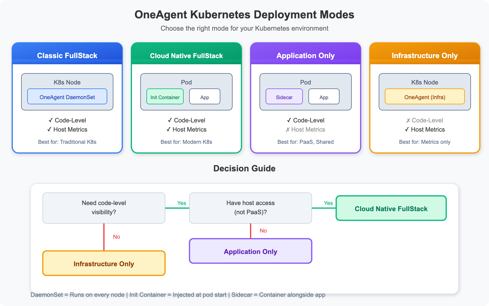

# ONBRD-05: Deploying OneAgent

> **Series:** ONBRD — Dynatrace Onboarding | **Notebook:** 5 of 10 | **Created:** December 2025 | **Last Updated:** 05/06/2026

## Getting Data Into Dynatrace
OneAgent is the foundation of Dynatrace monitoring. This notebook covers deployment strategies, installation methods, and verification steps to ensure your infrastructure is reporting data.

---

## Table of Contents

1. [What is OneAgent?](#what-is-oneagent)
2. [Deployment Strategy](#deployment-strategy)
3. [Generating a Deployment Token](#generating-a-deployment-token)
4. [Installation Methods](#installation-methods)
5. [Kubernetes Deployment](#kubernetes-deployment)
6. [Verifying Deployment](#verifying-deployment)
7. [Troubleshooting](#troubleshooting)

---

## Prerequisites

- Admin access to Dynatrace environment
- API token with `InstallerDownload` scope (created in ONBRD-02)
- Root/admin access to target hosts
- Network access from hosts to Dynatrace (port 443) or ActiveGate (ONBRD-03)
- Cloud integrations configured (ONBRD-04) for full context

<a id="what-is-oneagent"></a>
## 1. What is OneAgent?
OneAgent is Dynatrace's unified monitoring agent that:

| Capability | Description |
|------------|-------------|
| **Auto-discovery** | Automatically detects hosts, processes, services |
| **Full-stack** | Infrastructure, application, and user experience |
| **Zero configuration** | Works immediately after installation |
| **Distributed tracing** | End-to-end transaction visibility |
| **Log collection** | Collects and forwards log data |


<!-- MARKDOWN_TABLE_ALTERNATIVE
| Component | Location | Function |
|-----------|----------|----------|
| OneAgent | Host | Unified monitoring agent |
| Process Monitoring | Inside OneAgent | Monitors each running process |
| Infrastructure Monitoring | Inside OneAgent | CPU, Memory, Disk metrics |
| Log Collection | Inside OneAgent | Collects application logs |
| Dynatrace Cluster | Cloud | Analysis, storage, alerting |
-->

<a id="deployment-strategy"></a>
## 2. Deployment Strategy
### Phased Rollout (Recommended)

Don't deploy everywhere at once. Use a phased approach:


<!-- MARKDOWN_TABLE_ALTERNATIVE
| Phase | Window | Scope | Validation Focus |
|-------|--------|-------|------------------|
| 1 Pilot | Week 1–2 | 2–5 non-critical hosts | Hosts appear; Smartscape populates; primary tags emit |
| 2 Expand | Week 3–4 | One application tier or team | Service baseline; DPS pattern; alerting volume sane |
| 3 Production | Week 5+ | Full production fleet | Workflows alerting live; SLOs/Davis tuned; IAM scoping confirmed |
For environments where SVG doesn't render
-->

| Phase | Scope | Purpose |
|-------|-------|--------|
| **Pilot** | 2-5 non-critical hosts | Validate installation, network, discovery |
| **Expand** | One application tier | Test service detection, tracing |
| **Production** | Full environment | Complete coverage |

### Deployment Methods by Environment

| Environment | Recommended Method |
|-------------|-------------------|
| **Bare metal/VMs** | Direct install or package manager |
| **Kubernetes** | Dynatrace Operator |
| **OpenShift** | Dynatrace Operator |
| **AWS ECS** | Task definition sidecar |
| **Azure** | VM Extension or AKS Operator |
| **GCP** | Direct install or GKE Operator |

### Network Requirements

OneAgent needs outbound HTTPS (443) to:
- `*.apps.dynatrace.com` (SaaS)

If direct access isn't possible, OneAgents connect through **ActiveGate** (see ONBRD-03).

<a id="generating-a-deployment-token"></a>
## 3. Generating a Deployment Token
You need an API token with installer download permissions.

**Location:** Account Management → Access tokens → Generate new token

### Required Scope

| Scope | API Name | Purpose |
|-------|----------|--------|
| **PaaS integration - Installer download** | `InstallerDownload` | Download OneAgent installer |

### Token Naming Convention

Use descriptive names:
- `prod-oneagent-deployment`
- `dev-installer-token`
- `k8s-operator-token`

> **Important:** Copy the token immediately after creation. It won't be shown again.

<a id="installation-methods"></a>
## 4. Installation Methods
### Linux (Direct Download)

```bash
# Download the installer
wget -O Dynatrace-OneAgent.sh \
  "https://{tenant-id}.apps.dynatrace.com/api/v1/deployment/installer/agent/unix/default/latest?Api-Token={token}&arch=x86&flavor=default"

# Run the installer
sudo /bin/sh Dynatrace-OneAgent.sh
```

### Linux (One-liner)

```bash
wget -O Dynatrace-OneAgent.sh "https://{tenant-id}.apps.dynatrace.com/api/v1/deployment/installer/agent/unix/default/latest?Api-Token={token}" && sudo /bin/sh Dynatrace-OneAgent.sh
```

### Windows (PowerShell)

```powershell
# Download the installer
Invoke-WebRequest -Uri "https://{tenant-id}.apps.dynatrace.com/api/v1/deployment/installer/agent/windows/default/latest?Api-Token={token}" -OutFile Dynatrace-OneAgent.exe

# Run the installer
.\Dynatrace-OneAgent.exe
```

> **Sprint 1.338 Windows network insight (Npcap):** new OneAgent Windows builds use **Npcap** for network-monitoring capture (replacing legacy WinPcap). Plan an Npcap install / redistribution into your Windows golden image when rolling out OneAgent on hosts that need network insight. See the OneAgent release notes for the affected version range.

### Setting Primary Tags at Install Time (Sprint 1.337+)

Set `dt.security_context`, environment, team, cost-center, and other primary tags at OneAgent install time using `oneagentctl --set-host-tag`. Primary tags emit at the source on every signal (metrics, spans, logs, events) and feed directly into OpenPipeline routing, bucket assignment, and IAM scoping — more efficient than view-time auto-tagging.

```bash
# Set primary tags after install (Linux)
sudo /opt/dynatrace/oneagent/agent/tools/oneagentctl --set-host-tag environment=prod
sudo /opt/dynatrace/oneagent/agent/tools/oneagentctl --set-host-tag team=payments
sudo /opt/dynatrace/oneagent/agent/tools/oneagentctl --set-host-tag dt.security_context=team-payments

# Set host group at install time (preferred — avoid renaming later)
sudo /bin/sh Dynatrace-OneAgent.sh --set-host-group=prod-app-payments
```

Decide your primary-tag and host-group taxonomy *before* the first install — retrofitting breaks history-based thresholds, IAM scoping, and any automation keyed on those values. See **FAQ-01 (host group naming strategy)** and **FAQ-02 (tagging sources, standards, strategy)** for the canonical guidance.

### Configuration Management

For Ansible, Puppet, Chef, or other tools, see:
- [Ansible Collection](https://docs.dynatrace.com/docs/setup-and-configuration/dynatrace-oneagent/installation-and-operation/linux/installation/install-oneagent-on-linux#expand--oneagent-deployment-automation-with-ansible--2)
- [Puppet Module](https://forge.puppet.com/modules/dynatrace/dynatrace_oneagent)
- [Chef Cookbook](https://supermarket.chef.io/cookbooks/dynatrace)

<a id="kubernetes-deployment"></a>
## 5. Kubernetes Deployment
For Kubernetes environments, use the Dynatrace Operator—the recommended approach for deploying and managing OneAgent in containerized environments.

### OneAgent Deployment Modes

The Dynatrace Operator supports multiple deployment modes. Choose based on your requirements:


<!-- MARKDOWN_TABLE_ALTERNATIVE
| Mode | Description | Use Case |
|------|-------------|----------|
| Cloud Native FullStack | Init container injection | Kubernetes-native, automatic (recommended) |
| Application Only | Sidecar injection | PaaS, no host access |
| Host Monitoring | Host metrics only | When code-level not needed |
-->

| Mode | Deployment | Code-Level | Host Metrics | Best For |
|------|------------|------------|--------------|----------|
| **Cloud Native FullStack** | Init container + CSI | Yes | Yes | Modern K8s (recommended) |
| **Application Only** | Sidecar | Yes | No | PaaS, shared nodes, OpenShift |
| **Host Monitoring** | DaemonSet | No | Yes | When code-level monitoring not needed |

> **Note:** Classic FullStack mode is **not recommended for new deployments**. Dynatrace recommends Cloud Native FullStack for all Kubernetes environments.

### Deployment Method: Helm vs Manifests

| Method | Pros | Cons | Best For |
|--------|------|------|----------|
| **Helm Charts** | Version management, easy upgrades, values override | Requires Helm | Production, GitOps |
| **Manifest Files** | Simple, no dependencies | Manual version tracking | Air-gapped, constrained environments |

### Prerequisites

- `kubectl` access to cluster
- API token with required scopes
- Cluster admin permissions

### Required Token Scopes for Kubernetes

| Scope | Purpose |
|-------|---------|
| `InstallerDownload` | Download OneAgent |
| `entities.read` | Read topology |
| `settings.read` | Read configuration |
| `settings.write` | Write configuration |
| `DataExport` | Export data (optional) |

### Installation Option 1: Helm (Recommended)

```bash
# Add Dynatrace Helm repository
helm repo add dynatrace https://raw.githubusercontent.com/Dynatrace/dynatrace-operator/main/config/helm/repos/stable
helm repo update

# Create namespace and secret
kubectl create namespace dynatrace
kubectl -n dynatrace create secret generic dynakube --from-literal="apiToken=<API_TOKEN>" --from-literal="dataIngestToken=<DATA_INGEST_TOKEN>"

# Install with Helm
helm install dynatrace-operator dynatrace/dynatrace-operator \
  --namespace dynatrace \
  --set installCRD=true
```

### Installation Option 2: Manifest Files

1. **Navigate to Kubernetes monitoring**
   - Infrastructure → Kubernetes → Add cluster

2. **Follow the wizard**
   - Select your distribution
   - Choose observability options
   - Download dynakube.yaml

3. **Apply to cluster**
   ```bash
   kubectl apply -f https://github.com/Dynatrace/dynatrace-operator/releases/download/v1.8.1/kubernetes.yaml
   kubectl apply -f dynakube.yaml
   ```

4. **Verify deployment**
   ```bash
   kubectl get pods -n dynatrace
   ```

### DynaKube Custom Resource Configuration

The DynaKube CR is the primary configuration for the Dynatrace Operator. Here are examples for each deployment mode:

> **Important:** Use `apiVersion: dynatrace.com/v1beta5` or `v1beta6` for Dynatrace Operator 1.8.x. Operator 1.8.0 removes v1beta3 and auto-converts to v1beta6. v1beta6 adds OTLP exporter configuration.

**Cloud Native FullStack (Recommended for most K8s):**

```yaml
apiVersion: dynatrace.com/v1beta5
kind: DynaKube
metadata:
  name: dynakube
  namespace: dynatrace
spec:
  apiUrl: https://{tenant-id}.live.dynatrace.com/api

  # Cloud Native FullStack - automatic init container injection
  oneAgent:
    cloudNativeFullStack:
      tolerations:
        - effect: NoSchedule
          key: node-role.kubernetes.io/master
          operator: Exists
      args:
        - --set-host-group=my-k8s-cluster

  # ActiveGate for Kubernetes API monitoring
  activeGate:
    capabilities:
      - kubernetes-monitoring
      - routing
      - dynatrace-api
```

**Application Only (for PaaS or shared nodes):**

```yaml
apiVersion: dynatrace.com/v1beta5
kind: DynaKube
metadata:
  name: dynakube
  namespace: dynatrace
spec:
  apiUrl: https://{tenant-id}.live.dynatrace.com/api

  # Application Only - sidecar injection, no host monitoring
  oneAgent:
    applicationMonitoring:
      useCSIDriver: true
```

**Host Monitoring (host metrics only):**

```yaml
apiVersion: dynatrace.com/v1beta5
kind: DynaKube
metadata:
  name: dynakube
  namespace: dynatrace
spec:
  apiUrl: https://{tenant-id}.live.dynatrace.com/api

  # Host monitoring only - no code-level visibility
  oneAgent:
    hostMonitoring: {}
```

### Air-Gapped / Private Registry Deployment

For environments without internet access, host images in a private registry:

```yaml
apiVersion: dynatrace.com/v1beta5
kind: DynaKube
metadata:
  name: dynakube
  namespace: dynatrace
spec:
  apiUrl: https://{tenant-id}.live.dynatrace.com/api

  # Custom image locations for air-gapped environments
  oneAgent:
    cloudNativeFullStack:
      image: my-registry.example.com/dynatrace/oneagent:latest

  activeGate:
    capabilities:
      - kubernetes-monitoring
    image: my-registry.example.com/dynatrace/dynatrace-activegate:latest
```

**Image Mirroring Script:**
```bash
# Mirror required images to private registry
IMAGES=(
  "docker.io/dynatrace/dynatrace-operator:v1.8.1"
  "docker.io/dynatrace/dynatrace-oneagent:latest"
  "docker.io/dynatrace/dynatrace-activegate:latest"
)

for img in "${IMAGES[@]}"; do
  docker pull $img
  docker tag $img my-registry.example.com/${img#*/}
  docker push my-registry.example.com/${img#*/}
done
```

### Kubernetes Metadata and Dynatrace Tags

Dynatrace can leverage Kubernetes labels and annotations for observability:

| Feature | Behavior | Limitations |
|---------|----------|-------------|
| **Pod labels** | Appear as `[Kubernetes]` context tags on processes | Requires OneAgent code module injection |
| **Annotations** | Available as custom metadata at Process level | Requires view RBAC permissions |
| **Namespace labels** | Available via Primary Grail tags | Does not enrich K8s metrics or events |

**Requirements:**
- Service accounts need `view` access via rolebinding/clusterrolebinding
- Labels are read via Kubernetes REST API at deployment time
- Not all entities receive automatic tags (namespaces, pods, workloads have limited support)

For more control, configure automatic tagging rules: **Settings → Automatically applied tags**

### Multi-Tenant / Namespace Isolation

For large clusters with multiple teams, use namespace selectors:

```yaml
apiVersion: dynatrace.com/v1beta5
kind: DynaKube
metadata:
  name: team-a-dynakube
  namespace: dynatrace
spec:
  apiUrl: https://team-a-tenant.live.dynatrace.com/api

  oneAgent:
    cloudNativeFullStack:
      namespaceSelector:
        matchLabels:
          dynatrace-tenant: team-a
```

This allows different teams/tenants to monitor different namespaces within the same cluster.

<a id="verifying-deployment"></a>
## 6. Verifying Deployment
After installation, verify OneAgent is reporting data.

```dql
// Check all hosts with OneAgent
fetch dt.entity.host
| fields entity.name, state, monitoringMode
| filter state == "RUNNING"
| sort entity.name
| limit 50

// Alternative: Smartscape on Grail (entity.name → name)
// smartscapeNodes HOST
// | fields name, state, monitoringMode
// | filter state == "RUNNING"
// | sort name
// | limit 50

```

```dql
// Check hosts by monitoring state
fetch dt.entity.host
| summarize host_count = count(), by: {state, monitoringMode}
| sort host_count desc
```

```dql
// Check hosts by monitoring state - useful for verifying deployment
fetch dt.entity.host
| fields entity.name, state, monitoringMode
| summarize host_count = count(), by: {state}
| sort host_count desc
```

```dql
// Check discovered services
fetch dt.entity.service
| fields entity.name, serviceType
| summarize service_count = count(), by: {serviceType}
| sort service_count desc

// Alternative: Smartscape on Grail (entity.name → name)
// smartscapeNodes SERVICE
// | fields name, serviceType
// | summarize service_count = count(), by: {serviceType}
// | sort service_count desc

```

```dql
// Check for processes discovered
fetch dt.entity.process_group
| fields entity.name
| sort entity.name
| limit 50

// Alternative: Smartscape on Grail (entity.name → name)
// smartscapeNodes PROCESS
// | fields name
// | sort name
// | limit 50

```

### Host Verification Commands

**Linux:**
```bash
# Check OneAgent status
sudo systemctl status oneagent

# Check connection to Dynatrace
sudo /opt/dynatrace/oneagent/agent/tools/oneagent-connection-check

# Check OneAgent logs
sudo tail -100 /var/log/dynatrace/oneagent/oneagent.log
```

**Windows:**
```powershell
# Check service status
Get-Service -Name "Dynatrace OneAgent"

# Check connection
& "C:\Program Files\dynatrace\oneagent\agent\tools\oneagent-connection-check.exe"
```

<a id="troubleshooting"></a>
## 7. Troubleshooting
### Common Issues

| Issue | Cause | Solution |
|-------|-------|----------|
| **Host not appearing** | Network blocked | Check firewall rules for 443 |
| **Host showing but no data** | Agent not running | Restart OneAgent service |
| **Services not discovered** | Processes not restarted | Restart monitored applications |
| **Old OneAgent version** | Auto-update disabled | Enable auto-update or manual upgrade |
| **Connection errors** | Proxy required | Configure ActiveGate or proxy |

### Network Verification

```bash
# Test connectivity to Dynatrace
curl -v https://{tenant-id}.apps.dynatrace.com/api/v1/time

# Check DNS resolution
nslookup {tenant-id}.apps.dynatrace.com

# Test with OpenSSL
openssl s_client -connect {tenant-id}.apps.dynatrace.com:443
```

### Process Restart Requirement

OneAgent injects into running processes. After initial installation:

- **New processes** - Automatically monitored
- **Existing processes** - Restart required for full monitoring

For deep code-level visibility, restart:
- Application servers (Tomcat, JBoss, etc.)
- Web servers (Apache, Nginx, IIS)
- .NET/Java applications
- Node.js applications

## 8. Next Steps

With OneAgent deployed and verified:

1. **ONBRD-06: Organizing Your Environment** — Set up tags, segments, naming conventions, and `dt.security_context`
2. Wait 15-30 minutes for full topology discovery
3. Check Smartscape for service dependencies
4. Plan broader rollout based on pilot results

### Where to Go Deeper

- **K8S series** (15 notebooks) — Cluster monitoring, DynaKube depth, GitOps for K8s deployments
- **FAQ-01** — Host group naming strategy (decide before first install)
- **FAQ-02** — Tagging sources, standards, and strategy (primary tags vs auto-tags vs cloud tags)

### Deployment Checklist

- [ ] Pilot hosts deployed (2-5 hosts)
- [ ] Hosts appearing in Dynatrace
- [ ] OneAgent status "RUNNING" on all hosts
- [ ] Services being discovered
- [ ] Connection check passing
- [ ] Smartscape showing topology
- [ ] Host groups set at install time (not retrofitted later)
- [ ] Primary tags (environment, team, `dt.security_context`) emitted at source
- [ ] Windows hosts: Npcap install path planned (sprint-1.338 dependency)

---

## Summary

In this notebook, you learned:

- What OneAgent does and how it works
- Phased deployment strategy
- How to generate deployment tokens
- Installation methods for Linux, Windows, and Kubernetes
- Setting primary tags and host groups at install time (sprint-1.337+ pattern)
- Windows Npcap requirement (sprint-1.338)
- How to verify successful deployment
- Common troubleshooting steps

---

## References

- [OneAgent Overview](https://docs.dynatrace.com/docs/setup-and-configuration/dynatrace-oneagent)
- [Linux Installation](https://docs.dynatrace.com/docs/setup-and-configuration/dynatrace-oneagent/installation-and-operation/linux/installation/install-oneagent-on-linux)
- [Windows Installation](https://docs.dynatrace.com/docs/setup-and-configuration/dynatrace-oneagent/installation-and-operation/windows/installation/install-oneagent-on-windows)
- [Kubernetes Operator](https://docs.dynatrace.com/docs/ingest-from/setup-on-k8s)
- [Deployment API](https://docs.dynatrace.com/docs/dynatrace-api/environment-api/deployment)
- [OneAgent Attribute Enrichment](https://docs.dynatrace.com/docs/ingest-from/dynatrace-oneagent/oneagent-attribute-enrichment)

---

<sub>*This notebook was AI-generated from community-submitted and publicly available sources. This notebook series is not officially supported by Dynatrace. Always verify information against official Dynatrace documentation.*</sub>
