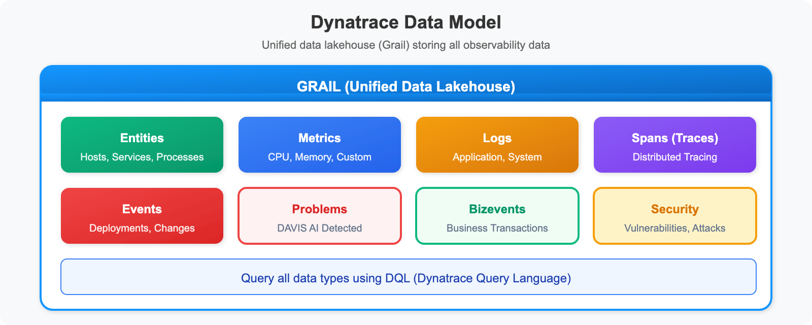
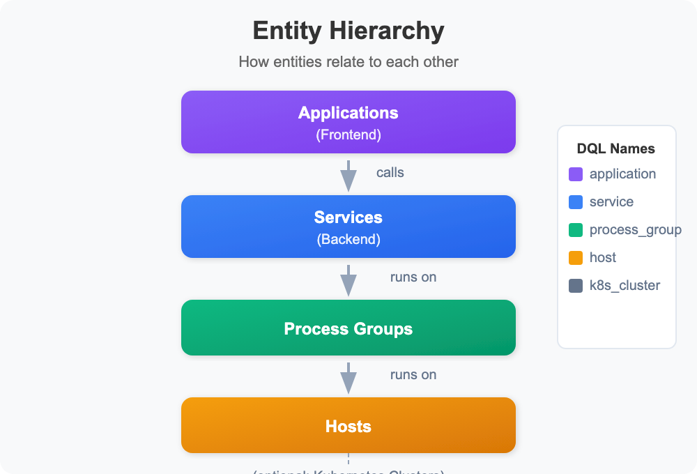
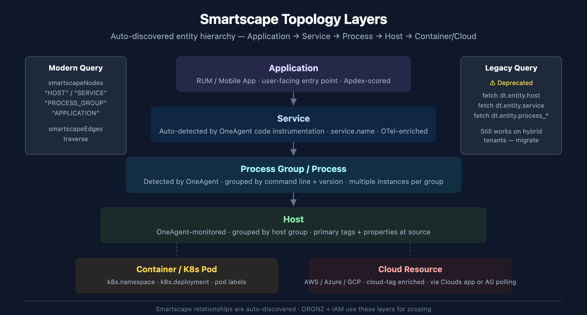

# ONBRD-07: Understanding Your Data

> **Series:** ONBRD — Dynatrace Onboarding | **Notebook:** 7 of 10 | **Created:** December 2025 | **Last Updated:** 05/06/2026

## Exploring What Dynatrace Discovered
With OneAgent deployed, Dynatrace has automatically discovered your infrastructure, processes, and services. This notebook helps you understand what's been found and how to explore your data.

---

## Table of Contents

1. [The Dynatrace Data Model](#the-dynatrace-data-model)
2. [Entities and Relationships](#entities-and-relationships)
3. [Exploring Topology](#exploring-topology)
4. [Data Types in Grail](#data-types-in-grail)
5. [Discovery Queries](#discovery-queries)

---

## Prerequisites

- OneAgent deployed on at least one host (ONBRD-05)
- Environment organized with tags (ONBRD-06)
- 15-30 minutes elapsed since deployment for full discovery
- DQL query permissions

<a id="the-dynatrace-data-model"></a>
## 1. The Dynatrace Data Model
Dynatrace organizes data into a unified model:


<!-- MARKDOWN_TABLE_ALTERNATIVE
| Data Type | Description | Example |
|-----------|-------------|---------|
| Entities | Monitored components | Host, Service, Process |
| Metrics | Numeric measurements | CPU usage, response time |
| Logs | Textual event records | Application log entry |
| Spans | Trace operations | HTTP request, DB query |
| Events | Point-in-time occurrences | Deployment, config change |
| Problems | DAVIS-detected issues | Service slowdown |
| Bizevents | Business transactions | Order placed, payment |
| Security | Vulnerabilities/attacks | CVE detection |
-->

### Key Concepts

| Concept | Description | Example |
|---------|-------------|--------|
| **Entity** | Any monitored component | Host, Service, Process |
| **Metric** | Numeric measurement over time | CPU usage, response time |
| **Log** | Textual event record | Application log entry |
| **Span** | Single operation in a trace | HTTP request, DB query |
| **Event** | Point-in-time occurrence | Deployment, config change |
| **Problem** | DAVIS-detected issue | Service slowdown |

<a id="entities-and-relationships"></a>
## 2. Entities and Relationships
Dynatrace automatically discovers and relates entities:


<!-- MARKDOWN_TABLE_ALTERNATIVE
| Entity Type | DQL Name | What It Represents |
|-------------|----------|--------------------|
| Application | dt.entity.application | Frontend application |
| Service | dt.entity.service | Logical backend service |
| Process Group | dt.entity.process_group | Set of identical processes |
| Host | dt.entity.host | Physical or virtual machine |
| K8s Cluster | dt.entity.kubernetes_cluster | Kubernetes cluster |
-->

### Common Entity Types

| Entity Type | DQL Name | What It Represents |
|-------------|----------|--------------------|
| **Host** | `dt.entity.host` | Physical or virtual machine |
| **Process Group** | `dt.entity.process_group` | Set of identical processes |
| **Service** | `dt.entity.service` | Logical backend service |
| **Application** | `dt.entity.application` | Frontend application |
| **K8s Cluster** | `dt.entity.kubernetes_cluster` | Kubernetes cluster |
| **K8s Namespace** | `dt.entity.cloud_application_namespace` | K8s namespace |
| **K8s Workload** | `dt.entity.cloud_application` | Deployment, DaemonSet, etc. |

<a id="exploring-topology"></a>
## 3. Exploring Topology
The topology view shows the visual representation of your environment.

**Location:** Infrastructure app → Hosts → Select any host → Dependencies

### Understanding Topology Layers


<!-- MARKDOWN_TABLE_ALTERNATIVE
| Layer | What It Is | Modern Query |
|-------|------------|--------------|
| Application | RUM / Mobile App; user-facing entry point | smartscapeNodes "APPLICATION" |
| Service | Auto-detected by OneAgent code instrumentation; service.name | smartscapeNodes "SERVICE" |
| Process Group / Process | Detected processes, grouped by command line + version | smartscapeNodes "PROCESS_GROUP" |
| Host | OneAgent-monitored; grouped by host group | smartscapeNodes "HOST" |
| Container / K8s Pod | k8s.namespace · k8s.deployment · pod labels | smartscapeNodes for K8s entity types |
| Cloud Resource | AWS/Azure/GCP; cloud-tag enriched | smartscapeNodes for cloud entity types |
Legacy fetch dt.entity.* still works on hybrid tenants but is deprecated
For environments where SVG doesn't render
-->

| Layer | Shows | Use Case |
|-------|-------|----------|
| **Applications** | Frontend apps, user sessions | User experience |
| **Services** | Backend services, APIs | Service dependencies |
| **Processes** | Running processes | Process mapping |
| **Hosts** | Servers, VMs, containers | Infrastructure view |

### Reading Topology Views

- **Nodes** = Entities
- **Lines** = Relationships (calls, runs on)
- **Line thickness** = Traffic volume
- **Colors** = Health status (green/yellow/red)

### Navigation Tips

- Click any entity to see details
- Use filters to focus on specific services
- Hover over connections to see traffic metrics
- Use the Services app for service-to-service dependencies

<a id="data-types-in-grail"></a>
## 4. Data Types in Grail
Grail stores different data types — each queried via a specific DQL command. Retention is **per-bucket and customer-configurable**, not a fixed default.

| Data Type | DQL Fetch / Command | Typical Use |
|-----------|---------------------|-------------|
| **Logs** | `fetch logs` | Troubleshooting, audit, compliance |
| **Spans** | `fetch spans` | Distributed tracing |
| **Metrics** | `timeseries` *(not `fetch`)* | Performance monitoring, SLOs |
| **Events** | `fetch events` | Change tracking, infra events |
| **Bizevents** | `fetch bizevents` | Business transactions, conversion funnels |
| **Davis problems** | `fetch dt.davis.problems` | Detected incidents (uses `event.status` / `event.end` fields) |
| **Davis events** | `fetch dt.davis.events` | Raw signals that feed problem detection (kind = `DAVIS_EVENT`) |
| **Security events** | `fetch securityEvents` | Vulnerabilities, security signals |
| **RUM sessions** | `fetch usersessions` | Session-level RUM aggregates |
| **RUM individual events** | `fetch user.events` | Page views, clicks, requests, errors |
| **RUM session replays** | `fetch user.replays` | Recorded session replays |
| **Entities (topology)** | `smartscapeNodes "<TYPE>"` *(modern)* / `fetch dt.entity.<type>` *(legacy)* | Topology queries; `dt.entity.*` is deprecated, prefer `smartscapeNodes` for new queries |

### Data Retention

Retention is **bucket-scoped and customer-configurable** — there is no universal default. Out-of-the-box retention varies by license tier and Grail bucket configuration. Inspect your tenant's bucket retention with:

```dql
// List configured Grail buckets and their retention (use Bucket Management UI for full detail)
fetch dt.system.buckets
| fields name, table, retention
| sort name asc
```

Typical starting points (subject to customer configuration):

| Data Type | Common Out-of-the-Box Retention |
|-----------|---------------------------------|
| Metrics (raw) | 14 days |
| Metrics (aggregated) | up to 5 years |
| Logs | 35 days (default bucket; can be 14d / 90d / 365d per tier) |
| Spans | 14 days |
| Events / Bizevents | 35 days |
| Davis problems | 35 days |

> **Where to go deeper:**
> - **ORGNZ-02 / ORGNZ-99** — Grail bucket strategy and retention design
> - **OPLOGS series** — Log processing in OpenPipeline
> - **OPMIG series** — Classic Logs → OpenPipeline migration
> - **OPIPE series** — OpenPipeline beyond logs (spans, metrics, events, bizevents)
> - **SPANS series** — Distributed tracing and span analysis

<a id="discovery-queries"></a>
## 5. Discovery Queries
Use these queries to understand what Dynatrace has discovered in your environment.

### Infrastructure Discovery

```dql
// Count all entity types in your environment
fetch dt.entity.host | summarize hosts = count()
// Run separately for other types:
// fetch dt.entity.service | summarize services = count()
// fetch dt.entity.process_group | summarize process_groups = count()

// Alternative: Smartscape on Grail (entity.name → name)
// smartscapeNodes HOST | summarize hosts = count()

```

```dql
// List all hosts with key details
fetch dt.entity.host
| fields entity.name, 
         state, 
         monitoringMode, 
         osType,
         cpuCores,
         physicalMemory
| sort entity.name
| limit 100
```

```dql
// Group hosts by OS type
fetch dt.entity.host
| summarize count = count(), by: {osType}
| sort count desc
```

### Service Discovery

```dql
// List all discovered services
fetch dt.entity.service
| fields entity.name, serviceType
| sort entity.name
| limit 100
```

```dql
// Group services by type
fetch dt.entity.service
| summarize count = count(), by: {serviceType}
| sort count desc
```

```dql
// Find services with recent traffic (spans)
fetch spans, from: now() - 1h
| filter span.kind == "server"
| summarize request_count = count(), by: {service.name}
| sort request_count desc
| limit 20
```

### Process Discovery

```dql
// List process groups
fetch dt.entity.process_group
| fields entity.name
| sort entity.name
| limit 50
```

```dql
// Count process groups
fetch dt.entity.process_group
| summarize count = count()
```

### Log Discovery

```dql
// Check log volume by source
fetch logs, from: now() - 1h
| summarize log_count = count(), by: {log.source}
| sort log_count desc
| limit 20
```

```dql
// Check log volume by severity
fetch logs, from: now() - 1h
| summarize log_count = count(), by: {loglevel}
| sort log_count desc
```

```dql
// Sample recent logs
fetch logs, from: now() - 15m
| fields timestamp, loglevel, log.source, content
| sort timestamp desc
| limit 25
```

### Kubernetes Discovery (if applicable)

```dql
// List Kubernetes clusters
fetch dt.entity.kubernetes_cluster
| fields entity.name
| sort entity.name

// Alternative: Smartscape on Grail (entity.name → name)
// smartscapeNodes K8S_CLUSTER
// | fields name
// | sort name

```

```dql
// List namespaces
fetch dt.entity.cloud_application_namespace
| fields entity.name
| sort entity.name
| limit 50

// Alternative: Smartscape on Grail (entity.name → name)
// smartscapeNodes K8S_NAMESPACE
// | fields name
// | sort name
// | limit 50

```

```dql
// List workloads (deployments, etc.)
fetch dt.entity.cloud_application
| fields entity.name
| sort entity.name
| limit 50

// Alternative: Smartscape on Grail (entity.name → name)
// smartscapeNodes K8S_DEPLOYMENT
// | fields name
// | sort name
// | limit 50

```

### Problems Discovery

```dql
// Check for recent problems
fetch dt.davis.problems, from: now() - 7d
| fields timestamp, display_id, title, event.status, affected_entity_types
| sort timestamp desc
| limit 20
```

```dql
// Problem summary by status
fetch dt.davis.problems, from: now() - 30d
| summarize problem_count = count(), by: {event.status}
| sort problem_count desc
```

## 6. Next Steps

Now that you understand your data:

1. **ONBRD-08: Your First Queries** — Learn DQL fundamentals
2. Explore topology for dependency visualization
3. Review any detected problems
4. Plan which additional hosts to instrument

### Where to Go Deeper

- **ORGNZ-02 / ORGNZ-99** — Grail bucket strategy
- **OPLOGS / OPMIG / OPIPE** — Log and OpenPipeline depth
- **SPANS series** — Distributed tracing depth
- **AIOPS series** — Davis problems, RCA, anomaly detection deep dives
- **K8S series** — Kubernetes monitoring depth

### Discovery Checklist

- [ ] Hosts discovered and showing data
- [ ] Services detected and mapped
- [ ] Process groups visible
- [ ] Topology showing relationships
- [ ] Log ingestion working (if applicable)
- [ ] Kubernetes entities visible (if applicable)
- [ ] Bucket retention reviewed against expected data class

---

## Summary

In this notebook, you learned:

- The Dynatrace data model (entities, metrics, logs, spans, events, bizevents, security, RUM)
- How entities relate to each other
- How to navigate topology views
- Different data types stored in Grail and their DQL fetch commands
- That `dt.davis.problems` uses `event.status` / `event.end` fields (not `status` / `end_time`)
- Discovery queries for infrastructure, services, and logs
- That retention is bucket-scoped and customer-configurable

---

## References

- [Entities](https://docs.dynatrace.com/docs/discover-dynatrace/explore-data/entities)
- [Topology and Dependencies](https://docs.dynatrace.com/docs/observe-and-explore/services/service-analysis/service-flow)
- [Grail Data Model](https://docs.dynatrace.com/docs/platform/grail)
- [Entity Types Reference](https://docs.dynatrace.com/docs/discover-dynatrace/references/entity-types)
- [Davis Problems App](https://docs.dynatrace.com/docs/dynatrace-intelligence/problems-app)

---

<sub>*This notebook was AI-generated from community-submitted and publicly available sources. This notebook series is not officially supported by Dynatrace. Always verify information against official Dynatrace documentation.*</sub>
