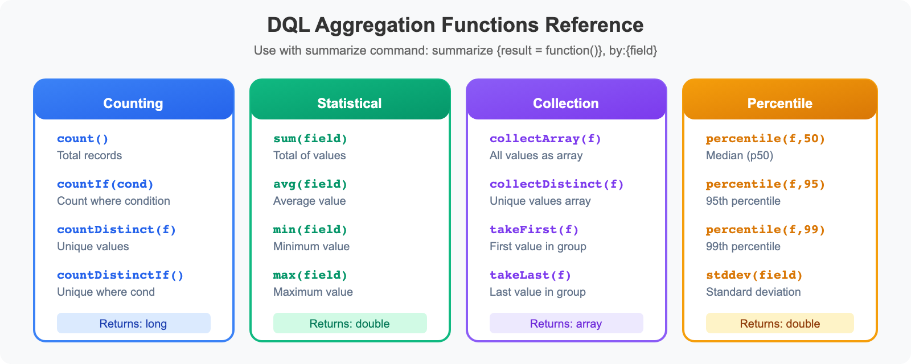

# OPLOGS-07: Analytics & Dashboards

> **Series:** OPLOGS — OpenPipeline Logs | **Notebook:** 7 of 8 | **Created:** December 2025 | **Last Updated:** 06/16/2026

## Aggregation, Time Series, and Visualization Queries
This notebook covers aggregation functions, time series analysis, statistical patterns, and dashboard-ready queries for log analytics.

---

## Table of Contents

1. [Aggregation Functions](#aggregation-functions)
2. [Time Series Analysis](#time-series-analysis)
3. [Statistical Analysis](#statistical-analysis)
4. [Dashboard-Ready Queries](#dashboard-ready-queries)
5. [Trend Analysis](#trend-analysis)
6. [Log Pattern Analysis](#log-pattern-analysis)
7. [Operational Dashboard Queries](#operational-dashboard-queries)
8. [📝 Summary](#summary)
9. [➡️ Next Steps](#next-steps)
10. [📚 References](#references)

---


## Prerequisites

- ✅ Access to a Dynatrace environment with log data
- ✅ Completed OPLOGS-01 through OPLOGS-06
- ✅ Familiarity with dashboard concepts

<a id="aggregation-functions"></a>
## 1. Aggregation Functions


<!-- MARKDOWN_TABLE_ALTERNATIVE
Aggregation Functions Reference:

Counting Functions:
- count() - Count all records
- countIf(condition) - Conditional count
- countDistinct(field) - Count unique values

Numeric Functions:
- sum(field) - Sum values
- avg(field) - Average
- min(field) - Minimum value
- max(field) - Maximum value

Collection Functions:
- takeFirst(field) - First value
- takeLast(field) - Last value
- collectDistinct(field) - Array of unique values

All aggregations must use named aliases for downstream operations.
-->

### Common Aggregation Functions

| Function | Description | Example |
|----------|-------------|---------|
| `count()` | Count records | `summarize {total = count()}` |
| `countIf(condition)` | Conditional count | `countIf(loglevel == "ERROR")` |
| `countDistinct(field)` | Unique values | `countDistinct(k8s.pod.name)` |
| `sum(field)` | Sum values | `sum(bytes)` |
| `avg(field)` | Average | `avg(response_time)` |
| `min(field)` | Minimum | `min(timestamp)` |
| `max(field)` | Maximum | `max(timestamp)` |
| `takeFirst(field)` | First value | `takeFirst(content)` |
| `takeLast(field)` | Last value | `takeLast(content)` |
| `collectDistinct(field)` | Array of unique values | `collectDistinct(loglevel)` |

### 🚨 Important: Named Aliases Required

```dql
// ✅ CORRECT - Named aliases
| summarize {count = count(), errors = countIf(...)}, by: {...}
| sort count desc

// ❌ WRONG - Anonymous aggregation can't be used in sort
| summarize count(), by: {...}
| sort count() desc  // ERROR!
```

```dql
// Basic aggregations
fetch logs, from: now() - 1h
| summarize {
    total_logs = count(),
    unique_hosts = countDistinct(dt.entity.host),
    unique_namespaces = countDistinct(k8s.namespace.name),
    unique_pods = countDistinct(k8s.pod.name)
  }
```

```dql
// Aggregations with grouping
fetch logs, from: now() - 1h
| summarize {
    total = count(),
    errors = countIf(loglevel == "ERROR"),
    warnings = countIf(loglevel == "WARN"),
    info = countIf(loglevel == "INFO")
  }, by: {k8s.namespace.name}
| sort total desc
| limit 15
```

```dql
// Error rate calculation
fetch logs, from: now() - 1h
| summarize {
    total = count(),
    errors = countIf(loglevel == "ERROR")
  }, by: {k8s.namespace.name}
| filter total > 100  // Minimum sample size
| fieldsAdd error_rate_pct = round((errors * 100.0) / total, decimals: 2)
| sort error_rate_pct desc
| limit 15
```

<a id="time-series-analysis"></a>
## 2. Time Series Analysis
The `makeTimeseries` command creates time-bucketed data for trend visualization.

```dql
// Log volume over time (5-minute buckets)
fetch logs, from: now() - 6h
| makeTimeseries {log_count = count()}, interval: 5m
```

```dql
// Error trend over time
fetch logs, from: now() - 6h
| makeTimeseries {
    total = count(),
    errors = countIf(loglevel == "ERROR"),
    warnings = countIf(loglevel == "WARN")
  }, interval: 5m
```

```dql
// Time series by dimension (namespace)
fetch logs, from: now() - 6h
| filter isNotNull(k8s.namespace.name)
| makeTimeseries {
    log_count = count()
  }, by: {k8s.namespace.name}, interval: 10m
```

```dql
// Error rate time series by host
fetch logs, from: now() - 6h
| filter isNotNull(dt.entity.host)
| makeTimeseries {
    total = count(),
    errors = countIf(loglevel == "ERROR")
  }, by: {dt.entity.host}, interval: 15m
```

<a id="statistical-analysis"></a>
## 3. Statistical Analysis

```dql
// Log volume statistics by source
fetch logs, from: now() - 24h
| summarize {
    total = count(),
    first_seen = min(timestamp),
    last_seen = max(timestamp)
  }, by: {dt.openpipeline.source}
| fieldsAdd duration_ns = toLong(last_seen) - toLong(first_seen)
| fieldsAdd duration_hours = round(duration_ns / 1h, decimals: 1)
| fieldsAdd logs_per_hour = round(total / (duration_ns / 1h), decimals: 0)
| sort total desc
```

```dql
// Percentile analysis (if numeric field available)
fetch logs, from: now() - 1h
| fieldsAdd content_length = stringLength(content)
| summarize {
    avg_length = avg(content_length),
    min_length = min(content_length),
    max_length = max(content_length),
    total_logs = count()
  }, by: {k8s.namespace.name}
| sort avg_length desc
| limit 15
```

```dql
// Hourly distribution analysis
fetch logs, from: now() - 24h
| fieldsAdd hour_bucket = bin(timestamp, 1h)
| summarize {log_count = count()}, by: {hour_bucket}
| sort hour_bucket asc
```

```dql
// Daily distribution analysis
fetch logs, from: now() - 7d
| fieldsAdd day_bucket = bin(timestamp, 1d)
| summarize {
    log_count = count(),
    error_count = countIf(loglevel == "ERROR")
  }, by: {day_bucket}
| sort day_bucket asc
```

<a id="dashboard-ready-queries"></a>
## 4. Dashboard-Ready Queries

> 📊 **Reference queries moved to OPLOGS-99.** See [**OPLOGS-99 § 9.1 Dashboard-Ready Queries**](../../oplogs/notebooks/-[OPLOGS]-99-best-practice-summary.ipynb) for single-value, time-series, breakdown, and percentile queries optimized for dashboard tiles. The teaching content for *how* dashboard queries are constructed lives in OPLOGS-05 (querying-parsing).

> 💰 **Cost-aware design — prefer a metric for queries that run on a schedule.** Dashboard tiles and alerts re-run their query on every render and evaluation. A `fetch logs … | summarize` behind a recurring tile pays the Grail **log Query** cost every time, whereas the same answer sourced from a metric does not — Metrics powered by Grail have no Query capability. For any recurring aggregate, check for an out-of-the-box metric first, and otherwise extract one from the log stream at ingest (OpenPipeline metric extraction — see OPLOGS-03 §3). Reserve `fetch logs` for one-shot investigation. **FAQ-09** covers the full decision and the DPS query economics.

<a id="trend-analysis"></a>
## 5. Trend Analysis

```dql
// Compare current hour to previous hour
fetch logs, from: now() - 2h
| fieldsAdd period = if(timestamp > now() - 1h, "current", else: "previous")
| summarize {count = count()}, by: {period, loglevel}
| sort period asc, count desc
```

```dql
// New error patterns (appeared in last hour)
fetch logs, from: now() - 1h
| filter loglevel == "ERROR"
| fieldsAdd error_sig = substring(content, from: 0, to: 80)
| summarize {
    count = count(),
    first_seen = min(timestamp)
  }, by: {error_sig, k8s.namespace.name}
| filter first_seen > now() - 30m  // First seen in last 30 minutes
| sort first_seen desc
| limit 15
```

```dql
// Volume anomaly detection (compare to baseline)
fetch logs, from: now() - 6h
| fieldsAdd time_bucket = bin(timestamp, 15m)
| summarize {log_count = count()}, by: {time_bucket, k8s.namespace.name}
| sort time_bucket desc
| limit 100
```

<a id="log-pattern-analysis"></a>
## 6. Log Pattern Analysis

```dql
// Top log patterns (by content prefix)
fetch logs, from: now() - 1h
| fieldsAdd pattern = substring(content, from: 0, to: 60)
| summarize {count = count()}, by: {pattern}
| sort count desc
| limit 25
```

```dql
// Unique log levels and statuses
fetch logs, from: now() - 1h
| summarize {
    loglevels = collectDistinct(loglevel),
    statuses = collectDistinct(status),
    sources = collectDistinct(dt.openpipeline.source)
  }
```

```dql
// Log diversity score (unique patterns per namespace)
fetch logs, from: now() - 1h
| fieldsAdd pattern = substring(content, from: 0, to: 50)
| summarize {
    total_logs = count(),
    unique_patterns = countDistinct(pattern)
  }, by: {k8s.namespace.name}
| fieldsAdd diversity_ratio = round((unique_patterns * 100.0) / total_logs, decimals: 2)
| sort diversity_ratio desc
| limit 15
```

<a id="operational-dashboard-queries"></a>
## 7. Operational Dashboard Queries

> 🚦 **Reference queries moved to OPLOGS-99.** See [**OPLOGS-99 § 9.2 Operational Dashboard Queries**](../../oplogs/notebooks/-[OPLOGS]-99-best-practice-summary.ipynb) for SLO-style queries: error budgets, top-N services by volume, per-host log distribution.

---

<a id="summary"></a>
## 📝 Summary
In this notebook, you learned:

✅ **Aggregation functions** - count, countIf, countDistinct, sum, avg  
✅ **Time series** - makeTimeseries with intervals  
✅ **Statistical analysis** - hourly/daily patterns, percentiles  
✅ **Dashboard queries** - Single values, charts, tables  
✅ **Trend analysis** - Period comparison, anomaly detection  
✅ **Pattern analysis** - Log clustering and diversity  

---

<a id="next-steps"></a>
## ➡️ Next Steps
Continue to **OPLOGS-08: Security & Data Protection** for data protection patterns.

---

<a id="references"></a>
## 📚 References
- [DQL Aggregation Functions](https://docs.dynatrace.com/docs/platform/grail/dynatrace-query-language/functions/aggregation-functions)
- [DQL makeTimeseries](https://docs.dynatrace.com/docs/platform/grail/dynatrace-query-language/commands/makeTimeseries)
- [Dynatrace Dashboards](https://docs.dynatrace.com/docs/observe-and-explore/dashboards-and-notebooks/dashboards-new)

---

<sub>*This notebook was AI-generated from community-submitted and publicly available sources. This notebook series is not officially supported by Dynatrace. Always verify information against official Dynatrace documentation.*</sub>
