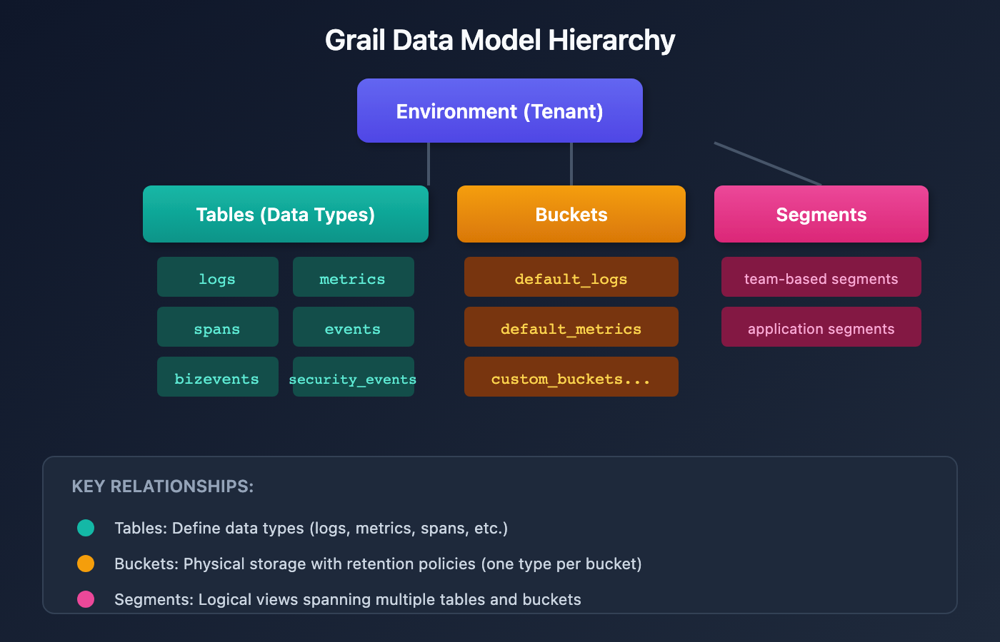

# ORGNZ-01 LAB: Introduction to Organizing Data in Grail - Hands-on Exercises

> **Series:** ORGNZ — Organize Data: Buckets, Segments, Security | **Notebook:** 1 of 10 | **Type:** LAB | **Created:** February 2026 | **Last Updated:** 04/25/2026

## Overview

This lab notebook contains 3 hands-on exercises extracted from **ORGNZ-01: Introduction to Organizing Data in Grail**. Complete the lecture notebook first, then work through these exercises to reinforce the concepts with real DQL queries against your Dynatrace environment.

---

## Table of Contents

1. [Exercise 1: Buckets (Physical Organization)](#exercise-1)
2. [Exercise 2: Buckets (Physical Organization)](#exercise-2)
3. [Exercise 3: Buckets (Physical Organization)](#exercise-3)
4. [Lab Summary](#lab-summary)

---

## Prerequisites

| Requirement | Details |
|-------------|----------|
| **Completed** | ORGNZ-01: Introduction to Organizing Data in Grail (lecture notebook) |
| **Dynatrace Environment** | SaaS tenant with Grail enabled |
| **Permissions** | `logs.read`, `metrics.read`, `entities.read`, `spans.read` |

<a id="exercise-1"></a>
## Exercise 1: Buckets (Physical Organization)

# ORGNZ-01: Introduction to Organizing Data in Grail

> **Series:** ORGNZ — Organize Data: Buckets, Segments, Security | **Notebook:** 1 of 10 | **Created:** January 2026 | **Last Updated:** 04/25/2026


Dynatrace Grail organizes data in **buckets**, **tables**, and **views** to ensure efficient storage, flexible access, and scalable querying. Understanding how to organize your data is fundamental to achieving optimal query performance, compliance requirements, and access control.


| Requirement | Details |
|---

---


1. Why Organize Data?
2. The Grail Data Model
3. Three Pillars of Data Organization
4. When to Use Each Mechanism
5. Permission Levels in Grail
6. Exploring Your Data Organization
7. Organization Decision Framework

---

-------------|----------|
| **Dynatrace Environment** | SaaS environment with Grail enabled |
| **Permissions** | `storage:buckets:read` for viewing data organization |
| **Knowledge** | Basic familiarity with Dynatrace and DQL |


By the end of this notebook, you will:
- Understand why data organization matters in Grail
- Know the three pillars of data organization: buckets, segments, and security
- Recognize when to use each organization mechanism
- Understand the Grail data model structure

Effective data organization in Grail enables:

| Benefit | Description |
|---------|-------------|
| **Query Performance** | Reduce query execution time by limiting data scope |
| **Cost Control** | Transparent GiB/day pricing with bucket-level attribution |
| **Access Control** | Fine-grained permissions from bucket to field level |
| **Compliance** | Meet retention and data residency requirements |
| **Operational Clarity** | Teams see only relevant data for faster troubleshooting |

Grail organizes data hierarchically with tables (data types), buckets (storage containers), and segments (logical views):



<!-- MARKDOWN_TABLE_ALTERNATIVE
| Level | Examples |
|-------|----------|
| Tables | logs, metrics, spans, events, bizevents, security_events |
| Buckets | default_logs, default_metrics, custom_buckets |
| Segments | team-based segments, application segments |
For environments where SVG doesn't render
-->


Buckets are logical storage containers where records are stored:

| Aspect | Description |
|--------|-------------|
| **Purpose** | Physical data partitioning and retention control |
| **Scope** | One data type per bucket (logs, metrics, etc.) |
| **Retention** | 1 day to 10 years per bucket |
| **Access** | IAM policies can grant bucket-level access |
| **Cost** | Enable precise cost attribution by team/LOB |


Segments provide dynamic, cross-signal data views:

| Aspect | Description |
|--------|-------------|
| **Purpose** | Real-time filtering without physical separation |
| **Scope** | Spans multiple data types and buckets |
| **Flexibility** | Rule-based, can use variables and relationships |
| **Access** | Governed by existing access controls |
| **Cost** | No direct storage cost impact |


Security context enables fine-grained permissions:

| Aspect | Description |
|--------|-------------|
| **Purpose** | Record-level access control |
| **Mechanism** | `dt.security_context` attribute on records |
| **Flexibility** | Custom values, hierarchical encoding |
| **Enforcement** | IAM policies filter at query time |

| Need | Solution | Rationale |
|------|----------|-----------|
| Different retention periods | **Buckets** | Retention is set per bucket |
| Cost attribution by team | **Buckets** | Direct GiB/day billing visibility |
| Broad team isolation | **Buckets** | Simple bucket-level IAM policies |
| Dynamic data views | **Segments** | Filter across data types at query time |
| Application-centric views | **Segments** | Group related entities and signals |
| Record-level access control | **Security Context** | Fine-grained ABAC |
| Multi-team shared buckets | **Security Context** | Filter records within same bucket |

Grail supports permissions at multiple levels:

| Level | Granularity | Example Use Case |
|-------|-------------|------------------|
| **Bucket** | All records in a bucket | Team owns entire bucket |
| **Table** | All records of a data type | Access to all logs |
| **Record** | Individual records by attribute | By host group, namespace, security context |
| **Field** | Specific fields on records | Mask sensitive fields |

> **Important**: Without permissions, users cannot query data from Grail. Permissions must be explicitly granted.

```dql
// List all buckets in your environment
fetch dt.system.buckets
| fields name, display_name, dt.system.table, retention_days, estimated_uncompressed_bytes
| sort dt.system.table asc, name asc
```

<a id="exercise-2"></a>
## Exercise 2: Buckets (Physical Organization)

```dql
// Summarize data volume by bucket
fetch logs, from:-1h
| summarize recordCount = count(), by:{dt.system.bucket}
| sort recordCount desc
```

<a id="exercise-3"></a>
## Exercise 3: Buckets (Physical Organization)

```dql
// Check for records with security context
fetch logs, from:-1h
| filter isNotNull(dt.security_context)
| summarize count = count(), by:{dt.security_context}
| sort count desc
| limit 20
```

<a id="lab-summary"></a>
## Lab Summary

You have completed 3 hands-on exercises for **ORGNZ-01: Introduction to Organizing Data in Grail**.

### Exercises Completed

- [ ] Exercise 1: Buckets (Physical Organization)
- [ ] Exercise 2: Buckets (Physical Organization)
- [ ] Exercise 3: Buckets (Physical Organization)

### Next Steps

Continue with **ORGNZ-02** for the next notebook.

---

<sub>*This notebook was AI-generated from community-submitted and publicly available sources. This notebook series is not officially supported by Dynatrace. Always verify information against official Dynatrace documentation.*</sub>
