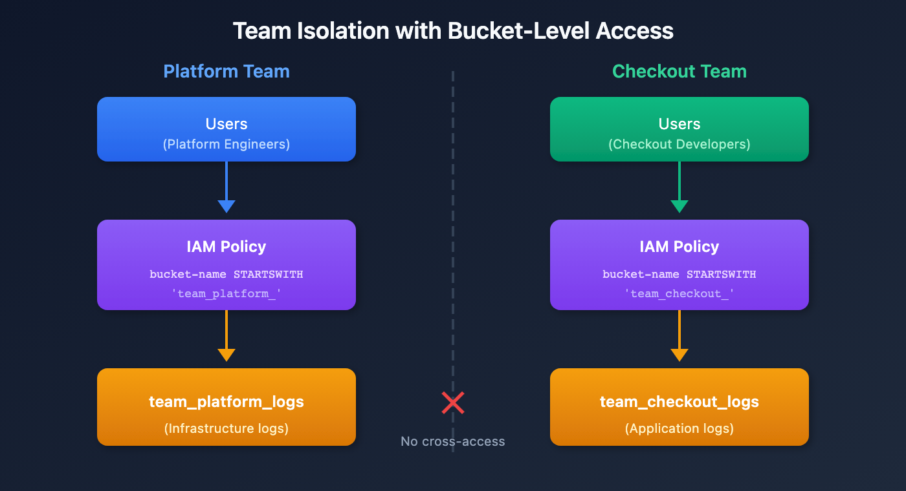

# ORGNZ-05 LAB: Bucket-Level Access Control - Hands-on Exercises

> **Series:** ORGNZ — Organize Data: Buckets, Segments, Security | **Notebook:** 5 of 10 | **Type:** LAB | **Created:** February 2026 | **Last Updated:** 04/25/2026

## Overview

This lab notebook contains 3 hands-on exercises extracted from **ORGNZ-05: Bucket-Level Access Control**. Complete the lecture notebook first, then work through these exercises to reinforce the concepts with real DQL queries against your Dynatrace environment.

---

## Table of Contents

1. [Exercise 1: Required Permissions](#exercise-1)
2. [Exercise 2: Required Permissions](#exercise-2)
3. [Exercise 3: Required Permissions](#exercise-3)
4. [Lab Summary](#lab-summary)

---

## Prerequisites

| Requirement | Details |
|-------------|----------|
| **Completed** | ORGNZ-05: Bucket-Level Access Control (lecture notebook) |
| **Dynatrace Environment** | SaaS tenant with Grail enabled |
| **Permissions** | `logs.read`, `metrics.read`, `entities.read`, `spans.read` |

<a id="exercise-1"></a>
## Exercise 1: Required Permissions

# ORGNZ-05: Bucket-Level Access Control

> **Series:** ORGNZ — Organize Data: Buckets, Segments, Security | **Notebook:** 5 of 10 | **Created:** January 2026 | **Last Updated:** 04/25/2026


Bucket-level access control provides a straightforward way to isolate data by team, application, or business unit. By granting permissions to specific buckets, you can ensure teams only access data relevant to their responsibilities.


| Requirement | Details |
|---

---


1. Bucket Permission Fundamentals
2. Policy Examples
3. Team Isolation Pattern
4. Default Buckets Policy
5. Verifying Bucket Access
6. Best Practices
7. When Bucket-Level Isn't Enough

---

-------------|----------|
| **Dynatrace Account** | Account-level administrative access |
| **Permissions** | IAM policy management permissions |
| **Knowledge** | Completed ORGNZ-04 |


By the end of this notebook, you will:
- Create IAM policies for bucket-level access
- Use bucket naming patterns in policies
- Implement team isolation using buckets
- Understand bucket permission best practices


All bucket access policies must start with `storage:buckets:read`:

```
ALLOW storage:buckets:read WHERE <condition>;
ALLOW storage:logs:read;  // Then allow table access
```


| Step | Purpose | Example |
|------|---------|----------|
| 1. Bucket access | Define which buckets | `storage:buckets:read WHERE bucket-name = 'x'` |
| 2. Table access | Define which data types | `storage:logs:read`, `storage:metrics:read` |


Grant a team access to their specific bucket:

```json
{
  "name": "platform-team-logs-access",
  "description": "Platform team can access platform logs bucket",
  "statementQuery": "ALLOW storage:buckets:read WHERE storage:bucket-name = 'team_platform_logs'; ALLOW storage:logs:read;",
  "tags": ["team:platform"]
}
```


Grant access to a list of specific buckets:

```json
{
  "name": "finance-multi-bucket-access",
  "description": "Finance team can access multiple buckets",
  "statementQuery": "ALLOW storage:buckets:read WHERE storage:bucket-name IN ('finance_logs', 'finance_metrics', 'finance_audit'); ALLOW storage:logs:read, storage:metrics:read;",
  "tags": ["team:finance"]
}
```


Grant access to all buckets matching a prefix:

```json
{
  "name": "prod-infrastructure-access",
  "description": "Access to all production infrastructure buckets",
  "statementQuery": "ALLOW storage:buckets:read WHERE storage:bucket-name STARTSWITH 'prod_infra_'; ALLOW storage:logs:read, storage:metrics:read, storage:spans:read;",
  "tags": ["env:production"]
}
```


Use pattern matching for complex bucket names:

```json
{
  "name": "database-team-access",
  "description": "Database team can access any database-related bucket",
  "statementQuery": "ALLOW storage:buckets:read WHERE storage:bucket-name MATCH ('*-database-*'); ALLOW storage:logs:read;",
  "tags": ["team:database"]
}
```




<!-- MARKDOWN_TABLE_ALTERNATIVE
| Team | Policy | Bucket |
|------|--------|--------|
| Platform | bucket-name = 'team_platform_*' | team_platform_logs |
| Checkout | bucket-name = 'team_checkout_*' | team_checkout_logs |
For environments where SVG doesn't render
-->


**Step 1: Create team buckets**

```
team_platform_logs
team_checkout_logs
team_payments_logs
```

**Step 2: Route data via OpenPipeline**

```yaml
processors:
  - type: route
    rules:
      - condition: "host.group starts-with 'platform-'"
        destination: "team_platform_logs"
      - condition: "service.name contains 'checkout'"
        destination: "team_checkout_logs"
```

**Step 3: Create IAM policies per team**

```
// Platform team policy
ALLOW storage:buckets:read WHERE storage:bucket-name STARTSWITH "team_platform_";
ALLOW storage:logs:read;

// Checkout team policy
ALLOW storage:buckets:read WHERE storage:bucket-name STARTSWITH "team_checkout_";
ALLOW storage:logs:read;
```


For users who need access to all default buckets:

```
ALLOW storage:buckets:read WHERE storage:bucket-name STARTSWITH "default_";
ALLOW storage:events:read, storage:logs:read, storage:metrics:read, 
      storage:entities:read, storage:bizevents:read, storage:spans:read;
```


```
ALLOW storage:buckets:read WHERE storage:bucket-name STARTSWITH "default_";
ALLOW storage:buckets:read WHERE storage:bucket-name = "audit_logs_365d";
ALLOW storage:logs:read, storage:metrics:read, storage:spans:read;
```

```dql
// List buckets you have access to
fetch dt.system.buckets
| fields name, display_name, dt.system.table, retention_days
| sort name asc
```

<a id="exercise-2"></a>
## Exercise 2: Required Permissions

```dql
// Query data from specific bucket to verify access
fetch logs, from:-1h, bucket: "team_platform_logs"
| limit 10
```

<a id="exercise-3"></a>
## Exercise 3: Required Permissions

```dql
// Check data distribution across accessible buckets
fetch logs, from:-1h
| summarize count = count(), by:{dt.system.bucket}
| sort count desc
```

<a id="lab-summary"></a>
## Lab Summary

You have completed 3 hands-on exercises for **ORGNZ-05: Bucket-Level Access Control**.

### Exercises Completed

- [ ] Exercise 1: Required Permissions
- [ ] Exercise 2: Required Permissions
- [ ] Exercise 3: Required Permissions

### Next Steps

Continue with **ORGNZ-06** for the next notebook.

---

<sub>*This notebook was AI-generated from community-submitted and publicly available sources. This notebook series is not officially supported by Dynatrace. Always verify information against official Dynatrace documentation.*</sub>
