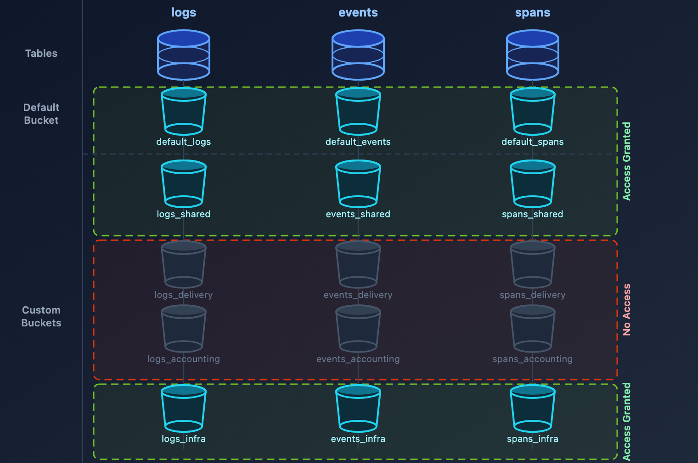

# ORGNZ-05: Bucket-Level Access Control

> **Series:** ORGNZ — Organize Data: Buckets, Segments, Security | **Notebook:** 5 of 10 | **Created:** January 2026 | **Last Updated:** 05/06/2026

## Overview

Bucket-level access control provides a straightforward way to isolate data by team, application, or business unit. By granting permissions to specific buckets, you can ensure teams only access data relevant to their responsibilities.

> **Canonical pattern (when bucket-level access fits):** Bucket-level access works well in specific scenarios — **compliance separation** (PCI/HIPAA), **retention isolation** (different retention requirements naturally produce distinct buckets), **hard cost attribution** (per-LOB billing buckets), or **hostile multi-tenancy** (strict cross-tenant isolation). For general team-scoped data access without one of those scenarios, **`dt.security_context` + record-level permissions** (covered in **ORGNZ-06**) is usually the simpler choice — it scales beyond the 80-bucket limit and is mutable without re-routing ingest. See **[IAM REFERENCE.md § Bucket-Match Overlay](../../iam/docs/REFERENCE.md#bucket-match-overlay-scenario-driven)** for the canonical scenario gating. The patterns below teach bucket-level mechanics for when the scenario fits.

## Prerequisites

| Requirement | Details |
|-------------|----------|
| **Dynatrace Environment** | SaaS environment with Grail enabled |
| **Permissions** | `storage:bucket-definitions:read`, `storage:logs:read` |
| **Knowledge** | Completed ORGNZ-04 (Permissions in Grail) |
| **Data** | At least 1 hour of log data |

---

## Table of Contents

1. [Bucket Permission Fundamentals](#bucket-permission-fundamentals)
2. [Policy Examples](#policy-examples)
3. [Team Isolation Pattern](#team-isolation-pattern)
4. [Default Buckets Policy](#default-buckets-policy)
5. [Verifying Bucket Access](#verifying-bucket-access)
6. [Best Practices](#best-practices)
7. [When Bucket-Level Isn't Enough](#when-bucket-level-isnt-enough)

---

## Learning Objectives

By the end of this notebook, you will:
- Create IAM policies for bucket-level access
- Use bucket naming patterns in policies
- Implement team isolation using buckets
- Understand bucket permission best practices

<a id="bucket-permission-fundamentals"></a>
## Bucket Permission Fundamentals
### Required Permissions

All bucket access policies must start with `storage:buckets:read`:

```
ALLOW storage:buckets:read WHERE <condition>;
ALLOW storage:logs:read;  // Then allow table access
```

### Two-Step Pattern

| Step | Purpose | Example |
|------|---------|----------|
| 1. Bucket access | Define which buckets | `storage:buckets:read WHERE bucket-name = 'x'` |
| 2. Table access | Define which data types | `storage:logs:read`, `storage:metrics:read` |




<!-- MARKDOWN_TABLE_ALTERNATIVE
| Zone | Buckets (logs / events / spans) | Access |
|------|---------------------------------|--------|
| Default | default_logs, default_events, default_spans | Granted |
| Custom shared | logs_shared, events_shared, spans_shared | Granted |
| Custom delivery/accounting | logs_delivery, logs_accounting, events_delivery, events_accounting, spans_delivery, spans_accounting | No Access |
| Custom infra | logs_infra_cloud, logs_infra_esxi, events_infra, spans_infra | Granted |
-->
<a id="policy-examples"></a>
## Policy Examples
### Example 1: Single Bucket Access

Grant a team access to their specific bucket:

```json
{
  "name": "platform-team-logs-access",
  "description": "Platform team can access platform logs bucket",
  "statementQuery": "ALLOW storage:buckets:read WHERE storage:bucket-name = 'team_platform_logs'; ALLOW storage:logs:read;",
  "tags": ["team:platform"]
}
```

### Example 2: Multiple Buckets with IN Operator

Grant access to a list of specific buckets:

```json
{
  "name": "finance-multi-bucket-access",
  "description": "Finance team can access multiple buckets",
  "statementQuery": "ALLOW storage:buckets:read WHERE storage:bucket-name IN ('finance_logs', 'finance_metrics', 'finance_audit'); ALLOW storage:logs:read, storage:metrics:read;",
  "tags": ["team:finance"]
}
```

### Example 3: Bucket Name Pattern with STARTSWITH

Grant access to all buckets matching a prefix:

```json
{
  "name": "prod-infrastructure-access",
  "description": "Access to all production infrastructure buckets",
  "statementQuery": "ALLOW storage:buckets:read WHERE storage:bucket-name STARTSWITH 'prod_infra_'; ALLOW storage:logs:read, storage:metrics:read, storage:spans:read;",
  "tags": ["env:production"]
}
```

### Example 4: Bucket Pattern with MATCH

Use pattern matching for complex bucket names:

```json
{
  "name": "database-team-access",
  "description": "Database team can access any database-related bucket",
  "statementQuery": "ALLOW storage:buckets:read WHERE storage:bucket-name MATCH ('*-database-*'); ALLOW storage:logs:read;",
  "tags": ["team:database"]
}
```

<a id="team-isolation-pattern"></a>
## Team Isolation Pattern

> **When this approach fits:** team isolation via dedicated buckets is well-suited to scenarios where each team's data already needs its own bucket for compliance, retention, or hard-cost-attribution reasons. For routine per-team scoping without one of those reasons, **`dt.security_context` parameterization** (one policy template, bound per team — see **ORGNZ-06** and **IAM-04 Pattern 2**) is usually simpler and avoids the 80-bucket limit. The pattern below applies once you've decided buckets are the right tool for your team-isolation scenario.

### Architecture


<!-- MARKDOWN_TABLE_ALTERNATIVE
| Team | Policy | Bucket |
|------|--------|--------|
| Platform | bucket-name = 'team_platform_*' | team_platform_logs |
| Checkout | bucket-name = 'team_checkout_*' | team_checkout_logs |
For environments where SVG doesn't render
-->

### Implementation

**Step 1: Create team buckets**

```
team_platform_logs
team_checkout_logs
team_payments_logs
```

**Step 2: Route data via OpenPipeline**

```yaml
processors:
  - type: route
    rules:
      - condition: "host.group starts-with 'platform-'"
        destination: "team_platform_logs"
      - condition: "service.name contains 'checkout'"
        destination: "team_checkout_logs"
```

**Step 3: Create IAM policies per team**

```
// Platform team policy
ALLOW storage:buckets:read WHERE storage:bucket-name STARTSWITH "team_platform_";
ALLOW storage:logs:read;

// Checkout team policy
ALLOW storage:buckets:read WHERE storage:bucket-name STARTSWITH "team_checkout_";
ALLOW storage:logs:read;
```

<a id="default-buckets-policy"></a>
## Default Buckets Policy
### Standard Default Access

For users who need access to all default buckets:

```
ALLOW storage:buckets:read WHERE storage:bucket-name STARTSWITH "default_";
ALLOW storage:events:read, storage:logs:read, storage:metrics:read, 
      storage:entities:read, storage:bizevents:read, storage:spans:read;
```

### Default Plus Custom Buckets

```
ALLOW storage:buckets:read WHERE storage:bucket-name STARTSWITH "default_";
ALLOW storage:buckets:read WHERE storage:bucket-name = "audit_logs_365d";
ALLOW storage:logs:read, storage:metrics:read, storage:spans:read;
```

<a id="verifying-bucket-access"></a>
## Verifying Bucket Access

<a id="best-practices"></a>
## Best Practices
| Practice | Rationale |
|----------|----------|
| Use consistent bucket naming | Enables pattern-based policies |
| Assign policies to groups, not users | Easier management, consistent access |
| Document all policies | Audit trail and governance |
| Test policies with sample users | Prevent access issues |
| Use STARTSWITH for team prefixes | Future-proof for new buckets |
| Combine with record-level for scale | Bucket limits (80) may not suffice |

<a id="when-bucket-level-isnt-enough"></a>
## When Bucket-Level Isn't Enough
Bucket-level access has limitations:

| Limitation | Alternative |
|------------|-------------|
| 80 bucket limit | Use security context for finer granularity |
| Shared data needs | Use record-level permissions |
| Dynamic team membership | Use security context mapped to tags |
| Field-level masking | Use field-level permissions |

See **ORGNZ-06** and **ORGNZ-07** for advanced permission patterns.

## Next Steps

Continue with the ORGNZ series:
- **ORGNZ-06**: Security Context

## References

- [Permissions in Grail](https://docs.dynatrace.com/docs/platform/grail/organize-data/assign-permissions-in-grail)
- [IAM policy reference](https://docs.dynatrace.com/docs/manage/identity-access-management/permission-management/manage-user-permissions-policies/advanced/iam-policystatements)

---

<sub>*This notebook was AI-generated from Dynatrace documentation and enterprise best practices. It is not officially supported by Dynatrace. Always verify information against official Dynatrace documentation.*</sub>

### DQL: Verifying Bucket Access

Confirm you can read from the expected buckets:

```dql
// Verify bucket access — check data distribution across buckets you can read
fetch logs, from:-1h
| summarize count = count(), by:{dt.system.bucket}
| sort count desc
```
