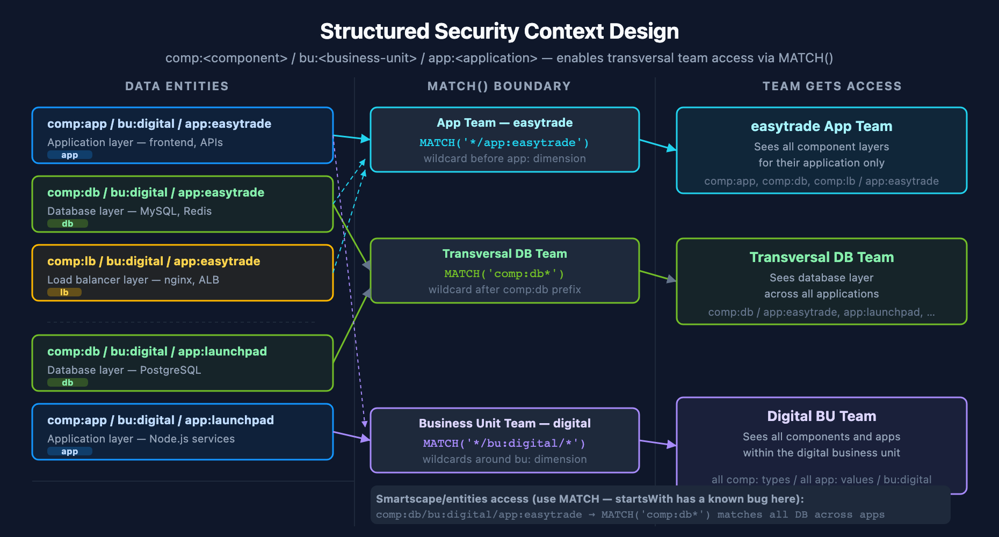

# ORGNZ-06: Security Context

> **Series:** ORGNZ — Organize Data: Buckets, Segments, Security | **Notebook:** 6 of 10 | **Created:** January 2026 | **Last Updated:** 04/26/2026

## Overview

If permissions on deployment-level attributes or bucket level are insufficient, Dynatrace allows you to set up **fine-grained permissions** by adding a `dt.security_context` attribute to your data. This enables record-level access control that scales beyond bucket limits.

## Prerequisites

| Requirement | Details |
|-------------|----------|
| **Dynatrace Environment** | SaaS environment with Grail enabled |
| **Permissions** | `storage:logs:read`, OpenPipeline configuration access |
| **Knowledge** | Completed ORGNZ-05 (Bucket-Level Access Control) |
| **Data** | Logs with `dt.security_context` field (or ability to configure) |

---

## Table of Contents

1. [What is Security Context?](#what-is-security-context)
2. [Security Context Values](#security-context-values)
3. [Setting Security Context](#setting-security-context)
4. [IAM Policies with Security Context](#iam-policies-with-security-context)
5. [Querying Security Context](#querying-security-context)
6. [Security Context Patterns](#security-context-patterns)
7. [Security Context Best Practices](#security-context-best-practices)
8. [Entity Security Context](#entity-security-context)

---

## Learning Objectives

By the end of this notebook, you will:
- Understand the purpose and structure of security context
- Know how to assign security context via OpenPipeline
- Create IAM policies that use security context
- Design hierarchical security context patterns

<a id="what-is-security-context"></a>
## What is Security Context?
Security context is a reserved field (`dt.security_context`) that enables custom authorization:

| Aspect | Description |
|--------|-------------|
| **Field name** | `dt.security_context` |
| **Type** | String or array of strings |
| **Purpose** | Custom authorization beyond standard attributes |
| **Source** | OpenPipeline, OneAgent, Kubernetes labels |
| **Enforcement** | IAM policies filter at query time |

### Why Use Security Context?

| Scenario | Without Security Context | With Security Context |
|----------|-------------------------|----------------------|
| 100 teams sharing data | Need 100 buckets | Single bucket, 100 context values |
| Dynamic team membership | Static bucket assignment | Update context via tags |
| Hierarchical access | Complex policy combinations | Hierarchical string encoding |

<a id="security-context-values"></a>
## Security Context Values
### Simple Values

```
dt.security_context: "team-a"
dt.security_context: "finance"
dt.security_context: "sec-lvl-7"
```

### Hierarchical Encoding

Encode hierarchy in a string for flexible access patterns:

```
dt.security_context: "department-A/team-1/project-x"
dt.security_context: "org1/finance/compliance"
dt.security_context: "region-us/aws-account-123/team-platform"
```

### Array Values

Records can have multiple security context values:

```
dt.security_context: ["team-a", "project-x", "compliance"]
```

<a id="setting-security-context"></a>
## Setting Security Context
### Via OpenPipeline

Configure OpenPipeline to add security context based on record attributes:

1. Go to **Settings** > **Log Processing** > **OpenPipeline**
2. Select your pipeline
3. Go to **Permission** tab
4. Add **Set Security Context** processor

```yaml
# OpenPipeline security context processor
processors:
  - type: security-context
    rules:
      - condition: "host.group starts-with 'finance-'"
        context: "lob:finance"
      - condition: "k8s.namespace.name == 'checkout'"
        context: "team:checkout"
      - condition: "matchesValue(service.name, 'payment-*')"
        context: "team:payments"
```

### Via OneAgent

OneAgent can set security context based on:

| Source | Configuration |
|--------|---------------|
| Host groups | Automatic from host group membership |
| Kubernetes labels | Map labels to security context |
| Cloud metadata | Use cloud account/project info |
| Custom tags | Reference existing tags |

### Via Kubernetes

Use labels or annotations to set security context:

```yaml
metadata:
  labels:
    dynatrace.com/security-context: "team:checkout"
  annotations:
    dynatrace.com/security-context: "compliance:pci"
```

<a id="iam-policies-with-security-context"></a>
## IAM Policies with Security Context
### Basic Security Context Policy

```json
{
  "name": "team-a-data-access",
  "description": "Team A can access data with team-a security context",
  "statementQuery": "ALLOW storage:buckets:read WHERE storage:bucket-name STARTSWITH 'default_'; ALLOW storage:logs:read WHERE storage:dt.security_context = 'team-a';",
  "tags": ["team:team-a"]
}
```

### Hierarchical Access with MATCH

Grant access to entire department:

```json
{
  "name": "finance-department-access",
  "description": "Finance department can access all finance sub-teams",
  "statementQuery": "ALLOW storage:buckets:read WHERE storage:bucket-name STARTSWITH 'default_'; ALLOW storage:logs:read WHERE storage:dt.security_context MATCH ('finance/*');",
  "tags": ["department:finance"]
}
```

### Array Field Access with MATCH

> **Important**: When `dt.security_context` holds an array, you MUST use `MATCH` operator. Using `=`, `STARTSWITH`, or `IN` will always return false for array fields.

```
// Correct - MATCH for array fields
ALLOW storage:logs:read WHERE storage:dt.security_context MATCH ("crn-70400-*");

// Wrong - = won't work for arrays
ALLOW storage:logs:read WHERE storage:dt.security_context = "crn-70400-team";
```

<a id="querying-security-context"></a>
## Querying Security Context

> **Lab Exercise:** Complete Exercises 1-2 in **ORGNZ-06 LAB** for hands-on practice with these concepts.

<a id="security-context-patterns"></a>
## Security Context Patterns
### Pattern 1: Team-Based Access

```
Context value: "team:<team-name>"
Examples: "team:platform", "team:checkout", "team:payments"
Policy: ALLOW ... WHERE storage:dt.security_context = "team:platform"
```

### Pattern 2: Line of Business

```
Context value: "lob:<business-unit>"
Examples: "lob:finance", "lob:retail", "lob:healthcare"
Policy: ALLOW ... WHERE storage:dt.security_context = "lob:finance"
```

### Pattern 3: Hierarchical Organization

```
Context value: "<org>/<department>/<team>"
Examples: "acme/engineering/platform", "acme/finance/compliance"

Department-level access:
ALLOW ... WHERE storage:dt.security_context MATCH ("acme/engineering/*")

Team-level access:
ALLOW ... WHERE storage:dt.security_context = "acme/engineering/platform"
```

### Pattern 4: Cloud Account Mapping

```
Context value: "<cloud>/<account>"
Examples: "aws/123456789012", "gcp/my-project-id"
Policy: ALLOW ... WHERE storage:dt.security_context MATCH ("aws/*")
```

### Pattern 5: Multi-Dimensional Structured Context

Encode multiple dimensions into a single string for transversal team access — teams that need cross-application visibility (database, networking, OS) without being tied to a specific application.



<!-- MARKDOWN_TABLE_ALTERNATIVE
| Team Type | MATCH() Expression | Gets Access To |
|-----------|-------------------|----------------|
| App team (easytrade) | MATCH('*/app:easytrade') | All component layers for easytrade |
| Transversal DB team | MATCH('comp:db*') | Database layer across all applications |
| Digital BU team | MATCH('*/bu:digital/*') | All components and apps within digital BU |
For environments where SVG doesn't render
-->

```
Context format: "comp:<component>/bu:<business-unit>/app:<application>"
Examples:
  "comp:app/bu:digital/app:easytrade"  — application layer, digital BU
  "comp:db/bu:digital/app:easytrade"   — database layer, digital BU
  "comp:lb/bu:digital/app:easytrade"   — load balancer layer, digital BU
```

**MATCH() access patterns (Grail / 3rd Gen storage domain):**

| Team Type | MATCH() Expression | Grants Access To |
|-----------|-------------------|------------------|
| App team | `MATCH('*/app:easytrade')` | All components for one application |
| Transversal DB team | `MATCH('comp:db*')` | Database layer across all applications |
| Business unit team | `MATCH('*/bu:digital/*')` | All components and apps within digital BU |

**startsWith patterns (Classic entity access):**

```
// App team — enumerate each component explicitly
ALLOW storage:logs:read WHERE storage:dt.security_context startsWith "comp:app/bu:digital/app:easytrade"
ALLOW storage:logs:read WHERE storage:dt.security_context startsWith "comp:db/bu:digital/app:easytrade"

// Transversal DB team — one prefix covers all apps
ALLOW storage:logs:read WHERE storage:dt.security_context startsWith "comp:db"
```

> **Dimension order matters for Classic entities.** Place the dimension used for transversal access *first* (typically `comp`). For the full two-domain comparison and multi-value context roadmap, see **IAM-04: Policy Authoring** and **IAM-05: Boundary Design**.

<a id="security-context-best-practices"></a>
## Security Context Best Practices
| Practice | Rationale |
|----------|----------|
| Use consistent naming conventions | Enables pattern matching in policies |
| Plan hierarchy before implementation | Hard to change after data is ingested |
| Use prefixes for context types | `team:`, `lob:`, `env:` for clarity |
| Document context values | Governance and audit requirements |
| Test with sample data | Verify context is assigned correctly |
| Use MATCH for array fields | Required for correct policy evaluation |
| Encode multiple dimensions for transversal access | `comp/bu/app` format scales to cross-application teams without per-app policies |

<a id="entity-security-context"></a>
## Entity Security Context
Security context can also be set on entities (not just records):

1. Go to **Settings** > **Topology model** > **Grail Security Context**
2. Define rules to assign security context to entities
3. Entities inherit context to related records

This enables entity-level access control for services, hosts, and other monitored entities.

## Next Steps

Continue with the ORGNZ series:
- **ORGNZ-07**: Advanced Permission Patterns

## References

- [Configure advanced permissions with security context](https://docs.dynatrace.com/docs/platform/grail/organize-data/advanced-permission-setup)
- [Set up Grail permissions for OneAgent](https://docs.dynatrace.com/docs/ingest-from/dynatrace-oneagent/oneagent-security-context)
- [Grant access to entities with security context](https://docs.dynatrace.com/docs/manage/identity-access-management/use-cases/access-security-context)

---

<sub>*This notebook was AI-generated from Dynatrace documentation and enterprise best practices. It is not officially supported by Dynatrace. Always verify information against official Dynatrace documentation.*</sub>
