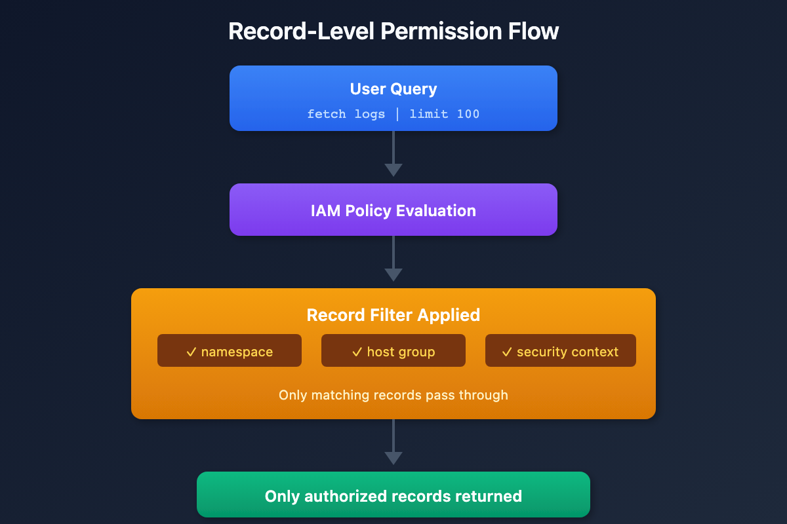
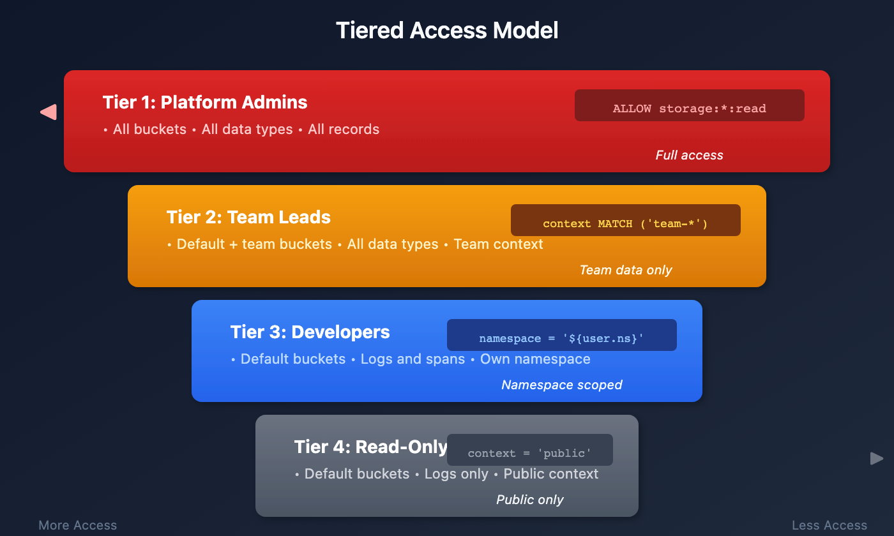

# ORGNZ-07: Advanced Permission Patterns

> **Series:** ORGNZ | **Notebook:** 7 of 10 | **Created:** January 2026 | **Last Updated:** 02/19/2026

## Overview

This notebook covers advanced permission patterns including record-level permissions, field-based access, and combining multiple access control mechanisms for enterprise-scale data governance.

## Prerequisites

| Requirement | Details |
|-------------|----------|
| **Dynatrace Environment** | SaaS environment with Grail enabled |
| **Permissions** | Account admin or IAM policy management access |
| **Knowledge** | Completed ORGNZ-06 (Security Context) |
| **Data** | At least 1 hour of log data |

---

## Table of Contents

1. [Record-Level Permissions](#record-level-permissions)
2. [Record-Level Policy Examples](#record-level-policy-examples)
3. [Field-Level Access](#field-level-access)
4. [Combined Permission Patterns](#combined-permission-patterns)
5. [Policy Boundaries](#policy-boundaries)
6. [Enterprise Architecture Patterns](#enterprise-architecture-patterns)
7. [Testing Permissions](#testing-permissions)
8. [Best Practices](#best-practices)

---

-------------|----------|
| **Dynatrace Account** | Account-level administrative access |
| **Permissions** | IAM policy management permissions |
| **Knowledge** | Completed ORGNZ-04 through ORGNZ-06 |

## Learning Objectives

By the end of this notebook, you will:
- Implement record-level permissions using various attributes
- Understand field-level access restrictions
- Use policy boundaries for reusable condition management
- Combine bucket, record, and field-level policies
- Design enterprise-scale permission architectures

<a id="record-level-permissions"></a>
## Record-Level Permissions
Record-level permissions filter data at query time based on record attributes:



<!-- MARKDOWN_TABLE_ALTERNATIVE
| Step | Action |
|------|--------|
| 1 | User Query: fetch logs |
| 2 | IAM Policy Evaluation |
| 3 | Record Filter (namespace, host group, security context) |
| 4 | Only authorized records returned |
For environments where SVG doesn't render
-->

### Supported Record-Level Conditions

| Condition | Description | Example |
|-----------|-------------|----------|
| `storage:k8s.namespace.name` | Kubernetes namespace | `= 'production'` |
| `storage:k8s.cluster.name` | Kubernetes cluster | `= 'main-cluster'` |
| `storage:host.name` | Host name | `= 'web-server-01'` |
| `storage:dt.host_group.id` | Host group | `STARTSWITH 'prod-'` |
| `storage:aws.account.id` | AWS account | `= '123456789012'` |
| `storage:gcp.project.id` | GCP project | `= 'my-project'` |
| `storage:azure.subscription` | Azure subscription | `= 'sub-id'` |
| `storage:azure.resource.group` | Azure resource group | `= 'my-rg'` |
| `storage:dt.security_context` | Custom context | `MATCH ('team-*')` |

<a id="record-level-policy-examples"></a>
## Record-Level Policy Examples
### Kubernetes Namespace Isolation

```json
{
  "name": "production-namespace-access",
  "description": "Access only to production namespace data",
  "statementQuery": "ALLOW storage:buckets:read WHERE storage:bucket-name STARTSWITH 'default_'; ALLOW storage:logs:read WHERE storage:k8s.namespace.name = 'production';"
}
```

### Host Group Based Access

```json
{
  "name": "web-tier-access",
  "description": "Access to web tier hosts only",
  "statementQuery": "ALLOW storage:buckets:read WHERE storage:bucket-name STARTSWITH 'default_'; ALLOW storage:logs:read, storage:metrics:read WHERE storage:dt.host_group.id STARTSWITH 'web-';"
}
```

### Combined Namespace and Host Group

```json
{
  "name": "prod-web-tier-access",
  "description": "Production web tier only",
  "statementQuery": "ALLOW storage:buckets:read WHERE storage:bucket-name STARTSWITH 'default_'; ALLOW storage:logs:read WHERE storage:k8s.namespace.name = 'production' AND storage:dt.host_group.id STARTSWITH 'web-';"
}
```

### Cloud Account Isolation

```json
{
  "name": "aws-team-account-access",
  "description": "Access to specific AWS account",
  "statementQuery": "ALLOW storage:buckets:read WHERE storage:bucket-name STARTSWITH 'default_'; ALLOW storage:logs:read, storage:metrics:read, storage:spans:read WHERE storage:aws.account.id = '123456789012';"
}
```

<a id="field-level-access"></a>
## Field-Level Access
Control access to specific fields within records:

| Use Case | Implementation |
|----------|----------------|
| Hide sensitive fields | Deny access to specific fields |
| Mask PII | Field-level policies |
| Compliance requirements | Restrict access to audit fields |

### Field-Level Policy Example

```json
{
  "name": "restricted-field-access",
  "description": "Hide sensitive fields from general users",
  "statementQuery": "ALLOW storage:buckets:read WHERE storage:bucket-name STARTSWITH 'default_'; ALLOW storage:logs:read; DENY storage:logs:read:user.email, storage:logs:read:user.ip_address;"
}
```

<a id="combined-permission-patterns"></a>
## Combined Permission Patterns
### Pattern 1: Layered Access Control

Combine bucket and record-level permissions:

```
Layer 1: Bucket access
  ALLOW storage:buckets:read WHERE bucket-name IN ('team_logs', 'shared_logs')

Layer 2: Record filtering
  ALLOW storage:logs:read WHERE k8s.namespace.name = 'team-namespace'

Layer 3: Field masking (optional)
  DENY storage:logs:read:sensitive_field
```

### Pattern 2: Multi-Team Shared Bucket

Multiple teams share a bucket with security context isolation:

```json
// Team A policy
{
  "name": "team-a-shared-bucket",
  "statementQuery": "ALLOW storage:buckets:read WHERE storage:bucket-name = 'shared_logs'; ALLOW storage:logs:read WHERE storage:dt.security_context MATCH ('team-a*');"
}

// Team B policy
{
  "name": "team-b-shared-bucket",
  "statementQuery": "ALLOW storage:buckets:read WHERE storage:bucket-name = 'shared_logs'; ALLOW storage:logs:read WHERE storage:dt.security_context MATCH ('team-b*');"
}
```

### Pattern 3: Environment-Based Tiering

```json
// Production access (restricted)
{
  "name": "production-access",
  "statementQuery": "ALLOW storage:buckets:read WHERE storage:bucket-name STARTSWITH 'prod_'; ALLOW storage:logs:read WHERE storage:dt.security_context = 'env:production';"
}

// Non-production access (broader)
{
  "name": "non-production-access",
  "statementQuery": "ALLOW storage:buckets:read WHERE storage:bucket-name STARTSWITH 'default_'; ALLOW storage:logs:read WHERE storage:dt.security_context MATCH ('env:dev*', 'env:staging*', 'env:qa*');"
}
```

### Pattern 4: Multi-Dimensional MATCH() for Transversal Teams

When teams need access by component type (database, networking, OS) across multiple applications, encode multiple dimensions into the security context and use MATCH() to slice across application boundaries:

```json
// Database team: all DB-layer components across all applications (Grail)
{
  "name": "db-team-grail-access",
  "statementQuery": "ALLOW storage:buckets:read WHERE storage:bucket-name STARTSWITH 'default_'; ALLOW storage:logs:read WHERE storage:dt.security_context MATCH ('comp:db*');"
}

// Application team: all component layers for one application (Grail)
{
  "name": "easytrade-team-access",
  "statementQuery": "ALLOW storage:buckets:read WHERE storage:bucket-name STARTSWITH 'default_'; ALLOW storage:logs:read WHERE storage:dt.security_context MATCH ('*/app:easytrade');"
}
```

> MATCH() supports `*` wildcards at any position and is **storage domain only**. For Classic entity access (hosts, services), use `startsWith` per component type. The context format is `comp:<component>/bu:<business-unit>/app:<application>` — place the transversal dimension first so `startsWith` cuts correctly. See **IAM-05: Boundary Design** for the full two-domain pattern.

<a id="policy-boundaries"></a>
## Policy Boundaries

**Policy boundaries** decouple the "what" (policy) from the "where" (conditions), enabling reusable condition sets that can be applied across multiple policies.

### What Are Boundaries?

| Aspect | Description |
|--------|-------------|
| **Purpose** | Bundle conditions for reuse across multiple policies |
| **Scope** | Record-level and resource-level restrictions |
| **Relationship** | Always used together with a policy — boundaries alone don't restrict anything |
| **Limit** | Maximum 10 restrictions per boundary |

### How Boundaries Work

While **policies** define _which features and data_ users can access, **boundaries** define _where_ users can access them:

```
Policy: ALLOW storage:logs:read, storage:metrics:read, storage:spans:read
Boundary: storage:k8s.namespace.name = "production"
           storage:dt.host_group.id STARTSWITH "prod-"
```

When assigned together, the user gets read access to logs, metrics, and spans — but only for production namespace data on production host groups.

### Boundary Rules

| Rule | Detail |
|------|--------|
| No AND operator | Each line is one condition (implicitly AND-combined) |
| No logical operators | For complex logic, use policy templating |
| Reusable | Same boundary can be applied to multiple policies |
| Max 10 restrictions | Create additional boundaries if more are needed |

### Creating Boundaries

1. Go to **Account Management** > **Identity & access management** > **Policy management**
2. Select the **Boundaries** tab
3. Select **Create boundary**
4. Enter boundary name and conditions (one per line)
5. Save and assign to group policies

### Example: Regional Boundary

```
# EU Region Boundary
storage:bucket-name STARTSWITH "eu_"
storage:azure.subscription = "eu-subscription-id"
```

This boundary can then be applied alongside any policy (logs access, metrics access, etc.) to restrict all data access to the EU region.

> **Tip:** Use boundaries when you have the same set of conditions (e.g., "production only" or "EU region only") that need to apply to multiple policies. This avoids duplicating conditions across every policy definition.

<a id="enterprise-architecture-patterns"></a>
## Enterprise Architecture Patterns
### Tiered Access Model



<!-- MARKDOWN_TABLE_ALTERNATIVE
| Tier | Role | Access |
|------|------|--------|
| 1 | Platform Admins | All buckets, all data types, all records |
| 2 | Team Leads | Default + team buckets, team context |
| 3 | Developers | Default buckets, own namespace only |
| 4 | Read-Only Viewers | Default buckets, public context only |
For environments where SVG doesn't render
-->

### Geographic/Regulatory Model

| Region | Buckets | Context | Policy |
|--------|---------|---------|--------|
| EU | eu_* | region:eu | bucket-name STARTSWITH 'eu_' AND security_context MATCH ('region:eu*') |
| US | us_* | region:us | bucket-name STARTSWITH 'us_' AND security_context MATCH ('region:us*') |

> **Tip:** Use policy boundaries to define regional restrictions once, then apply the same boundary to all team policies within that region.

<a id="testing-permissions"></a>
## Testing Permissions

> **Lab Exercise:** Complete Exercises 1-2 in **ORGNZ-07 LAB** for hands-on practice with these concepts.

<a id="best-practices"></a>
## Best Practices
| Practice | Rationale |
|----------|----------|
| Start with least privilege | Grant minimum required access |
| Use groups, not individuals | Easier management, consistent access |
| Use policy boundaries for reuse | Avoid duplicating conditions across policies |
| Document all policies | Audit trail and governance |
| Test policies before deployment | Prevent access issues |
| Regular access reviews | Remove unnecessary permissions |
| Use MATCH for array fields | Required for correct evaluation |
| Combine bucket + record level | Defense in depth |

## Next Steps

Continue with the ORGNZ series:
- **ORGNZ-08**: Grail Segments

## References

- [Configure advanced permissions with security context](https://docs.dynatrace.com/docs/platform/grail/organize-data/advanced-permission-setup)
- [Policy boundaries](https://docs.dynatrace.com/docs/manage/identity-access-management/permission-management/manage-user-permissions-policies/iam-policy-boundaries)
- [IAM policy reference](https://docs.dynatrace.com/docs/manage/identity-access-management/permission-management/manage-user-permissions-policies/advanced/iam-policystatements)
- [Enhance data management with Grail](https://www.dynatrace.com/news/blog/enhance-data-management-with-grail-ultimate-guide-to-custom-buckets-and-security-policies/)

---

<sub>*This notebook was AI-generated from Dynatrace documentation and enterprise best practices. It is not officially supported by Dynatrace. Always verify information against official Dynatrace documentation.*</sub>
