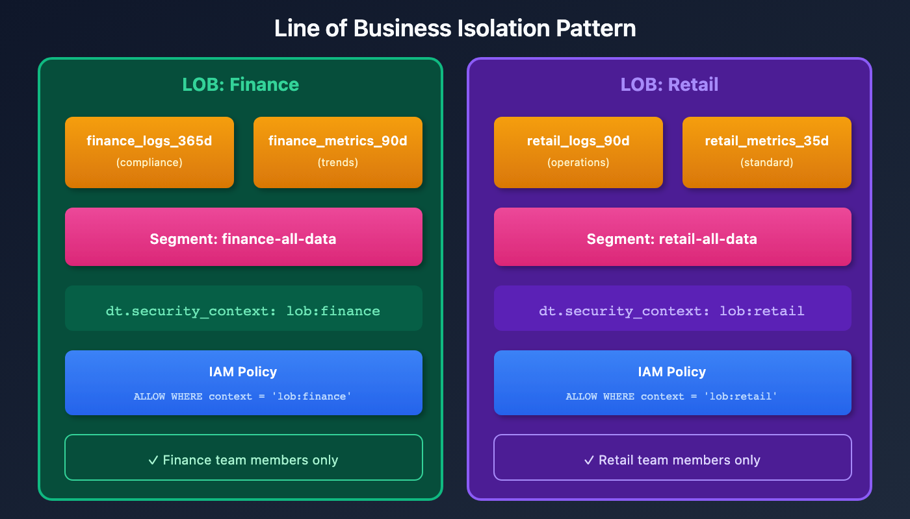
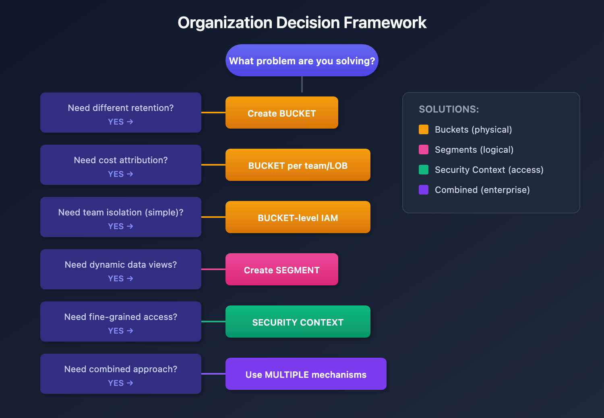

# ORGNZ-09: Enterprise Data Organization Patterns

> **Series:** ORGNZ — Organize Data: Buckets, Segments, Security | **Notebook:** 9 of 10 | **Created:** January 2026 | **Last Updated:** 04/26/2026

## Overview

This notebook brings together buckets, segments, and security context into comprehensive enterprise patterns. Learn how to combine these mechanisms for effective data governance at scale.

## Prerequisites

| Requirement | Details |
|-------------|----------|
| **Dynatrace Environment** | SaaS environment with Grail enabled |
| **Permissions** | `storage:bucket-definitions:read`, `storage:logs:read`, `storage:filter-segments:read` |
| **Knowledge** | Completed ORGNZ-08 (Grail Segments) |
| **Data** | At least 1 hour of log and entity data |

---

## Table of Contents

1. [Combining All Three Mechanisms](#combining-all-three-mechanisms)
2. [Enterprise Pattern 1: Line of Business Isolation](#enterprise-pattern-1-line-of-business-isolation)
3. [Enterprise Pattern 2: Environment-Based Tiering](#enterprise-pattern-2-environment-based-tiering)
4. [Enterprise Pattern 3: Multi-Cloud Organization](#enterprise-pattern-3-multi-cloud-organization)
5. [Enterprise Pattern 4: Kubernetes-Native Organization](#enterprise-pattern-4-kubernetes-native-organization)
6. [Decision Framework](#decision-framework)
7. [Implementation Checklist](#implementation-checklist)
8. [Auditing Your Organization](#auditing-your-organization)
9. [Best Practices Summary](#best-practices-summary)
10. [Series Summary](#series-summary)

---

## Learning Objectives

By the end of this notebook, you will:
- Combine buckets, segments, and security context effectively
- Design enterprise-scale data organization architectures
- Implement common organizational patterns
- Plan data governance strategies

<a id="combining-all-three-mechanisms"></a>
## Combining All Three Mechanisms
For comprehensive data governance, use all three mechanisms:

| Mechanism | Purpose | When to Use |
|-----------|---------|-------------|
| **Buckets** | Physical storage, retention, cost | Different retention needs, cost attribution |
| **Segments** | Logical filtering, views | Team-focused data views, cross-signal filtering |
| **Security Context** | Access enforcement | Fine-grained security requirements |

### Complete Architecture Example

```
Finance Team Requirements:

Bucket: finance_logs_365d
  - 1 year retention for compliance
  - Cost attributed to Finance

Segment: finance-team-view
  - Filtered view of finance data
  - Includes related services and hosts

Security Context: lob:finance
  - IAM policy: ALLOW WHERE security_context = 'lob:finance'
  - Only finance team members can access
```

<a id="enterprise-pattern-1-line-of-business-isolation"></a>
## Enterprise Pattern 1: Line of Business Isolation
Complete isolation by business unit:



<!-- MARKDOWN_TABLE_ALTERNATIVE
| LOB | Buckets | Segment | Security Context | Policy |
|-----|---------|---------|------------------|--------|
| Finance | finance_logs_365d, finance_metrics_90d | finance-all-data | lob:finance | ALLOW WHERE context = 'lob:finance' |
| Retail | retail_logs_90d, retail_metrics_35d | retail-all-data | lob:retail | ALLOW WHERE context = 'lob:retail' |
For environments where SVG doesn't render
-->

### Implementation

**Step 1: Create buckets**
```
finance_logs_365d (logs, 365 days)
finance_metrics_90d (metrics, 90 days)
retail_logs_90d (logs, 90 days)
```

**Step 2: Configure OpenPipeline routing**
```yaml
processors:
  - type: route
    rules:
      - condition: "host.group starts-with 'finance-'"
        destination: "finance_logs_365d"
      - condition: "host.group starts-with 'retail-'"
        destination: "retail_logs_90d"
```

**Step 3: Set security context**
```yaml
processors:
  - type: security-context
    rules:
      - condition: "host.group starts-with 'finance-'"
        context: "lob:finance"
      - condition: "host.group starts-with 'retail-'"
        context: "lob:retail"
```

**Step 4: Create IAM policies**
```
// Finance policy
ALLOW storage:buckets:read WHERE storage:bucket-name STARTSWITH "finance_";
ALLOW storage:logs:read, storage:metrics:read WHERE storage:dt.security_context = "lob:finance";
```

<a id="enterprise-pattern-2-environment-based-tiering"></a>
## Enterprise Pattern 2: Environment-Based Tiering
Different access levels for production vs non-production:

```
Production:
├── Buckets: prod_logs, prod_metrics, prod_spans
├── Security Context: env:production
├── Policy: ALLOW WHERE storage:dt.security_context = 'env:production'
├── Access: Restricted to production support team
└── Audit: Full audit logging enabled

Non-Production:
├── Buckets: default_logs, default_metrics, default_spans
├── Security Context: env:dev, env:staging, env:qa
├── Policy: ALLOW WHERE storage:dt.security_context MATCH ('env:dev*', 'env:staging*')
├── Access: Broader developer access
└── Audit: Reduced audit requirements
```

### Tiered Access Groups

| Group | Production Access | Non-Prod Access |
|-------|------------------|------------------|
| SRE Team | Full | Full |
| Production Support | Read-only | None |
| Developers | None | Full |
| QA | None | Read-only |

<a id="enterprise-pattern-3-multi-cloud-organization"></a>
## Enterprise Pattern 3: Multi-Cloud Organization
Organize by cloud provider and account:

```
AWS:
├── Bucket: aws_logs_35d
├── Security Context: cloud:aws/<account-id>
└── Policy: ALLOW WHERE storage:aws.account.id = '123456789012'

Azure:
├── Bucket: azure_logs_35d
├── Security Context: cloud:azure/<subscription>
└── Policy: ALLOW WHERE storage:azure.subscription = 'sub-id'

GCP:
├── Bucket: gcp_logs_35d
├── Security Context: cloud:gcp/<project>
└── Policy: ALLOW WHERE storage:gcp.project.id = 'my-project'
```

<a id="enterprise-pattern-4-kubernetes-native-organization"></a>
## Enterprise Pattern 4: Kubernetes-Native Organization
Leverage Kubernetes constructs for organization:

```
Cluster: main-cluster
├── Namespace: production
|   ├── Security Context: k8s:main-cluster/production
|   └── Policy: ALLOW WHERE storage:k8s.namespace.name = 'production'
|
├── Namespace: staging
|   ├── Security Context: k8s:main-cluster/staging
|   └── Policy: ALLOW WHERE storage:k8s.namespace.name = 'staging'
|
└── Namespace: development
    ├── Security Context: k8s:main-cluster/development
    └── Policy: ALLOW WHERE storage:k8s.namespace.name = 'development'
```

### Cross-Namespace Segment

```yaml
name: checkout-application
displayName: "Checkout App (All Environments)"

includes:
  - type: logs
    filter: "k8s.deployment.name == 'checkout'"
  
  - type: spans
    filter: "service.name == 'checkout'"
```

<a id="decision-framework"></a>
## Decision Framework
Use this framework to choose your organization strategy:



<!-- MARKDOWN_TABLE_ALTERNATIVE
| Question | YES → Solution |
|----------|----------------|
| Need different retention? | Create custom BUCKETS |
| Need cost attribution? | Create BUCKETS per cost center |
| Need team isolation (simple)? | BUCKET-level IAM policies |
| Need team isolation (complex)? | SECURITY CONTEXT + record-level policies |
| Need dynamic data views? | Create SEGMENTS |
| Need fine-grained access control? | Configure SECURITY CONTEXT |
For environments where SVG doesn't render
-->

<a id="implementation-checklist"></a>
## Implementation Checklist
### Phase 1: Planning
- [ ] Identified retention requirements
- [ ] Mapped organizational structure (teams, LOBs, cost centers)
- [ ] Defined access control requirements
- [ ] Planned bucket naming convention
- [ ] Designed security context schema

### Phase 2: Infrastructure
- [ ] Created custom buckets
- [ ] Configured OpenPipeline routing rules
- [ ] Configured OpenPipeline security context processors
- [ ] Verified data flow to correct buckets

### Phase 3: Access Control
- [ ] Created IAM policies
- [ ] Assigned policies to groups
- [ ] Tested access with sample users
- [ ] Documented all policies

### Phase 4: Views
- [ ] Created segments for team views
- [ ] Tested segment filters
- [ ] Documented segment purposes

### Phase 5: Governance
- [ ] Planned access review process
- [ ] Configured audit logging
- [ ] Created runbook for access management

<a id="auditing-your-organization"></a>
## Auditing Your Organization

> **Lab Exercise:** Complete Exercises 1-2 in **ORGNZ-09 LAB** for hands-on practice with these concepts.

<a id="best-practices-summary"></a>
## Best Practices Summary
| Area | Best Practice |
|------|---------------|
| **Buckets** | Keep ingest <1 TB/day; use consistent naming |
| **Segments** | Test rules with DQL before deploying |
| **Security Context** | Use hierarchical encoding for flexibility |
| **IAM Policies** | Assign to groups, not individuals |
| **Documentation** | Document all policies and contexts |
| **Reviews** | Schedule regular access reviews |

<a id="series-summary"></a>
## Series Summary
The ORGNZ series covered:

| Notebook | Topic | Key Takeaway |
|----------|-------|---------------|
| ORGNZ-01 | Introduction | Why organize data; three pillars |
| ORGNZ-02 | Grail Buckets | Bucket fundamentals and limits |
| ORGNZ-03 | Bucket Strategy | Naming, retention, design patterns |
| ORGNZ-04 | Permissions Overview | Permission levels and policy structure |
| ORGNZ-05 | Bucket-Level Access | IAM policies for bucket isolation |
| ORGNZ-06 | Security Context | Fine-grained access with dt.security_context |
| ORGNZ-07 | Advanced Permissions | Record and field-level patterns |
| ORGNZ-08 | Grail Segments | Dynamic data organization |
| ORGNZ-09 | Enterprise Patterns | Combined approaches at scale |
| ORGNZ-10 | Advanced Segment Definitions | Filter syntax, enrichment, variables, troubleshooting |

## References

- [Organize data](https://docs.dynatrace.com/docs/platform/grail/organize-data)
- [Permissions in Grail](https://docs.dynatrace.com/docs/platform/grail/organize-data/assign-permissions-in-grail)
- [Advanced permission setup](https://docs.dynatrace.com/docs/platform/grail/organize-data/advanced-permission-setup)
- [Enhance data management with Grail](https://www.dynatrace.com/news/blog/enhance-data-management-with-grail-ultimate-guide-to-custom-buckets-and-security-policies/)

---

<sub>*This notebook was AI-generated from Dynatrace documentation and enterprise best practices. It is not officially supported by Dynatrace. Always verify information against official Dynatrace documentation.*</sub>
