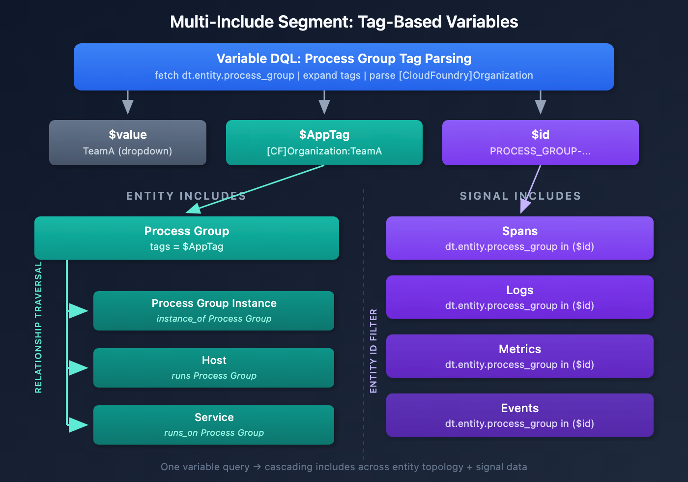

# ORGNZ-10: Advanced Segment Definitions

> **Series:** ORGNZ | **Notebook:** 10 of 10 | **Created:** February 2026 | **Last Updated:** 02/19/2026

## Overview

This notebook is a deep-dive into the mechanics of creating effective segment definitions in Dynatrace Grail. While **ORGNZ-08** introduced segments, their structure, and design patterns, this notebook focuses on the practical details: filter condition syntax, data type include rules, metadata enrichment for segments, advanced variable patterns, and troubleshooting techniques.

The content draws from real-world implementation patterns, including host group-based segmentation strategies used in enterprise environments.

---

## Table of Contents

1. [Filter Condition Syntax](#filter-condition-syntax)
2. [Data Type Include Rules](#data-type-include-rules)
3. [Primary Grail Fields and Enrichment](#primary-grail-fields-and-enrichment)
4. [Advanced Variable Patterns](#advanced-variable-patterns)
5. [Host Group-Based Segments](#host-group-based-segments)
6. [Segment Visibility and Sharing](#segment-visibility-and-sharing)
7. [Cross-App Integration](#cross-app-integration)
8. [Known Limitations and Workarounds](#known-limitations-and-workarounds)
9. [Troubleshooting and Performance](#troubleshooting-and-performance)

---

## Prerequisites

| Requirement | Details |
|-------------|----------|
| **Dynatrace Environment** | SaaS environment with Grail enabled |
| **Permissions** | `storage:filter-segments:read` and `storage:filter-segments:write` |
| **Knowledge** | Completed ORGNZ-08 (Grail Segments fundamentals) |
| **Data** | At least 1 hour of log, span, and entity data |

## Learning Objectives

By the end of this notebook, you will:
- Master filter condition syntax including operators, field access, and combining conditions
- Understand data type include rules and the one-include-per-type constraint
- Know which metadata fields propagate across all signals (and which don't)
- Create advanced variable definitions using DQL entity queries
- Build host group-based segments from real-world naming conventions
- Troubleshoot common segment issues and apply performance best practices

<a id="filter-condition-syntax"></a>

## 1. Filter Condition Syntax

Segment filter conditions define which data a segment includes. Understanding the available operators and field access patterns is critical for building effective segments.

### Supported Operators

| Operator | Example | Notes |
|----------|---------|-------|
| `=` (equals) | `k8s.namespace.name = "production"` | Exact match, best performance |
| `!=` (not equals) | `k8s.namespace.name != "kube-system"` | Exclude specific values |
| `starts-with` | `dt.host_group.id = $platform*` | Prefix match with wildcard `*` |
| `IN` | `k8s.namespace.name IN ("prod", "staging")` | Match any value in list |
| `NOT IN` | `k8s.namespace.name NOT IN ("kube-system")` | Exclude list of values |

> **Important — operator availability depends on data type:**
> - **Signal data includes** (logs, spans, events, metrics) support `=`, `!=`, `contains`, `not contains`, `starts with`, `ends with`, `IN`, and `NOT IN`.
> - **Classic entity includes** (`dt.entity.*`) only support `=` (with optional prefix wildcard `*`) and `in()`. `contains` and `ends-with` are **not available** for entity includes.
>
> For cross-signal consistency, prefer prefix-based naming conventions (e.g., `prod-web-tier` not `web-tier-prod`) so `starts-with` works everywhere.

### Field Access Patterns

| Pattern | Example | Use Case |
|---------|---------|----------|
| Direct field | `k8s.namespace.name = "production"` | Primary Grail Fields |
| Tag matching | `matchesValue(tags, "env:production")` | Entity tags |
| Entity name | `entity.name = "my-service"` | Specific entity |
| Host group | `dt.host_group.id = "prod-web"` | Host group filtering (signal data) |
| JSON field | `content$.uri = "/health"` | Nested JSON in log content |

### Combining Conditions

- **AND** — Multiple conditions within a single include are AND-combined:
  ```
  k8s.namespace.name = "production" AND k8s.cluster.name = "main-cluster"
  ```
- **OR** — Use the `or` keyword within a single include (you cannot have multiple includes for the same data type):
  ```
  k8s.namespace.name = "production" OR k8s.namespace.name = "staging"
  ```

### Test Your Filter Conditions

Before creating a segment, always validate your filter conditions with DQL. Run the equivalent filter clause as a DQL query to verify the results match your expectations.

> **Lab Exercise:** Complete Exercises 1-2 in **ORGNZ-10 LAB** for hands-on practice with these concepts.

<a id="data-type-include-rules"></a>

## 2. Data Type Include Rules

Segments use **includes** to define which data types are filtered. Understanding how includes work is essential for building segments that behave as expected.

### One Include Per Data Type

A segment can have **only one include block per data type**. You cannot define two separate include blocks for `logs`. To match multiple conditions, combine them with `OR` within a single include.

### Supported Data Types

| Data Type | Category | Example Filter |
|-----------|----------|----------------|
| `logs` | Signal data | `k8s.namespace.name = "prod"` |
| `spans` | Signal data | `service.name starts-with "checkout"` |
| `events` | Signal data | `event.type = "CUSTOM_INFO"` |
| `bizevents` | Signal data | `event.provider = "my-app"` |
| `dt.entity.host` | Classic entity | `tags contains "env:prod"` |
| `dt.entity.service` | Classic entity | `entity.name starts-with "payment"` |
| `dt.entity.process_group` | Classic entity | `relationship: runsOn dt.entity.host` |
| `dt.entity.kubernetes_cluster` | Classic entity | `entity.name = "main-cluster"` |

### How Conditions Apply Per Data Type

When a segment is active and a user queries a specific data type, **only the matching include rule is injected**:

- Running `fetch logs` → only the `logs` include condition applies
- Running `fetch dt.entity.host` → only the `dt.entity.host` include condition applies
- Entity include rules do **NOT** filter signal data (and vice versa)

> **Critical:** Not all metadata is available on all data types. For example, `java.jar.file` exists only on spans. If you filter a segment by `java.jar.file`, it will only apply to spans — not to logs, metrics, or events. **Always use Primary Grail Fields for cross-signal segment filtering.**

### Include Limits

| Limit | Value |
|-------|-------|
| Maximum includes per segment | 20 |
| Include blocks per data type | 1 |
| Expressions per filter condition | 10 |

Since each data type gets at most 1 include, a segment can cover up to 20 distinct data types or entity types.

<a id="primary-grail-fields-and-enrichment"></a>

## 3. Primary Grail Fields and Enrichment

The foundation of effective segment definitions is **metadata enrichment**. In Dynatrace's 3rd-generation architecture, each data point is treated independently. Unlike 2nd-gen where signals were tightly coupled to entities via Management Zones, in 3rd-gen every signal (logs, spans, metrics, events) must be enriched with the corresponding metadata.

### Primary Grail Fields

Primary Grail Fields are infrastructure-related fields that are **automatically propagated across ALL data types** (spans, logs, metrics, topology). These are the ideal fields for segment filter conditions because they guarantee cross-signal consistency.

| Primary Grail Field | DQL Field Name | Source |
|---------------------|----------------|--------|
| **Host Group** | `dt.host_group.id` | OneAgent host group configuration |
| **Kubernetes Cluster** | `k8s.cluster.name` | K8s integration |
| **Kubernetes Namespace** | `k8s.namespace.name` | K8s integration |
| **AWS Account** | `aws.account.id` | AWS integration |
| **Azure Subscription** | `azure.subscription` | Azure integration |
| **GCP Project** | `gcp.project.id` | GCP integration |

> **Best Practice:** Always prefer Primary Grail Fields in segment definitions. They are indexed, automatically enriched, and consistent across all signal types.

### Fields That Also Propagate to Service Metrics

Some fields go further and propagate to derived data like service metrics:

| Field | Propagates to Service Metrics |
|-------|------------------------------|
| `dt.security_context` | Yes |
| `dt.cost.costcenter` | Yes |
| `dt.cost.product` | Yes |
| Host group (`dt.host_group.id`) | Yes |
| Other host tags | **No** |

### Primary Grail Tags

When Primary Grail Fields don't align with how your organization wants to segment data (e.g., shared infrastructure with multiple apps on one host group), use **Primary Grail Tags**.

- Identified by the prefix `primary_tags.`
- Example: `primary_tags.stage=prod`, `primary_tags.team=platform`
- Set via host properties, environment variables (`DT_TAGS`), or OpenPipeline
- Propagated across all data points, similar to Primary Grail Fields

> **Limitation:** Primary Grail Tags do not yet enrich Kubernetes metrics or events. They work for logs, spans, and topology data. Check the [Dynatrace documentation](https://docs.dynatrace.com/docs/ingest-from/setup-on-k8s/guides/metadata-automation/k8s-metadata-telemetry-enrichment) for the latest supported signal types.

### Enrichment Approaches

| Scenario | Approach | Effort | Granularity |
|----------|----------|--------|-------------|
| **Dedicated Infrastructure** | Host group + host properties | Low | Host-level |
| **Shared Infrastructure** | `DT_TAGS` environment variable per process | Higher | Process-level |
| **Kubernetes** | Primary Grail Fields (automatic) | None | Namespace/cluster |
| **Cloud (AWS/Azure/GCP)** | Native cloud tags | None | Account/subscription |

### Enrichment via Host Properties

For dedicated infrastructure, enrich hosts via **Deployment Status** → select hosts → **Modify host properties**:

1. `dt.security_context=<team-or-app>` — For IAM access control
2. `dt.cost.costcenter=<cost-center>` — For cost allocation
3. `dt.cost.product=<product>` — For product tracking
4. `primary_tags.<key>=<value>` — For custom enrichment

> **Restart Requirements:**
> - **Logs**: No application restart needed — OneAgent log module auto-enriches after its own restart
> - **Spans**: Application restart **required** to apply enrichment to traces
> - **Metrics**: OneAgent restart applies automatically

### Verify Enrichment Coverage

Before building segments, verify that the fields you plan to filter on actually exist on your signal data. Fields with 0% coverage need enrichment via OneAgent configuration or OpenPipeline.

> **Lab Exercise:** Complete Exercises 3-4 in **ORGNZ-10 LAB** for hands-on practice with these concepts.

<a id="advanced-variable-patterns"></a>

## 4. Advanced Variable Patterns

Variables make segments dynamic by letting users select values at runtime (e.g., choosing a host group or namespace from a dropdown).

### Primary vs Secondary Variables

The variable definition is a DQL query. The columns in the result set determine the variable behavior:

| Column Position | Role | Behavior |
|----------------|------|----------|
| **First column** | Primary variable | Shown in the dropdown selector |
| **Additional columns** | Secondary variables | Available for use in filter conditions |

### Variable Rules

| Rule | Detail |
|------|--------|
| Maximum values in dropdown | 10,000 per variable |
| Selected values per segment | 100 maximum |
| Wildcard | Allowed **after** variable name: `$cluster*` (starts-with) |
| No wildcard in names | Variable names and values cannot contain `*` |
| Permissions | Users must have read access to entities queried by the variable DQL |
| Empty dropdown | Usually means the user lacks permission for the variable query |

### Variable DQL Examples

The following queries demonstrate how to create variable definitions for common use cases.

> **Lab Exercise:** Complete Exercises 5-6 in **ORGNZ-10 LAB** for hands-on practice with these concepts.

### Multi-Include Segment Pattern: Tag-Based Variables

The CloudFoundry query above creates three variables from process group tags:

| Variable | Example Value | Use |
|----------|---------------|-----|
| `$value` | `TeamA` | Display in dropdown |
| `$id` | `PROCESS_GROUP-1234567` | Filter signal data by entity ID |
| `$AppTag` | `[CloudFoundry]Organization:TeamA` | Match entity tags |

Use these variables across **multiple includes** to build a segment that filters both entity and signal data:



<!-- MARKDOWN_TABLE_ALTERNATIVE
| Include Type | Filter | Category |
|-------------|--------|----------|
| Process Group | tags = $AppTag | Entity include (anchor) |
| Process Group Instance | instance_of Process Group | Entity include (relationship traversal) |
| Host | runs Process Group | Entity include (relationship traversal) |
| Service | runs_on Process Group | Entity include (relationship traversal) |
| Spans | dt.entity.process_group in ($id) | Signal include (entity ID filter) |
| Logs | dt.entity.process_group in ($id) | Signal include (entity ID filter) |
| Metrics | dt.entity.process_group in ($id) | Signal include (entity ID filter) |
| Events | dt.entity.process_group in ($id) | Signal include (entity ID filter) |
For environments where SVG doesn't render
-->

| Include Type | Filter | How It Works |
|-------------|--------|--------------|
| **Process Group** | `tags = $AppTag` | Matches process groups by tag |
| **Process Group Instance** | `instance_of Process Group` | Relationship traversal — includes instances of matched process groups |
| **Host** | `runs Process Group` | Relationship traversal — includes hosts running matched process groups |
| **Service** | `runs_on Process Group` | Relationship traversal — includes services on matched process groups |
| **Spans** | `dt.entity.process_group in ($id)` | Signal include — filters spans by process group entity ID |

> **Key Insight:** This pattern bridges entity and signal data in a single segment. Entity includes use tag matching and relationship traversal to cascade across the topology, while signal includes use the entity ID variable to filter spans, logs, and metrics directly. This is especially powerful when Primary Grail Fields are not available for your use case and you need to segment by application-level metadata like CloudFoundry organizations or custom tags.

### Using Variables in Filter Conditions

After defining a variable query, reference the columns in your segment filter:

```
Filter: dt.host_group.id = $host_group OR dt.entity.host_group = $id
```

Where `$host_group` references the primary variable (first column) and `$id` references the secondary variable (second column).

**Wildcard with variables** — Use `$variable*` to match prefixes:

```
Filter: dt.host_group.id = $platform*
```

This matches all host groups that **start with** the selected platform value.

<a id="host-group-based-segments"></a>

## 5. Host Group-Based Segments

A common enterprise pattern is encoding multiple dimensions into host group names using a naming convention. This section shows how to create segments from these encoded dimensions.

### Real-World Pattern

Consider a customer using the host group naming convention `<platform>_<app>_<stage>`:

| Host Group | Platform | App | Stage |
|------------|----------|-----|-------|
| `k8s_multi_prod` | k8s | multi | prod |
| `k8s_easytravel_staging` | k8s | easytravel | staging |
| `onPrem_easytravel_staging` | onPrem | easytravel | staging |
| `onPrem_easytrade_prod` | onPrem | easytrade | prod |

### Best Practice: One Segment Per Dimension

Create a **separate segment for each dimension** (platform, app, stage). This gives users the flexibility to combine them as needed.

### Step 1: Extract Dimensions with DQL

Use DQL to parse the host group name and extract each dimension as a variable:

> **Lab Exercise:** Complete Exercise 9 in **ORGNZ-10 LAB** for hands-on practice with this concept.

### Step 2: Create Variable DQL for Each Dimension

**Platform variable:**
```dql
fetch dt.entity.host_group
| parse entity.name, """LD:platform '_' LD:app '_' LD:stage"""
| dedup platform
| fields platform
```

**App variable:**
```dql
fetch dt.entity.host_group
| parse entity.name, """LD:platform '_' LD:app '_' LD:stage"""
| dedup app
| fields app
```

**Stage variable:**
```dql
fetch dt.entity.host_group
| parse entity.name, """LD:platform '_' LD:app '_' LD:stage"""
| dedup stage
| fields stage
```

### Step 3: Define Filter Conditions

| Segment | Filter Condition | Notes |
|---------|-----------------|-------|
| Platform | `dt.host_group.id = $platform*` | Matches host groups starting with selected platform |
| App | `dt.host_group.id contains $app` | Matches host groups containing selected app (signal includes only) |
| Stage | `dt.host_group.id ends-with _$stage` | Matches host groups ending with selected stage (signal includes only) |

> **Note:** `contains` and `ends-with` operators are available for signal data includes (logs, spans, events, metrics) but **not** for classic entity includes. For entity includes, use `starts-with` (prefix wildcard) patterns. Always test with the segment preview before deploying.

### Step 4: Validate Across Signal Types

After creating the segments, validate they filter correctly across:
- **Logs** — Check record count reduction when segment is applied
- **Distributed Traces** — Verify spans are filtered by the host group dimension
- **Hosts / Services** — Confirm entity filtering matches expectations
- **Infrastructure** — Verify metrics are scoped correctly

> **Tip:** The host group is a Primary Grail Field, so it propagates across all signal types. This makes it an excellent candidate for segment filtering.

<a id="segment-visibility-and-sharing"></a>

## 6. Segment Visibility and Sharing

### Visibility Settings

| Setting | Behavior |
|---------|----------|
| **Unlisted** (default) | Only visible to the creator and users it's shared with |
| **Public** | Visible in everyone's segment list in the environment |

### Permissions Model

| Permission | Action | Included In |
|------------|--------|-------------|
| `storage:filter-segments:read` | View and use segments | Dynatrace Standard User |
| `storage:filter-segments:write` | Create and edit segments | Dynatrace Standard User |
| `storage:filter-segments:share` | Share with others | Dynatrace Standard User |
| `storage:filter-segments:delete` | Delete segments | Dynatrace Standard User |
| `storage:filter-segments:admin` | Manage segment permissions | Dynatrace Professional User |

### Governance Recommendations

- **Platform team** owns environment and infrastructure segments (public)
- **Application teams** own app-specific segments (shared with their group)
- Maintain a small set of "official" public segments
- Use consistent naming: `team-`, `env-`, `app-`, `region-` prefixes

<a id="cross-app-integration"></a>

## 7. Cross-App Integration

### Cross-App Persistence

When you select a segment in one Dynatrace app (e.g., Logs), the selection **persists** as you navigate to other apps (e.g., Distributed Traces, Problems). This means you don't need to reapply filters when drilling into different data types during an investigation.

### App Support Matrix

| App | Segment Support | Notes |
|-----|----------------|-------|
| **Dashboards** | Full | Dashboard-level and tile-level segments |
| **Notebooks** | Full | Segment selector at top of notebook |
| **Logs** | Full | Filters all log queries |
| **Distributed Traces** | Full | Filters span queries |
| **Problems** | Full | Requires events include with `event.kind = "DAVIS_PROBLEM"` |
| **SLOs** | Full | Filters SLO evaluation scope |
| **Site Reliability Guardian** | Full | Filters validation scope |
| **Workflows** | Full | Available in workflow DQL steps |
| **Smartscape** | Full | Filters topology view |

### Dashboard Segment Behavior

- **Dashboard-level segment** applies to all tiles
- **Tile-level segment** overrides the dashboard segment for that specific tile
- Use this pattern for executive dashboards that show cross-team metrics alongside team-specific views

<a id="known-limitations-and-workarounds"></a>

## 8. Known Limitations and Workarounds

| Limitation | Detail | Workaround |
|------------|--------|------------|
| **detected problems require event includes** | To filter problems with segments, define an events include with `event.kind = "DAVIS_PROBLEM"`; entity includes alone do not filter problem records | Add event-type includes alongside entity includes |
| **Single relationship traversal** | Entity relationships can only traverse one hop | Target specific entity types directly in includes |
| **Inclusions only, no exclusions** | Cannot say "everything EXCEPT team-X" | Explicitly include what you want (MZ supported exclusions; segments do not) |
| **Entity includes: no contains/ends-with** | Classic entity includes only support `=` and prefix wildcards; `contains` and `ends-with` are not available | Use prefix-based naming conventions; signal includes support broader operators |
| **1 include per data type** | Cannot have two `logs` include blocks | Combine conditions with `OR` within a single include |
| **Max 20 includes per segment** | Hard limit on rule count | Consolidate rules; use variables for flexibility |
| **Max 10 expressions per filter** | Limits filter complexity | Use OpenPipeline to pre-enrich data with simpler filter fields |
| **Max 10 segments per query** | Cannot stack unlimited segments | Design broader segments instead of many narrow ones |
| **Variable dropdown empty** | Users without entity read permissions see empty dropdown | Ensure variable DQL targets entities the user can read |

<a id="troubleshooting-and-performance"></a>

## 9. Troubleshooting and Performance

### Common Issues

| Symptom | Likely Cause | Fix |
|---------|-------------|-----|
| Empty variable dropdown | Missing entity read permissions | Grant `dt.entity.*:read` to user's policy |
| Segment shows no data | Filter field not enriched on signal data | Verify enrichment with audit queries from Section 3 |
| Segment filters entities but not logs | Entity includes don't apply to signals | Add separate signal-type includes (logs, spans) |
| Unexpected data included | OR logic combining values | Review filter condition logic within the include |
| Segment missing in app | Segment set to unlisted and not shared | Share segment or set visibility to public |
| Segment works for logs but not spans | Field exists on logs but not spans | Use Primary Grail Fields for cross-signal consistency |

### Performance Best Practices

Every segment filter condition is injected into every query the user runs. Keep conditions simple:

1. **Prefer Primary Grail Fields** — They are indexed and optimized for filtering
2. **Use exact matches** — `=` is faster than `starts-with`
3. **Minimize expressions** — Fewer conditions = better query performance
4. **Use OpenPipeline pre-processing** — If conditions would be complex, pre-enrich a simple field (like `dt.security_context`) and filter on that instead
5. **Narrow scope first** — Start with the most restrictive condition in AND combinations

### Naming Conventions

| Prefix | Use Case | Examples |
|--------|----------|----------|
| `team-` | Team-based segments | `team-platform-infra`, `team-checkout` |
| `env-` | Environment segments | `env-production`, `env-staging` |
| `app-` | Application segments | `app-checkout-full`, `app-payments` |
| `region-` | Regional segments | `region-us-east`, `region-eu-west` |

### Segment Lifecycle

1. **Design** — Identify data types, filter conditions, variables
2. **Test** — Validate filter logic with DQL queries
3. **Create** — Build in the Segments app
4. **Share** — Distribute to appropriate users/groups
5. **Monitor** — Check for empty results, permission issues
6. **Retire** — Remove when no longer needed; review quarterly

### Discover Available Filter Candidates

> **Lab Exercise:** Complete Exercises 10-11 in **ORGNZ-10 LAB** for hands-on practice with these concepts.

## Summary

In this notebook you learned:

1. **Filter condition syntax** — Operators (`=`, `!=`, `starts-with`, `contains`), field access, AND/OR logic
2. **Data type include rules** — One include per type, conditions scoped to queried data type
3. **Primary Grail Fields** — Which metadata propagates across all signals (and which doesn't)
4. **Enrichment approaches** — Dedicated vs shared infrastructure, host properties vs DT_TAGS
5. **Advanced variables** — Primary/secondary, DQL queries, permission requirements
6. **Host group-based segments** — Parsing naming conventions, one segment per dimension
7. **Visibility and sharing** — Public vs unlisted, governance model
8. **Cross-app integration** — Persistence, dashboard vs tile-level segments
9. **Limitations and troubleshooting** — detected problem event includes, entity operator restrictions, performance tips

## Series Summary

| Notebook | Topic | Key Takeaway |
|----------|-------|--------------|
| ORGNZ-01 | Introduction | Three pillars of data organization |
| ORGNZ-02 | Grail Buckets | Bucket fundamentals and limits |
| ORGNZ-03 | Bucket Strategy | Naming, retention, design patterns |
| ORGNZ-04 | Permissions Overview | Permission levels and policy structure |
| ORGNZ-05 | Bucket-Level Access | IAM policies for bucket isolation |
| ORGNZ-06 | Security Context | Fine-grained access with dt.security_context |
| ORGNZ-07 | Advanced Permissions | Record and field-level patterns |
| ORGNZ-08 | Grail Segments | Segment fundamentals and design patterns |
| ORGNZ-09 | Enterprise Patterns | Combined approaches at scale |
| **ORGNZ-10** | **Advanced Segment Definitions** | **Filter syntax, enrichment, variables, troubleshooting** |

## References

- [Grail Segments](https://docs.dynatrace.com/docs/manage/segments)
- [Include Data in Segments](https://docs.dynatrace.com/docs/manage/segments/concepts/segments-concepts-includes)
- [Variables in Segments](https://docs.dynatrace.com/docs/manage/segments/concepts/segments-concepts-variables)
- [Segment Limits](https://docs.dynatrace.com/docs/manage/segments/reference/segments-reference-limits)
- [Segments in DQL Queries](https://docs.dynatrace.com/docs/manage/segments/concepts/segments-concepts-queries)
- [Supported Data Types in Segments](https://docs.dynatrace.com/docs/manage/segments/reference/segments-reference-data-types)
- [Segments Blog: Cut Through the Noise](https://www.dynatrace.com/news/blog/cut-through-the-noise-with-segments-simple-powerful-and-dynamic-data-filtering/)
- [Segments Blog: Empower Centralized Teams](https://www.dynatrace.com/news/blog/segments-empower-centralized-teams-to-dynamically-organize-data-at-petabyte-scale/)

---

<sub>*This notebook was AI-generated from Dynatrace documentation and enterprise best practices. It is not officially supported by Dynatrace. Always verify information against official Dynatrace documentation.*</sub>
