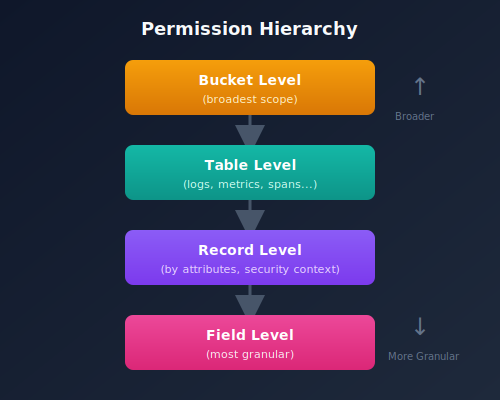
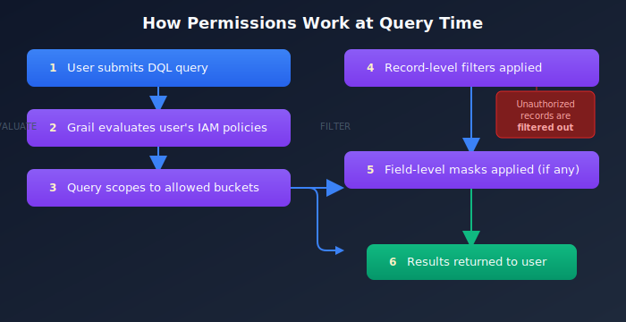

# ORGNZ-04: Permissions in Grail Overview

> **Series:** ORGNZ | **Notebook:** 4 of 10 | **Created:** January 2026 | **Last Updated:** 01/28/2026

## Overview

Dynatrace provides a comprehensive permission model for Grail that applies to all telemetry data including metrics, logs, spans, and events. Permissions can be assigned at the **bucket**, **table**, **record**, and **field** level. Without permissions, users cannot query data from Grail.

## Prerequisites

| Requirement | Details |
|-------------|----------|
| **Dynatrace Environment** | SaaS environment with Grail enabled |
| **Permissions** | Account admin or IAM policy management access |
| **Knowledge** | Completed ORGNZ-03 (Bucket Strategy) |
| **Data** | None required (conceptual overview) |

---

## Table of Contents

1. [Permission Levels](#permission-levels)
2. [IAM Policy Structure](#iam-policy-structure)
3. [Supported Conditions for Storage Policies](#supported-conditions-for-storage-policies)
4. [Policy Operators](#policy-operators)
5. [Basic Policy Examples](#basic-policy-examples)
6. [How Permissions Work at Query Time](#how-permissions-work-at-query-time)
7. [Policy Management Location](#policy-management-location)
8. [Permission Scalability](#permission-scalability)
9. [Choosing Your Permission Strategy](#choosing-your-permission-strategy)

---

-------------|----------|
| **Dynatrace Account** | Account-level administrative access |
| **Permissions** | IAM policy management permissions |
| **Knowledge** | Completed ORGNZ-01 through ORGNZ-03 |

## Learning Objectives

By the end of this notebook, you will:
- Understand the four permission levels in Grail
- Know how IAM policies control data access
- Recognize supported conditions for access control
- Navigate policy management in Dynatrace

<a id="permission-levels"></a>
## Permission Levels
Grail supports permissions at multiple granularity levels:

| Level | Granularity | Example Use Case |
|-------|-------------|------------------|
| **Bucket** | All records in a bucket | Team owns entire bucket |
| **Table** | All records of a data type | Access to all logs across buckets |
| **Record** | Individual records by attribute | Filter by host group, namespace, security context |
| **Field** | Specific fields on records | Mask sensitive fields |



<!-- MARKDOWN_TABLE_ALTERNATIVE
| Level | Scope |
|-------|-------|
| Bucket Level | broadest |
| Table Level | data type |
| Record Level | by attributes |
| Field Level | most granular |
For environments where SVG doesn't render
-->

<a id="iam-policy-structure"></a>
## IAM Policy Structure
Permissions are defined through IAM policies using statement queries:

```
ALLOW <service>:<resource>:<action> WHERE <conditions>
```

### Policy Components

| Component | Description | Examples |
|-----------|-------------|----------|
| **Service** | The Dynatrace service | `storage` |
| **Resource** | What is being accessed | `buckets`, `logs`, `metrics`, `spans` |
| **Action** | What operation is allowed | `read`, `write`, `delete` |
| **Conditions** | Contextual requirements | `bucket-name`, `security-context` |

<a id="supported-conditions-for-storage-policies"></a>
## Supported Conditions for Storage Policies
### Deployment-Level Attributes

| Condition | Description | Example |
|-----------|-------------|----------|
| `storage:bucket-name` | Filter by bucket name | `WHERE storage:bucket-name = 'team_logs'` |
| `storage:k8s.namespace.name` | Kubernetes namespace | `WHERE storage:k8s.namespace.name = 'production'` |
| `storage:k8s.cluster.name` | Kubernetes cluster | `WHERE storage:k8s.cluster.name = 'main-cluster'` |
| `storage:host.name` | Host name | `WHERE storage:host.name = 'web-server-01'` |
| `storage:dt.host_group.id` | Host group identifier | `WHERE storage:dt.host_group.id STARTSWITH 'prod-'` |

### Cloud Provider Attributes

| Condition | Description |
|-----------|-------------|
| `storage:aws.account.id` | AWS account ID |
| `storage:gcp.project.id` | GCP project ID |
| `storage:azure.subscription` | Azure subscription |
| `storage:azure.resource.group` | Azure resource group |

### Custom Security Context

| Condition | Description |
|-----------|-------------|
| `storage:dt.security_context` | Custom security context field |

<a id="policy-operators"></a>
## Policy Operators
IAM policies support several operators for conditions:

| Operator | Usage | Example |
|----------|-------|----------|
| `=` | Exact equality | `storage:bucket-name = 'team_logs'` |
| `STARTSWITH` | Prefix matching | `storage:bucket-name STARTSWITH 'prod_'` |
| `IN` | List equality | `storage:bucket-name IN ('bucket_a', 'bucket_b')` |
| `MATCH` | Pattern matching | `storage:bucket-name MATCH ('*-database-*')` |

> **Important**: When the field holds an array (like `dt.security_context`), use `MATCH` instead of `=`, `STARTSWITH`, or `IN`. The latter operators will always return false for array fields.

<a id="basic-policy-examples"></a>
## Basic Policy Examples
### Example 1: Default Bucket Access

Grant read access to all default buckets:

```
ALLOW storage:buckets:read WHERE storage:bucket-name STARTSWITH "default_";
ALLOW storage:events:read, storage:logs:read, storage:metrics:read, 
      storage:entities:read, storage:bizevents:read, storage:spans:read;
```

### Example 2: Team-Specific Bucket Access

Restrict access to team buckets:

```
ALLOW storage:buckets:read WHERE storage:bucket-name STARTSWITH "team_platform_";
ALLOW storage:logs:read;
```

### Example 3: Namespace-Based Access

Grant access based on Kubernetes namespace:

```
ALLOW storage:buckets:read WHERE storage:bucket-name STARTSWITH "default_";
ALLOW storage:logs:read WHERE storage:k8s.namespace.name = "production";
```

<a id="how-permissions-work-at-query-time"></a>
## How Permissions Work at Query Time
When a user runs a DQL query, Grail evaluates permissions at each level:



Records without defined access are automatically filtered out.

<!-- MARKDOWN_TABLE_ALTERNATIVE
| Step | Action |
|------|--------|
| 1 | User submits DQL query |
| 2 | Grail evaluates user's IAM policies |
| 3 | Query scopes to allowed buckets |
| 4 | Record-level filters applied |
| 5 | Field-level masks applied (if any) |
| 6 | Results returned to user |
For environments where SVG doesn't render
-->

<a id="policy-management-location"></a>
## Policy Management Location
To configure permissions:

1. Go to **Account Management**
2. If you have multiple accounts, select the appropriate account
3. Navigate to **Identity & access management** > **Policy management**

### Policy Assignment

| Target | Description |
|--------|-------------|
| Groups | Assign policies to user groups (recommended) |
| Users | Assign policies to individual users |
| Service accounts | Assign policies for API access |

<a id="permission-scalability"></a>
## Permission Scalability
### Challenge

Creating access policies solely on the bucket and table level is not scalable in enterprise environments:

- One Dynatrace tenant has a limited number of custom buckets (80 default)
- Creating a bucket per team/application doesn't scale

### Solution

Use record-level permissions based on:

| Approach | Method |
|----------|--------|
| Deployment attributes | Host groups, namespaces, clusters |
| Cloud attributes | AWS account, GCP project, Azure subscription |
| Custom security context | `dt.security_context` field |

This allows multiple teams to share buckets while seeing only authorized data.

<a id="choosing-your-permission-strategy"></a>
## Choosing Your Permission Strategy
| Scenario | Recommended Approach |
|----------|---------------------|
| Small org, few teams | Bucket-level policies |
| Large org, many teams | Security context + record-level |
| Kubernetes-centric | Namespace-based policies |
| Multi-cloud | Cloud account-based policies |
| Complex hierarchy | Hierarchical security context |

## Next Steps

Continue with the ORGNZ series:
- **ORGNZ-05**: Bucket-Level Access Control
- **ORGNZ-06**: Security Context
- **ORGNZ-07**: Advanced Permission Patterns

## References

- [Permissions in Grail](https://docs.dynatrace.com/docs/platform/grail/organize-data/assign-permissions-in-grail)
- [IAM policy reference](https://docs.dynatrace.com/docs/manage/identity-access-management/permission-management/manage-user-permissions-policies/advanced/iam-policystatements)
- [Working with policies](https://docs.dynatrace.com/docs/manage/identity-access-management/permission-management/manage-user-permissions-policies)

---

<sub>*This notebook was AI-generated from Dynatrace documentation and enterprise best practices. It is not officially supported by Dynatrace. Always verify information against official Dynatrace documentation.*</sub>
