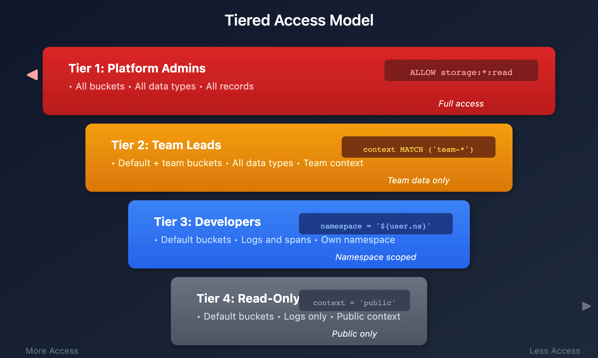

# ORGNZ-07 LAB: Advanced Permission Patterns - Hands-on Exercises

> **Series:** ORGNZ | **Notebook:** 7 of 10 | **Type:** LAB | **Created:** February 2026 | **Last Updated:** 02/19/2026

## Overview

This lab notebook contains 3 hands-on exercises extracted from **ORGNZ-07: Advanced Permission Patterns**. Complete the lecture notebook first, then work through these exercises to reinforce the concepts with real DQL queries against your Dynatrace environment.

---

## Table of Contents

1. [Exercise 1: Supported Record-Level Conditions](#exercise-1)
2. [Exercise 2: Supported Record-Level Conditions](#exercise-2)
3. [Exercise 3: Supported Record-Level Conditions](#exercise-3)
4. [Lab Summary](#lab-summary)

---

## Prerequisites

| Requirement | Details |
|-------------|----------|
| **Completed** | ORGNZ-07: Advanced Permission Patterns (lecture notebook) |
| **Dynatrace Environment** | SaaS tenant with Grail enabled |
| **Permissions** | `logs.read`, `metrics.read`, `entities.read`, `spans.read` |

<a id="exercise-1"></a>
## Exercise 1: Supported Record-Level Conditions

# ORGNZ-07: Advanced Permission Patterns

> **Series:** ORGNZ | **Notebook:** 7 of 10 | **Created:** January 2026 | **Last Updated:** 02/09/2026


This notebook covers advanced permission patterns including record-level permissions, field-based access, and combining multiple access control mechanisms for enterprise-scale data governance.


| Requirement | Details |
|---

---


1. Record-Level Permissions
2. Record-Level Policy Examples
3. Field-Level Access
4. Combined Permission Patterns
5. Policy Boundaries
6. Enterprise Architecture Patterns
7. Testing Permissions
8. Best Practices

---

-------------|----------|
| **Dynatrace Account** | Account-level administrative access |
| **Permissions** | IAM policy management permissions |
| **Knowledge** | Completed ORGNZ-04 through ORGNZ-06 |


By the end of this notebook, you will:
- Implement record-level permissions using various attributes
- Understand field-level access restrictions
- Use policy boundaries for reusable condition management
- Combine bucket, record, and field-level policies
- Design enterprise-scale permission architectures

Record-level permissions filter data at query time based on record attributes:


<!-- MARKDOWN_TABLE_ALTERNATIVE
| Step | Action |
|------|--------|
| 1 | User Query: fetch logs |
| 2 | IAM Policy Evaluation |
| 3 | Record Filter (namespace, host group, security context) |
| 4 | Only authorized records returned |
For environments where SVG doesn't render
-->


| Condition | Description | Example |
|-----------|-------------|----------|
| `storage:k8s.namespace.name` | Kubernetes namespace | `= 'production'` |
| `storage:k8s.cluster.name` | Kubernetes cluster | `= 'main-cluster'` |
| `storage:host.name` | Host name | `= 'web-server-01'` |
| `storage:dt.host_group.id` | Host group | `STARTSWITH 'prod-'` |
| `storage:aws.account.id` | AWS account | `= '123456789012'` |
| `storage:gcp.project.id` | GCP project | `= 'my-project'` |
| `storage:azure.subscription` | Azure subscription | `= 'sub-id'` |
| `storage:azure.resource.group` | Azure resource group | `= 'my-rg'` |
| `storage:dt.security_context` | Custom context | `MATCH ('team-*')` |


```json
{
  "name": "production-namespace-access",
  "description": "Access only to production namespace data",
  "statementQuery": "ALLOW storage:buckets:read WHERE storage:bucket-name STARTSWITH 'default_'; ALLOW storage:logs:read WHERE storage:k8s.namespace.name = 'production';"
}
```


```json
{
  "name": "web-tier-access",
  "description": "Access to web tier hosts only",
  "statementQuery": "ALLOW storage:buckets:read WHERE storage:bucket-name STARTSWITH 'default_'; ALLOW storage:logs:read, storage:metrics:read WHERE storage:dt.host_group.id STARTSWITH 'web-';"
}
```


```json
{
  "name": "prod-web-tier-access",
  "description": "Production web tier only",
  "statementQuery": "ALLOW storage:buckets:read WHERE storage:bucket-name STARTSWITH 'default_'; ALLOW storage:logs:read WHERE storage:k8s.namespace.name = 'production' AND storage:dt.host_group.id STARTSWITH 'web-';"
}
```


```json
{
  "name": "aws-team-account-access",
  "description": "Access to specific AWS account",
  "statementQuery": "ALLOW storage:buckets:read WHERE storage:bucket-name STARTSWITH 'default_'; ALLOW storage:logs:read, storage:metrics:read, storage:spans:read WHERE storage:aws.account.id = '123456789012';"
}
```

Control access to specific fields within records:

| Use Case | Implementation |
|----------|----------------|
| Hide sensitive fields | Deny access to specific fields |
| Mask PII | Field-level policies |
| Compliance requirements | Restrict access to audit fields |


```json
{
  "name": "restricted-field-access",
  "description": "Hide sensitive fields from general users",
  "statementQuery": "ALLOW storage:buckets:read WHERE storage:bucket-name STARTSWITH 'default_'; ALLOW storage:logs:read; DENY storage:logs:read:user.email, storage:logs:read:user.ip_address;"
}
```


Combine bucket and record-level permissions:

```
Layer 1: Bucket access
  ALLOW storage:buckets:read WHERE bucket-name IN ('team_logs', 'shared_logs')

Layer 2: Record filtering
  ALLOW storage:logs:read WHERE k8s.namespace.name = 'team-namespace'

Layer 3: Field masking (optional)
  DENY storage:logs:read:sensitive_field
```


Multiple teams share a bucket with security context isolation:

```json
// Team A policy
{
  "name": "team-a-shared-bucket",
  "statementQuery": "ALLOW storage:buckets:read WHERE storage:bucket-name = 'shared_logs'; ALLOW storage:logs:read WHERE storage:dt.security_context MATCH ('team-a*');"
}

// Team B policy
{
  "name": "team-b-shared-bucket",
  "statementQuery": "ALLOW storage:buckets:read WHERE storage:bucket-name = 'shared_logs'; ALLOW storage:logs:read WHERE storage:dt.security_context MATCH ('team-b*');"
}
```


```json
// Production access (restricted)
{
  "name": "production-access",
  "statementQuery": "ALLOW storage:buckets:read WHERE storage:bucket-name STARTSWITH 'prod_'; ALLOW storage:logs:read WHERE storage:dt.security_context = 'env:production';"
}

// Non-production access (broader)
{
  "name": "non-production-access",
  "statementQuery": "ALLOW storage:buckets:read WHERE storage:bucket-name STARTSWITH 'default_'; ALLOW storage:logs:read WHERE storage:dt.security_context MATCH ('env:dev*', 'env:staging*', 'env:qa*');"
}
```


**Policy boundaries** decouple the "what" (policy) from the "where" (conditions), enabling reusable condition sets that can be applied across multiple policies.


| Aspect | Description |
|--------|-------------|
| **Purpose** | Bundle conditions for reuse across multiple policies |
| **Scope** | Record-level and resource-level restrictions |
| **Relationship** | Always used together with a policy — boundaries alone don't restrict anything |
| **Limit** | Maximum 10 restrictions per boundary |


While **policies** define _which features and data_ users can access, **boundaries** define _where_ users can access them:

```
Policy: ALLOW storage:logs:read, storage:metrics:read, storage:spans:read
Boundary: storage:k8s.namespace.name = "production"
           storage:dt.host_group.id STARTSWITH "prod-"
```

When assigned together, the user gets read access to logs, metrics, and spans — but only for production namespace data on production host groups.


| Rule | Detail |
|------|--------|
| No AND operator | Each line is one condition (implicitly AND-combined) |
| No logical operators | For complex logic, use policy templating |
| Reusable | Same boundary can be applied to multiple policies |
| Max 10 restrictions | Create additional boundaries if more are needed |


1. Go to **Account Management** > **Identity & access management** > **Policy management**
2. Select the **Boundaries** tab
3. Select **Create boundary**
4. Enter boundary name and conditions (one per line)
5. Save and assign to group policies


```
# EU Region Boundary
storage:bucket-name STARTSWITH "eu_"
storage:azure.subscription = "eu-subscription-id"
```

This boundary can then be applied alongside any policy (logs access, metrics access, etc.) to restrict all data access to the EU region.

> **Tip:** Use boundaries when you have the same set of conditions (e.g., "production only" or "EU region only") that need to apply to multiple policies. This avoids duplicating conditions across every policy definition.




<!-- MARKDOWN_TABLE_ALTERNATIVE
| Tier | Role | Access |
|------|------|--------|
| 1 | Platform Admins | All buckets, all data types, all records |
| 2 | Team Leads | Default + team buckets, team context |
| 3 | Developers | Default buckets, own namespace only |
| 4 | Read-Only Viewers | Default buckets, public context only |
For environments where SVG doesn't render
-->


| Region | Buckets | Context | Policy |
|--------|---------|---------|--------|
| EU | eu_* | region:eu | bucket-name STARTSWITH 'eu_' AND security_context MATCH ('region:eu*') |
| US | us_* | region:us | bucket-name STARTSWITH 'us_' AND security_context MATCH ('region:us*') |

> **Tip:** Use policy boundaries to define regional restrictions once, then apply the same boundary to all team policies within that region.

```dql
// Test namespace-based access
fetch logs, from:-1h
| filter isNotNull(k8s.namespace.name)
| summarize count = count(), by:{k8s.namespace.name}
| sort count desc
```

<a id="exercise-2"></a>
## Exercise 2: Supported Record-Level Conditions


```dql
// Test host group access
fetch logs, from:-1h
| filter isNotNull(dt.host_group.id)
| summarize count = count(), by:{dt.host_group.id}
| sort count desc
```

<a id="exercise-3"></a>
## Exercise 3: Supported Record-Level Conditions


```dql
// Verify accessible data distribution
fetch logs, from:-1h
| summarize 
    total = count(),
    withSecurityContext = countIf(isNotNull(dt.security_context)),
    withNamespace = countIf(isNotNull(k8s.namespace.name)),
    withHostGroup = countIf(isNotNull(dt.host_group.id))
```

<a id="lab-summary"></a>
## Lab Summary

You have completed 3 hands-on exercises for **ORGNZ-07: Advanced Permission Patterns**.

### Exercises Completed

- [ ] Exercise 1: Supported Record-Level Conditions
- [ ] Exercise 2: Supported Record-Level Conditions
- [ ] Exercise 3: Supported Record-Level Conditions

### Next Steps

Continue with **ORGNZ-08** for the next notebook.

---

<sub>*This notebook was AI-generated from community-submitted and publicly available sources. This notebook series is not officially supported by Dynatrace. Always verify information against official Dynatrace documentation.*</sub>
