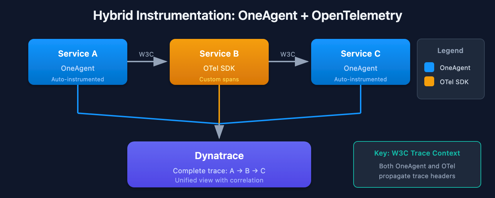
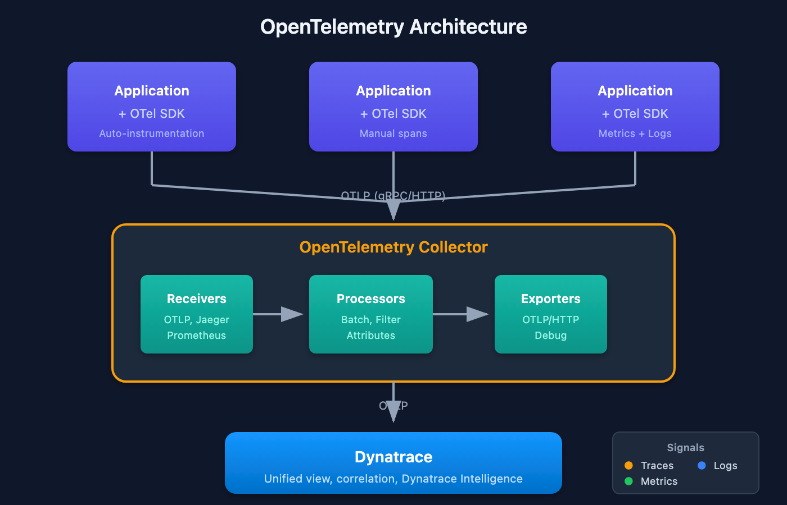

# OpenTelemetry Fundamentals

> **Series:** OTEL | **Notebook:** 1 of 8 | **Created:** January 2026 | **Last Updated:** 02/09/2026

## Introduction to OpenTelemetry and Dynatrace
OpenTelemetry (OTel) is the industry-standard framework for collecting telemetry data. Dynatrace fully supports OpenTelemetry through native OTLP ingestion, allowing you to leverage OTel instrumentation while benefiting from Dynatrace's AI-powered analytics.

---

## Table of Contents

1. [What is OpenTelemetry?](#what-is-opentelemetry)
2. [OTel vs. Proprietary Agents](#otel-vs-proprietary-agents)
3. [Core Components](#core-components)
4. [Signal Types: Traces, Metrics, Logs](#signal-types-traces-metrics-logs)
5. [Semantic Conventions](#semantic-conventions)
6. [Dynatrace OTel Integration](#dynatrace-otel-integration)
7. [When to Use OpenTelemetry](#when-to-use-opentelemetry)

---

## Prerequisites

| Requirement | Details |
|-------------|----------|
| **Dynatrace Environment** | SaaS with OTLP ingestion enabled |
| **Permissions** | `openpipeline.events`, `metrics.ingest`, `logs.ingest` |
| **Knowledge** | Basic observability concepts |

<a id="what-is-opentelemetry"></a>
## 1. What is OpenTelemetry?
OpenTelemetry is a vendor-neutral, open-source observability framework that provides:

| Component | Purpose |
|-----------|----------|
| **APIs** | Standardized interfaces for instrumentation |
| **SDKs** | Language-specific implementations |
| **Collector** | Agent for receiving, processing, and exporting telemetry |
| **Protocol (OTLP)** | Standard wire protocol for telemetry data |

### CNCF Project

OpenTelemetry is a Cloud Native Computing Foundation (CNCF) project, formed from the merger of OpenTracing and OpenCensus. It's the second-most active CNCF project after Kubernetes.

### Key Benefits

| Benefit | Description |
|---------|-------------|
| **Vendor Neutral** | No lock-in to specific backends |
| **Standardized** | Consistent across languages and platforms |
| **Comprehensive** | Traces, metrics, and logs in one framework |
| **Community-Driven** | Active development, broad adoption |

<a id="otel-vs-proprietary-agents"></a>
## 2. OTel vs. Proprietary Agents
### Comparison

| Aspect | OpenTelemetry | Dynatrace OneAgent |
|--------|---------------|--------------------|
| **Instrumentation** | Manual or auto-instrumentation | Automatic |
| **Deployment** | SDK + Collector | Single agent |
| **Coverage** | Code-level | Full-stack |
| **Flexibility** | High (any backend) | Dynatrace-specific |
| **Maintenance** | Higher | Lower |
| **Features** | Standard signals | AI, RCA, Dynatrace Intelligence |

### When to Choose OTel

| Scenario | Recommendation |
|----------|----------------|
| Multi-vendor observability | OTel |
| Serverless/Lambda | OTel |
| Custom instrumentation needs | OTel |
| Existing OTel investment | OTel |
| Full-stack visibility | OneAgent + OTel |
| Minimal effort | OneAgent |

### Hybrid Approach

Dynatrace supports using both OneAgent and OTel together:



<!-- MARKDOWN_TABLE_ALTERNATIVE
| Component | Function |
|-----------|----------|
| Application | Runs your code |
| OneAgent (auto) | Automatic instrumentation |
| OTel SDK (custom) | Manual custom spans |
| Dynatrace Backend | Unified view, correlation, Dynatrace Intelligence |

Both agents send to Dynatrace for unified analysis.
For environments where SVG doesn't render
-->

<a id="core-components"></a>
## 3. Core Components
### OpenTelemetry Architecture



<!-- MARKDOWN_TABLE_ALTERNATIVE
| Component | Role |
|-----------|------|
| Applications + OTel SDK | Instrumented services |
| OTLP (gRPC/HTTP) | Wire protocol |
| OpenTelemetry Collector | Receives, processes, exports |
| Receivers | OTLP, Jaeger, Prometheus |
| Processors | Batch, Filter, Attributes |
| Exporters | OTLP/HTTP, Debug |
| Dynatrace | Unified view, correlation, Dynatrace Intelligence |
For environments where SVG doesn't render
-->

### Component Descriptions

| Component | Role |
|-----------|------|
| **API** | Defines how to instrument (language-specific interfaces) |
| **SDK** | Implements the API, handles sampling, batching |
| **Exporter** | Sends data to backends (OTLP, Jaeger, etc.) |
| **Collector** | Standalone service for processing telemetry |
| **Instrumentation Libraries** | Pre-built instrumentation for frameworks |

<a id="signal-types-traces-metrics-logs"></a>
## 4. Signal Types: Traces, Metrics, Logs
### Traces

Distributed traces track requests across services.

| Concept | Description |
|---------|-------------|
| **Trace** | End-to-end transaction path |
| **Span** | Single operation within a trace |
| **SpanContext** | Propagated context (trace ID, span ID) |
| **Attributes** | Key-value metadata on spans |
| **Events** | Timestamped annotations on spans |

### Metrics

Quantitative measurements over time.

| Instrument Type | Use Case | Example |
|-----------------|----------|----------|
| **Counter** | Monotonically increasing value | Request count |
| **UpDownCounter** | Value that goes up and down | Active connections |
| **Histogram** | Distribution of values | Response time |
| **Gauge** | Current value | Temperature, queue size |

### Logs

Structured event records correlated with traces.

| Field | Description |
|-------|-------------|
| **Timestamp** | When the event occurred |
| **Severity** | Log level (DEBUG, INFO, ERROR) |
| **Body** | Log message content |
| **Attributes** | Structured metadata |
| **TraceContext** | Link to active span |

<a id="semantic-conventions"></a>
## 5. Semantic Conventions
Semantic conventions define standard attribute names for consistent telemetry.

> **Note:** OpenTelemetry semantic conventions are evolving. HTTP conventions were **stabilized in 2023** with new names (see migration tables below). Database conventions are also migrating. SDKs support a gradual transition via the `OTEL_SEMCONV_STABILITY_OPT_IN` environment variable. Both old and new names may coexist during migration.

### Resource Attributes

| Attribute | Example | Description |
|-----------|---------|-------------|
| `service.name` | `checkout-api` | Logical service name |
| `service.version` | `1.2.3` | Service version |
| `service.namespace` | `production` | Service namespace |
| `deployment.environment.name` | `prod` | Deployment environment |

> **Note:** `deployment.environment` was renamed to `deployment.environment.name` in the stable resource semantic conventions.

### HTTP Span Attributes

| Old (Legacy) | Stable | Description |
|--------------|--------|-------------|
| `http.method` | `http.request.method` | HTTP method |
| `http.url` | `url.full` | Full URL |
| `http.status_code` | `http.response.status_code` | Response status code |
| `http.route` | `url.path` / `http.route` | URL path or route template |
| `http.target` | `url.path` + `url.query` | Request target |
| `http.host` | `server.address` | Server hostname |

> **Tip:** Use `OTEL_SEMCONV_STABILITY_OPT_IN=http` to emit only stable names, or `http/dup` to emit both old and new during migration. See the [HTTP semconv migration guide](https://opentelemetry.io/docs/specs/semconv/non-normative/http-migration/).

### Database Span Attributes

| Old (Legacy) | Stable | Description |
|--------------|--------|-------------|
| `db.name` | `db.namespace` | Database name/namespace |
| `db.statement` | `db.query.text` | Query statement |
| `db.operation` | `db.operation.name` | Operation type |
| `db.system` | `db.system` | Database type (unchanged) |

> **Tip:** Use `OTEL_SEMCONV_STABILITY_OPT_IN=database` for stable database names. See the [DB semconv migration guide](https://opentelemetry.io/docs/specs/semconv/non-normative/db-migration/).

### Kubernetes Attributes

| Attribute | Example | Description |
|-----------|---------|-------------|
| `k8s.namespace.name` | `checkout` | Namespace |
| `k8s.pod.name` | `checkout-api-abc123` | Pod name |
| `k8s.deployment.name` | `checkout-api` | Deployment |

<a id="dynatrace-otel-integration"></a>
## 6. Dynatrace OTel Integration
### OTLP Endpoints

Dynatrace accepts OTLP data natively via **HTTP only** (gRPC is not supported for direct ingest):

| Protocol | Endpoint | Notes |
|----------|----------|-------|
| **HTTP** | `https://{your-env}.live.dynatrace.com/api/v2/otlp` | Recommended for direct ingest |
| **gRPC** | Not supported for direct Dynatrace ingest | Use a Collector to convert gRPC → HTTP |

> **Important:** If your application uses gRPC to export OTLP data, route it through an OpenTelemetry Collector configured with an `otlp` gRPC receiver and an `otlphttp` exporter to Dynatrace. See [Transform OTLP gRPC](https://docs.dynatrace.com/docs/ingest-from/opentelemetry/collector/use-cases/grpc).

### Authentication

Use Dynatrace API token with required scopes:

| Signal | Required Scope |
|--------|----------------|
| Traces | `openTelemetryTrace.ingest` |
| Metrics | `metrics.ingest` |
| Logs | `logs.ingest` |

### Configuration Example

**OTel Collector Exporter:**

```yaml
exporters:
  otlphttp:
    endpoint: https://{your-env}.live.dynatrace.com/api/v2/otlp
    headers:
      Authorization: Api-Token ${DT_API_TOKEN}
```

**SDK Direct Export (Python):**

```python
import os

from opentelemetry.exporter.otlp.proto.http.trace_exporter import OTLPSpanExporter

exporter = OTLPSpanExporter(
    endpoint="https://{your-env}.live.dynatrace.com/api/v2/otlp/v1/traces",
    headers={"Authorization": f"Api-Token {os.environ['DT_API_TOKEN']}"}
)
```

```dql
// View OpenTelemetry traces in Dynatrace
fetch spans, from:-1h
| filter isNotNull(otel.library.name)
| fields timestamp, trace.id, span.name, otel.library.name, duration
| sort timestamp desc
| limit 20
```

```dql
// OTel instrumentation libraries in use
fetch spans, from:-1h
| filter isNotNull(otel.library.name)
| summarize count = count(), by:{otel.library.name, otel.library.version}
| sort count desc
| limit 20
```

<a id="when-to-use-opentelemetry"></a>
## 7. When to Use OpenTelemetry
### OTel is Ideal For

| Scenario | Why OTel |
|----------|----------|
| **Serverless** | AWS Lambda, Azure Functions (no agent) |
| **Multi-cloud** | Consistent instrumentation across clouds |
| **Custom metrics** | Business-specific measurements |
| **Vendor diversity** | Send to multiple backends |
| **Edge/IoT** | Lightweight collection |
| **Polyglot** | Many languages, one standard |

### OneAgent is Better For

| Scenario | Why OneAgent |
|----------|---------------|
| **Full-stack** | Infrastructure + code in one |
| **Zero-effort** | Auto-instrumentation |
| **Dynatrace Intelligence** | Full AI capabilities |
| **PurePath** | Complete transaction tracing |
| **Real User Monitoring** | RUM integration |

### Recommended: Hybrid

For most enterprises:
- **OneAgent** for infrastructure and supported technologies
- **OTel** for unsupported languages, serverless, custom metrics

## Next Steps

Now that you understand OTel fundamentals, proceed to:

| Next Notebook | Topic |
|---------------|-------|
| **OTEL-02: Collector Architecture** | Deep-dive into the Collector |
| **OTEL-03: Collector Deployment** | Deployment patterns |
| **OTEL-04: Trace Instrumentation** | Instrumenting your code |

---

## Summary

In this notebook, you learned:

- What OpenTelemetry is and its benefits
- How OTel compares to proprietary agents
- Core OTel components: API, SDK, Collector
- Signal types: traces, metrics, logs
- Semantic conventions for consistent telemetry (including the stable HTTP and DB naming migration)
- Dynatrace OTLP integration configuration (HTTP only — gRPC requires Collector)
- When to use OTel vs. OneAgent

---

## References

- [OpenTelemetry Official Docs](https://opentelemetry.io/docs/)
- [Dynatrace OpenTelemetry Integration](https://docs.dynatrace.com/docs/ingest-from/opentelemetry)
- [OTLP Specification](https://opentelemetry.io/docs/specs/otlp/)
- [Semantic Conventions](https://opentelemetry.io/docs/specs/semconv/)
- [HTTP Semconv Migration Guide](https://opentelemetry.io/docs/specs/semconv/non-normative/http-migration/)
- [DB Semconv Migration Guide](https://opentelemetry.io/docs/specs/semconv/non-normative/db-migration/)

---

<sub>*This notebook was AI-generated from community-submitted and publicly available sources. This notebook series is not officially supported by Dynatrace. Always verify information against official Dynatrace documentation.*</sub>
