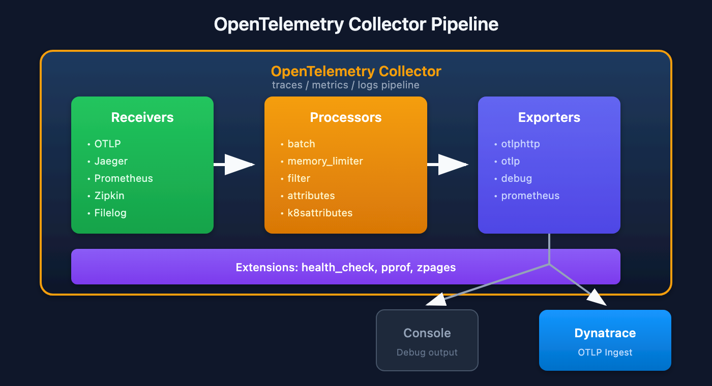

# OTEL-02: OpenTelemetry Collector Architecture

> **Series:** OTEL — OpenTelemetry Integration | **Notebook:** 2 of 8 | **Created:** January 2026 | **Last Updated:** 02/09/2026

## Understanding the OTel Collector Pipeline
The OpenTelemetry Collector is the backbone of OTel deployments—a vendor-agnostic service for receiving, processing, and exporting telemetry data. This notebook covers its architecture, components, and configuration.

---

## Table of Contents

1. [Pipeline Architecture](#pipeline-architecture)
2. [Receivers](#receivers)
3. [Processors](#processors)
4. [Exporters](#exporters)
5. [Extensions](#extensions)
6. [Connectors](#connectors)
7. [Configuration Basics](#configuration-basics)

---

## Prerequisites

| Requirement | Details |
|-------------|----------|
| **Knowledge** | OTEL-01: OpenTelemetry Fundamentals |
| **Tools** | YAML familiarity for configuration |

## 1. Collector Overview

### What is the Collector?

The OpenTelemetry Collector is a standalone service that:

| Function | Description |
|----------|-------------|
| **Receives** | Ingests telemetry from multiple sources |
| **Processes** | Transforms, filters, enriches data |
| **Exports** | Sends to one or more backends |

### Collector Distributions

| Distribution | Use Case | Components |
|--------------|----------|------------|
| **Core** | Minimal, essential only | Basic receivers/exporters |
| **Contrib** | Extended functionality | Many community components |
| **Custom** | Your specific needs | Build with ocb (OTel Collector Builder) |
| **Vendor** | Pre-configured for vendor | Dynatrace, AWS, etc. |

### Why Use a Collector?

| Benefit | Description |
|---------|-------------|
| **Decoupling** | Apps don't need backend-specific SDKs |
| **Processing** | Centralized filtering, sampling, enrichment |
| **Fan-out** | Send to multiple backends |
| **Buffering** | Retry and batching for reliability |
| **Security** | Centralize credentials and auth |

<a id="pipeline-architecture"></a>
## 2. Pipeline Architecture
### Data Flow



<!-- MARKDOWN_TABLE_ALTERNATIVE
| Stage | Components | Function |
|-------|------------|----------|
| Receivers | OTLP, Jaeger, Prometheus, Zipkin, Filelog | Ingest telemetry |
| Processors | batch, memory_limiter, filter, attributes, k8sattributes | Transform data |
| Exporters | otlphttp, otlp, debug, prometheus | Send to backends |
| Extensions | health_check, pprof, zpages | Operational support |

Data flows: Receivers → Processors → Exporters
Supports traces / metrics / logs pipelines
For environments where SVG doesn't render
-->

### Pipeline Types

| Pipeline | Data Type | Example |
|----------|-----------|----------|
| `traces` | Distributed traces | Request spans |
| `metrics` | Quantitative measurements | CPU usage |
| `logs` | Log records | Application logs |

Each signal type has its own pipeline(s) with separate receivers, processors, and exporters.

<a id="receivers"></a>
## 3. Receivers
Receivers ingest telemetry data from external sources.

### Common Receivers

| Receiver | Protocol | Signals | Use Case |
|----------|----------|---------|----------|
| `otlp` | OTLP (gRPC/HTTP) | Traces, Metrics, Logs | OTel SDKs |
| `jaeger` | Jaeger (gRPC/HTTP) | Traces | Jaeger clients |
| `zipkin` | Zipkin HTTP | Traces | Zipkin clients |
| `prometheus` | Prometheus scrape | Metrics | Prometheus targets |
| `filelog` | File tailing | Logs | Log files |
| `hostmetrics` | Host stats | Metrics | CPU, memory, disk |

### OTLP Receiver Configuration

```yaml
receivers:
  otlp:
    protocols:
      grpc:
        endpoint: 0.0.0.0:4317
      http:
        endpoint: 0.0.0.0:4318
```

### Prometheus Receiver

```yaml
receivers:
  prometheus:
    config:
      scrape_configs:
        - job_name: 'my-app'
          scrape_interval: 15s
          static_configs:
            - targets: ['app:8080']
```

<a id="processors"></a>
## 4. Processors
Processors transform, filter, or enrich telemetry data.

### Essential Processors

| Processor | Purpose | When to Use |
|-----------|---------|-------------|
| `batch` | Batch data for efficiency | Always |
| `memory_limiter` | Prevent OOM | Always |
| `resourcedetection` | Add resource attributes | K8s, cloud |
| `attributes` | Add/modify attributes | Enrichment |
| `filter` | Drop unwanted data | Cost reduction |
| `transform` | OTTL-based transformations | Complex processing |

### Batch Processor (Critical)

```yaml
processors:
  batch:
    timeout: 10s
    send_batch_size: 1000
    send_batch_max_size: 1500
```

### Memory Limiter (Critical)

```yaml
processors:
  memory_limiter:
    check_interval: 1s
    limit_mib: 400
    spike_limit_mib: 100
```

### Attributes Processor

```yaml
processors:
  attributes:
    actions:
      - key: environment
        value: production
        action: upsert
      - key: api.key
        action: delete
```

### Filter Processor

```yaml
processors:
  filter:
    traces:
      span:
        - 'attributes["http.url"] == "/health"'
```

<a id="exporters"></a>
## 5. Exporters
Exporters send processed telemetry to backends.

### Common Exporters

| Exporter | Target | Signals | Notes |
|----------|--------|---------|-------|
| `otlphttp` | OTLP over HTTP | All | Dynatrace, many backends |
| `otlp` | OTLP over gRPC | All | Lower overhead |
| `debug` | Console/logs | All | Development |
| `prometheus` | Prometheus endpoint | Metrics | Pull model |
| `file` | Local files | All | Debugging |

### OTLP HTTP Exporter (Dynatrace)

```yaml
exporters:
  otlphttp:
    endpoint: https://{your-env}.live.dynatrace.com/api/v2/otlp
    headers:
      Authorization: Api-Token ${DT_API_TOKEN}
```

### Debug Exporter

```yaml
exporters:
  debug:
    verbosity: detailed
    sampling_initial: 5
    sampling_thereafter: 200
```

### Multiple Exporters (Fan-Out)

```yaml
exporters:
  otlphttp/dynatrace:
    endpoint: https://${DT_ENV_ID}.live.dynatrace.com/api/v2/otlp
    headers:
      Authorization: Api-Token ${DT_API_TOKEN}
  otlphttp/backup:
    endpoint: https://backup-backend.example.com

service:
  pipelines:
    traces:
      receivers: [otlp]
      processors: [batch]
      exporters: [otlphttp/dynatrace, otlphttp/backup]  # Both!
```

<a id="extensions"></a>
## 6. Extensions
Extensions provide operational capabilities for the Collector itself.

### Common Extensions

| Extension | Purpose |
|-----------|----------|
| `health_check` | Liveness/readiness endpoints |
| `pprof` | Go profiling data |
| `zpages` | Debug pages for pipelines |

> **Note:** The `memory_ballast` extension is **deprecated** and was removed from default Helm chart configurations. Use the `GOMEMLIMIT` environment variable instead (set to ~80% of the container memory limit). See [Collector discussion #9264](https://github.com/open-telemetry/opentelemetry-collector/discussions/9264).

### Configuration

```yaml
extensions:
  health_check:
    endpoint: 0.0.0.0:13133
  pprof:
    endpoint: 0.0.0.0:1777
  zpages:
    endpoint: 0.0.0.0:55679

service:
  extensions: [health_check, pprof, zpages]
```

<a id="connectors"></a>
## 7. Connectors
Connectors link pipelines, acting as both exporter and receiver.

### Use Cases

| Connector | Function |
|-----------|----------|
| `spanmetrics` | Generate metrics from spans |
| `servicegraph` | Build service dependency graph |
| `count` | Count data points |

### Span Metrics Connector

```yaml
connectors:
  spanmetrics:
    dimensions:
      - name: http.method
      - name: http.status_code
    histogram:
      explicit:
        buckets: [100ms, 500ms, 1s, 5s]

service:
  pipelines:
    traces:
      receivers: [otlp]
      exporters: [spanmetrics, otlphttp]
    metrics:
      receivers: [spanmetrics]  # Receives from connector
      exporters: [otlphttp]
```

<a id="configuration-basics"></a>
## 8. Configuration Basics
### Minimal Configuration

```yaml
receivers:
  otlp:
    protocols:
      grpc:
        endpoint: 0.0.0.0:4317
      http:
        endpoint: 0.0.0.0:4318

processors:
  batch:
    timeout: 10s

exporters:
  otlphttp:
    endpoint: https://${DT_ENV_ID}.live.dynatrace.com/api/v2/otlp
    headers:
      Authorization: Api-Token ${DT_API_TOKEN}

service:
  pipelines:
    traces:
      receivers: [otlp]
      processors: [batch]
      exporters: [otlphttp]
    metrics:
      receivers: [otlp]
      processors: [batch]
      exporters: [otlphttp]
    logs:
      receivers: [otlp]
      processors: [batch]
      exporters: [otlphttp]
```

### Configuration Best Practices

| Practice | Reason |
|----------|--------|
| Always use `batch` processor | Efficiency |
| Always use `memory_limiter` | Stability |
| Put `memory_limiter` first | Fail fast |
| Use environment variables for secrets | Security |
| Validate config before deploy | Catch errors early |

## Summary

In this notebook, you learned:

- Collector overview and distributions
- Pipeline architecture: receivers → processors → exporters
- Common receivers (OTLP, Prometheus, Jaeger)
- Essential processors (batch, memory_limiter, filter)
- Exporters for Dynatrace and other backends
- Extensions for operational capabilities
- Connectors for pipeline linking
- Configuration fundamentals

---

## Next Steps

| Next Notebook | Topic |
|---------------|-------|
| **OTEL-03: Collector Deployment** | Deployment patterns |
| **OTEL-04: Trace Instrumentation** | Instrumenting code |

---

## References

- [OTel Collector Documentation](https://opentelemetry.io/docs/collector/)
- [Collector Configuration](https://opentelemetry.io/docs/collector/configuration/)
- [Collector Releases](https://github.com/open-telemetry/opentelemetry-collector-releases)

---

<sub>*This notebook was AI-generated from community-submitted and publicly available sources. This notebook series is not officially supported by Dynatrace. Always verify information against official Dynatrace documentation.*</sub>
