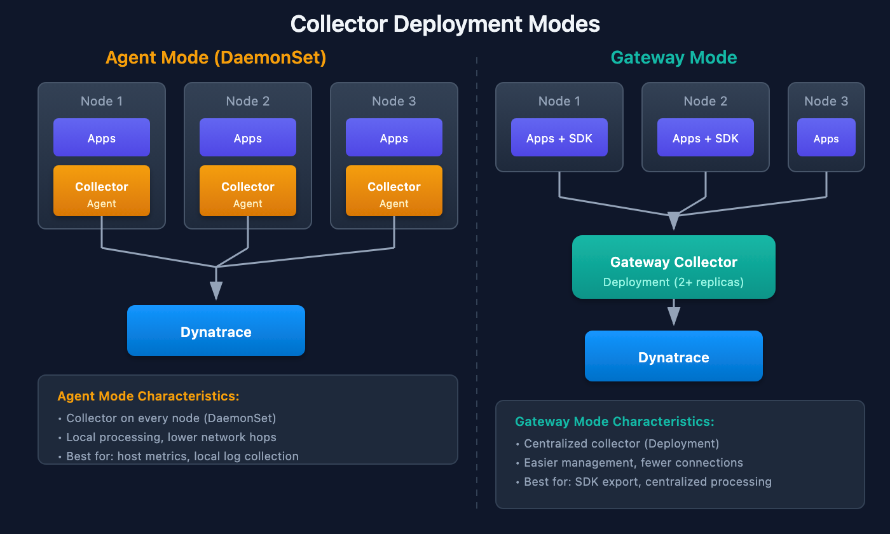
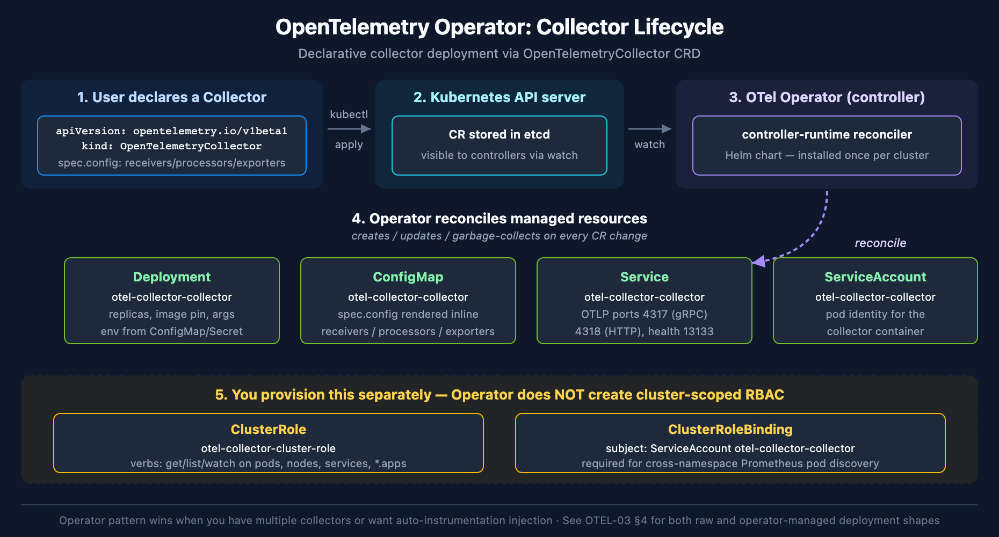
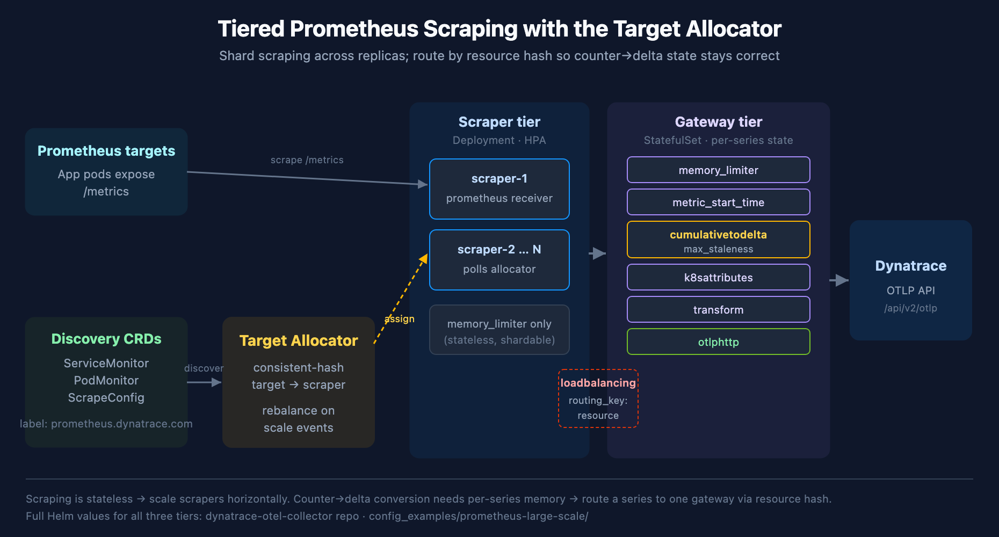

# OTEL-03: Collector Deployment Patterns

> **Series:** OTEL — OpenTelemetry Integration | **Notebook:** 3 of 8 | **Created:** January 2026 | **Last Updated:** 07/08/2026

## Deploying the OpenTelemetry Collector
The OTel Collector can be deployed in various patterns depending on your infrastructure. This notebook covers deployment modes, Kubernetes configurations, and best practices for production.

---

## Table of Contents

1. [Deployment Modes](#deployment-modes)
2. [Agent Mode (Sidecar/DaemonSet)](#agent-mode-sidecardaemonset)
3. [Gateway Mode](#gateway-mode)
4. [Kubernetes Deployment](#kubernetes-deployment)
5. [Scaling Prometheus Scraping](#scaling-prometheus-scraping)
6. [Docker Compose](#docker-compose)
7. [High Availability](#high-availability)
8. [Resource Sizing](#resource-sizing)
9. [Security Considerations](#security-considerations)

---

## Prerequisites

| Requirement | Details |
|-------------|----------|
| **Knowledge** | OTEL-02: Collector Architecture |
| **Tools** | kubectl, Helm, or Docker |

<a id="deployment-modes"></a>
## 1. Deployment Modes
### Mode Comparison

| Mode | Deployment | Use Case | Pros | Cons |
|------|------------|----------|------|------|
| **Agent** | DaemonSet/Sidecar | Per-node collection | Low latency, local processing | More instances |
| **Gateway** | Deployment | Centralized | Single point, aggregation | Potential bottleneck |
| **Hybrid** | Both | Large scale | Best of both | Complex |

### Architecture Patterns



<!-- MARKDOWN_TABLE_ALTERNATIVE
**Agent Mode (DaemonSet):**
| Node | Component |
|------|-----------|
| Node 1 | Collector (local) |
| Node 2 | Collector (local) |
| Node 3 | Collector (local) |
Each collector sends directly to Dynatrace

**Gateway Mode:**
| Layer | Component |
|-------|-----------|
| Nodes | Apps only |
| Central | Gateway Collector |
| Backend | Dynatrace |
All data flows through central gateway
For environments where SVG doesn't render
-->

<a id="agent-mode-sidecardaemonset"></a>
## 2. Agent Mode (Sidecar/DaemonSet)
### DaemonSet Configuration

> **Important:** Always pin your Collector image to a specific version. Using `latest` can cause unexpected behavior during upgrades. Check the [OpenTelemetry Collector releases](https://github.com/open-telemetry/opentelemetry-collector-releases/releases) for the current stable version.

```yaml
apiVersion: apps/v1
kind: DaemonSet
metadata:
  name: otel-collector-agent
  namespace: otel
spec:
  selector:
    matchLabels:
      app: otel-collector-agent
  template:
    metadata:
      labels:
        app: otel-collector-agent
    spec:
      containers:
        - name: collector
          image: otel/opentelemetry-collector-contrib:0.151.0
          args:
            - --config=/conf/otel-collector-config.yaml
          ports:
            - containerPort: 4317  # OTLP gRPC
            - containerPort: 4318  # OTLP HTTP
          resources:
            requests:
              cpu: 100m
              memory: 256Mi
            limits:
              cpu: 500m
              memory: 512Mi
          volumeMounts:
            - name: config
              mountPath: /conf
      volumes:
        - name: config
          configMap:
            name: otel-collector-config
```

### Sidecar Pattern

```yaml
apiVersion: v1
kind: Pod
metadata:
  name: my-app
spec:
  containers:
    - name: app
      image: my-app:latest
      env:
        - name: OTEL_EXPORTER_OTLP_ENDPOINT
          value: http://localhost:4317
    - name: otel-collector
      image: otel/opentelemetry-collector-contrib:0.151.0
      args:
        - --config=/conf/otel-collector-config.yaml
      ports:
        - containerPort: 4317
```

> **Collector version currency (checked 07/08/2026):** the pins in this notebook (`otel/opentelemetry-collector-contrib:0.151.0`, Dynatrace distro `v0.48.0`) are the **validated baseline** for these examples. Newer Dynatrace-distro releases exist — **v0.49.0–v0.51.0** (wrapping upstream contrib 0.153–0.155) — with breaking changes to review before bumping: the `filter` processor's default `error_mode` changed to `ignore` (0.49), `span_metrics` now rejects duplicate dimension names at startup (0.50), and `memory_limiter` self-metrics were renamed to `otelcol_processor_memory_limiter_*` (0.51 — affects self-monitoring dashboards that chart those series). The pinned versions remain valid and supported; upgrade deliberately per the always-pin guidance in this section, reviewing the [release notes](https://github.com/Dynatrace/dynatrace-otel-collector/releases) for each version you cross.

<a id="gateway-mode"></a>
## 3. Gateway Mode
### Gateway Deployment

```yaml
apiVersion: apps/v1
kind: Deployment
metadata:
  name: otel-collector-gateway
  namespace: otel
spec:
  replicas: 2  # HA
  selector:
    matchLabels:
      app: otel-collector-gateway
  template:
    metadata:
      labels:
        app: otel-collector-gateway
    spec:
      containers:
        - name: collector
          image: otel/opentelemetry-collector-contrib:0.151.0  # pinned — see the version-pinning callout in §2
          args:
            - --config=/conf/otel-collector-config.yaml
          ports:
            - containerPort: 4317
            - containerPort: 4318
          resources:
            requests:
              cpu: 500m
              memory: 1Gi
            limits:
              cpu: 2000m
              memory: 4Gi
```

### Gateway Service

```yaml
apiVersion: v1
kind: Service
metadata:
  name: otel-collector-gateway
  namespace: otel
spec:
  ports:
    - name: otlp-grpc
      port: 4317
      targetPort: 4317
    - name: otlp-http
      port: 4318
      targetPort: 4318
  selector:
    app: otel-collector-gateway
```

<a id="kubernetes-deployment"></a>
## 4. Kubernetes Deployment
### Helm Installation

```bash
# Add Helm repo
helm repo add open-telemetry https://open-telemetry.github.io/opentelemetry-helm-charts
helm repo update

# Install as DaemonSet (agent mode)
helm install otel-collector open-telemetry/opentelemetry-collector \
  --namespace otel \
  --create-namespace \
  --set mode=daemonset

# Install as Deployment (gateway mode)
helm install otel-collector open-telemetry/opentelemetry-collector \
  --namespace otel \
  --create-namespace \
  --set mode=deployment \
  --set replicaCount=2
```

### Helm Values for Dynatrace

```yaml
# values.yaml
mode: deployment
replicaCount: 2

config:
  receivers:
    otlp:
      protocols:
        grpc:
          endpoint: 0.0.0.0:4317
        http:
          endpoint: 0.0.0.0:4318

  processors:
    batch:
      timeout: 10s
    memory_limiter:
      check_interval: 1s
      limit_mib: 800

  exporters:
    otlphttp:
      endpoint: https://${DT_ENDPOINT}/api/v2/otlp
      headers:
        Authorization: Api-Token ${DT_TOKEN}

  service:
    pipelines:
      traces:
        receivers: [otlp]
        processors: [memory_limiter, batch]
        exporters: [otlphttp]
      metrics:
        receivers: [otlp]
        processors: [memory_limiter, batch]
        exporters: [otlphttp]
      logs:
        receivers: [otlp]
        processors: [memory_limiter, batch]
        exporters: [otlphttp]
```

### OpenTelemetry Operator (CRD-managed)

The Helm install above creates a raw `Deployment` that you own and roll over manually. The **OpenTelemetry Operator** introduces a higher-level pattern — install the operator once, then declare collectors as `OpenTelemetryCollector` custom resources. The operator reconciles the `Deployment`, `ConfigMap`, `ServiceAccount`, and the collector's container.



<!-- MARKDOWN_TABLE_ALTERNATIVE
| Stage | Resource | What it does |
|-------|----------|--------------|
| 1 | OpenTelemetry Operator | Installed once per cluster from the Helm chart |
| 2 | OpenTelemetryCollector CR | You write this — collector config inline |
| 3 | Operator reconciles | Creates managed Deployment, ConfigMap, ServiceAccount |
| 4 | ClusterRole + ClusterRoleBinding | Provisioned separately for cross-namespace pod discovery |
For environments where SVG does not render
-->

**Two-stage install:**

```bash
# Stage 1 — install the operator (once per cluster)
helm repo add open-telemetry https://open-telemetry.github.io/opentelemetry-helm-charts
helm repo update

helm install opentelemetry-operator open-telemetry/opentelemetry-operator \
  --namespace opentelemetry-operator-system \
  --create-namespace \
  --set "manager.collectorImage.repository=otel/opentelemetry-collector-k8s" \
  --set admissionWebhooks.certManager.enabled=false \
  --set admissionWebhooks.autoGenerateCert.enabled=true \
  --wait --timeout 5m

# Stage 2 — declare a collector via custom resource
kubectl apply -f opentelemetry-collector.yaml
```

**`OpenTelemetryCollector` resource shape:**

```yaml
apiVersion: opentelemetry.io/v1beta1
kind: OpenTelemetryCollector
metadata:
  name: otel-collector
  namespace: o11y
spec:
  env:
    - name: DT_ENDPOINT
      valueFrom:
        configMapKeyRef:
          name: otel-collector-config
          key: DT_ENDPOINT
    - name: DT_API_TOKEN
      valueFrom:
        secretKeyRef:
          name: otel-collector-secret
          key: DT_API_TOKEN
  config:
    receivers:
      prometheus:
        config:
          scrape_configs:
            - job_name: kubernetes-pods
              # See OTEL-05 §6 for the full receiver + relabel chain
    processors:
      memory_limiter:
        check_interval: 1s
        limit_percentage: 75
      batch:
        send_batch_size: 10000
        timeout: 10s
    exporters:
      otlphttp:
        endpoint: ${env:DT_ENDPOINT}
        headers:
          Authorization: Api-Token ${env:DT_API_TOKEN}
    service:
      pipelines:
        metrics:
          receivers: [prometheus]
          processors: [memory_limiter, batch]
          exporters: [otlphttp]
```

The operator creates the `ServiceAccount` automatically (named `<collectorName>-collector`). For Prometheus pod discovery the collector still needs cluster-scoped read access — provision a `ClusterRole` and bind it separately:

```yaml
apiVersion: rbac.authorization.k8s.io/v1
kind: ClusterRole
metadata:
  name: otel-collector-cluster-role
rules:
  - apiGroups: ["", "apps", "batch"]
    resources:
      - pods
      - namespaces
      - nodes
      - services
      - replicasets
      - deployments
      - daemonsets
      - statefulsets
      - jobs
      - cronjobs
    verbs: ["get", "list", "watch"]
---
apiVersion: rbac.authorization.k8s.io/v1
kind: ClusterRoleBinding
metadata:
  name: otel-collector-cluster-role-binding
subjects:
  - kind: ServiceAccount
    name: otel-collector-collector   # <collectorName>-collector
    namespace: o11y
roleRef:
  kind: ClusterRole
  name: otel-collector-cluster-role
  apiGroup: rbac.authorization.k8s.io
```

**When to use which:**

| Choose | When |
|--------|------|
| Raw `Deployment` + Helm chart | One or two collectors; team already manages Deployment rollouts; Helm-first workflows |
| `OpenTelemetryCollector` CRD + Operator | Multiple collectors per cluster; auto-reload on config change; want OTLP auto-instrumentation injection for application pods |

The operator's auto-instrumentation feature is the strongest pull for greenfield Kubernetes deployments — annotate a pod with `instrumentation.opentelemetry.io/inject-python: "true"` and the operator injects an init container that loads the OTel agent, pointed at a `Service` your collector exposes. See **OTEL-04 — Trace Instrumentation** for the application-side pattern.

> <sub>**Sources:**</sub>
> - <sub>[OpenTelemetry Operator (opentelemetry-operator GitHub)](https://github.com/open-telemetry/opentelemetry-operator)</sub>
> - <sub>[OpenTelemetryCollector CRD reference (opentelemetry-operator GitHub)](https://github.com/open-telemetry/opentelemetry-operator/blob/main/docs/api.md)</sub>
> - <sub>**Derived:** "when to use which" table combines operator design with operational trade-offs observed in community deployments</sub>

<a id="scaling-prometheus-scraping"></a>
## 5. Scaling Prometheus Scraping: Target Allocator & Tiered Collectors

The single-collector pattern in **OTEL-05 — Metrics Instrumentation, §6** (one collector with a `prometheus` receiver scraping annotated pods) is the right starting point and carries most deployments. But it does not scale horizontally: a `prometheus` receiver owns a fixed target list, so a second replica makes **both** collectors scrape **every** target — double-counting metrics, not sharing load. Once you reach thousands of scrape targets or millions of data points per minute, you need a tiered architecture that shards scraping across replicas.

This builds directly on the OpenTelemetry Operator pattern in §4 — the **Target Allocator** is an Operator component.



<!-- MARKDOWN_TABLE_ALTERNATIVE
| Tier | Resource | Role |
|------|----------|------|
| Target Allocator | Operator component | Discovers targets via CRDs; consistent-hash assigns them to scrapers |
| Scraper tier | Deployment + HPA | Stateless `prometheus` receiver that polls the allocator for its slice; scales horizontally |
| Gateway tier | StatefulSet | Stateful processing (cumulativetodelta, k8sattributes); receives a resource-hashed stream so a series lands on one gateway |
| Dynatrace | OTLP API | `otlphttp` export to `/api/v2/otlp` |
For environments where SVG does not render
-->

### Why two tiers

| Concern | Tier | Why it must live here |
|---------|------|----------------------|
| Target discovery & sharding | Target Allocator | One brain assigns targets to scrapers and rebalances on scale events |
| Scraping | Scraper (Deployment) | Stateless and shardable — scale horizontally with an HPA |
| Counter→delta conversion, enrichment | Gateway (StatefulSet) | `cumulativetodelta` keeps **per-series memory state**; every sample for a series must reach the **same** instance |

The split exists because of `cumulativetodelta`. Prometheus counters are cumulative; Dynatrace prefers delta temporality (cross-reference **OTEL-07 — Dynatrace Integration, §9**). Converting cumulative→delta requires remembering the previous value **per series**, so it cannot be sharded blindly — the gateway tier receives a **resource-hashed** stream so all samples of a series land on one gateway.

### Target Allocator

The Allocator discovers targets from **Prometheus Operator CRDs** and distributes them across scrapers by consistent hashing. Each scraper's `prometheus` receiver polls the Allocator for its assigned slice instead of holding a static `scrape_configs` list:

```yaml
# Scraper tier — prometheus receiver driven by the Target Allocator
receivers:
  prometheus:
    target_allocator:
      endpoint: http://tiered-allocator-ta
      interval: 15s
      collector_id: ${env:K8S_POD_NAME}   # unique per scraper pod
```

The Allocator selects which CRDs to honor with label selectors:

```yaml
# Target Allocator config
prometheus_cr:
  enabled: true
  scrapeInterval: 15s
  service_monitor_selector:
    matchlabels:
      prometheus.dynatrace.com: "true"
  pod_monitor_selector:
    matchlabels:
      prometheus.dynatrace.com: "true"
  scrape_config_selector:
    matchlabels:
      prometheus.dynatrace.com: "true"
```

Targets are declared with the same three CRDs a Prometheus Operator stack uses — opt them in with the matching label:

```yaml
apiVersion: monitoring.coreos.com/v1
kind: ServiceMonitor
metadata:
  name: my-service
  labels:
    prometheus.dynatrace.com: "true"
spec:
  selector:
    matchLabels:
      app: my-service
  endpoints:
    - port: metrics
      interval: 60s
```

`PodMonitor` selects pods directly (bypassing Services); `ScrapeConfig` is the native Prometheus format for annotation-based discovery.

### Scraper tier → gateway tier

Scrapers do **no** stateful processing — a `memory_limiter` and then hand off via the **`loadbalancing`** exporter, keyed by `resource` so all series from a given source resource route to one gateway:

```yaml
# Scraper tier — route to gateways by resource hash
exporters:
  loadbalancing:
    routing_key: resource          # load-bearing: keeps a series on one gateway
    resolver:
      k8s:
        service: tiered-gateway.otel-ta
    protocol:
      otlp:
        tls:
          insecure: true
```

The gateway tier does the stateful work — converting counters, enriching with Kubernetes attributes, exporting to Dynatrace:

```yaml
# Gateway tier (StatefulSet)
processors:
  memory_limiter:
    check_interval: 1s
    limit_percentage: 95
    spike_limit_percentage: 5
  metric_start_time:
  cumulativetodelta:
    max_staleness: 10m        # ~10x scrape interval; evicts stale series
    initial_value: drop
  k8sattributes:
    # extract metadata.dynatrace.com/* annotations + k8s.* resource attributes
  transform: {}

exporters:
  otlphttp:
    endpoint: ${env:DT_ENDPOINT}
    headers:
      Authorization: "Api-Token ${env:DT_API_TOKEN}"

service:
  pipelines:
    metrics:
      receivers: [otlp]
      processors: [memory_limiter, metric_start_time, cumulativetodelta, k8sattributes, transform]
      exporters: [otlphttp]
```

`max_staleness` bounds gateway memory: a series not seen within that window is evicted, so pod churn does not grow state unbounded. Set it to roughly 10x the scrape interval.

### Scaling the fleet

Both tiers run an HPA. Scale **up** immediately and **down** slowly, so a brief lull does not drop a replica mid-series and reset delta state:

```yaml
behavior:
  scaleUp:
    stabilizationWindowSeconds: 0
  scaleDown:
    stabilizationWindowSeconds: 300   # ~5x scrape interval
```

Replica counts scale roughly with data-point throughput. Dynatrace publishes a reference sizing (60-second scrape interval) — treat these as a **starting point and size against your own data-points-per-minute and target count**, not as fixed values:

| Data points/min | Targets | Scraper replicas | Gateway replicas |
|-----------------|---------|------------------|------------------|
| 1M | ~5 | 2 | 2 |
| 10M | ~60 | 13 | 4 |
| 30M | ~334 | 38 | 8 |
| 60M | ~667 | 74 | 18 |
| 90M | ~1,000 | 102 | 23 |

Hash-based distribution does not rebalance on actual load — a heavy target stays pinned to its assigned scraper. If one target dominates, split it across multiple ports/paths or vertically size the scraper that owns it.

### Deploying the tiers

Four components deploy in the order the reference repo prescribes — RBAC and discovery CRs first, then one Helm release per tier:

```bash
# 1. ServiceAccounts, ClusterRoles, bindings + the ScrapeConfig CRs
kubectl apply -f rbac.yaml
kubectl apply -f scrapeconfig.yaml

# 2. one Helm release per component
helm upgrade --install allocator       <chart> -f allocator.values.yaml
helm upgrade --install tier1-scraper   <chart> -f tier1-scraper.values.yaml
helm upgrade --install tier2-gateway   <chart> -f tier2-gateway.values.yaml
helm upgrade --install selfmon-scraper <chart> -f selfmon-scraper.yaml   # recommended
```

The repo ships one values file per component (`allocator.values.yaml`, `tier1-scraper.values.yaml`, `tier2-gateway.values.yaml`, `selfmon-scraper.yaml`) plus `rbac.yaml` and `scrapeconfig.yaml`. **Prerequisite:** the Prometheus Operator CRDs (`ServiceMonitor`/`PodMonitor`/`ScrapeConfig`) must already be installed — the Allocator consumes them.

### RBAC: what each tier needs

Each tier runs under its own `ServiceAccount` bound to a `ClusterRole` scoped to only what that tier does — the Allocator needs the broadest access (it does discovery), scrapers need target-resolution reads, gateways need only the metadata `k8sattributes` enriches with:

| ServiceAccount | Reads | Why |
|----------------|-------|-----|
| `tiered-otel-allocator` | pods, endpoints, services, endpointslices, nodes, nodes/metrics, configmaps, secrets, ingresses, namespaces + Prometheus CRDs (`servicemonitors`, `podmonitors`, `scrapeconfigs`, `probes`) + non-resource URL `/metrics` | Discovers targets from CRDs and the API server |
| `tiered-otel-scraper` | pods, endpoints, services, endpointslices, nodes, namespaces, replicasets, deployments, statefulsets, daemonsets, jobs, cronjobs (`get`/`list`/`watch`) | Resolves scrape targets behind Services/Endpoints |
| `tiered-otel-gateway` | pods, namespaces, nodes, replicasets, jobs, cronjobs (`get`/`list`/`watch`) | `k8sattributes` enrichment metadata only |

Worked `ClusterRole` for the Allocator — the load-bearing one. Note the Prometheus CRD verbs and the `/metrics` non-resource URL, both of which the scraper/gateway roles omit:

```yaml
apiVersion: rbac.authorization.k8s.io/v1
kind: ClusterRole
metadata:
  name: tiered-otel-allocator
rules:
  - apiGroups: [""]
    resources: [pods, endpoints, services, nodes, nodes/metrics, configmaps, secrets, namespaces]
    verbs: [get, list, watch]
  - apiGroups: ["discovery.k8s.io"]
    resources: [endpointslices]
    verbs: [get, list, watch]
  - apiGroups: ["monitoring.coreos.com"]
    resources: [servicemonitors, podmonitors, scrapeconfigs, probes]
    verbs: ["*"]
  - nonResourceURLs: ["/metrics"]
    verbs: [get]
---
apiVersion: rbac.authorization.k8s.io/v1
kind: ClusterRoleBinding
metadata:
  name: tiered-otel-allocator
subjects:
  - kind: ServiceAccount
    name: tiered-otel-allocator
    namespace: otel-ta
roleRef:
  kind: ClusterRole
  name: tiered-otel-allocator
  apiGroup: rbac.authorization.k8s.io
```

Each of the four ServiceAccounts gets a matching `ClusterRoleBinding`. Unlike the `OpenTelemetryCollector` CRD path in §4 (where the Operator creates the collector ServiceAccount for you), this Helm-values deployment provisions all four explicitly in `rbac.yaml`.

### Target Allocator high availability

The Allocator sits on the control path — if it is unreachable, scrapers cannot learn their assignments. Run **multiple Allocator replicas**. Because the assignment algorithm is deterministic, the replicas need no leader election or shared state:

> "Run multiple TA replicas for failure tolerance. Because the consistent-hashing algorithm is deterministic, all replicas independently produce the same target-to-scraper assignments without coordination."

Every replica computes the identical target→scraper map from the same discovered set, so a scraper polling any replica gets a consistent answer and losing a replica is transparent — the scraper simply polls another.

### Self-monitoring & verification

The reference deployment ships a dedicated **self-monitoring collector** (`selfmon-scraper`) whose only job is to scrape the other collectors' and the allocator's internal telemetry and forward it to Dynatrace — the fleet observing itself. It is a `prometheus` receiver doing pod discovery in the collector namespace, keyed off annotations:

```yaml
receivers:
  prometheus:
    config:
      scrape_configs:
        - job_name: otel-selfmon
          scrape_interval: 15s
          kubernetes_sd_configs:
            - role: pod
              namespaces:
                names: [otel-ta]
          # keep pods annotated metrics.dynatrace.com/scrape: "true";
          # read the scrape port from metrics.dynatrace.com/port
exporters:
  otlphttp/dynatrace:
    endpoint: ${env:DT_ENDPOINT}
    headers:
      Authorization: "Api-Token ${env:DT_API_TOKEN}"
```

Watch these collector self-metrics — they tell you whether the fleet is keeping up and whether routing is intact:

| Metric | Tier | Healthy signal |
|--------|------|----------------|
| `otelcol_receiver_accepted_metric_points` | Scraper | Rises in step with scrape volume; flat-lining means scraping stalled |
| `otelcol_processor_incoming_items` vs `otelcol_processor_outgoing_items` | Gateway | Roughly equal; a growing gap means a processor (usually `memory_limiter`) is dropping |
| `otelcol_exporter_send_failed_metric_points` | Gateway | Near zero; sustained non-zero means export to Dynatrace is failing (auth, endpoint, or rate) |
| `otelcol_loadbalancer_num_resolutions` | Scraper | Changes when the gateway set scales; a value stuck through a known scale event means stale routing |

Once these land in Dynatrace you can chart them with `timeseries` like any other metric and alert on the export-failure and processor-gap signals. Confirm the exact ingested metric keys in the metric browser first — collector self-metric naming varies by distribution and OTel Collector version.

### Single collector vs. tiered — which to run

| Run | When |
|-----|------|
| Single collector (OTEL-05 §6) | Up to a few hundred targets / low-single-digit-million data points per minute; one team, one config; no need for horizontal scrape scaling |
| Tiered + Target Allocator | Thousands of targets; HPA-driven horizontal scaling; CRD-based (`ServiceMonitor` / `PodMonitor` / `ScrapeConfig`) discovery across many teams |

Complete, runnable configs (Helm values for all three tiers, RBAC, self-monitoring) live in the Dynatrace OTel Collector repo under `config_examples/prometheus-large-scale/`.

> <sub>**Sources:**</sub>
> - <sub>[Prometheus standard use case (DT docs)](https://docs.dynatrace.com/docs/ingest-from/opentelemetry/collector/use-cases/prometheus/standard)</sub>
> - <sub>[prometheus-large-scale config examples (Dynatrace GitHub)](https://github.com/Dynatrace/dynatrace-otel-collector/tree/main/config_examples/prometheus-large-scale) — verbatim tier-1 scraper / tier-2 gateway / allocator Helm values</sub>
> - <sub>[OpenTelemetry Operator (opentelemetry-operator GitHub)](https://github.com/open-telemetry/opentelemetry-operator) — Target Allocator component</sub>
> - <sub>**Derived:** the "why two tiers" split and the single-vs-tiered decision table synthesize the docs architecture with the `cumulativetodelta` per-series-state constraint from OTEL-07 §9</sub>

<a id="docker-compose"></a>
## 6. Docker Compose
### Basic Setup

```yaml
# docker-compose.yaml
version: '3.8'

services:
  otel-collector:
    image: otel/opentelemetry-collector-contrib:0.151.0  # pinned — never latest, even in local/dev compose files
    command: ["--config=/etc/otel-collector-config.yaml"]
    volumes:
      - ./otel-collector-config.yaml:/etc/otel-collector-config.yaml
    ports:
      - "4317:4317"   # OTLP gRPC
      - "4318:4318"   # OTLP HTTP
      - "13133:13133" # Health check
    environment:
      - DT_ENDPOINT=${DT_ENDPOINT}
      - DT_TOKEN=${DT_TOKEN}

  my-app:
    image: my-app:latest
    environment:
      - OTEL_EXPORTER_OTLP_ENDPOINT=http://otel-collector:4317
      - OTEL_SERVICE_NAME=my-app
    depends_on:
      - otel-collector
```

<a id="high-availability"></a>
## 7. High Availability
### HA Considerations

| Component | HA Strategy |
|-----------|-------------|
| **Agent (DaemonSet)** | Node failure = pod restarts |
| **Gateway** | Multiple replicas behind load balancer |
| **Persistent Queue** | Prevent data loss during restarts |

### Gateway with Persistent Queue

```yaml
exporters:
  otlphttp:
    endpoint: https://${DT_ENDPOINT}/api/v2/otlp
    sending_queue:
      enabled: true
      num_consumers: 10
      queue_size: 1000
      storage: file_storage
    retry_on_failure:
      enabled: true
      initial_interval: 1s
      max_interval: 30s
      max_elapsed_time: 300s

extensions:
  file_storage:
    directory: /var/lib/otel/storage
    timeout: 10s

service:
  extensions: [file_storage]
```

### Pod Disruption Budget

```yaml
apiVersion: policy/v1
kind: PodDisruptionBudget
metadata:
  name: otel-collector-pdb
spec:
  minAvailable: 1
  selector:
    matchLabels:
      app: otel-collector-gateway
```

<a id="resource-sizing"></a>
## 8. Resource Sizing
### Sizing Guidelines

| Throughput | CPU | Memory | Replicas |
|------------|-----|--------|----------|
| Low (<1000 spans/s) | 100m | 256Mi | 1 |
| Medium (<10k spans/s) | 500m | 1Gi | 2 |
| High (<100k spans/s) | 2 | 4Gi | 3+ |
| Very High (>100k spans/s) | 4+ | 8Gi+ | 5+ |

### Memory Limiter Tuning

```yaml
processors:
  memory_limiter:
    check_interval: 1s
    limit_mib: 800       # 80% of container memory limit
    spike_limit_mib: 200 # Room for spikes
```

### Horizontal Pod Autoscaler

```yaml
apiVersion: autoscaling/v2
kind: HorizontalPodAutoscaler
metadata:
  name: otel-collector-hpa
spec:
  scaleTargetRef:
    apiVersion: apps/v1
    kind: Deployment
    name: otel-collector-gateway
  minReplicas: 2
  maxReplicas: 10
  metrics:
    - type: Resource
      resource:
        name: cpu
        target:
          type: Utilization
          averageUtilization: 70
```

<a id="security-considerations"></a>
## 9. Security Considerations
### Token Management

Store Dynatrace API tokens in Kubernetes Secrets:

```yaml
# Kubernetes Secret (create via kubectl or sealed-secrets)
apiVersion: v1
kind: Secret
metadata:
  name: dynatrace-otel-token
type: Opaque
stringData:
  token: <your-dynatrace-api-token>
```

```yaml
# Reference in Deployment
env:
  - name: DT_TOKEN
    valueFrom:
      secretKeyRef:
        name: dynatrace-otel-token
        key: token
```

### TLS Configuration

```yaml
receivers:
  otlp:
    protocols:
      grpc:
        endpoint: 0.0.0.0:4317
        tls:
          cert_file: /certs/server.crt
          key_file: /certs/server.key
          client_ca_file: /certs/ca.crt  # mTLS
```

### Network Policy

```yaml
apiVersion: networking.k8s.io/v1
kind: NetworkPolicy
metadata:
  name: otel-collector-policy
spec:
  podSelector:
    matchLabels:
      app: otel-collector-gateway
  policyTypes:
    - Ingress
    - Egress
  ingress:
    - from:
        - namespaceSelector: {}
      ports:
        - protocol: TCP
          port: 4317
        - protocol: TCP
          port: 4318
  egress:
    - to:
        - ipBlock:
            cidr: 0.0.0.0/0
      ports:
        - protocol: TCP
          port: 443
```

## Summary

In this notebook, you learned:

- Deployment modes: Agent vs. Gateway vs. Hybrid
- DaemonSet and Sidecar configurations for agent mode
- Gateway deployment with services
- Kubernetes deployment via Helm
- Docker Compose setup
- High availability with persistent queues
- Resource sizing guidelines
- Security best practices

---

## Next Steps

| Next Notebook | Topic |
|---------------|-------|
| **OTEL-04: Trace Instrumentation** | Instrumenting code |
| **OTEL-07: Dynatrace Integration** | Complete DT setup |

---

## References

- [Collector Deployment](https://opentelemetry.io/docs/collector/deployment/)
- [Helm Chart](https://github.com/open-telemetry/opentelemetry-helm-charts)
- [Docker Images](https://hub.docker.com/r/otel/opentelemetry-collector-contrib)

---

<sub>*This notebook was AI-generated from community-submitted and publicly available sources. This notebook series is not officially supported by Dynatrace. Always verify information against official Dynatrace documentation.*</sub>
