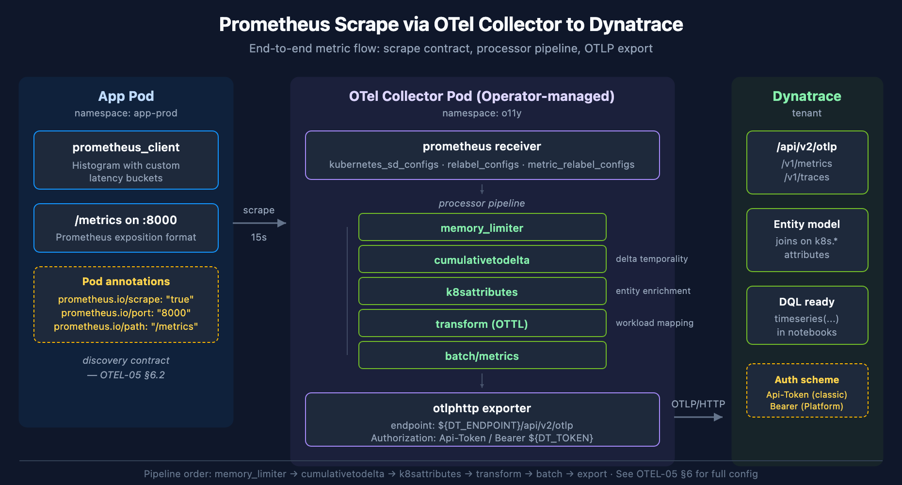

# OTEL-05: Metrics Instrumentation

> **Series:** OTEL — OpenTelemetry Integration | **Notebook:** 5 of 8 | **Created:** January 2026 | **Last Updated:** 06/29/2026

## Creating Custom Metrics with OpenTelemetry
OpenTelemetry metrics provide quantitative measurements of your application's behavior over time. This notebook covers metric types, instrumentation patterns, and integration with Dynatrace.

---

## Table of Contents

1. [Metric Types](#metric-types)
2. [Instrument Selection](#instrument-selection)
3. [Creating Metrics](#creating-metrics)
4. [Metric Attributes](#metric-attributes)
5. [Aggregation and Views](#aggregation-and-views)
6. [Prometheus Integration](#prometheus-integration)
7. [Best Practices](#best-practices)

---

## Prerequisites

| Requirement | Details |
|-------------|----------|
| **Knowledge** | OTEL-01 and OTEL-03 |
| **Environment** | Collector with metrics pipeline |

<a id="metric-types"></a>
## 1. Metric Types
### OTel Metric Instruments

| Instrument | Aggregation | Use Case | Example |
|------------|-------------|----------|----------|
| **Counter** | Sum (monotonic) | Cumulative events | Total requests |
| **UpDownCounter** | Sum (non-monotonic) | Current values | Active connections |
| **Histogram** | Distribution | Value ranges | Response time |
| **Gauge** | Last value | Current measurement | Temperature |

### Sync vs Async

| Type | When Recorded | Use Case |
|------|---------------|----------|
| **Synchronous** | On each operation | Request handling |
| **Asynchronous (Observable)** | On collection | System stats, gauges |

<a id="instrument-selection"></a>
## 2. Instrument Selection
### Decision Guide

| Question | If Yes | If No |
|----------|--------|-------|
| Value only goes up? | Counter | UpDownCounter or Histogram |
| Measuring duration/size? | Histogram | Counter or UpDownCounter |
| Current state? | Gauge | Counter or Histogram |
| Recording in request path? | Sync | Async (Observable) |

### Common Patterns

| Metric | Instrument | Why |
|--------|------------|-----|
| Request count | Counter | Monotonically increasing |
| Request duration | Histogram | Distribution needed |
| Active requests | UpDownCounter | Goes up and down |
| Queue size | ObservableGauge | Current state |
| CPU usage | ObservableGauge | Periodic measurement |

<a id="creating-metrics"></a>
## 3. Creating Metrics
### Python Examples

```python
from opentelemetry import metrics
from opentelemetry.sdk.metrics import MeterProvider
from opentelemetry.sdk.metrics.export import PeriodicExportingMetricReader
from opentelemetry.exporter.otlp.proto.grpc.metric_exporter import OTLPMetricExporter

# Setup
exporter = OTLPMetricExporter(endpoint="http://collector:4317")
reader = PeriodicExportingMetricReader(exporter, export_interval_millis=60000)
provider = MeterProvider(metric_readers=[reader])
metrics.set_meter_provider(provider)

# Get meter
meter = metrics.get_meter(__name__)

# Counter
request_counter = meter.create_counter(
    name="http.server.request.count",
    description="Total HTTP requests",
    unit="1"
)

# Histogram
request_duration = meter.create_histogram(
    name="http.server.request.duration",
    description="HTTP request duration",
    unit="ms"
)

# UpDownCounter
active_requests = meter.create_up_down_counter(
    name="http.server.active_requests",
    description="Active HTTP requests",
    unit="1"
)
```

### Using Metrics

```python
import time

def handle_request(request):
    # Increment active requests
    active_requests.add(1, {"method": request.method})
    start = time.time()
    
    try:
        response = process_request(request)
        status = response.status_code
    except Exception:
        status = 500
        raise
    finally:
        # Record duration
        duration_ms = (time.time() - start) * 1000
        request_duration.record(duration_ms, {
            "method": request.method,
            "status": str(status)
        })
        
        # Increment counter
        request_counter.add(1, {
            "method": request.method,
            "status": str(status)
        })
        
        # Decrement active requests
        active_requests.add(-1, {"method": request.method})
    
    return response
```

### Observable (Async) Metrics

```python
import psutil

# Observable gauge for CPU
def get_cpu_usage(options):
    yield metrics.Observation(psutil.cpu_percent(), {})

cpu_gauge = meter.create_observable_gauge(
    name="system.cpu.usage",
    callbacks=[get_cpu_usage],
    description="CPU usage percentage",
    unit="%"
)

# Observable counter for network bytes
last_bytes = {"sent": 0, "recv": 0}

def get_network_io(options):
    net = psutil.net_io_counters()
    yield metrics.Observation(net.bytes_sent, {"direction": "sent"})
    yield metrics.Observation(net.bytes_recv, {"direction": "recv"})

network_counter = meter.create_observable_counter(
    name="system.network.io",
    callbacks=[get_network_io],
    description="Network I/O bytes",
    unit="By"
)
```

<a id="metric-attributes"></a>
## 4. Metric Attributes
### Common Attributes

| Attribute | Example | Use |
|-----------|---------|-----|
| `http.method` | `GET`, `POST` | HTTP method breakdown |
| `http.status_code` | `200`, `500` | Response status |
| `service.name` | `checkout-api` | Service identification |
| `environment` | `production` | Environment |

### Cardinality Considerations

| High Cardinality (Avoid) | Low Cardinality (Good) |
|--------------------------|------------------------|
| User ID | Region |
| Request ID | HTTP method |
| Timestamp | Status code class |
| Full URL | Route template |

### Attribute Best Practices

```python
# Good - Low cardinality
request_counter.add(1, {
    "method": "GET",
    "route": "/api/users/{id}",  # Template, not actual ID
    "status": "2xx"  # Status class
})

# Bad - High cardinality
request_counter.add(1, {
    "user_id": "user-12345",  # Millions of values
    "url": "/api/users/12345",  # Every request different
    "timestamp": "2026-01-26T10:00:00"  # Every second different
})
```

<a id="aggregation-and-views"></a>
## 5. Aggregation and Views
### Histogram Buckets

Configure explicit bucket boundaries:

```python
from opentelemetry.sdk.metrics import MeterProvider
from opentelemetry.sdk.metrics.view import View, ExplicitBucketHistogramAggregation

# Custom histogram buckets for response times
duration_view = View(
    instrument_name="http.server.request.duration",
    aggregation=ExplicitBucketHistogramAggregation(
        boundaries=[5, 10, 25, 50, 100, 250, 500, 1000, 2500, 5000, 10000]
    )
)

provider = MeterProvider(
    metric_readers=[reader],
    views=[duration_view]
)
```

### Choosing Bucket Boundaries

The bucket boundaries decide what shape of latency distribution your histogram can describe. Pick them once — changing them later forces a metric reset and breaks dashboards built on the old layout.

**Rule of thumb:**

- 8–12 buckets, log-spaced.
- Span from `P50 / 10` to `P99 × 2` of observed latency.
- Add `+Inf` (implicit in OpenTelemetry; explicit in Prometheus client libraries).

**Two realistic patterns:**

| Workload | Buckets (seconds) | Why this shape |
|----------|-------------------|----------------|
| HTTP request latency (sub-second SLO) | `0.1, 0.2, 0.5, 1.0, 2.0, 5.0, 10.0, +Inf` | Tight resolution under 1s where the SLO lives; tail tops out at 10s |
| Long-running event processor | `0.2, 0.4, 1.0, 2.0, 4.0, 16.0, 96.0, +Inf` | Spans two orders of magnitude; coarse at the tail because operators only care whether jobs exceed 96s |

**Cardinality cost.** A histogram produces `(buckets + 2) × series` timeseries — one `_bucket{le=...}` per boundary (including `+Inf`), plus `_count` and `_sum`. A histogram with 8 buckets broken down by `method` (5 values) and `status_code` (10 values) yields `10 × 50 = 500` timeseries **per pod**. Multiply by replicas and pod count; tens of thousands of series is not unusual.

Trim labels before adding buckets. The cardinality multiplier on labels is larger than on bucket count.

### Drop Metrics via Views

```python
from opentelemetry.sdk.metrics.view import DropAggregation

# Drop noisy metrics
drop_view = View(
    instrument_name="internal.debug.*",
    aggregation=DropAggregation()
)
```

<a id="prometheus-integration"></a>
## 6. Prometheus Integration

OpenTelemetry and Prometheus both expose metrics, and an OTel Collector can bridge them in either direction:

| Direction | Pattern | When to use |
|-----------|---------|-------------|
| **Prometheus → OTLP** | Collector `prometheus` receiver scrapes app; `otlphttp` exporter sends to Dynatrace | App already exposes `/metrics`; you want it in Dynatrace without changing app code |
| **OTel SDK → Prometheus** | App uses `PrometheusMetricReader`; existing Prometheus stack scrapes it | App is OTel-instrumented but an existing Prometheus-based monitoring stack must keep working |

The first direction is the common path in Dynatrace deployments. The rest of this section walks the end-to-end pattern.

> **This section shows the single-collector pattern** — one collector scrapes a fixed set of annotated pods. It does not scale horizontally (a second replica would scrape every target again, double-counting). For thousands of targets or millions of data points per minute, use the tiered **Target Allocator** architecture in **OTEL-03 — Collector Deployment Patterns, §5 Scaling Prometheus Scraping** (scraper Deployment + gateway StatefulSet + resource-hash routing).



<!-- MARKDOWN_TABLE_ALTERNATIVE
| Stage | Component | Purpose |
|-------|-----------|---------|
| 1 | App pod | Exposes Prometheus `/metrics` on container port; carries discovery annotations |
| 2 | OTel Collector pod | Scrapes via `kubernetes_sd_configs`; runs processor pipeline |
| 3 | Processor pipeline | `memory_limiter` → `cumulativetodelta` → `k8sattributes` → `transform` → `batch` |
| 4 | otlphttp exporter | Sends OTLP/HTTP to Dynatrace tenant `/api/v2/otlp` endpoint |
For environments where SVG does not render
-->

### 6.1. Step 1: Expose Prometheus Metrics from the App

The application uses `prometheus_client` and declares histograms with explicit buckets matching the workload's latency shape (see §5 *Choosing Bucket Boundaries*):

```python
from prometheus_client import Histogram, start_http_server

# HTTP latency — sub-second SLO
request_latency = Histogram(
    "myapp_http_request_duration_seconds",
    "HTTP request duration in seconds",
    buckets=(0.1, 0.2, 0.5, 1.0, 2.0, 5.0, 10.0, float("inf"))
)

# Long-running processor — different distribution, different buckets
process_latency = Histogram(
    "myapp_event_processor_duration_seconds",
    "Event processor duration in seconds",
    buckets=(0.2, 0.4, 1.0, 2.0, 4.0, 16.0, 96.0, float("inf"))
)

# Expose /metrics on container port 8000
start_http_server(8000)
```

The exposition format produces one timeseries per bucket boundary plus `_count` and `_sum`:

```text
myapp_http_request_duration_seconds_bucket{le="0.1"} 12
myapp_http_request_duration_seconds_bucket{le="0.2"} 47
myapp_http_request_duration_seconds_bucket{le="0.5"} 113
...
myapp_http_request_duration_seconds_bucket{le="+Inf"} 130
myapp_http_request_duration_seconds_count 130
myapp_http_request_duration_seconds_sum 47.31
```

### 6.2. Step 2: Discovery Contract — Pod Annotations

Pods opt into scraping via well-known Prometheus annotations. The collector's `relabel_configs` (next step) use them to discover scrape targets:

```yaml
apiVersion: apps/v1
kind: Deployment
metadata:
  name: myapp
spec:
  template:
    metadata:
      annotations:
        prometheus.io/scrape: "true"
        prometheus.io/path:   "/metrics"
        prometheus.io/port:   "8000"
        prometheus.io/scheme: "http"
```

A pod without `prometheus.io/scrape: "true"` is invisible to the collector — annotations are the explicit opt-in.

### 6.3. Step 3: Collector Receiver with Kubernetes Service Discovery

The collector's `prometheus` receiver uses `kubernetes_sd_configs` to find pods and `relabel_configs` to convert annotations into scrape targets:

```yaml
receivers:
  prometheus:
    config:
      scrape_configs:
        - job_name: "kubernetes-pods"
          scrape_interval: 15s
          kubernetes_sd_configs:
            - role: pod
              namespaces:
                names:
                  - app-prod
                  - app-stage
          relabel_configs:
            # Keep only pods explicitly annotated for scraping
            - source_labels: [__meta_kubernetes_pod_annotation_prometheus_io_scrape]
              regex: true
              action: keep
            # Override target address with annotated port
            - source_labels: [__address__, __meta_kubernetes_pod_annotation_prometheus_io_port]
              regex: ([^:]+)(?::\d+)?;(\d+)
              replacement: $$1:$$2
              target_label: __address__
            # Override metrics path
            - source_labels: [__meta_kubernetes_pod_annotation_prometheus_io_path]
              regex: (.+)
              action: replace
              target_label: __metrics_path__
            # Drop pods that are Failed or Succeeded (not running)
            - source_labels: [__meta_kubernetes_pod_phase]
              regex: (Failed|Succeeded)
              action: drop
```

The collector needs RBAC to list pods cluster-wide — see **OTEL-03 — Collector Deployment** for the `ClusterRole` and `ClusterRoleBinding` shape.

### 6.4. Step 4: Cardinality Control via metric_relabel_configs

A pod-discovery scrape will collect every `_bucket`, `_count`, `_sum`, and platform metric on the target. Without filtering, an OTel-instrumented Python app can produce thousands of unique series per replica. `metric_relabel_configs` runs **after** scrape and **before** the pipeline, so it is the cheapest place to drop noise:

```yaml
metric_relabel_configs:
  # Keep only metric families this collector cares about
  - source_labels: [__name__]
    regex: (myapp_.*|webservice_.*|process_.+|go_.+|jvm_.+|http_server_requests_.+|up)
    action: keep
  # Keep only labels that downstream queries actually use
  - regex: (le|method|status_code|route|pod|namespace|cluster|service_name)
    action: labelkeep
```

The keep-list is a deliberate allow-list — easier to extend than to chase down new noisy series later. Match against `__name__` first (cheapest), then narrow labels.

### 6.5. Step 5: Full Pipeline

The processor pipeline shapes scraped Prometheus data for Dynatrace ingest. Order matters: `memory_limiter` first protects the collector under load; `batch` last reduces network round-trips:

```yaml
processors:
  memory_limiter:
    check_interval: 1s
    limit_percentage: 75
    spike_limit_percentage: 15

  cumulativetodelta:
    max_staleness: 3m

  k8sattributes:
    extract:
      metadata:
        - k8s.pod.name
        - k8s.namespace.name
        - k8s.deployment.name
        - k8s.node.name
        - k8s.cluster.uid
        - k8s.container.name
    pod_association:
      - sources:
          - from: resource_attribute
            name: k8s.pod.ip

  transform:
    metric_statements:
      - context: resource
        statements:
          - set(attributes["k8s.workload.name"], attributes["k8s.deployment.name"]) where IsString(attributes["k8s.deployment.name"])
          - set(attributes["k8s.workload.kind"], "deployment") where IsString(attributes["k8s.deployment.name"])

  batch/metrics:
    send_batch_max_size: 5000
    send_batch_size: 500
    timeout: 10s

exporters:
  otlphttp:
    endpoint: ${env:DT_ENDPOINT}
    headers:
      Authorization: Api-Token ${env:DT_API_TOKEN}

service:
  pipelines:
    metrics:
      receivers: [prometheus]
      processors: [memory_limiter, cumulativetodelta, k8sattributes, transform, batch/metrics]
      exporters: [otlphttp]
```

**Why each processor matters:**

| Processor | Purpose |
|-----------|---------|
| `memory_limiter` | Sheds load before the collector OOMs. First in the pipeline. |
| `cumulativetodelta` | Prometheus emits cumulative counters; Dynatrace prefers delta temporality. Without this, every counter looks ever-increasing in Dynatrace and rate math is awkward at query time. |
| `k8sattributes` | Enriches each metric with pod / deployment / namespace / node so Dynatrace's entity model can join the data. |
| `transform` | Normalizes workload metadata — `k8s.workload.{name,kind,uid}` are derived from whichever workload kind (deployment / statefulset / daemonset / etc.) owns the pod. |
| `batch/metrics` | Reduces export overhead. `send_batch_size: 500` keeps batches small enough for OTLP/HTTP without hitting tenant-side payload limits. |

The `otlphttp` exporter posts to `https://<tenant>.live.dynatrace.com/api/v2/otlp/v1/metrics`. The `Api-Token` auth scheme is for classic API Tokens (prefix `dt0c01.*`); Platform Tokens use `Bearer ${TOKEN}` instead. See **OTEL-07 — Dynatrace Integration** for the full token / endpoint / scope matrix.

### 6.6. Operator-Managed vs Raw Deployment

The collector itself can be deployed two ways:

| Deployment style | Spec kind | What you write | What manages the collector |
|------------------|-----------|----------------|----------------------------|
| **Raw** | `Deployment` + `ConfigMap` | Container image + collector YAML in a ConfigMap | You — manual rollout, RBAC, lifecycle |
| **Operator-managed** | `OpenTelemetryCollector` (CRD) | Collector config inline in the custom resource | The OpenTelemetry Operator reconciles Deployment, ConfigMap, ServiceAccount, RBAC bindings |

The operator-managed pattern is cleaner once you have more than one collector — it owns rollout, auto-restart on config change, and OTLP-auto-instrumentation injection for application pods. The trade-off is one more controller in the cluster.

See **OTEL-03 — Collector Deployment** for both deployment shapes side-by-side.

### 6.7. The Reverse Direction: Exposing OTel Metrics as Prometheus

If an existing Prometheus stack must continue scraping the application, the OTel SDK can expose itself as a Prometheus endpoint instead of pushing OTLP:

```python
from opentelemetry.exporter.prometheus import PrometheusMetricReader
from prometheus_client import start_http_server

# Start Prometheus endpoint
start_http_server(8080)

# Use Prometheus reader
reader = PrometheusMetricReader()
provider = MeterProvider(metric_readers=[reader])
```

This path is rarer in greenfield Dynatrace deployments — it preserves the Prometheus scrape contract at the cost of duplicating the metric pipeline.

> <sub>**Sources:**</sub>
> - <sub>[Prometheus Receiver (OpenTelemetry Collector Contrib GitHub)](https://github.com/open-telemetry/opentelemetry-collector-contrib/tree/main/receiver/prometheusreceiver)</sub>
> - <sub>[k8sattributes processor (OpenTelemetry Collector Contrib GitHub)](https://github.com/open-telemetry/opentelemetry-collector-contrib/tree/main/processor/k8sattributesprocessor)</sub>
> - <sub>[Cumulative to Delta processor (OpenTelemetry Collector Contrib GitHub)](https://github.com/open-telemetry/opentelemetry-collector-contrib/tree/main/processor/cumulativetodeltaprocessor)</sub>
> - <sub>[Ingest OTLP metrics (DT docs)](https://docs.dynatrace.com/docs/ingest-from/opentelemetry/otlp-api/ingest-otlp-metrics)</sub>
> - <sub>**Derived:** §6.6 raw-vs-operator framing combines OTel Operator design with operational trade-offs observed in community examples</sub>

```dql
// Query OTel metrics in Dynatrace
timeseries avg(http.server.request.duration), from:-1h, by:{http.method}
| limit 10
```

```dql
// Request rate by status
timeseries rate = sum(http.server.request.count), from:-1h, by:{http.status_code}
| limit 10
```

<a id="best-practices"></a>
## 7. Best Practices
### Naming Conventions

| Pattern | Example | Description |
|---------|---------|-------------|
| `<domain>.<component>.<metric>` | `http.server.request.count` | Hierarchical naming |
| Use lowercase | `request_count` not `RequestCount` | Consistency |
| Include units | `duration_ms`, `size_bytes` | Clarity |

### Performance Tips

| Tip | Reason |
|-----|--------|
| Limit attribute cardinality | Memory, query performance |
| Use appropriate export interval | Balance freshness vs. load |
| Batch metrics | Reduce network calls |
| Use observable for system stats | Avoid polling in hot path |

### What to Measure

| Category | Metrics |
|----------|----------|
| **RED** | Rate, Errors, Duration (for services) |
| **USE** | Utilization, Saturation, Errors (for resources) |
| **Business** | Revenue, conversions, user actions |

---

## Summary

In this notebook, you learned:

- Metric types: Counter, UpDownCounter, Histogram, Gauge
- Sync vs async instruments
- Creating and recording metrics
- Attribute best practices and cardinality
- Views and aggregation configuration
- Prometheus integration patterns

---

## References

- [OTel Metrics Specification](https://opentelemetry.io/docs/specs/otel/metrics/)
- [OTel Python Metrics](https://opentelemetry.io/docs/instrumentation/python/manual/#metrics)
- [Dynatrace OTLP Metrics Ingest](https://docs.dynatrace.com/docs/ingest-from/opentelemetry/otlp-api/ingest-otlp-metrics)
- [Configure OTLP Metrics](https://docs.dynatrace.com/docs/ingest-from/opentelemetry/otlp-api/ingest-otlp-metrics/configure-otlp-metrics)

---

<sub>*This notebook was AI-generated from community-submitted and publicly available sources. This notebook series is not officially supported by Dynatrace. Always verify information against official Dynatrace documentation.*</sub>
