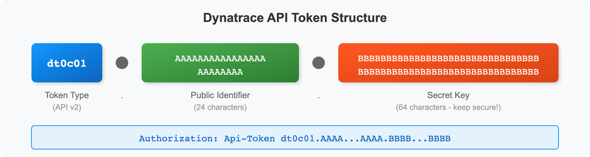

# Dynatrace OTLP Integration

> **Series:** OTEL | **Notebook:** 7 of 8 | **Created:** January 2026 | **Last Updated:** 02/09/2026

## Complete Setup for OpenTelemetry with Dynatrace
This notebook provides end-to-end configuration for sending OpenTelemetry data to Dynatrace, including authentication, endpoints, and verification.

---

## Table of Contents

1. [Dynatrace OTLP Endpoints](#dynatrace-otlp-endpoints)
2. [Authentication Setup](#authentication-setup)
3. [Collector Configuration](#collector-configuration)
4. [Direct SDK Export](#direct-sdk-export)
5. [Entity Mapping](#entity-mapping)
6. [Span Attributes for Dynatrace](#span-attributes-for-dynatrace)
7. [OTLP Metric Dimensions](#otlp-metric-dimensions)
8. [Verification](#verification)
9. [Hybrid with OneAgent](#hybrid-with-oneagent)

---

## Prerequisites

| Requirement | Details |
|-------------|----------|
| **Dynatrace Environment** | SaaS or Managed with OTLP enabled |
| **Permissions** | Token creation access |
| **Knowledge** | OTEL-01 through OTEL-06 |

<a id="dynatrace-otlp-endpoints"></a>
## 1. Dynatrace OTLP Endpoints
### SaaS Endpoints

Dynatrace supports **OTLP/HTTP only** for native ingest. gRPC is not supported for direct ingest — use a Collector to convert gRPC to HTTP.

| Signal | HTTP Endpoint |
|--------|---------------|
| All (base) | `https://{env-id}.live.dynatrace.com/api/v2/otlp` |
| Traces | `https://{env-id}.live.dynatrace.com/api/v2/otlp/v1/traces` |
| Metrics | `https://{env-id}.live.dynatrace.com/api/v2/otlp/v1/metrics` |
| Logs | `https://{env-id}.live.dynatrace.com/api/v2/otlp/v1/logs` |

> **Important:** gRPC is **not supported** for direct Dynatrace ingest. If your SDKs use gRPC, route through a Collector with an `otlp` gRPC receiver and `otlphttp` exporter. See [Transform OTLP gRPC](https://docs.dynatrace.com/docs/ingest-from/opentelemetry/collector/use-cases/grpc).

### ActiveGate Endpoints

For on-premises or network-restricted environments:

| Signal | Endpoint |
|--------|----------|
| All | `https://{activegate-host}:9999/e/{env-id}/api/v2/otlp` |

### Dynatrace Collector Distribution

Dynatrace provides its own **Collector distribution** with verified, production-ready components:

| Aspect | Detail |
|--------|--------|
| Image | `ghcr.io/dynatrace/dynatrace-otel-collector/dynatrace-otel-collector` |
| Features | Pre-configured for Dynatrace, upstream-compatible, monthly releases |
| Docs | [Dynatrace Collector](https://docs.dynatrace.com/docs/ingest-from/opentelemetry/collector) |

> **Tip:** The Dynatrace Collector distribution is recommended for production deployments. It includes verified components and stays current with upstream releases.

### Environment ID

Find your environment ID:
1. Log into Dynatrace
2. Look at the URL: `https://abc12345.live.dynatrace.com`
3. `abc12345` is your environment ID

<a id="authentication-setup"></a>
## 2. Authentication Setup
### Create API Token

1. Navigate to **Settings > Access tokens**
2. Click **Generate new token**
3. Name: `otel-ingest-token`
4. Select scopes:

| Scope | Signal | Required |
|-------|--------|----------|
| `openTelemetryTrace.ingest` | Traces | Yes (for traces) |
| `metrics.ingest` | Metrics | Yes (for metrics) |
| `logs.ingest` | Logs | Yes (for logs) |
| `events.ingest` | Events | Optional |

### Token Format



<!-- MARKDOWN_TABLE_ALTERNATIVE
| Part | Description | Length |
|------|-------------|--------|
| Prefix | Token type identifier (e.g., dt0c01 for API v2) | 6 chars |
| Public ID | Token identifier (safe to log) | 24 chars |
| Secret | Secret key (keep secure!) | 64 chars |
Parts are separated by dots (.)
For environments where SVG doesn't render
-->

### Header Format

Use the `Api-Token` prefix in the Authorization header:

```
Authorization: Api-Token <your-full-token>
```

<a id="collector-configuration"></a>
## 3. Collector Configuration
### Image Versioning Best Practice

> **Important:** Always pin your OTel Collector image to a specific version. Using `latest` can cause unexpected behavior during upgrades.

```yaml
# Avoid - Non-deterministic deployments
image: otel/opentelemetry-collector-contrib:latest

# Recommended - Pin to a specific version
image: otel/opentelemetry-collector-contrib:0.120.0

# Or use the Dynatrace distribution
image: ghcr.io/dynatrace/dynatrace-otel-collector/dynatrace-otel-collector:latest
```

Check the [OpenTelemetry Collector releases](https://github.com/open-telemetry/opentelemetry-collector-releases/releases) or [Dynatrace Collector releases](https://github.com/Dynatrace/dynatrace-otel-collector/releases) for the current stable version.

### Complete Collector Config for Dynatrace

```yaml
# otel-collector-config.yaml
receivers:
  otlp:
    protocols:
      grpc:
        endpoint: 0.0.0.0:4317
      http:
        endpoint: 0.0.0.0:4318

processors:
  batch:
    timeout: 10s
    send_batch_size: 1000
  
  memory_limiter:
    check_interval: 1s
    limit_mib: 800
    spike_limit_mib: 200

  # Add service.name if missing
  resource:
    attributes:
      - key: service.name
        value: "unknown-service"
        action: insert

exporters:
  otlphttp/dynatrace:
    endpoint: https://${DT_ENV_ID}.live.dynatrace.com/api/v2/otlp
    headers:
      Authorization: Api-Token ${DT_API_TOKEN}
    retry_on_failure:
      enabled: true
      initial_interval: 5s
      max_interval: 30s
      max_elapsed_time: 300s

  debug:
    verbosity: detailed

extensions:
  health_check:
    endpoint: 0.0.0.0:13133

service:
  extensions: [health_check]
  pipelines:
    traces:
      receivers: [otlp]
      processors: [memory_limiter, resource, batch]
      exporters: [otlphttp/dynatrace]
    metrics:
      receivers: [otlp]
      processors: [memory_limiter, resource, batch]
      exporters: [otlphttp/dynatrace]
    logs:
      receivers: [otlp]
      processors: [memory_limiter, resource, batch]
      exporters: [otlphttp/dynatrace]
```

### Resource Sizing Guide

| Environment | CPU Limit | Memory Limit | Batch Size |
|-------------|-----------|--------------|------------|
| Dev/Test | 200m | 256Mi | 500 |
| Staging | 500m | 512Mi | 1000 |
| Production | 1000m | 1Gi | 2000 |

### Running with Environment Variables

```bash
export DT_ENV_ID="abc12345"
export DT_API_TOKEN="<your-api-token>"

otelcol-contrib --config otel-collector-config.yaml
```

<a id="direct-sdk-export"></a>
## 4. Direct SDK Export
### Python Direct to Dynatrace

```python
import os
from opentelemetry import trace
from opentelemetry.sdk.trace import TracerProvider
from opentelemetry.sdk.trace.export import BatchSpanProcessor
from opentelemetry.exporter.otlp.proto.http.trace_exporter import OTLPSpanExporter
from opentelemetry.sdk.resources import Resource

# Configuration
DT_ENV_ID = os.environ["DT_ENV_ID"]
DT_API_TOKEN = os.environ["DT_API_TOKEN"]

# Resource with service name
resource = Resource.create({
    "service.name": "my-python-app",
    "service.version": "1.0.0",
    "deployment.environment": "production"
})

# Setup tracer
provider = TracerProvider(resource=resource)
exporter = OTLPSpanExporter(
    endpoint=f"https://{DT_ENV_ID}.live.dynatrace.com/api/v2/otlp/v1/traces",
    headers={"Authorization": f"Api-Token {DT_API_TOKEN}"}
)
provider.add_span_processor(BatchSpanProcessor(exporter))
trace.set_tracer_provider(provider)
```

### Java with System Properties

```bash
# Set environment variables first
export DT_ENV_ID="abc12345"
export DT_API_TOKEN="<your-api-token>"

# URL-encode the token for the header (space becomes %20)
java -javaagent:opentelemetry-javaagent.jar \
  -Dotel.service.name=my-java-app \
  -Dotel.exporter.otlp.endpoint=https://${DT_ENV_ID}.live.dynatrace.com/api/v2/otlp \
  -Dotel.exporter.otlp.headers="Authorization=Api-Token%20${DT_API_TOKEN}" \
  -jar app.jar
```

### Node.js

```javascript
const { NodeSDK } = require('@opentelemetry/sdk-node');
const { OTLPTraceExporter } = require('@opentelemetry/exporter-trace-otlp-http');
const { Resource } = require('@opentelemetry/resources');

const sdk = new NodeSDK({
  resource: new Resource({
    'service.name': 'my-node-app',
  }),
  traceExporter: new OTLPTraceExporter({
    url: `https://${process.env.DT_ENV_ID}.live.dynatrace.com/api/v2/otlp/v1/traces`,
    headers: {
      'Authorization': `Api-Token ${process.env.DT_API_TOKEN}`,
    },
  }),
});

sdk.start();
```

<a id="entity-mapping"></a>
## 5. Entity Mapping
### How Dynatrace Maps OTel Data

| OTel Resource Attribute | Dynatrace Entity | Notes |
|-------------------------|------------------|-------|
| `service.name` | Service | Required for service detection |
| `service.namespace` | Service group | Optional grouping |
| `host.name` | Host | Links to host entity |
| `k8s.namespace.name` | K8s namespace | Links to K8s entities |
| `k8s.pod.name` | Process group | Links to pod |

### Essential Resource Attributes

Always set these for proper entity mapping:

```python
resource = Resource.create({
    # Required
    "service.name": "checkout-api",
    
    # Recommended
    "service.version": "1.2.3",
    "service.namespace": "ecommerce",
    "deployment.environment": "production",
    
    # For K8s
    "k8s.namespace.name": "checkout",
    "k8s.pod.name": "checkout-api-abc123",
    "k8s.deployment.name": "checkout-api",
})
```

<a id="span-attributes-for-dynatrace"></a>
## 6. Span Attributes for Dynatrace
### Dynatrace-Specific Attributes

| Attribute | Purpose | Example |
|-----------|---------|----------|
| `dt.entity.process_group_instance` | Link to PGI | `PROCESS_GROUP_INSTANCE-XXX` |
| `dt.span.type` | Override span type | `DATABASE`, `MESSAGING` |
| `dt.source` | Data source | `opentelemetry` |

### Semantic Conventions Dynatrace Uses

| Convention | Dynatrace Feature |
|------------|-------------------|
| `http.*` | HTTP service detection |
| `db.*` | Database call analysis |
| `messaging.*` | Message queue tracking |
| `rpc.*` | RPC call tracking |

### Example with Rich Attributes

```python
with tracer.start_as_current_span("checkout") as span:
    # Standard semantic conventions
    span.set_attribute("http.method", "POST")
    span.set_attribute("http.url", "https://api.example.com/checkout")
    span.set_attribute("http.status_code", 200)
    span.set_attribute("http.route", "/checkout")
    
    # Business context
    span.set_attribute("order.id", order_id)
    span.set_attribute("order.total", order_total)
```

<a id="otlp-metric-dimensions"></a>
## 7. OTLP Metric Dimensions

### Advanced OTLP Metric Dimensions (January 2026)

Dynatrace introduced an opt-in setting for **advanced OTLP metric dimensions**:

| Feature | Details |
|---------|---------|
| **Primary Grail Fields** | Metrics can carry Primary Grail Fields as dimensions |
| **Higher Cardinality** | Increased cardinality limits for metric dimensions |
| **Faster Queries** | Performance improvements for high-cardinality metrics |
| **Special Characters** | Dimension names can include slashes and other special characters |

> **Warning:** After enabling advanced OTLP metric dimensions, OTLP metrics will **no longer** be automatically enriched with the `dt.entity.service` dimension. If you use `dt.entity.service` in SLOs, alerts, or dashboards, update your queries to filter using the underlying attributes (e.g., `service.name`) instead.

### Scope Attributes as Dimensions

When **Add Meter name and version as metric dimensions** is enabled:
- `otel.scope.name` (instrumentation library/scope name)
- `otel.scope.version` (instrumentation library/scope version)

These are automatically added as dimensions to ingested OTLP metrics.

### OTLP Auto-Configuration for Kubernetes

Dynatrace Operator (v1.8+) supports **automatic OTLP exporter configuration** for K8s workloads:

| Feature | Details |
|---------|---------|
| **Auto-injection** | Environment variables injected into application pods at startup |
| **Routing** | Traffic routes through in-cluster ActiveGate if available |
| **Control** | Per-pod opt-in/out via `otlp-exporter-configuration.dynatrace.com/inject` annotation |
| **Docs** | [OTLP Auto-Config](https://docs.dynatrace.com/docs/ingest-from/setup-on-k8s/extend-observability-k8s/otlp-auto-config) |

For more details, see [Configure OTLP Metrics Ingestion](https://docs.dynatrace.com/docs/ingest-from/opentelemetry/otlp-api/ingest-otlp-metrics/configure-otlp-metrics).

```dql
// Verify OTel traces are arriving
fetch spans, from:-1h
| filter isNotNull(otel.library.name)
| summarize count = count(), by:{service.name, otel.library.name}
| sort count desc
| limit 20
```

```dql
// Check recent OTel spans
fetch spans, from: now() - 1h
| filter isNotNull(otel.library.name)
| fields timestamp, service.name, span.name, duration
| sort timestamp desc
| limit 30
```

```dql
// View OTel data by instrumentation scope
fetch spans, from:-1h
| filter isNotNull(otel.scope.name)
| summarize count = count(), by:{otel.scope.name}
| sort count desc
| limit 10
```

<a id="verification"></a>
## 8. Verification
### Verify Data in Dynatrace

1. **Services**: Go to **Services** - OTel services appear with OTel icon
2. **Traces**: Go to **Distributed Traces** - Filter by service
3. **Metrics**: Go to **Metrics** - Search for custom metric names
4. **Logs**: Go to **Logs & Events** - Filter by trace_id

### Troubleshooting Checklist

| Check | How |
|-------|-----|
| Token scopes | Settings > Access tokens |
| Collector logs | `otelcol-contrib --config config.yaml` |
| Network connectivity | `curl -v https://{env}.live.dynatrace.com/api/v2/otlp` |
| service.name set | Check resource attributes |

### Common Issues

| Issue | Cause | Fix |
|-------|-------|-----|
| 401 Unauthorized | Invalid token | Check token, regenerate |
| 403 Forbidden | Missing scope | Add required scopes |
| No data | service.name missing | Add resource attribute |
| Partial data | Network timeout | Check batch size, retry config |

<a id="hybrid-with-oneagent"></a>
## 9. Hybrid with OneAgent
### Using OTel + OneAgent

| Scenario | Recommendation |
|----------|----------------|
| OneAgent-supported tech | Let OneAgent auto-instrument |
| Custom spans needed | Add OTel manual spans |
| Serverless | Use OTel (no agent) |
| Unsupported language | Use OTel SDK |

### Trace Context Propagation

OneAgent and OTel both support W3C Trace Context, enabling unified traces:

```
Service A (OneAgent) → Service B (OTel) → Service C (OneAgent)
                 ↓                  ↓
            Dynatrace traces show complete path
```

### Configuration for Hybrid

Ensure both use W3C propagation:

```python
# Python OTel
from opentelemetry.propagate import set_global_textmap
from opentelemetry.propagators.composite import CompositePropagator
from opentelemetry.propagators.w3c.traceparent import W3CTraceparentPropagator
from opentelemetry.propagators.w3c.tracestate import W3CTracestatePropagator

set_global_textmap(CompositePropagator([
    W3CTraceparentPropagator(),
    W3CTracestatePropagator()
]))
```

---

## Summary

In this notebook, you learned:

- Dynatrace OTLP endpoints (HTTP only — gRPC requires Collector)
- Dynatrace OTel Collector distribution for production deployments
- API token creation with required scopes
- Complete Collector configuration
- Direct SDK export configuration
- Entity mapping and resource attributes
- Span attributes that enhance Dynatrace analysis
- OTLP metric dimensions changes and auto-configuration
- Verification and troubleshooting
- Hybrid deployment with OneAgent

---

## References

- [Dynatrace OpenTelemetry](https://docs.dynatrace.com/docs/ingest-from/opentelemetry)
- [OTLP API Endpoints](https://docs.dynatrace.com/docs/ingest-from/opentelemetry/otlp-api)
- [Dynatrace Collector](https://docs.dynatrace.com/docs/ingest-from/opentelemetry/collector)
- [Configure OTLP Metrics](https://docs.dynatrace.com/docs/ingest-from/opentelemetry/otlp-api/ingest-otlp-metrics/configure-otlp-metrics)
- [OTLP Auto-Config for K8s](https://docs.dynatrace.com/docs/ingest-from/setup-on-k8s/extend-observability-k8s/otlp-auto-config)
- [Ensure Success with OTel](https://docs.dynatrace.com/docs/ingest-from/opentelemetry/troubleshooting)

---

<sub>*This notebook was AI-generated from community-submitted and publicly available sources. This notebook series is not officially supported by Dynatrace. Always verify information against official Dynatrace documentation.*</sub>
