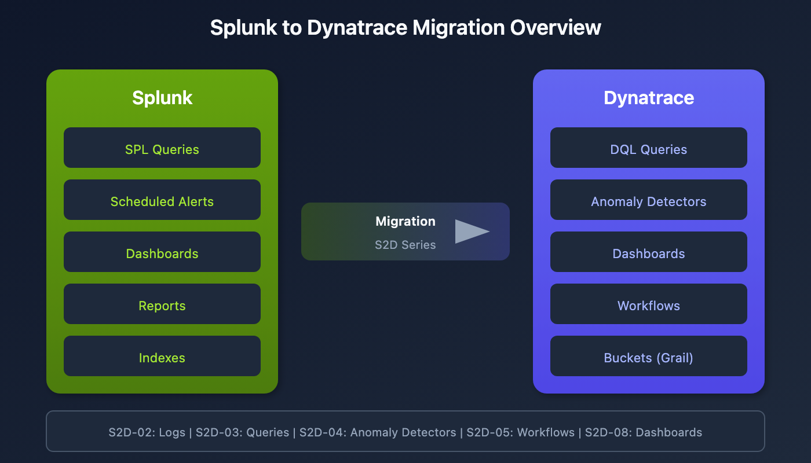

# S2D-01: Splunk to Dynatrace Migration - Getting Started

> **Series:** S2D — Splunk to Dynatrace Migration | **Notebook:** 1 of 9 | **Created:** January 2026 | **Last Updated:** 01/30/2026

## Overview

This notebook series provides comprehensive guidance for migrating monitoring capabilities from Splunk to Dynatrace. Whether you're moving dashboards, alerts, reports, or log queries, these notebooks will help you understand the key differences between platforms and make informed translation decisions.



<!-- MARKDOWN_TABLE_ALTERNATIVE
| Source | Target | Coverage |
|---|--------|----------|
| Splunk Queries | DQL Queries | S2D-03 |
| Splunk Alerts | Anomaly Detectors | S2D-04 |
| Splunk Alerts | Workflows | S2D-05 |
| Splunk Dashboards | Dynatrace Dashboards | S2D-08 |
| Splunk Indexes | Dynatrace Buckets | S2D-02 |
For environments where SVG doesn't render
-->

---

## Table of Contents

1. [Key Platform Differences](#key-platform-differences)
2. [Migration Planning](#migration-planning)
3. [Series Roadmap](#series-roadmap)
4. [Quick Start: Verify Your First Log Source](#quick-start-verify-your-first-log-source)

---

## Prerequisites

| Requirement | Details |
|-------------|----------|
| **Dynatrace Environment** | SaaS with Grail enabled |
| **Permissions** | `logs.read`, `settings.read` |
| **Splunk Access** | Ability to view existing queries, alerts, dashboards |
| **Knowledge** | Basic familiarity with both Splunk SPL and Dynatrace DQL |

## Learning Objectives

By the end of this series, you will be able to:

1. Validate that required log data is available in Dynatrace
2. Translate SPL queries to DQL
3. Migrate Splunk alerts to Anomaly Detectors or Workflows
4. Convert Splunk dashboards to Dynatrace format
5. Apply consistent naming standards to migrated assets
6. Request metric extraction for performance-critical queries

<a id="key-platform-differences"></a>
## Key Platform Differences
Understanding the fundamental differences between Splunk and Dynatrace is critical for a successful migration.

### Data Model

| Aspect | Splunk | Dynatrace |
|--------|--------|------------|
| **Storage** | Indexes | Buckets (Grail) |
| **Query Language** | SPL (Search Processing Language) | DQL (Dynatrace Query Language) |
| **Data Types** | Events (logs) | Logs, Metrics, Traces, Events, Entities |
| **Schema** | Schema-on-read | Schema-on-read with semantic model |
| **Retention** | Index-based | Bucket-based with tiered storage |

### Alerting Model

| Aspect | Splunk | Dynatrace |
|--------|--------|------------|
| **Execution** | Scheduled queries | Continuous monitoring |
| **Frequency** | User-defined schedule | Every minute |
| **Evaluation** | Single point-in-time | Sliding window |
| **Threshold** | Total over period | Per-minute samples |
| **Intelligence** | Rule-based | Dynatrace Intelligence powered |

<a id="migration-planning"></a>
## Migration Planning
A successful migration follows this general sequence:

### Phase 1: Discovery

1. **Inventory existing assets** - Document all dashboards, alerts, reports, and saved searches
2. **Identify data sources** - Map log sources to hosts, clusters, or namespaces
3. **Prioritize by criticality** - Focus on production monitoring first

### Phase 2: Data Validation

1. **Verify log ingestion** - Confirm logs are flowing into Dynatrace
2. **Check field mappings** - Ensure required fields are available
3. **Configure ingest rules** - Add any missing log sources

### Phase 3: Query Translation

1. **Convert SPL to DQL** - Translate query syntax
2. **Validate results** - Compare output with Splunk
3. **Optimize performance** - Apply DQL best practices

### Phase 4: Alert Migration

1. **Choose alert type** - Anomaly Detector or Workflow
2. **Translate thresholds** - Apply conversion formula
3. **Configure notifications** - Set up alerting profiles

### Phase 5: Dashboard Migration

1. **Recreate visualizations** - Build equivalent charts
2. **Apply filters** - Configure time and segment filters
3. **Validate accuracy** - Compare with Splunk dashboards

<a id="series-roadmap"></a>
## Series Roadmap
| Notebook | Topic | Description |
|----------|-------|-------------|
| **S2D-01** | Getting Started | This notebook - overview and planning |
| **S2D-02** | Locating Logs | Validating log data availability |
| **S2D-03** | SPL to DQL | Query translation fundamentals |
| **S2D-04** | Anomaly Detectors | Translating alerts to continuous monitoring |
| **S2D-05** | Workflow Alerts | When and how to use workflow-based alerting |
| **S2D-06** | ArrayMovingSum | Handling extended timeframes (>1 hour) |
| **S2D-07** | Metric Creation | Creating log metrics via OpenPipeline |
| **S2D-08** | Dashboard Migration | Converting Splunk dashboards |
| **S2D-09** | Naming Standards | Organization and naming conventions |

<a id="quick-start-verify-your-first-log-source"></a>
## Quick Start: Verify Your First Log Source
Before diving deeper, let's verify that logs are available in Dynatrace. This query shows log sources and their record counts.

```dql
// View available log sources and counts
fetch logs, from:-1h
| summarize count = count(), by:{log.source}
| sort count desc
| limit 20
```

Check logs by host name to match Splunk source mapping.

```dql
// View log counts by host
fetch logs, from:-1h
| summarize count = count(), by:{host.name}
| sort count desc
| limit 20
```

For Kubernetes workloads, check by cluster and namespace.

```dql
// View log counts by Kubernetes attributes
fetch logs, from:-1h
| filter isNotNull(k8s.cluster.name)
| summarize count = count(), by:{k8s.cluster.name, k8s.namespace.name}
| sort count desc
| limit 20
```

## Next Steps

Continue to **S2D-02: Locating Logs in Dynatrace** to learn the complete process for validating log data availability before beginning your migration.

## References

- [Dynatrace DQL Reference](https://docs.dynatrace.com/docs/shortlink/dql-reference)
- [Anomaly Detectors](https://docs.dynatrace.com/docs/shortlink/davis-anomaly-detectors)
- [Dynatrace Workflows](https://docs.dynatrace.com/docs/shortlink/workflows)
- [Log Management](https://docs.dynatrace.com/docs/shortlink/log-management)

---

<sub>*This notebook was AI-generated from community-submitted and publicly available sources. This notebook series is not officially supported by Dynatrace. Always verify information against official Dynatrace documentation.*</sub>
