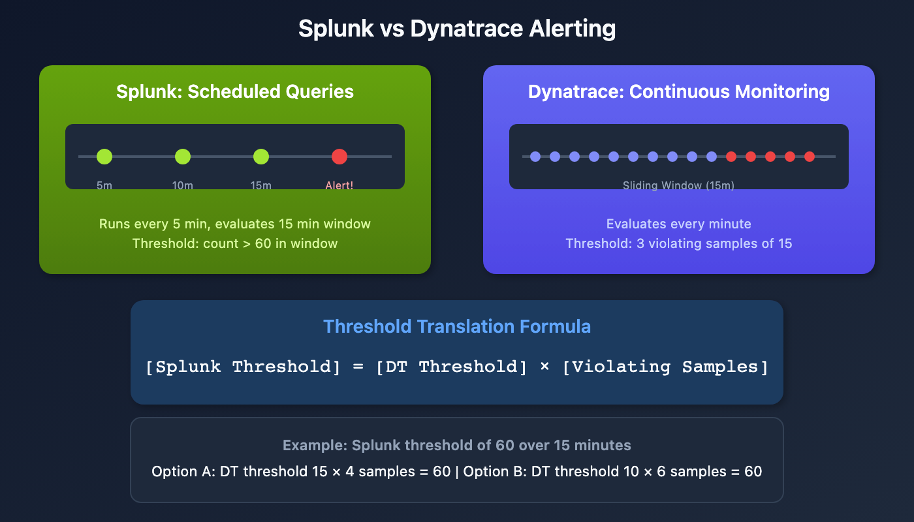

# S2D-04: Alert Migration - Anomaly Detectors

> **Series:** S2D | **Notebook:** 4 of 9 | **Created:** January 2026 | **Last Updated:** 01/30/2026

## Overview

This notebook explains how to translate Splunk alert conditions into Dynatrace Anomaly Detectors. Understanding the fundamental differences between scheduled queries and continuous monitoring is essential for successful alert migration.



<!-- MARKDOWN_TABLE_ALTERNATIVE
| Aspect | Splunk | Dynatrace |
|---|--------|------------|
| Execution | Scheduled | Continuous (every minute) |
| Evaluation | Single point-in-time | Sliding window |
| Threshold | Total over period | Per-minute with samples |
For environments where SVG doesn't render
-->

---

## Table of Contents

1. [Splunk vs Dynatrace Alerting](#splunk-vs-dynatrace-alerting)
2. [The Sliding Window Concept](#the-sliding-window-concept)
3. [Threshold Translation Formula](#threshold-translation-formula)
4. [Migration Strategies](#migration-strategies)
5. [Concept Mapping](#concept-mapping)
6. [Creating a Anomaly Detector](#creating-a-davis-anomaly-detector)
7. [Migration Decision Tree](#migration-decision-tree)
8. [Validation Query](#validation-query)

---

## Prerequisites

| Requirement | Details |
|-------------|----------|
| **Dynatrace Environment** | SaaS with Grail enabled |
| **Permissions** | `logs.read`, `settings.write` |
| **Knowledge** | Understanding of source Splunk alert logic |

## Learning Objectives

By the end of this notebook, you will be able to:

1. Explain the difference between Splunk scheduled alerts and Anomaly Detectors
2. Apply the threshold translation formula
3. Choose the appropriate migration strategy for different alert types
4. Configure Anomaly Detector parameters correctly

<a id="splunk-vs-dynatrace-alerting"></a>
## Splunk vs Dynatrace Alerting
### Splunk Alerting Model

In Splunk, alerts are **scheduled queries** that:
- Run at defined intervals (e.g., every 5 minutes)
- Evaluate a query over a timeframe (e.g., last 15 minutes)
- Trigger when results exceed a threshold (e.g., count > 10)
- Apply suppression to prevent repeated alerts

### Dynatrace Alerting Model

Anomaly Detectors provide **continuous monitoring** that:
- Evaluate every minute (1-minute granularity)
- Use a sliding window approach
- Require multiple violating samples to trigger
- Require dealerting samples to close

### Key Parameters

| Parameter | Description | Maximum |
|-----------|-------------|----------|
| **Threshold** | Value triggering a violation | Unlimited |
| **Sliding Window** | Time range evaluated | 60 minutes |
| **Violating Samples** | Minutes above threshold to alert | 60 |
| **Dealerting Samples** | Minutes below threshold to close | 60 |

<a id="the-sliding-window-concept"></a>
## The Sliding Window Concept
Anomaly Detectors continuously evaluate metrics using a sliding window.

**Example Configuration:**
- Metric: Error Log Count
- Threshold: 5 errors/minute
- Sliding Window: 15 minutes
- Violating Samples: 3
- Dealerting Samples: 5

**Behavior:**
1. Every minute, the detector checks if error count > 5
2. If 3 of the last 15 minutes exceed the threshold → Alert opens
3. Alert stays open until 5 consecutive minutes are below threshold

<a id="threshold-translation-formula"></a>
## Threshold Translation Formula
The key insight for translation is that both platforms should require roughly the same number of events to trigger:

```
[Splunk Threshold] = [Dynatrace Threshold] × [Dynatrace Violating Samples]
```

### Example Translation

**Splunk Alert:**
- Runs every 5 minutes
- Timeframe: last 15 minutes
- Threshold: 60 error logs
- Suppress: 15 minutes

**Dynatrace Options (all satisfy 60 total errors):**

| Option | DT Threshold | Violating Samples | Product |
|--------|--------------|-------------------|----------|
| A | 15 | 4 | 60 |
| B | 10 | 6 | 60 |
| C | 30 | 2 | 60 |
| D | 20 | 3 | 60 |

<a id="migration-strategies"></a>
## Migration Strategies
### Option 1: Alert Reimagined (Recommended)

**Strategy:** Calculate new threshold and violating samples to most closely replicate Splunk behavior.

**Parameters:**
- Threshold: 3
- Sliding Window: 15
- Violating Samples: 2 (triggers at 6 total errors spread across 2 minutes)
- Dealerting Samples: 15

**Pros:**
- Best balance between sensitivity and stability
- Closest to expected alert behavior

**Cons:**
- Requires threshold recalculation
- Mindset shift for teams used to Splunk

```dql
// Option 1: Alert Reimagined - DQL for Anomaly Detector
// Threshold: 3, Violating Samples: 2, Sliding Window: 15
fetch logs, from:-24h
| filter loglevel == "ERROR"
| filter matchesPhrase(k8s.cluster.name, "production")
| filter matchesPhrase(k8s.deployment.name, "checkout-service")
| makeTimeseries count = count(), by:{dt.entity.cloud_application}, interval:1m
```

### Option 2: Conservative Threshold

**Strategy:** Use a 1-minute threshold equal to Splunk threshold, with high violating samples.

**Parameters:**
- Threshold: 6 (same as Splunk total)
- Sliding Window: 15
- Violating Samples: 1
- Dealerting Samples: 15

**Pros:**
- Easy to understand and explain
- Preserves original threshold number

**Cons:**
- Very sensitive to brief spikes
- May alert more frequently than Splunk

```dql
// Option 2: Conservative - Same threshold, minimum samples
// Threshold: 6, Violating Samples: 1, Sliding Window: 15
fetch logs, from:-24h
| filter loglevel == "ERROR"
| filter matchesPhrase(k8s.cluster.name, "production")
| filter matchesPhrase(k8s.deployment.name, "checkout-service")
| makeTimeseries count = count(), by:{dt.entity.cloud_application}, interval:1m
```

### Option 3: Aggressive Threshold

**Strategy:** Divide Splunk threshold by sliding window for per-minute threshold.

**Parameters:**
- Threshold: 0.4 (6 ÷ 15 = 0.4 per minute)
- Sliding Window: 15
- Violating Samples: 15 (all samples must violate)
- Dealerting Samples: 15

**Pros:**
- Very stable, requires sustained issues
- Less sensitive to spikes

**Cons:**
- May miss short-duration issues
- Delayed alerting compared to Splunk

### Option 4: Data-Driven

**Strategy:** Analyze actual data patterns to determine optimal thresholds.

**Steps:**
1. Query historical data to understand baseline patterns
2. Identify normal vs. problematic periods
3. Set thresholds that would have caught past incidents
4. Tune based on observed alert frequency

**Pros:**
- Most accurate for the specific environment
- Data-backed decisions

**Cons:**
- Requires more analysis effort
- Needs historical data availability

```dql
// Data-Driven Analysis: View error patterns over time
fetch logs, from:now()-7d
| filter loglevel == "ERROR"
| filter matchesPhrase(k8s.deployment.name, "checkout-service")
| makeTimeseries count = count(), interval:1h
| fieldsAdd 
    daily_avg = arrayAvg(count),
    daily_max = arrayMax(count),
    daily_min = arrayMin(count)
```

<a id="concept-mapping"></a>
## Concept Mapping
| Splunk Concept | Dynatrace Equivalent | Notes |
|----------------|---------------------|--------|
| Query Timeframe | Sliding Window | Both define evaluation period |
| Suppress Duration | Dealerting Samples | Time before alert can re-trigger |
| Threshold | Threshold × Violating Samples | Must calculate product |
| Schedule Frequency | Always 1 minute | Cannot be changed |

<a id="creating-a-davis-anomaly-detector"></a>
## Creating a Anomaly Detector
### Step 1: Create the DQL Query

Your query must return timeseries data with a 1-minute interval:

```dql
// Template for Anomaly Detector DQL
fetch logs, from:-24h
| filter loglevel == "ERROR"
| filter matchesPhrase(k8s.cluster.name, "your-cluster")
| filter matchesPhrase(k8s.namespace.name, "your-namespace")
| makeTimeseries count = count(), by:{dt.entity.cloud_application}, interval:1m
```

### Step 2: Configure Detector Settings

| Setting | Value | Rationale |
|---------|-------|-----------|
| **Name** | `[AppName] High Error Count` | Clear identification |
| **Threshold** | Calculated per formula | See translation formula |
| **Sliding Window** | Match Splunk timeframe | Usually 15-60 minutes |
| **Violating Samples** | Depends on strategy | See migration options |
| **Dealerting Samples** | Match suppress duration | Prevents alert flapping |

### Step 3: Configure Event Properties

| Property | Example | Purpose |
|----------|---------|----------|
| **Event Name** | `[AppName] P2 - {host.name} - High Errors` | Alert identification |
| **Event Type** | `ERROR_EVENT` | Severity classification |
| **Description** | Dynamic with affected entity | Context for responders |

<a id="migration-decision-tree"></a>
## Migration Decision Tree
Use this decision tree to choose your migration approach:

1. **Is the Splunk alert timeframe > 1 hour?**
   - Yes → Use Workflows (see S2D-05) or ArrayMovingSum (see S2D-06)
   - No → Continue

2. **Is the alert scheduled infrequently (< 6 times/day)?**
   - Yes → Consider Workflows (see S2D-05)
   - No → Continue

3. **Do you have historical data for analysis?**
   - Yes → Use Option 4 (Data-Driven)
   - No → Continue

4. **Is minimizing false positives critical?**
   - Yes → Use Option 1 (Alert Reimagined) or Option 3 (Aggressive)
   - No → Use Option 2 (Conservative)

<a id="validation-query"></a>
## Validation Query
Before creating a Anomaly Detector, validate your query returns expected results:

```dql
// Validate alert query returns timeseries data
fetch logs, from:now()-24h
| filter loglevel == "ERROR"
| filter matchesPhrase(k8s.deployment.name, "checkout-service")
| makeTimeseries count = count(), by:{dt.entity.cloud_application}, interval:1m
| limit 100
```

## Next Steps

- **S2D-05: Alert Migration - Workflows** - For alerts that don't fit the Dynatrace Intelligence model
- **S2D-06: ArrayMovingSum** - For timeframes exceeding 1 hour

## References

- [Anomaly Detectors](https://docs.dynatrace.com/docs/shortlink/davis-anomaly-detectors)
- [Custom Events for Alerting](https://docs.dynatrace.com/docs/shortlink/custom-events-alerting)
- [Alerting Profiles](https://docs.dynatrace.com/docs/shortlink/alerting-profiles)

---

<sub>*This notebook was AI-generated from community-submitted and publicly available sources. This notebook series is not officially supported by Dynatrace. Always verify information against official Dynatrace documentation.*</sub>
