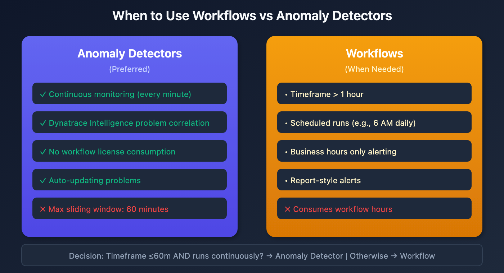

# S2D-05: Alert Migration - Workflow-Based Alerts

> **Series:** S2D | **Notebook:** 5 of 9 | **Created:** January 2026 | **Last Updated:** 01/30/2026

## Overview

While Davis Anomaly Detectors are preferred for continuous monitoring, some Splunk alerts are better suited for workflow-based alerting. This notebook explains when and how to use Dynatrace Workflows for alert migration.



<!-- MARKDOWN_TABLE_ALTERNATIVE
| Feature | Anomaly Detector | Workflow |
|---------|-----------------|----------|
| Execution | Continuous | Scheduled |
| Max Window | 60 minutes | Unlimited |
| AI Integration | Davis AI | Manual logic |
| License | Included | Workflow hours |
For environments where SVG doesn't render
-->

---

## Table of Contents

1. [When to Use Workflows for Alerting](#when-to-use-workflows-for-alerting)
2. [Drawbacks of Workflow-Based Alerts](#drawbacks-of-workflow-based-alerts)
3. [Basic Alerting Workflow Structure](#basic-alerting-workflow-structure)
4. [Example Workflow Query](#example-workflow-query)
5. [Event Creation JavaScript](#event-creation-javascript)
6. [Schedule Configuration](#schedule-configuration)
7. [Alternative: Business Hours with Anomaly Detectors](#alternative-business-hours-with-anomaly-detectors)
8. [Important Disclaimers](#important-disclaimers)
9. [Migration Checklist](#migration-checklist)

---

## Prerequisites

| Requirement | Details |
|-------------|----------|
| **Dynatrace Environment** | SaaS with Workflows enabled |
| **Permissions** | `automation.write`, `logs.read` |
| **Knowledge** | Understanding of Dynatrace Workflows |

## Learning Objectives

By the end of this notebook, you will be able to:

1. Identify when workflows are more appropriate than anomaly detectors
2. Structure a basic alerting workflow
3. Configure scheduled triggers
4. Create events from workflow results

<a id="when-to-use-workflows-for-alerting"></a>
## When to Use Workflows for Alerting
### Use Workflows When:

1. **Query timeframe exceeds 1 hour**
   - Anomaly Detectors have a maximum sliding window of 60 minutes
   - Example: Alert on 7-day log volume trends

2. **Alert runs on a schedule (few times per day)**
   - Scheduled reports that happen at specific times
   - Example: Run every weekday at 6 AM

3. **Alert is disabled for extended periods**
   - Business hours-only alerting
   - Example: Alert every 5 minutes during 8 AM - 6 PM only

4. **Alert is actually a report**
   - Some Splunk "alerts" are reports that always trigger
   - Indicators:
     - Returns multiple appended datasets
     - Threshold of 0 for consistently large results
     - Very large timeframes

### Use Anomaly Detectors When:

- Continuous, real-time monitoring is needed
- Timeframe is ≤ 60 minutes
- Alert should run every minute
- Dynatrace Intelligence problem correlation is beneficial

<a id="drawbacks-of-workflow-based-alerts"></a>
## Drawbacks of Workflow-Based Alerts
Before choosing workflows, consider these limitations:

| Aspect | Impact |
|--------|--------|
| **License consumption** | Workflows consume workflow hours |
| **Setup effort** | More complex than anomaly detectors |
| **Event handling** | Manual event creation required |
| **No auto-update** | Events won't update or auto-close |
| **No Dynatrace Intelligence correlation** | Won't be correlated with other problems |

<a id="basic-alerting-workflow-structure"></a>
## Basic Alerting Workflow Structure
A typical alerting workflow has three main components:

### 1. Trigger (Schedule)

Defines when the workflow runs:

| Schedule Type | Use Case | Example |
|--------------|----------|----------|
| Fixed time | Daily reports | Every day at 9:00 AM |
| Time interval | Regular checks | Every 10 minutes |
| Cron | Complex schedules | Weekdays at 6 AM |

### 2. Query (DQL Execution)

Executes the DQL query to retrieve data:
- Unlike anomaly detectors, does NOT require timeseries output
- Can return single aggregated values
- Timeframe specified in the query, not from notebook/dashboard selector

### 3. Event Creation (JavaScript)

Evaluates results and creates events if threshold exceeded:
- Extracts values from query results
- Compares against threshold
- Creates custom event with appropriate properties

<a id="example-workflow-query"></a>
## Example Workflow Query
Unlike Anomaly Detectors, workflow queries often return a single aggregated value:

```dql
// Workflow alert query - returns single count
// Timeframe explicitly specified (last 7 days)
fetch logs, from:now()-7d
| filter loglevel == "ERROR"
| filter matchesPhrase(k8s.deployment.name, "payment-service")
| summarize error_count = count()
```

### Query with Dimensions

Add dimensions to provide context in the event:

```dql
// Query with dimensions for event context
fetch logs, from:now()-24h
| filter loglevel == "ERROR"
| summarize 
    error_count = count(),
    by:{k8s.deployment.name, k8s.namespace.name, dt.entity.cloud_application}
| filter error_count > 100
| sort error_count desc
```

<a id="event-creation-javascript"></a>
## Event Creation JavaScript
The final workflow step uses JavaScript to create events. Here's a template:

```javascript
// Event Creation Template
export default async function ({ execution_id }) {
  // Get query results from previous step
  const queryResult = await getResult('query_step_name');
  const records = queryResult.records;
  
  // Configuration
  const THRESHOLD = 100;
  const ALERT_TITLE = '[AppName] High Error Count';
  
  // Check each result against threshold
  for (const record of records) {
    const errorCount = record.error_count;
    
    if (errorCount > THRESHOLD) {
      // Create event
      await sendEvent({
        eventType: 'ERROR_EVENT',
        title: ALERT_TITLE,
        properties: {
          'error.count': errorCount,
          'deployment.name': record['k8s.deployment.name']
        },
        timeout: 15 // minutes
      });
    }
  }
}
```

<a id="schedule-configuration"></a>
## Schedule Configuration
### Fixed Time Schedule

Run at specific times:

```yaml
# Every day at 9:00 AM
schedule:
  type: fixed
  time: "09:00"
  timezone: "America/New_York"
```

### Interval Schedule

Run at regular intervals:

```yaml
# Every 6 hours
schedule:
  type: interval
  interval: "6h"
```

### Cron Schedule

Complex scheduling with cron expressions:

```yaml
# Weekdays at 6 AM
schedule:
  type: cron
  expression: "0 6 * * 1-5"
  timezone: "America/New_York"
```

<a id="alternative-business-hours-with-anomaly-detectors"></a>
## Alternative: Business Hours with Anomaly Detectors
For business hours-only alerting, consider these alternatives before using workflows:

### Option A: Filter by Hour in Query

Add hour-of-day filtering to exclude off-hours:

```dql
// Filter logs to business hours only (8 AM - 6 PM)
fetch logs, from:-24h
| filter loglevel == "ERROR"
| fieldsAdd hour = toLong(formatTimestamp(timestamp, format:"HH"))
| filter hour >= 8 and hour < 18
| makeTimeseries count = count(), interval:1m
```

### Option B: Workflow to Enable/Disable Detector

Create a workflow that enables/disables the anomaly detector on schedule:

1. Morning workflow (8 AM): Enable detector
2. Evening workflow (6 PM): Disable detector

This preserves the benefits of Dynatrace Intelligence while limiting alert times.

<a id="important-disclaimers"></a>
## Important Disclaimers
1. **Workflows do NOT send notifications directly**
   - The workflow generates a problem/event
   - Notifications are handled by alerting profiles and problem notification workflows

2. **Event lifecycle is manual**
   - Events won't auto-update or auto-close
   - Consider event timeout settings

3. **License considerations**
   - Workflow hours are consumed
   - See [Workflow consumption documentation](https://docs.dynatrace.com/docs/shortlink/dps-automation-consumption)

<a id="migration-checklist"></a>
## Migration Checklist
| Step | Action |
|------|--------|
| 1 | Confirm workflow is appropriate (see criteria above) |
| 2 | Create DQL query with explicit timeframe |
| 3 | Configure schedule trigger |
| 4 | Implement event creation logic |
| 5 | Test workflow execution |
| 6 | Configure notification routing |

## Next Steps

- **S2D-06: ArrayMovingSum** - For extending anomaly detector timeframes
- **S2D-07: Metric Creation** - For performance-critical alerting queries

## References

- [Dynatrace Workflows](https://docs.dynatrace.com/docs/shortlink/workflows)
- [Workflow Schedules](https://docs.dynatrace.com/docs/shortlink/workflows-schedules)
- [Workflow Consumption](https://docs.dynatrace.com/docs/shortlink/dps-automation-consumption)
- [Event Ingest API](https://developer.dynatrace.com/develop/sdks/client-classic-environment-v2/#eventingest)

---

<sub>*This notebook was AI-generated from community-submitted and publicly available sources. This notebook series is not officially supported by Dynatrace. Always verify information against official Dynatrace documentation.*</sub>
