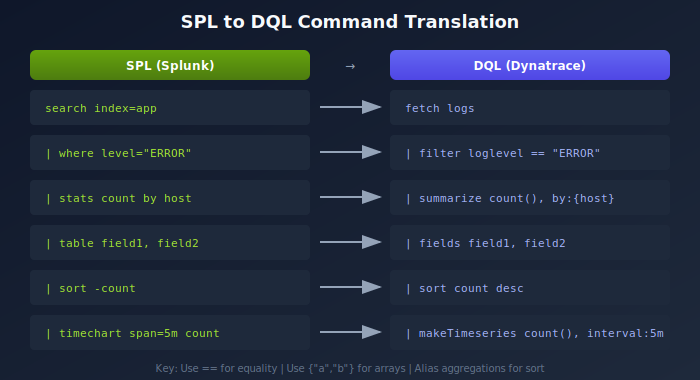

# S2D-03: SPL to DQL Translation

> **Series:** S2D | **Notebook:** 3 of 9 | **Created:** January 2026 | **Last Updated:** 01/28/2026

## Overview

This notebook provides a comprehensive guide for translating Splunk SPL (Search Processing Language) queries to Dynatrace DQL (Dynatrace Query Language). While both languages share similar concepts, their syntax and capabilities differ significantly.



<!-- MARKDOWN_TABLE_ALTERNATIVE
| SPL Step | DQL Equivalent | Notes |
|----------|----------------|-------|
| search/index | fetch | Data source selection |
| where | filter | Condition filtering |
| stats | summarize | Aggregation |
| eval | fieldsAdd | Field calculation |
| table | fields | Column selection |
For environments where SVG doesn't render
-->

## Prerequisites

| Requirement | Details |
|-------------|----------|
| **Dynatrace Environment** | SaaS or Managed with Grail |
| **Permissions** | `logs.read` |
| **Knowledge** | Familiarity with source SPL queries |

## Learning Objectives

By the end of this notebook, you will be able to:

1. Map SPL commands to their DQL equivalents
2. Translate common SPL patterns to DQL
3. Handle differences in string matching and filtering
4. Convert aggregation and time-series queries
5. Apply DQL best practices during translation

## Command Translation Reference

### Core Commands

| SPL Command | DQL Command | Description |
|-------------|-------------|-------------|
| `search index=...` | `fetch logs` | Select data source |
| `where field="value"` | `filter field == "value"` | Filter records |
| `stats count by field` | `summarize count = count(), by:{field}` | Aggregate data |
| `table field1, field2` | `fields field1, field2` | Select columns |
| `sort -count` | `sort count desc` | Sort results |
| `head 10` | `limit 10` | Limit results |
| `eval new=field1+field2` | `fieldsAdd new = field1 + field2` | Calculate fields |
| `rename old AS new` | `fieldsRename new = old` | Rename fields |
| `dedup field` | Not directly available | Use `summarize ... by:{field}` |

### String Matching

| SPL Pattern | DQL Pattern | Description |
|-------------|-------------|-------------|
| `field="*error*"` | `matchesPhrase(field, "error")` | Contains text |
| `field=error` | `field == "error"` | Exact match |
| `field IN ("a","b")` | `in(field, {"a", "b"})` | Multiple values |
| `rex field=f "(?<name>...)"` | `parse f, "DATA:name"` | Extract patterns |

## Basic Query Translation

### Example 1: Simple Log Search

**SPL:**
```spl
index=application sourcetype=app_logs host=app-server-01 | head 100
```

**DQL:**

```dql
// Simple log search with host filter
fetch logs
| filter matchesPhrase(host.name, "app-server-01")
| limit 100
```

### Example 2: Error Log Count by Host

**SPL:**
```spl
index=application level=ERROR | stats count by host | sort -count
```

**DQL:**

```dql
// Error log count by host
fetch logs
| filter loglevel == "ERROR"
| summarize count = count(), by:{host.name}
| sort count desc
```

### Example 3: Time-Based Aggregation

**SPL:**
```spl
index=application | timechart span=5m count by level
```

**DQL:**

```dql
// Time-series count by log level
fetch logs
| makeTimeseries count = count(), by:{loglevel}, interval:5m
```

## Filtering Patterns

### Phrase Matching (Contains)

**SPL:**
```spl
index=application "connection timeout"
```

**DQL:**

```dql
// Search for phrase in log content
fetch logs
| filter matchesPhrase(content, "connection timeout")
| limit 50
```

### Multiple Value Filter (IN)

**SPL:**
```spl
index=application level IN ("ERROR", "WARN", "FATAL")
```

**DQL:**

```dql
// Filter for multiple log levels
fetch logs
| filter in(loglevel, {"ERROR", "WARN", "FATAL"})
| summarize count = count(), by:{loglevel}
```

### NOT Filter

**SPL:**
```spl
index=application NOT level="DEBUG"
```

**DQL:**

```dql
// Exclude DEBUG level logs
fetch logs
| filter loglevel != "DEBUG"
| summarize count = count(), by:{loglevel}
```

### Combined Conditions (AND/OR)

**SPL:**
```spl
index=application (host="app-01" OR host="app-02") AND level="ERROR"
```

**DQL:**

```dql
// Combined AND/OR conditions
fetch logs
| filter (matchesPhrase(host.name, "app-01") OR matchesPhrase(host.name, "app-02"))
| filter loglevel == "ERROR"
| limit 100
```

## Aggregation Patterns

### Multiple Aggregations

**SPL:**
```spl
index=application | stats count, avg(response_time), max(response_time) by host
```

**DQL:**

```dql
// Multiple aggregations by host
fetch logs
| filter isNotNull(response_time)
| summarize 
    count = count(),
    avg_response = avg(response_time),
    max_response = max(response_time),
    by:{host.name}
```

### Conditional Count

**SPL:**
```spl
index=application | stats count(eval(level="ERROR")) as errors, count as total by host
```

**DQL:**

```dql
// Conditional count - errors vs total
fetch logs
| summarize 
    errors = countIf(loglevel == "ERROR"),
    total = count(),
    by:{host.name}
| fieldsAdd error_rate = (toDouble(errors) / toDouble(total)) * 100
```

## Field Extraction

### Regex Pattern Extraction

**SPL:**
```spl
index=application | rex field=_raw "user=(?<username>\w+)"
```

**DQL:**

```dql
// Extract username from log content
fetch logs
| filter matchesPhrase(content, "user=")
| parse content, "LD 'user=' WORD:username"
| summarize count = count(), by:{username}
| sort count desc
```

### Key-Value Extraction

**SPL:**
```spl
index=application | rex field=_raw "status=(?<status>\d+)" | rex field=_raw "duration=(?<duration>\d+)"
```

**DQL:**

```dql
// Extract multiple fields from structured log
fetch logs
| parse content, "LD 'status=' INT:status LD 'duration=' INT:duration"
| filter isNotNull(status) AND isNotNull(duration)
| summarize avg_duration = avg(duration), by:{status}
```

## Time-Series Queries

### Timechart Equivalent

**SPL:**
```spl
index=application level=ERROR | timechart span=1m count by host
```

**DQL:**

```dql
// Time-series error count by host
fetch logs
| filter loglevel == "ERROR"
| makeTimeseries count = count(), by:{host.name}, interval:1m
```

## Key Syntax Differences

### Important DQL Rules

| Aspect | SPL | DQL |
|--------|-----|-----|
| String quotes | Single or double | Double only |
| Array syntax | `("a", "b")` | `{"a", "b"}` |
| Equality | `=` | `==` |
| Named params | Positional | Required: `decimals: 2` |
| Pipe symbol | `\|` | `\|` |
| Field access | `field_name` | `field.name` (nested) |

### Aggregation Aliasing (Critical)

In DQL, aggregations MUST be aliased if you want to reference them later:

```dql
// Wrong - cannot sort by count()
| summarize count(), by:{host.name}
| sort count() desc  // ERROR!

// Correct - alias the aggregation
| summarize count = count(), by:{host.name}
| sort count desc  // Works!
```

## Next Steps

With your queries translated, proceed to **S2D-04: Alert Migration - Davis Anomaly Detectors** to learn how to convert Splunk alerts to continuous Dynatrace monitoring.

## References

- [DQL Reference](https://docs.dynatrace.com/docs/shortlink/dql-reference)
- [DQL Functions](https://docs.dynatrace.com/docs/shortlink/dql-functions)
- [Parse Command](https://docs.dynatrace.com/docs/shortlink/dql-parse)

---

<sub>*This notebook was AI-generated from community-submitted and publicly available sources. This notebook series is not officially supported by Dynatrace. Always verify information against official Dynatrace documentation.*</sub>
