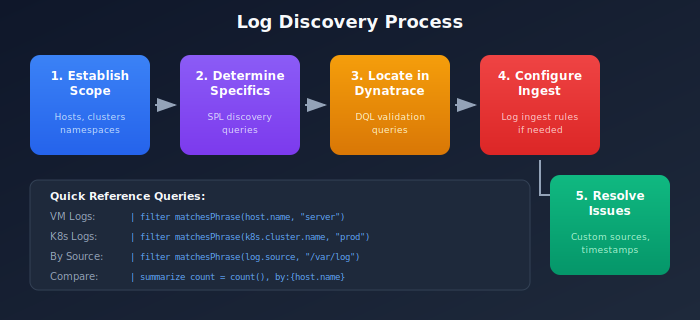

# S2D-02: Locating Logs in Dynatrace

> **Series:** S2D | **Notebook:** 2 of 9 | **Created:** January 2026 | **Last Updated:** 01/30/2026

## Overview

Before migrating Splunk objects such as dashboards, alerts, or reports, it is essential to verify that the log data referenced in these objects is available in Dynatrace.

This notebook describes the process of determining where the required logs can be found, then validating whether they are present in Dynatrace.



<!-- MARKDOWN_TABLE_ALTERNATIVE
| Step | Action | Output |
|---|--------|--------|
| 1 | Establish Scope | Infrastructure footprint |
| 2 | Determine Specifics | Required log sources |
| 3 | Locate in Dynatrace | DQL verification queries |
| 4 | Configure Ingest | Ingest rules if needed |
| 5 | Resolve Discrepancies | Troubleshooting steps |
For environments where SVG doesn't render
-->

---

## Table of Contents

1. [Step 1: Establishing Scope](#step-1-establishing-scope)
2. [Step 2: Determining Specifics in Splunk](#step-2-determining-specifics-in-splunk)
3. [Step 3: Locating Logs in Dynatrace](#step-3-locating-logs-in-dynatrace)
4. [Step 4: Configuring Log Ingest](#step-4-configuring-log-ingest)
5. [Step 5: Resolving Discrepancies](#step-5-resolving-discrepancies)
6. [Troubleshooting Checklist](#troubleshooting-checklist)
7. [Validation Query Template](#validation-query-template)

---

## Prerequisites

| Requirement | Details |
|-------------|----------|
| **Dynatrace Environment** | SaaS or Managed with Grail |
| **Permissions** | `logs.read`, `settings.read` |
| **Splunk Access** | Ability to run queries against source indexes |
| **Infrastructure Knowledge** | Understanding of application deployment topology |

## Learning Objectives

By the end of this notebook, you will be able to:

1. Establish the infrastructure scope for log migration
2. Use Splunk queries to identify specific log sources
3. Validate log availability in Dynatrace using DQL
4. Configure log ingest rules when data is missing
5. Troubleshoot common log ingestion issues

<a id="step-1-establishing-scope"></a>
## Step 1: Establishing Scope
When approaching a new application for migration, the first task is determining where the logs required for monitoring are located. This often coincides with the application's infrastructure, but not always.

### Common Log Locations

| Environment Type | Log Location Identifier |
|-----------------|------------------------|
| Virtual Machines | Host or host group |
| Kubernetes | Cluster, namespace, deployment |
| Cloud Functions | Cloud provider, function name |
| Containers | Container name, image |

### Gathering Scope Information

Information about application scope can come from:

1. **Management Zones** - If configured, these often define application boundaries
2. **Application Teams** - Direct knowledge of deployment topology
3. **CMDB/Inventory** - Infrastructure documentation
4. **Existing Splunk Queries** - Filters used in current dashboards

<a id="step-2-determining-specifics-in-splunk"></a>
## Step 2: Determining Specifics in Splunk
Not all logs within an application's footprint are required for every dashboard and alert. Conversely, dashboards and alerts may reference logs outside the expected footprint.

### Splunk Discovery Queries

Run these queries in Splunk to understand the specific log sources being used:

#### Record Count by Host
```spl
index=[your_index] | stats count by host
```

#### Record Count by Source
```spl
index=[your_index] | stats count by source, sourcetype
```

#### Record Count by Kubernetes Attributes
```spl
index=[your_index] | stats count by kubernetes_cluster, kubernetes_namespace, kubernetes_deployment_name
```

> **Tip:** If your Splunk environment doesn't use index-based organization, substitute the filters from your actual queries before the `stats` command.

<a id="step-3-locating-logs-in-dynatrace"></a>
## Step 3: Locating Logs in Dynatrace
To determine whether required logs are present in Dynatrace, use DQL queries with the relevant filters from your Splunk discovery.

### Search by Host Name

```dql
// Search logs by host name
// Replace 'your-host-name' with the actual host from Splunk
fetch logs, from:-1h
| filter matchesPhrase(host.name, "your-host-name")
| summarize count = count(), by:{log.source}
| sort count desc
```

### Search by Log Source Path

```dql
// Search by specific log file path
// Replace path with your application's log location
fetch logs, from:-1h
| filter matchesPhrase(log.source, "/var/log/application")
| summarize count = count(), by:{host.name}
| sort count desc
```

### Search by Kubernetes Attributes

```dql
// Search by Kubernetes cluster and namespace
fetch logs, from:-1h
| filter matchesPhrase(k8s.cluster.name, "production-cluster")
| filter matchesPhrase(k8s.namespace.name, "ecommerce")
| summarize count = count(), by:{k8s.deployment.name, k8s.pod.name}
| sort count desc
```

### Compare Counts with Splunk

Run equivalent time-bounded queries in both platforms to compare log volumes:

```dql
// Total log count for the last hour (compare with Splunk)
fetch logs, from:now()-1h
| filter matchesPhrase(host.name, "your-host-name")
| summarize total_count = count()
```

<a id="step-4-configuring-log-ingest"></a>
## Step 4: Configuring Log Ingest
If the required logs are not available in Dynatrace, you need to configure log ingest rules.

### Ingest Rule Hierarchy

| Level | Scope | Best For |
|-------|-------|----------|
| Environment | All hosts | Organization-wide policies |
| Host Group | Specific host groups | Application-specific rules |
| Host | Single host | Special cases |

> **Recommendation:** Use host group-level rules for application granularity without per-host overhead.

### Log Ingest Rule Properties

Rules can filter logs based on:
- Host name patterns
- Log file name or path
- Kubernetes attributes
- Log level
- Process name
- Content patterns

### Documentation Reference

See [Log Ingest Rules](https://docs.dynatrace.com/docs/shortlink/lma-log-ingest-rules) for complete configuration options.

<a id="step-5-resolving-discrepancies"></a>
## Step 5: Resolving Discrepancies
If logs are still not appearing after configuring ingest rules, investigate these common issues:

### Custom Log Sources

If your application writes to non-standard log locations, you may need to configure [Custom Log Sources](https://docs.dynatrace.com/docs/shortlink/lma-custom-log-source).

### OneAgent Log Monitoring

Verify that log content access is enabled on the OneAgent. The `oneagentctl` command can check this:

```bash
oneagentctl --get-log-content-access
```

> **Note:** Host-level settings supersede environment configuration. If log monitoring is disabled on the OneAgent, environment-level rules will not apply.

### Timestamp and Splitting Issues

If logs appear but counts differ or content seems incorrect, you may need [Timestamp and Splitting Rules](https://docs.dynatrace.com/docs/shortlink/lma-timestamp-configuration) to properly parse multi-line logs or custom timestamp formats.

<a id="troubleshooting-checklist"></a>
## Troubleshooting Checklist
| Symptom | Possible Cause | Solution |
|---------|---------------|----------|
| No logs from host | Ingest rule missing | Add ingest rule for host/host group |
| No logs from file | Custom log source needed | Configure custom log source |
| Some logs missing | OneAgent disabled | Enable log content access |
| Wrong log count | Timestamp parsing | Configure timestamp rules |
| Multi-line broken | Splitting rules | Configure splitting rules |

<a id="validation-query-template"></a>
## Validation Query Template
Use this template to create a comprehensive validation query for your application:

```dql
// Comprehensive log validation template
// Modify filters to match your application
fetch logs, from:now()-24h
| filter matchesPhrase(host.name, "app-server") OR matchesPhrase(k8s.namespace.name, "app-namespace")
| summarize 
    total_count = count(),
    error_count = countIf(loglevel == "ERROR"),
    warn_count = countIf(loglevel == "WARN"),
    by:{log.source}
| sort total_count desc
```

## Next Steps

Once you've validated that required logs are available in Dynatrace, proceed to **S2D-03: SPL to DQL Translation** to begin converting your Splunk queries.

## References

- [Log Ingest Rules](https://docs.dynatrace.com/docs/shortlink/lma-log-ingest-rules)
- [Custom Log Sources](https://docs.dynatrace.com/docs/shortlink/lma-custom-log-source)
- [Log Content Access](https://docs.dynatrace.com/docs/shortlink/oneagentctl#check-if-log-monitoring-is-enabled)
- [Timestamp Configuration](https://docs.dynatrace.com/docs/shortlink/lma-timestamp-configuration)

---

<sub>*This notebook was AI-generated from community-submitted and publicly available sources. This notebook series is not officially supported by Dynatrace. Always verify information against official Dynatrace documentation.*</sub>
