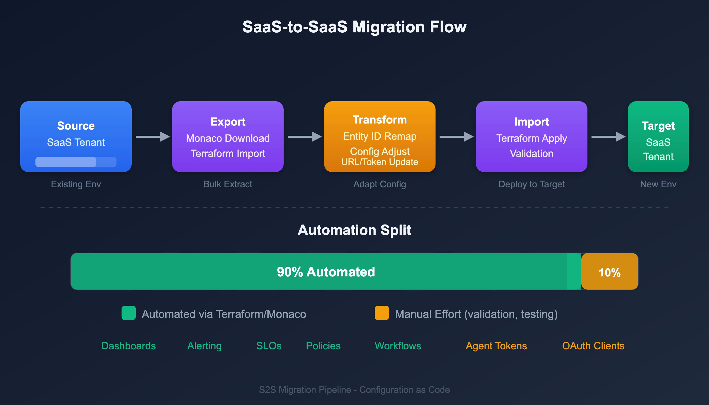

# S2S-01: Migration Scenarios and Readiness Assessment

> **Series:** S2S | **Notebook:** 1 of 12 | **Created:** March 2026 | **Last Updated:** 03/23/2026

## Overview

Migrating between Dynatrace SaaS tenants is fundamentally different from migrating from Managed to SaaS. Both source and target are Gen3 Grail-powered environments, which simplifies some aspects (no architecture upgrade) but introduces unique challenges (entity ID remapping, historical data gaps, parallel operation). This series provides a comprehensive, vendor-neutral guide for every SaaS-to-SaaS migration scenario.

---

## Table of Contents

1. [Why Migrate Between SaaS Tenants](#why-migrate)
2. [Migration Scenarios](#migration-scenarios)
3. [What Migrates and What Does Not](#what-migrates)
4. [Migration Tools Comparison](#migration-tools)
5. [Readiness Assessment](#readiness-assessment)
6. [The 90/10 Rule](#the-90-10-rule)

---

## Prerequisites

| Requirement | Details |
|-------------|----------|
| **Source Tenant** | Active Dynatrace SaaS environment |
| **Target Tenant** | Provisioned Dynatrace SaaS environment |
| **Permissions** | Admin access to both tenants |
| **CLI Tools** | Monaco CLI v2.x, Terraform v1.5+ |
| **Network** | Connectivity to both tenant URLs |

<a id="why-migrate"></a>
## 1. Why Migrate Between SaaS Tenants

Organizations migrate between Dynatrace SaaS tenants for several reasons:

| Scenario | Driver | Example |
|----------|--------|---------|
| **Tenant Consolidation** | Reduce operational overhead | Merging 5 regional tenants into 1 global tenant after M&A |
| **Account Restructuring** | Organizational alignment | Spinning off a business unit into its own Dynatrace account |
| **Regional Relocation** | Compliance or latency | Moving from US-hosted to EU-hosted SaaS cluster for GDPR |
| **License Restructuring** | Contract changes | Moving from multiple small tenants to a single enterprise agreement |
| **Disaster Recovery Setup** | Business continuity | Creating a standby tenant in a different region |
| **Environment Promotion** | Dev/staging/prod split | Splitting a single tenant into environment-specific tenants |

> **Key Difference from M2S:** In a Managed-to-SaaS migration, the SaaS Upgrade Assistant handles most of the heavy lifting. For SaaS-to-SaaS, there is no automated assistant — you use Monaco, Terraform, and the Settings API to export and reimport configuration.

<a id="migration-scenarios"></a>
## 2. Migration Scenarios

### Scenario A: Tenant Consolidation (Many → One)

Multiple SaaS tenants merged into a single target tenant. This is the most common and most complex scenario.

| Challenge | Impact | Mitigation |
|-----------|--------|------------|
| Naming collisions | Dashboards, rules, SLOs with same names | Prefix with source tenant identifier |
| Entity ID conflicts | Same hosts monitored in multiple tenants | Deduplicate before cutover |
| IAM policy overlap | Different teams had different policies | Redesign IAM from scratch for consolidated tenant |
| Historical data loss | Each source tenant's history is lost | Run parallel for 30+ days before cutover |

### Scenario B: Tenant Split (One → Many)

A single tenant split into multiple tenants, typically for organizational or compliance reasons.

| Challenge | Impact | Mitigation |
|-----------|--------|------------|
| Configuration separation | Which configs belong to which tenant? | Tag everything by business unit before splitting |
| Agent reassignment | OneAgents must point to new tenant | Phased rollout by host group |
| Shared dashboards | Cross-team dashboards must be duplicated | Export, modify ownership, import |

### Scenario C: Regional Relocation

Moving a tenant to a different SaaS cluster (e.g., US → EU, EU → APAC).

| Challenge | Impact | Mitigation |
|-----------|--------|------------|
| New tenant URL | All agents, integrations, API calls change | Comprehensive endpoint inventory |
| Data residency | Historical data cannot move | Accept data gap or run parallel |
| DNS/Firewall changes | Network configuration must update | Pre-configure network rules |

### Scenario D: Cloud Provider Transformation

Migrating monitored workloads between cloud providers while simultaneously migrating the Dynatrace configuration.

| Transformation | Key Considerations |
|---------------|-------------------|
| **AWS → Azure** | Replace AWS CloudWatch integrations with Azure Monitor; update K8s monitoring for AKS; remap IAM roles to Azure AD |
| **AWS → GCP** | Replace CloudWatch with GCP Cloud Monitoring; update K8s for GKE; remap to GCP IAM |
| **Azure → AWS** | Replace Azure Monitor with CloudWatch; update K8s for EKS; remap Azure AD to AWS IAM |
| **Azure → GCP** | Replace Azure Monitor with GCP Cloud Monitoring; update K8s for GKE; remap identity providers |
| **GCP → AWS** | Replace GCP Monitoring with CloudWatch; update K8s for EKS; remap GCP IAM to AWS IAM |
| **GCP → Azure** | Replace GCP Monitoring with Azure Monitor; update K8s for AKS; remap to Azure AD |
| **On-Prem → Any Cloud** | New cloud integrations; ActiveGate deployment; network zone configuration |
| **Multi-Cloud Consolidation** | Unified monitoring across providers; single pane of glass; standardized naming |

<a id="what-migrates"></a>
## 3. What Migrates and What Does Not

### Configuration That CAN Be Migrated

#### Gen2 (Classic) Configuration

| Category | API | Tool | Notes |
|----------|-----|------|-------|
| Management zones | Config API v1 | Terraform, Monaco | Zone rules and entity assignments |
| Auto-tags | Config API v1 / Settings 2.0 | Terraform, Monaco | Tag rules and conditions |
| Alerting profiles | Config API v1 / Settings 2.0 | Terraform, Monaco | Severity filters, event filters |
| Notification rules | Config API v1 / Settings 2.0 | Terraform, Monaco | Integrations (email, webhook, Slack, PagerDuty) |
| Calculated service metrics | Config API v1 | Terraform, Monaco | Custom metric definitions |
| Request attributes | Config API v1 / Settings 2.0 | Terraform, Monaco | Capture rules and extraction |
| Custom services | Config API v1 | Terraform, Monaco | Detection rules |
| Application detection rules | Config API v1 / Settings 2.0 | Terraform, Monaco | RUM application boundaries |
| Conditional naming rules | Config API v1 / Settings 2.0 | Terraform, Monaco | Host, service, process group naming |
| Process group detection rules | Config API v1 / Settings 2.0 | Terraform, Monaco | Custom process grouping |
| Service detection rules | Config API v1 / Settings 2.0 | Terraform, Monaco | Custom service endpoints |
| Maintenance windows | Config API v1 / Settings 2.0 | Terraform, Monaco | Scheduled suppression |
| Anomaly detection settings | Settings 2.0 | Terraform, Monaco | Thresholds and sensitivity |
| Classic dashboards | Dashboard API v1 | Terraform, Monaco | JSON export/import (entity IDs must be updated) |
| Host group assignments | Config API v1 | Terraform, Monaco | Logical host grouping |
| Network zones | Settings 2.0 | Terraform, Monaco | Routing configuration |
| Credential vault entries | Config API v1 | Terraform, Monaco | Stored credentials for Synthetics |

#### Gen3 (Grail) Configuration

Monaco v2 supports eight configuration types that cover all Gen3 resources: **settings**, **document**, **automation**, **bucket**, **segment**, **slo-v2**, **openpipeline**, and classic **api**. Terraform covers all of these plus IAM.

| Category | Monaco | Terraform | Notes |
|----------|--------|-----------|-------|
| Settings 2.0 (all schemas) | Yes | Yes | Bulk export/import |
| Dashboards and Notebooks | Yes (documents type) | Yes | Entity ID references must be updated |
| SLO definitions | Yes (settings type) | Yes | Metric expressions may reference entity IDs |
| Notification rules and integrations | Yes (settings type) | Yes | Webhook URLs may need updating |
| Synthetic monitors (HTTP, Browser) | Yes | Yes | Requires classic API token (v1.88.0+) |
| Workflows and automations | Yes (automations type) | Yes | Requires OAuth client credentials |
| OpenPipeline processing rules | Yes (openpipeline type) | Yes | Bucket references must match target |
| Grail bucket definitions | Yes (bucket type) | Yes | Retention policies may differ |
| K8s metadata enrichment rules | Yes (settings type) | Yes | `builtin:kubernetes.metadata.enrichment` |
| Extensions 2.0 | No | No | Neither tool supports Extensions 2.0 — manual reinstall from Hub required |
| **IAM policies, groups, bindings** | **No** | **Yes** | Account-level, requires OAuth + account ID |
| Segments | Yes | Yes | Dedicated `segment` config type — download, deploy, and delete |

> **Key takeaway:** The only resources that **require** Terraform are IAM policies/groups/bindings. Everything else can be migrated with either Monaco or Terraform.
>
> **Download limitations:** Cloud provider credentials (AWS, Azure, K8s) can be deployed by Monaco but **not exported** via `monaco download`. These must be recreated manually in the target tenant regardless of tool choice.

### What CANNOT Be Migrated

| Item | Reason | Workaround |
|------|--------|------------|
| **Historical metrics, logs, traces** | Stored in source tenant's Grail | Run parallel tenants during transition |
| **Entity IDs** | Unique per tenant, auto-generated | Remap references in dashboards/SLOs |
| **User session data (RUM)** | Bound to source tenant | Accept gap or extend parallel period |
| **Smartscape topology history** | Computed per-tenant | Rebuilds automatically in target |
| **Davis AI baselines** | Learned from source data | Requires 2-4 weeks to retrain |
| **Problem history** | Stored in source tenant | Export key problems as documentation |
| **API tokens** | Secrets, cannot be exported | Create new tokens in target |
| **OAuth client secrets** | Secrets, cannot be exported | Create new OAuth clients in target |

> **The 90/10 Rule:** 90% of configuration migrates automatically with Monaco or Terraform. The remaining 10% — entity ID remapping, integration repointing, IAM redesign — takes 90% of the effort.

<a id="migration-tools"></a>
## 4. Migration Tools Comparison

| Tool | Capabilities | Strengths | Limitations |
|------|-------------|-----------|-------------|
| **Monaco** | Settings, documents, automations, buckets, openpipeline, SLOs, Synthetics, classic config | `monaco download` bulk export, `monaco deploy` with automatic dependency resolution, no HCL knowledge needed | No state management, no drift detection, cannot manage IAM; segments are fully supported (download, deploy, delete) |
| **Terraform** | Everything Monaco covers **plus** IAM policies/groups/bindings | State tracking, drift detection via `terraform plan`, cross-platform resource references | Requires HCL knowledge, no bulk export equivalent |
| **Settings API** | Settings 2.0 schemas | Fine-grained programmatic control | Custom scripting required |
| **SaaS Upgrade Assistant** | Managed-to-SaaS only | N/A for SaaS-to-SaaS | Does not support SaaS-to-SaaS |

### When You Need Terraform

Terraform is required **only** when you need to manage:
- **IAM policies, groups, and bindings** — Monaco cannot manage account-level IAM
- **State management and drift detection** — Monaco deploys are stateless

For everything else, Monaco and Terraform are functionally equivalent. Choose based on your team's existing expertise.

### Recommended Approach

Choose based on your team's existing tooling:

**Path A — Monaco (simpler for one-time migration):**
1. `monaco download` from source tenant
2. Update manifest to point at target tenant
3. `monaco deploy` to target tenant
4. Use Terraform only for IAM policies/groups (if needed)
5. Validate with DQL queries

**Path B — Terraform (better for ongoing management):**
1. `monaco download` from source (for initial export — Terraform has no bulk export)
2. Convert Monaco output to Terraform HCL
3. `terraform import` existing resources
4. `terraform apply` to target tenant
5. Validate with DQL queries

> **Guidance:** If your team does not use Terraform today, Path A covers ~99% of the migration. Add Terraform only for IAM if needed. If your team already uses Terraform, Path B gives you drift detection and state management post-migration.

<a id="readiness-assessment"></a>
## 5. Readiness Assessment

### Pre-Migration Checklist

| Area | Question | Status |
|------|----------|--------|
| **Licensing** | Is the target tenant licensed and provisioned? | ☐ |
| **Network** | Can agents reach the target tenant URL? | ☐ |
| **Authentication** | Are API tokens and OAuth clients created in target? | ☐ |
| **IAM** | Is the IAM group/policy structure designed for target? | ☐ |
| **SSO** | Is SAML/OIDC configured for the target tenant? | ☐ |
| **Cloud Integrations** | Are cloud provider credentials ready for target? | ☐ |
| **Naming Convention** | Is there a naming strategy to avoid collisions? | ☐ |
| **Parallel Period** | Is the parallel operation timeline agreed upon? | ☐ |
| **Rollback Plan** | Can you revert agents to source tenant if needed? | ☐ |
| **Stakeholder Alignment** | Are teams aware of the migration timeline? | ☐ |

### Inventory Queries

Run these DQL queries against the **source** tenant to understand the migration scope:

```dql
// Count monitored entities by type
fetch dt.entity.host
| summarize host_count = count()
| append [fetch dt.entity.service | summarize service_count = count()]
| append [fetch dt.entity.process_group | summarize pg_count = count()]
```

```dql
// Count dashboards and notebooks
fetch logs, from:-30d
| filter matchesPhrase(log.source, "audit")
| filter contains(content, "document") and contains(content, "created")
| summarize document_count = count()
```

<a id="the-90-10-rule"></a>
## 6. The 90/10 Rule


<!-- MARKDOWN_TABLE_ALTERNATIVE
| Phase | Effort | What It Covers |
|-------|--------|----------------|
| Automated Export/Import (90%) | 10% of time | Settings, dashboards, SLOs, notification rules |
| Manual Remediation (10%) | 90% of time | Entity ID remapping, integration repointing, IAM redesign, parallel validation |
-->

The 90/10 rule is the defining reality of SaaS-to-SaaS migration:

| Phase | Effort | What It Covers |
|-------|--------|----------------|
| **Automated Export/Import** (90% of config) | ~10% of total effort | Settings 2.0, dashboards, SLOs, notification rules, enrichment rules |
| **Manual Remediation** (10% of config) | ~90% of total effort | Entity ID remapping, webhook URL updates, IAM redesign, cloud integration reconfiguration, parallel validation |

### Why Manual Effort Dominates

- **Entity IDs change** between tenants — every dashboard filter, SLO metric expression, and notification rule that references an entity ID must be updated
- **Integrations are tenant-specific** — webhook URLs, cloud provider connections, and SSO configurations must be reconfigured
- **Historical data cannot move** — parallel operation is required to maintain continuity
- **Davis AI must relearn** — baselines take 2-4 weeks to stabilize in the target tenant

---

## Next Steps

Continue to **S2S-02: Discovery and Configuration Export** to begin inventorying and exporting your source tenant configuration.

---

<sub>*This notebook was AI-generated from community-submitted and publicly available sources. This notebook series is not officially supported by Dynatrace. Always verify information against official Dynatrace documentation.*</sub>
