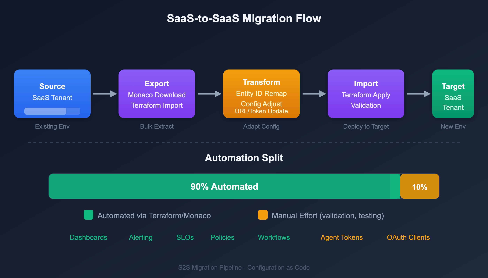

# S2S-01: Step 1 — Discover: Migration Scenarios and Inventory

> **Series:** S2S | **Notebook:** 1 of 9 | **Phase:** Plan | **Step:** Discover | **Created:** March 2026 | **Last Updated:** 04/04/2026

The first step in any SaaS-to-SaaS migration is understanding *why* you are migrating between tenants, inventorying what you have, and confirming what migrates automatically versus what requires manual effort. This notebook guides you through discovery, scenario identification, and tool selection.

> **S2S Migration Journey — 3 Phases / 9 Steps**
>
> **Plan:** **1. Discover** | 2. Strategize | 3. Design
>
> **Upgrade:** 4. Prepare | 5. Execute | 6. Integrate
>
> **Run:** 7. Expand | 8. Enable | 9. Optimize

---

## Table of Contents

1. [Why Migrate Between SaaS Tenants](#why-migrate-between-saas-tenants)
2. [What Migrates and What Does Not](#what-migrates-and-what-does-not)
3. [Entity Inventory](#entity-inventory)
4. [Configuration Inventory](#configuration-inventory)
5. [Migration Tools Comparison](#migration-tools-comparison)
6. [The 90/10 Rule](#the-90-10-rule)
7. [Step Completion Checklist](#step-completion-checklist)

---

## Prerequisites

| Requirement | Details |
|-------------|----------|
| **Source Tenant** | Active Dynatrace SaaS environment with administrator access |
| **Target Tenant** | Provisioned Dynatrace SaaS environment (or planning to provision) |
| **API Tokens** | Tokens with `entities.read`, `settings.read` scopes on source tenant |
| **CLI Tools** | Monaco CLI v2.x, Terraform v1.5+ (for IAM only) |
| **Stakeholder Access** | Ability to document and share findings with decision-makers |



<!-- MARKDOWN_TABLE_ALTERNATIVE
| Phase | Steps | Focus |
|-------|-------|-------|
| Plan | 1. Discover, 2. Strategize, 3. Design | Understand scope, select approach, architect target |
| Upgrade | 4. Prepare, 5. Execute, 6. Integrate | Export config, migrate agents, reconnect integrations |
| Run | 7. Expand, 8. Enable, 9. Optimize | Scale coverage, activate features, tune performance |
For environments where SVG doesn't render
-->

<a id="why-migrate-between-saas-tenants"></a>

## 1. Why Migrate Between SaaS Tenants

Migrating between Dynatrace SaaS tenants is fundamentally different from migrating from Managed to SaaS. Both source and target are Gen3 Grail-powered environments, which simplifies some aspects (no architecture upgrade) but introduces unique challenges (entity ID remapping, historical data gaps, parallel operation).

### Migration Scenarios

| Scenario | Description | Example |
|----------|------------|----------|
| **Tenant Consolidation** | Multiple SaaS tenants merged into a single tenant | Merging 5 regional tenants into 1 global tenant after M&A |
| **Account Restructuring** | Redistribute environments across different account structures | Spinning off a business unit into its own Dynatrace account |
| **Regional Relocation** | Move to a different SaaS region for compliance or performance | Moving from US-hosted to EU-hosted SaaS cluster for GDPR |
| **License Restructuring** | Restructure DPS allocation across tenants | Moving from multiple small tenants to a single enterprise agreement |
| **Cloud Transformation** | AWS → Azure, Azure → AWS, or cross-cloud consolidation | Rebuilding workloads on a new cloud provider with new monitoring |
| **Environment Promotion** | Promote a staging or POC tenant to production | Converting a successful POC into the production monitoring tenant |

> **Key Difference from M2S:** In a Managed-to-SaaS migration, the SaaS Upgrade Assistant handles most of the heavy lifting. For SaaS-to-SaaS, there is **no automated assistant** — you use Monaco, Terraform, and the Settings API to export and reimport configuration.

### S2S-Specific Order of Operations

The S2S migration follows an 11-step order of operations within the 9-step framework:

| Step | Action | Phase |
|------|--------|-------|
| 1 | **Assess** — Inventory source tenant | Plan |
| 2 | **Provision** — Target SaaS tenant and access (SSO/IAM) | Plan |
| 3 | **Export** — Configuration from source tenant | Upgrade |
| 4 | **Migrate** — Configuration to target tenant | Upgrade |
| 5 | **Rebuild** — Dashboards, SLOs, alerts | Upgrade |
| 6 | **Redirect** — OneAgents and operators to target | Upgrade |
| 7 | **Reconnect** — Cloud integrations and extensions | Upgrade |
| 8 | **Migrate** — Any remaining configuration | Upgrade |
| 9 | **Validate** — Data flow and performance | Run |
| 10 | **Cutover** — Full switch to target tenant | Run |
| 11 | **Decommission** — Source tenant | Run |

<a id="what-migrates-and-what-does-not"></a>

## 2. What Migrates and What Does Not

Understanding portability constraints upfront prevents surprises during execution.

### Configuration That CAN Be Migrated (with tooling)

| Configuration Type | Tool | Notes |
|--------------------|------|-------|
| Gen3 settings (Settings 2.0) | Monaco, Terraform | Bulk export/import via `monaco download` |
| Dashboards and notebooks | Monaco (documents type), Terraform | Entity ID references must be updated in target |
| Workflows and automations | Monaco (automations type), Terraform | Requires OAuth client credentials |
| OpenPipeline rules | Monaco (openpipeline type), Terraform | Bucket references must match target |
| Grail bucket configuration | Monaco (bucket type), Terraform | Retention policies may differ |
| SLO definitions | Monaco (settings/slo-v2 type), Terraform | Metric expressions may reference entity IDs |
| Management zones | Monaco, Terraform | Zone rules and entity assignments |
| Auto-tagging rules | Monaco, Terraform | Tag rules and conditions |
| Service detection rules | Monaco, Terraform | Custom service naming and merging |
| Request attributes | Monaco, Terraform | Capture rules for request metadata |
| Synthetic monitors | Monaco, Terraform | Requires classic API token (v1.88.0+) |
| Segments | Monaco, Terraform | Download, deploy, and delete |
| Classic dashboards | Monaco, Terraform | JSON export/import; entity IDs must be updated |

### What CANNOT Be Migrated

| Item | Reason | Impact |
|------|--------|--------|
| **Historical metrics, logs, traces** | Stored in source tenant's Grail | Run parallel tenants during transition |
| **Entity IDs** | Unique per tenant, auto-generated | Remap references in dashboards/SLOs |
| **Davis AI baselines** | Learned from source data | Requires 2–4 weeks to retrain |
| **Session replay recordings** | Bound to source tenant | Accept gap or extend parallel period |
| **Problem history** | Stored in source tenant | Export key problems as documentation |
| **Credential Vault secrets** | Security — secrets cannot be exported | Recreate in target Credentials Vault |
| **API tokens** | Security — environment-specific | Generate new tokens in target |
| **OAuth client secrets** | Security — cannot be exported | Create new OAuth clients in target |
| **Synthetic execution history** | Bound to source tenant | Execution data starts fresh |
| **Smartscape topology history** | Computed per-tenant | Rebuilds automatically in target |

> **Important:** Historic data does **not** migrate. Plan for a parallel-run period (typically 2–4 weeks) where both tenants receive data so the target tenant accumulates its own baselines and history.

<a id="entity-inventory"></a>

## 3. Entity Inventory

Run these DQL queries against the **source** tenant to understand the full monitoring footprint. This inventory drives license sizing, identifies migration complexity, and serves as the validation baseline after cutover.

### Host Inventory

```dql
// Host inventory by cloud provider and OS
// Note: cloud provider fields (awsNameTag, azureResourceGroupName, gcpProjectId)
// are only present on hosts monitored in those cloud environments
fetch dt.entity.host
| fieldsAdd provider = if(isNotNull(awsNameTag), then: "AWS",
    else: if(isNotNull(azureResourceGroupName), then: "Azure", else: "On-Premises"))
| summarize count = count(), by:{provider, osType}
| sort count desc

// Alternative: Smartscape on Grail (entity.name → name)
// smartscapeNodes HOST
// | fieldsAdd provider = if(isNotNull(awsNameTag), then: "AWS",
// else: if(isNotNull(azureResourceGroupName), then: "Azure", else: "On-Premises"))
// | summarize count = count(), by:{provider, osType}
// | sort count desc

```

### Kubernetes Cluster Inventory

```dql
// Kubernetes cluster inventory
fetch dt.entity.kubernetes_cluster
| fields entity.name, id
| sort entity.name asc

// Alternative: Smartscape on Grail (entity.name → name)
// smartscapeNodes K8S_CLUSTER
// | fields name, id
// | sort name asc

```

### Service Inventory

```dql
// Service inventory by technology
fetch dt.entity.service
| summarize count = count(), by:{serviceType}
| sort count desc

// Alternative: Smartscape on Grail (entity.name → name)
// smartscapeNodes SERVICE
// | summarize count = count(), by:{serviceType}
// | sort count desc

```

### Application and Synthetic Inventory

```dql
// Application and synthetic monitor counts
fetch dt.entity.application
| summarize app_count = count()
| append [fetch dt.entity.synthetic_test | summarize synthetic_count = count()]

```

### ActiveGate Inventory

```dql
// ActiveGate inventory — query hosts with isActiveGate property
// Note: ActiveGate entity type name varies by deployment (active_gate or environment_active_gate)
fetch dt.entity.host
| fieldsAdd entity.name
| summarize activeGateCount = count()
```

### Configuration Change Audit

Understanding what has been actively changed in the last 30 days helps prioritize which configurations are actively managed versus stale.

```dql
// Audit log: recent configuration changes (last 30 days)
fetch logs, from:-30d
| filter matchesPhrase(log.source, "audit")
| filter contains(content, "settings")
| parse content, "JSON:json"
| fieldsAdd schemaId = json["schemaId"]
| summarize changes = count(), by:{schemaId}
| sort changes desc
| limit 20
```

### Entity Summary Table

Record your findings in this table:

| Entity Type | Count | Notes |
|------------|-------|-------|
| Hosts | ___ | Include OS and cloud provider breakdown |
| Kubernetes Clusters | ___ | Cluster names and versions |
| Services | ___ | Include technology breakdown |
| Applications | ___ | Web and mobile |
| Synthetic Tests | ___ | HTTP, browser, scripted |
| ActiveGates | ___ | Environment AGs and cluster AGs |
| Process Groups | ___ | Total monitored process groups |

<a id="configuration-inventory"></a>

## 4. Configuration Inventory

Beyond entities, you need a count of configuration objects to estimate migration effort. Use the tables below as a checklist.

### Gen2 (Classic) Configuration

| Category | API | Your Count | Typical Range |
|----------|-----|-----------|---------------|
| Management zones | Config API v1: `/managementZones` | ___ | 5–30 |
| Auto-tags | Config API v1: `/autoTags` or Settings 2.0 | ___ | 10–50 |
| Alerting profiles | Config API v1: `/alertingProfiles` | ___ | 5–20 |
| Notification rules | Config API v1: `/notifications` or Settings 2.0 | ___ | 5–50 |
| Calculated service metrics | Config API v1: `/calculatedMetrics/service` | ___ | 10–50 |
| Request attributes | Config API v1: `/requestAttributes` or Settings 2.0 | ___ | 5–30 |
| Custom services | Config API v1: `/service/customServices` | ___ | 5–20 |
| Application detection rules | Config API v1 or Settings 2.0 | ___ | 5–20 |
| Conditional naming rules | Config API v1 or Settings 2.0 | ___ | 5–15 |
| Maintenance windows | Config API v1 or Settings 2.0 | ___ | 3–10 |
| Classic dashboards | Dashboard API v1 | ___ | 20–200 |
| Credential vault entries | Config API v1 | ___ | 5–20 |

### Gen3 (Grail) Configuration

| Category | API | Your Count | Typical Range |
|----------|-----|-----------|---------------|
| Settings 2.0 schemas (total) | Settings API | ___ | 50–500 |
| Dashboards (modern) | Document API | ___ | 20–200 |
| Notebooks | Document API | ___ | 5–50 |
| SLO definitions | SLO API / slo-v2 | ___ | 10–100 |
| Synthetic monitors | Synthetic API | ___ | 10–100 |
| Workflows | Automation API | ___ | 5–30 |
| OpenPipeline rules | OpenPipeline API | ___ | 1–10 |
| Grail buckets | Bucket API | ___ | 1–10 |
| Segments | Segment API | ___ | 1–20 |
| K8s enrichment rules | Settings API: `builtin:kubernetes.metadata.enrichment` | ___ | 1–20 |

<a id="migration-tools-comparison"></a>

## 5. Migration Tools Comparison

| Tool | Best For | Strengths | Limitations |
|------|---------|-----------|-------------|
| **Monaco** | Bulk config export/import: settings, documents, automations, buckets, segments, slo-v2, openpipeline, classic API | `monaco download` bulk export, `monaco deploy` with automatic dependency resolution, no HCL knowledge needed | No state management, no drift detection, cannot manage IAM |
| **Terraform** | IAM (policies, groups, bindings), ongoing infrastructure-as-code management | State tracking, drift detection via `terraform plan`, cross-platform resource references | Requires HCL knowledge, no bulk export equivalent |
| **Settings API** | Targeted, surgical changes to specific settings | Fine-grained programmatic control | Custom scripting required for large-scale migration |

> **Note:** The SaaS Upgrade Assistant is for Managed-to-SaaS migrations only. It does **not** support SaaS-to-SaaS.

### When You Need Terraform

Terraform is required **only** when you need to manage:

- **IAM policies, groups, and bindings** — Monaco cannot manage account-level IAM
- **State management and drift detection** — Monaco deploys are stateless

For everything else, Monaco and Terraform are functionally equivalent. Choose based on your team's existing expertise.

### Recommended Approach

Use **Monaco for bulk configuration** and **Terraform for IAM only**:

```bash
# Step 1: Monaco download from source tenant
monaco download manifest.yaml --environment source-tenant

# Step 2: Update manifest to point at target tenant
# Step 3: Validate and deploy
monaco deploy manifest.yaml --environment target-tenant --dry-run
monaco deploy manifest.yaml --environment target-tenant

# Step 4: Use Terraform only for IAM
terraform apply -target=dynatrace_iam_policy.example
```

> **Download limitations:** Cloud provider credentials (AWS, Azure, K8s) can be deployed by Monaco but **not exported** via `monaco download`. These must be recreated manually in the target tenant regardless of tool choice.

<a id="the-90-10-rule"></a>

## 6. The 90/10 Rule

The 90/10 rule is the defining reality of SaaS-to-SaaS migration:

| Phase | Effort | What It Covers |
|-------|--------|----------------|
| **Automated Export/Import** (90% of config) | ~10% of total effort | Settings 2.0, dashboards, SLOs, notification rules, enrichment rules, OpenPipeline |
| **Manual Remediation** (10% of config) | ~90% of total effort | Entity ID remapping, webhook URL updates, IAM redesign, cloud integration reconfiguration, parallel validation |

### Why Manual Effort Dominates

- **Entity IDs change** between tenants — every dashboard filter, SLO metric expression, and notification rule that references an entity ID must be updated
- **Integrations are tenant-specific** — webhook URLs, cloud provider connections, and SSO configurations must be reconfigured
- **Historical data cannot move** — parallel operation is required to maintain continuity
- **Davis AI must relearn** — baselines take 2–4 weeks to stabilize in the target tenant

### Items That Require Manual Attention

| Item | Why It Cannot Be Automated |
|------|---------------------------|
| Entity ID references in dashboards | IDs are auto-generated per tenant |
| Entity ID references in SLO expressions | Metric selectors embed entity IDs |
| Webhook notification URLs | Network paths differ between tenants |
| Cloud provider credentials | Secrets cannot be exported |
| SSO/SAML configuration | Identity provider settings are tenant-specific |
| Synthetic private locations | ActiveGate-bound, environment-specific |
| Extensions 2.0 | Neither Monaco nor Terraform supports export — reinstall from Hub |

<a id="step-completion-checklist"></a>

## 7. Step Completion Checklist

Before proceeding to **Step 2 — Strategize**, confirm that you have completed each item:

| Checkpoint | Status |
|-----------|--------|
| Migration scenario identified (consolidation, split, regional relocation, cloud transformation) | [ ] |
| Entity inventory complete (hosts, services, K8s clusters, applications, synthetics, ActiveGates) | [ ] |
| Configuration inventory complete (Gen2 counts + Gen3 counts) | [ ] |
| Non-portable items identified (credentials, tokens, entity IDs, historical data) | [ ] |
| Migration tools selected (Monaco for bulk config + Terraform for IAM) | [ ] |
| 90/10 manual items documented | [ ] |
| Stakeholders informed of historical data limitation and parallel-run requirement | [ ] |

## Next Step

> **S2S-02: Step 2 — Strategize** — Define your migration approach, timeline, and risk assessment. Choose between big-bang and phased migration, plan your parallel-run period, and identify dependencies and risks.

### Additional Resources

- [Monaco Configuration as Code](https://docs.dynatrace.com/docs/deliver/configuration-as-code/monaco)
- [Dynatrace Terraform Provider](https://registry.terraform.io/providers/dynatrace-oss/dynatrace/latest)
- [Settings API](https://docs.dynatrace.com/docs/dynatrace-api/environment-api/settings)
- [Grail Data Lakehouse](https://docs.dynatrace.com/docs/platform/grail)
- [DQL Reference](https://docs.dynatrace.com/docs/platform/grail/dynatrace-query-language)

---

## Summary

In Step 1, you:

- Identified your migration scenario (consolidation, split, regional relocation, cloud transformation, or environment promotion)
- Documented what configuration migrates with tooling versus what requires manual recreation
- Completed an entity inventory (hosts, services, K8s clusters, applications, synthetics, ActiveGates)
- Completed a configuration inventory (Gen2 classic + Gen3 Grail counts)
- Selected migration tools (Monaco for bulk config, Terraform for IAM)
- Understood the 90/10 rule: 90% of config migrates automatically, but the remaining 10% takes 90% of the effort

---

<sub>*This notebook was AI-generated from community-submitted and publicly available sources. This notebook series is not officially supported by Dynatrace. Always verify information against official Dynatrace documentation.*</sub>
