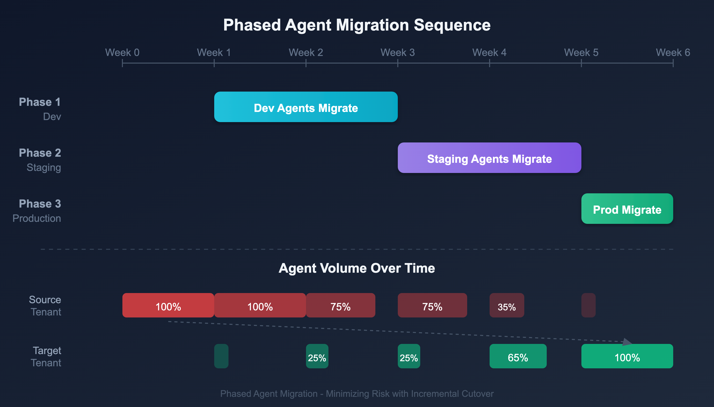

# S2S-04: OneAgent and ActiveGate Cutover

> **Series:** S2S | **Notebook:** 4 of 12 | **Created:** March 2026 | **Last Updated:** 03/23/2026

## Overview

Migrating OneAgents and ActiveGates is the most operationally visible part of a SaaS-to-SaaS migration. Hosts must be reconfigured to report to the target tenant, which requires coordination with application teams, change management, and a clear rollback plan.

> **Operator Version:** This notebook targets Dynatrace Operator **v1.8.1** (February 2026) with DynaKube API **v1beta5/v1beta6**. Operator 1.8.x removes v1beta3 and auto-converts to v1beta6. Both v1beta5 and v1beta6 are supported; v1beta6 adds OTLP exporter configuration.

---

## Table of Contents

1. [Agent Migration Strategies](#agent-strategies)
2. [OneAgent Reconfiguration](#oneagent-reconfiguration)
3. [ActiveGate Migration](#activegate-migration)
4. [Kubernetes Operator Migration](#k8s-operator-migration)
5. [Dynatrace Operator Resource Overhead](#operator-overhead)
6. [Network Zone Reconfiguration](#network-zones)
7. [Rollback Procedures](#rollback-procedures)

---

## Prerequisites

| Requirement | Details |
|-------------|----------|
| **Target Tenant** | Provisioned with OneAgent deployment configured |
| **Dynatrace Operator** | v1.8.1+ (Helm chart `oci://public.ecr.aws/dynatrace/dynatrace-operator`) |
| **DynaKube API** | `dynatrace.com/v1beta5` or `v1beta6` (v1beta3 removed in Operator 1.8.0) |
| **Change Management** | Approved change window for agent cutover |
| **Network** | Target tenant URL reachable from all hosts |
| **Tokens** | PaaS token or installer download token for target tenant |

<a id="agent-strategies"></a>
## 1. Agent Migration Strategies

### Approach Comparison

| Strategy | Description | Risk | Downtime |
|----------|-------------|------|----------|
| **Big Bang** | All agents switch at once | High — no partial rollback | Minutes (config change) |
| **Phased by Host Group** | Migrate host groups one at a time | Low — rollback per group | None (rolling) |
| **Phased by Environment** | Dev → Staging → Production | Lowest — full validation between phases | None (rolling) |
| **Blue-Green** | New agents in target, old agents in source, DNS switch | Lowest — instant rollback | None |

> **Recommendation:** Phased by environment. Migrate dev first, validate for 1-2 weeks, then staging, then production. This gives Davis AI time to establish baselines in the target tenant.


<!-- MARKDOWN_TABLE_ALTERNATIVE
| Phase | Environment | Duration | Validation |
|-------|-------------|----------|------------|
| 1 | Development | Week 1-2 | Baseline establishment |
| 2 | Staging | Week 3-4 | SLO validation |
| 3 | Production | Week 5-6 | Full validation |
-->

<a id="oneagent-reconfiguration"></a>
## 2. OneAgent Reconfiguration

### Using oneagentctl

The `oneagentctl` command-line tool reconfigures a running OneAgent to report to a different tenant:

```bash
# Linux — reconfigure to target tenant
sudo /opt/dynatrace/oneagent/agent/tools/oneagentctl \
  --set-server=https://<target-tenant>.live.dynatrace.com/communication \
  --set-tenant=<target-tenant-id> \
  --set-tenant-token=<target-paas-token>

# Windows — same operation
"C:\ProgramData\dynatrace\oneagent\agent\tools\oneagentctl.exe" ^
  --set-server=https://<target-tenant>.live.dynatrace.com/communication ^
  --set-tenant=<target-tenant-id> ^
  --set-tenant-token=<target-paas-token>

# Verify the change
sudo /opt/dynatrace/oneagent/agent/tools/oneagentctl --get-server
```

> **Note:** The OneAgent restarts its communication after `oneagentctl` changes. Monitored applications are NOT restarted — there is no application downtime.

### Automation at Scale

For large fleets, automate with your configuration management tool:

| Tool | Approach |
|------|----------|
| **Ansible** | Playbook with `command` module running `oneagentctl` |
| **Chef** | Recipe updating OneAgent configuration |
| **Puppet** | Manifest managing OneAgent settings |
| **AWS Systems Manager** | Run Command document across EC2 fleet |
| **Azure Automation** | Runbook executing on VM fleet |
| **GCP OS Config** | Policy applying `oneagentctl` changes |

<a id="activegate-migration"></a>
## 3. ActiveGate Migration

ActiveGates must be reinstalled — they cannot be reconfigured like OneAgents:

| Step | Action | Notes |
|------|--------|-------|
| 1 | Install new ActiveGate in target tenant | Download installer from target tenant UI |
| 2 | Configure network zones (if used) | Match source network zone topology |
| 3 | Configure ActiveGate routing | Point OneAgents to new ActiveGate |
| 4 | Verify connectivity | Check ActiveGate health in target UI |
| 5 | Decommission source ActiveGate | After all OneAgents migrated |

### ActiveGate Types to Migrate

| Type | Migration Path | Notes |
|------|---------------|-------|
| **Environment ActiveGate** | Install new, reconfigure routing | OneAgents auto-discover new AG |
| **Cluster ActiveGate** | Not applicable to SaaS | SaaS does not use Cluster AGs |
| **Synthetic ActiveGate** | Install new, reassign locations | Synthetic monitors must update location references |

<a id="k8s-operator-migration"></a>
## 4. Kubernetes Operator Migration

### Helm Installation for Target Tenant

```bash
# Install Operator v1.8.1 in target cluster
helm upgrade dynatrace-operator oci://public.ecr.aws/dynatrace/dynatrace-operator \
  --version 1.8.1 \
  --create-namespace --namespace dynatrace \
  --install \
  --atomic
```

### DynaKube CR Update

Update the DynaKube custom resource to point to the target tenant:

```yaml
apiVersion: dynatrace.com/v1beta5
kind: DynaKube
metadata:
  name: dynakube
  namespace: dynatrace
spec:
  apiUrl: https://<target-tenant>.live.dynatrace.com/api
  # ... rest of configuration unchanged
```

> **API Version Warning:** Operator 1.8.x removes `v1beta3` and auto-converts existing CRDs to `v1beta6`. Both `v1beta5` and `v1beta6` are supported. If your manifests use `v1beta3`, update to `v1beta5` or `v1beta6` before upgrading. The Operator emits Kubernetes warning events if the CRD version does not match.

### Migration Steps

| Step | Action | Tool |
|------|--------|------|
| 1 | Create `dynatrace` namespace secret with target tenant tokens | kubectl |
| 2 | Update DynaKube CR `apiUrl` to target tenant | kubectl / ArgoCD |
| 3 | Restart Dynatrace Operator | kubectl rollout restart |
| 4 | Verify pods reconnect to target | Target tenant UI |
| 5 | Verify enrichment tags populate | DQL query in target |

### Cloud-Specific K8s Considerations

| Platform | K8s Service | Key Differences |
|----------|-------------|-----------------|
| **AWS** | EKS | IAM roles for service accounts (IRSA) must reference target tenant |
| **Azure** | AKS | Managed Identity or Service Principal for target tenant |
| **GCP** | GKE | Workload Identity mapping for target tenant |
| **On-Prem** | K8s/OpenShift | Network routing to target tenant URL |

<a id="operator-overhead"></a>
## 5. Dynatrace Operator Resource Overhead

When planning capacity for the target cluster, account for the resource overhead introduced by the Dynatrace Operator and its components. These values are from the [Operator v1.8.1 Helm chart defaults](https://github.com/Dynatrace/dynatrace-operator/blob/main/config/helm/chart/default/values.yaml).

### Control Plane Components (per cluster)

| Component | Replicas | CPU Request | CPU Limit | Memory Request | Memory Limit |
|-----------|----------|-------------|-----------|----------------|--------------|
| **Operator** | 1 | 50m | 100m | 64Mi | 128Mi |
| **Webhook** | 2 | 300m each | 300m each | 128Mi each | 128Mi each |
| **Control plane total** | — | **650m** | **700m** | **320Mi** | **384Mi** |

> **Webhook HA:** Operator 1.8.x defaults to 2 webhook replicas with topology spread constraints across zones and nodes, plus a PodDisruptionBudget (`minAvailable: 1`).

### Per-Node DaemonSet Components

| Component | CPU Request | CPU Limit | Memory Request | Memory Limit |
|-----------|-------------|-----------|----------------|--------------|
| **OneAgent** | 100m | 300m | 512Mi | 1.5Gi |
| **CSI Driver (server)** | 50m | 50m | 100Mi | 100Mi |
| **CSI Driver (provisioner)** | 300m | — | 100Mi | — |
| **CSI Driver (registrar)** | 20m | 20m | 30Mi | 30Mi |
| **CSI Driver (livenessprobe)** | 20m | 20m | 30Mi | 30Mi |
| **CSI Driver (init)** | 50m | 50m | 100Mi | 100Mi |
| **Per-node total** | **~540m** | **~440m+** | **~872Mi** | **~1.76Gi** |

### Total Cluster Overhead by Size

| Cluster Size | Control Plane | Node Overhead | Total CPU Request | Total Memory Request |
|-------------|---------------|---------------|-------------------|-----------------------|
| **5 nodes** | 650m | 2,700m | ~3.4 cores | ~4.7 Gi |
| **10 nodes** | 650m | 5,400m | ~6.1 cores | ~9.0 Gi |
| **20 nodes** | 650m | 10,800m | ~11.5 cores | ~17.8 Gi |
| **50 nodes** | 650m | 27,000m | ~27.7 cores | ~44.0 Gi |
| **100 nodes** | 650m | 54,000m | ~54.7 cores | ~87.5 Gi |

> **In practice:** OneAgent typically consumes 50-80m CPU per node under normal load. The 100m request provides headroom for code injection and deep monitoring. For a typical 8-vCPU node, Dynatrace uses about **6-7% of CPU** and **5-6% of memory** in request terms.

### ActiveGate Sizing (if deployed in-cluster)

| Cluster Size | Recommended Replicas | CPU Request (each) | Memory Request (each) |
|-------------|---------------------|--------------------|-----------------------|
| 1-10 nodes | 1 | 500m | 1Gi |
| 11-30 nodes | 2 | 500m | 1Gi |
| 31-50 nodes | 2-3 | 500m | 1.5Gi |
| 50+ nodes | 3+ | 1000m | 2Gi |

### Operator RBAC Roles (v1.8.1)

The Operator Helm chart creates RBAC roles for these components:

| RBAC Role | Purpose | Created by Default |
|-----------|---------|-------------------|
| `activeGate` | ActiveGate deployment management | Yes |
| `kubernetesMonitoring` | K8s API access for metrics | Yes |
| `edgeConnect` | Edge Connect management | Yes |
| `extensions` | Extensions 2.0 (includes Prometheus and database) | Yes |
| `telemetryIngest` | OpenTelemetry/metric ingest | Yes |
| `logMonitoring` | Log monitoring access | Yes |
| `oneAgent` | OneAgent DaemonSet management | Yes |
| `kspm` | Kubernetes Security Posture Management | Yes |

<a id="network-zones"></a>
## 6. Network Zone Reconfiguration

If the source tenant uses network zones, recreate them in the target:

```bash
# Export network zone configuration from source
monaco download manifest.yaml --environment source \
  --specific-settings builtin:networkzones

# Apply to target
monaco deploy manifest.yaml --environment target
```

### Network Zone Mapping

| Source Zone | Target Zone | Hosts | Notes |
|------------|------------|-------|-------|
| `zone-us-east` | `zone-us-east` | 50 | Same name, new tenant |
| `zone-eu-west` | `zone-eu-west` | 30 | Same name, new tenant |
| `zone-dmz` | `zone-dmz` | 10 | ActiveGate routing must be reconfigured |

<a id="rollback-procedures"></a>
## 7. Rollback Procedures

| Scenario | Rollback Action | Impact |
|----------|----------------|--------|
| OneAgent not reporting | Run `oneagentctl` with source tenant parameters | 1-2 minutes per host |
| DynaKube cutover fails | Revert DynaKube CR to source `apiUrl` | Pods reconnect within minutes |
| ActiveGate unhealthy | Point OneAgents back to source AG | Requires AG to still be running |
| Mass rollback needed | Ansible/SSM playbook with source parameters | Fleet-wide in minutes |

> **Critical:** Keep the source tenant running throughout the migration window. Do not decommission source ActiveGates or revoke source tokens until all agents are confirmed in the target.

---

## Next Steps

Continue to **S2S-05: Settings and Configuration Import** to apply exported configuration to the target tenant.

---

<sub>*This notebook was AI-generated from community-submitted and publicly available sources. This notebook series is not officially supported by Dynatrace. Always verify information against official Dynatrace documentation.*</sub>
