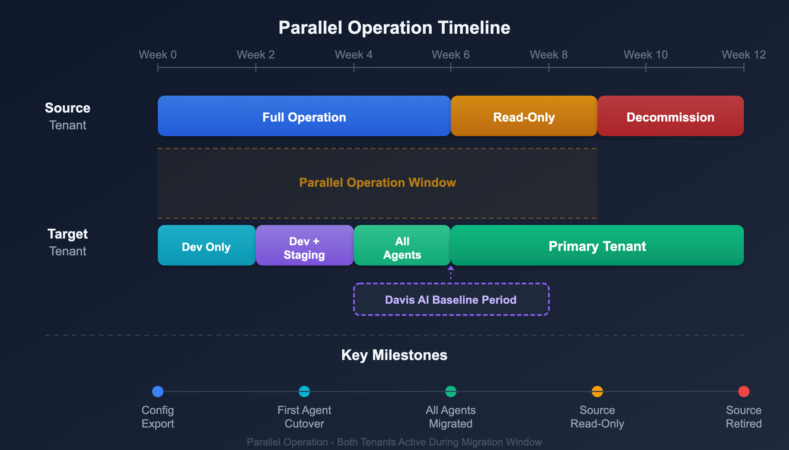

# S2S-09: Data Continuity and Parallel Operation

> **Series:** S2S | **Notebook:** 9 of 12 | **Created:** March 2026 | **Last Updated:** 03/23/2026

## Overview

Historical data cannot be migrated between SaaS tenants. The only way to maintain continuity is to run both tenants in parallel during the transition. This notebook covers parallel operation strategy, SLO baseline establishment, and stakeholder communication.

---

## Table of Contents

1. [Parallel Operation Strategy](#parallel-strategy)
2. [Davis AI Baseline Establishment](#davis-baselines)
3. [SLO Continuity](#slo-continuity)
4. [Stakeholder Communication](#stakeholder-communication)
5. [Cost Management During Parallel Period](#cost-management)

---

## Prerequisites

| Requirement | Details |
|-------------|----------|
| **Both Tenants** | Source and target both active and licensed |
| **Licensing** | Budget for parallel operation (typically 30-90 days) |
| **Monitoring** | At least some agents reporting to target tenant |

## 1. Parallel Operation Strategy

### Timeline

<!-- MARKDOWN_TABLE_ALTERNATIVE
| Week | Source Tenant | Target Tenant | Activity |
|------|-------------|--------------|----------|
| 1-2 | Full monitoring | Dev agents only | Configuration import, baseline start |
| 3-4 | Full monitoring | Dev + Staging agents | SLO validation, dashboard review |
| 5-6 | Full monitoring | All agents | Full parallel, stakeholder validation |
| 7-8 | Read-only | Primary | Cutover complete, source retained for reference |
| 9+ | Decommission | Primary | Source tenant decommissioned |
-->

### Parallel Operation Models

| Model | Description | Duration | Cost |
|-------|-------------|----------|------|
| **Full Parallel** | All agents report to both tenants | 4-8 weeks | 2x host units |
| **Phased Parallel** | Agents migrate in waves (dev → staging → prod) | 6-12 weeks | 1.1-1.5x host units |
| **Reference Parallel** | Source is read-only, target is primary | 2-4 weeks | 1x + read-only cost |

> **Recommendation:** Phased parallel is the best balance of cost and risk. You never have all agents on both tenants simultaneously.

## 2. Davis AI Baseline Establishment

Davis AI needs time to learn normal behavior patterns in the target tenant:

| Baseline Type | Time to Establish | Factors |
|--------------|-------------------|---------|
| Availability | 2-3 days | Binary metric, fast learning |
| Response time | 1-2 weeks | Requires weekday/weekend patterns |
| Error rate | 1-2 weeks | Needs regular traffic patterns |
| Resource utilization | 2-4 weeks | Needs full business cycle |

### Accelerating Baseline Learning

- Migrate dev/staging first to give Davis AI a head start
- Ensure representative traffic reaches services in target
- Avoid migration during atypical periods (holidays, sales events)

## 3. SLO Continuity

SLOs in the target tenant start with no historical evaluation:

| SLO Type | Impact | Mitigation |
|----------|--------|------------|
| Rolling week | 7 days of no data | SLO appears at 0% until data accumulates |
| Rolling month | 30 days of no data | Create with reduced window initially |
| Calendar-based | Varies | Align cutover with calendar boundary |

### Strategy

1. Create SLOs in target with same definitions
2. Set initial evaluation window to match available data (e.g., `ROLLING_3_DAYS`)
3. Expand to full window after sufficient data (e.g., `ROLLING_WEEK`)
4. Document the baseline gap for stakeholders

## 4. Stakeholder Communication

### Communication Plan

| Audience | When | Message |
|----------|------|---------|
| Engineering teams | 4 weeks before | "Migration timeline, agent cutover schedule, expected impacts" |
| SRE/On-call | 2 weeks before | "Alert routing changes, dual-tenant monitoring during transition" |
| Management | 1 week before | "SLO baseline gap, Davis AI relearning period, risk mitigation" |
| All users | Day of cutover | "New tenant URL, SSO changes, bookmark updates" |

### Expected Impact Summary

| Item | Impact | Duration |
|------|--------|----------|
| Davis AI alerts | May fire false positives during baseline learning | 2-4 weeks |
| SLO reporting | Gap in historical evaluation | 7-30 days |
| Dashboards | Some tiles may show "No data" initially | Hours to days |
| Problem history | Not available in target | Permanent (document key problems) |

## 5. Cost Management During Parallel Period

| Strategy | Savings | Trade-off |
|----------|---------|-----------|
| Migrate dev first, decommission source dev | Early savings | Less parallel validation |
| Negotiate parallel license with Dynatrace | Significant | Requires contract discussion |
| Use DPS licensing model | Pay-per-use | Cost scales with actual usage |
| Reduce source to monitoring-only | Reduced DPS consumption | No alerting from source |

---

## Next Steps

Continue to **S2S-10: SLO and Alerting Migration** to configure SLOs and notification rules in the target tenant.

---

*This notebook was AI-generated from community-submitted and publicly available sources. This notebook series is not officially supported by Dynatrace. Always verify information against official Dynatrace documentation.*
