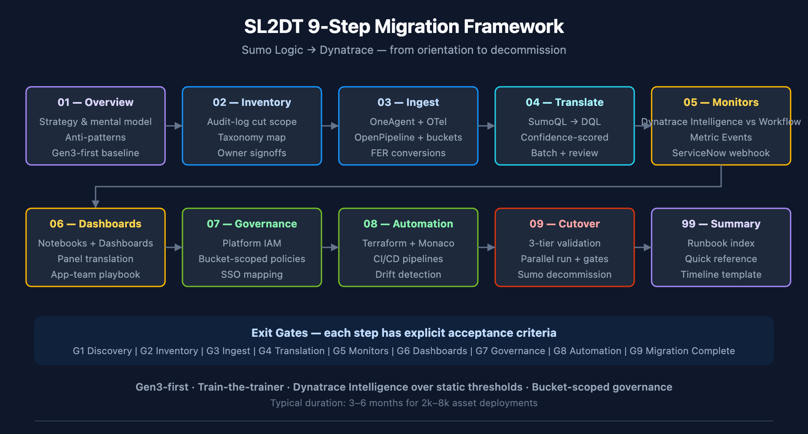

# SL2DT-01: Overview & Migration Strategy

> **Series:** SL2DT — Sumo Logic to Dynatrace | **Notebook:** 1 of 10 | **Created:** April 2026 | **Last Updated:** 04/26/2026

## Overview

**Goal of this notebook:** establish the strategy, mental model, and vocabulary for migrating from Sumo Logic to Dynatrace. Every decision in the following nine notebooks ladders up to a choice made here.

This is not a how-to. It is the *why* — why Gen3, why Anomaly Detection over lift-and-shift thresholds, why train-the-trainer, why a bucket-plus-attribute `_sourceCategory` strategy, why OpenPipeline at ingest rather than parsing at query time.

**Scope:** logs, dashboards, monitors, scheduled searches, Field Extraction Rules. Metrics and traces are addressed where they intersect log migration. Cloud SIEM migration is explicitly out of scope — it is a separate workstream.

### Sprint 1.337 (April 2026) Updates Affecting SL2DT

Three sprint-1.337 changes simplify the Sumo Logic → Dynatrace migration:

1. **OneAgent primary fields/tags at the source.** Hosts now emit standardized fields (`dt.security_context`, `dt.cost.costcenter`, `dt.cost.product`) and customer-defined primary tags as top-level attributes on every signal — eliminating a class of OpenPipeline parse processors needed during the Sumo→DT cut. See SL2DT-03 (Log Ingest Architecture) for the ingest-time configuration.
2. **OpenPipeline extraction processor recommended-field suggestions.** When converting Sumo Field Extraction Rules (FERs) to OpenPipeline DPL processors (SL2DT-03), the UI now flags permission-relevant fields and Smartscape identifiers — preventing the most common misconfiguration: promoting sensitive content into a permission-relevant position.
3. **Configuration API → Settings v2 acceleration + Platform tokens.** New automation (SL2DT-08) should target Settings v2 paths and use Platform tokens (`dt0s16`/`dt0s01`, `Authorization: Bearer`). Classic `dt0c01` still works for legacy paths but is not the default for new pipelines.

These changes reinforce — they don't change — the Gen3-first migration baseline documented in this series.

---

---

## Table of Contents

1. [Why This Series Exists](#why)
2. [Platform Mental Model — Sumo vs Dynatrace](#mental-model)
3. [The Five-Wave Migration Pattern](#waves)
4. [Train-the-Trainer Delivery Model](#train-trainer)
5. [MVP vs Full Fidelity — The Cut-Scope Decision](#mvp)
6. [Anti-Patterns to Avoid](#anti-patterns)
7. [Success Criteria](#success)
8. [What to Read Next](#next)

---

## Prerequisites

| Requirement | Details |
|-------------|---------|
| **Audience** | Migration lead + architects scoping the engagement |
| **Format** | Orientation — read before any hands-on work |
| **Prior knowledge** | Sumo Logic search experience (helpful); Dynatrace fundamentals (ONBRD-01) |
| **Tenant** | Not required for this notebook |

## 1. Why This Series Exists

Sumo-to-Dynatrace migrations fail for predictable reasons:

| Failure mode | Why it happens | Mitigation (which notebook addresses it) |
|--------------|----------------|------------------------------------------|
| 1:1 lift-and-shift of static thresholds | Teams treat Dynatrace as "Sumo with a different UI" | SL2DT-05 anomaly detection framework |
| `_sourceCategory` chaos post-migration | No upfront taxonomy decision | SL2DT-02 inventory, SL2DT-03 ingest design |
| Dashboards migrate but nobody uses them | Dashboard inventory wasn't audit-log-pruned | SL2DT-02 cut-scope analysis |
| Monitors fire too much | DQL anomaly baseline needs different tuning than Sumo thresholds | SL2DT-05 tuning playbook |
| Governance gap at cutover | Sumo role model doesn't map 1:1 to IAM | SL2DT-07 role mapping |
| Parallel-run runs too long | No validation exit criteria defined | SL2DT-09 cutover runbook |

This series is the procedural spine that prevents those failures.

<!-- MARKDOWN_TABLE_ALTERNATIVE
| Step | Notebook | Output |
|------|----------|--------|
| 1 Orient | SL2DT-01 | Strategy, mental model |
| 2 Inventory | SL2DT-02 | Asset inventory + cut scope |
| 3 Ingest | SL2DT-03 | OpenPipeline + bucket design |
| 4 Translate | SL2DT-04 | SumoQL → DQL translation |
| 5 Monitors | SL2DT-05 | Alerts + anomaly detection framework |
| 6 Dashboards | SL2DT-06 | Dashboard conversion |
| 7 Governance | SL2DT-07 | IAM + bucket-scoped policies |
| 8 Automation | SL2DT-08 | Monaco/Terraform/CI |
| 9 Cutover | SL2DT-09 | Parallel run, validation, decommission |
| Summary | SL2DT-99 | Runbook index + timeline template |
For environments where SVG doesn't render
-->

## 2. Platform Mental Model — Sumo vs Dynatrace

The platforms solve the same problem differently. Mapping the concepts is the first job.

| Sumo Logic Concept | Dynatrace Equivalent | Notes |
|---------------------|----------------------|-------|
| `_sourceCategory` (taxonomy) | Grail bucket + optional attribute | Plan in SL2DT-03 |
| Hosted Collector | OneAgent / OTel Collector / OpenPipeline endpoint | Per-source choice |
| Installed Collector | OneAgent on host | Auto-instrumented |
| Source (file/stream config) | OneAgent log source config or OTel receiver | Ingest-side |
| Partition | Bucket (Grail) | Retention + IAM boundary |
| Index (field index) | — (Grail indexes all fields) | No manual index management |
| Field Extraction Rule | OpenPipeline processor | DPL pattern |
| Saved Search | Notebook section or Workflow DQL task | |
| Scheduled Search | Workflow with cron trigger + DQL + action | |
| Monitor (threshold) | Workflow with DQL + threshold, or anomaly detection | Prefer Dynatrace Intelligence |
| Monitor (outlier/anomaly) | Anomaly Detection | Native |
| Dashboard | Notebook or Dashboard (DT) | 1:1 in most cases |
| Dashboard Panel | DQL section within notebook/dashboard | |
| Lookup Table | Grail Lookup Table (Resource Store API) | |
| Role (RBAC) | Platform IAM Group + Policy | |
| Role Search Filter | Policy with bucket filter | |
| Data Volume Alert | Bucket retention + cost per bucket | |

**Load-bearing concept:** `_sourceCategory`. Everything downstream depends on how it's mapped. SL2DT-03 walks through the three strategies (bucket / attribute / entity tag) with a decision framework.

## 3. The Five-Wave Migration Pattern

Migrate in waves, not a single big-bang. Each wave has entry criteria, exit criteria, and owners.

| Wave | Asset Class | Entry Criteria | Exit Criteria | Typical Duration |
|------|-------------|----------------|---------------|-------------------|
| **Wave 0** | Inventory + cut scope | Sumo audit-log pulled | Cut scope signed off by owners | 2 weeks |
| **Wave 1** | Ingest + OpenPipeline + buckets | Wave 0 complete; taxonomy chosen | All high-volume sources dual-writing | 3–4 weeks |
| **Wave 2** | Core monitors (top-10 business-critical) | Wave 1 complete; dual ingest running | First 10 monitors validated | 2 weeks |
| **Wave 3** | Dashboards (high-usage only) | Wave 2 complete | Top-N dashboards live + users trained | 3–4 weeks |
| **Wave 4** | Remaining monitors + dashboards (app teams) | Wave 3 complete; train-the-trainer done | Signoff per team | 6–8 weeks |
| **Wave 5** | Cutover + Sumo decommission | All waves validated; parallel run window elapsed | Sumo contract terminated | 2–3 weeks |

**Critical waves:** Wave 0 (inventory) and Wave 1 (ingest parity). These are gating — nothing downstream works without them.

**Parallelizable:** Waves 2 and 3 can overlap with Wave 4 for app teams who are ready early. Coordinate through the migration PM.

## 4. Train-the-Trainer Delivery Model

For engagements with 50+ teams and 100+ power users, direct delivery doesn't scale. Use train-the-trainer:

1. **Core migration team** (typically SREs, 4–8 engineers) learns Dynatrace deeply — SL2DT-04 through SL2DT-08.
2. **Core team demonstrates** by migrating 5 representative real-world assets per domain:
   - 1–2 dashboards
   - 2–3 monitors (mix of static + anomaly)
   - 1 scheduled search
   - 1 FER → OpenPipeline processor
3. **Core team documents** the translation as a worked example, commits to a shared repo.
4. **App teams convert their own assets** using the examples as templates. Each team delivers a PR for core-team review.
5. **Core team reviews + approves** — becomes the gate for decommissioning the Sumo-side asset.

This pattern is proven in the NR2DT migrations (NRLC-01 through NRLC-09 apply the same model). Don't skip the review step — it is where best-practice violations get caught before they proliferate.

### Why App Teams Resist (and How to Handle It)

Ownership matters. App teams see monitor conversion as "more work without new value." Common patterns:

- **"Just recreate my static threshold"** — App team wants to copy the number from Sumo without evaluating if anomaly detection would reduce noise. Push back with data (SL2DT-05 provides the framework).
- **"I'll do it later"** — App team defers, risking cutover date. Migration PM tracks team-by-team progress in a shared burn-down.
- **"The translation tool got it wrong"** — App team dismisses low-confidence output without engaging. Core team's review role includes translation debugging (SL2DT-04).

## 5. MVP vs Full Fidelity — The Cut-Scope Decision

Migrations fail when the scope is "everything in Sumo." A typical Sumo deployment has 5,000–10,000 dashboards and monitors; audit logs routinely show that 70–80% of them haven't been accessed in 90+ days.

**The cut-scope decision is a project-plan make-or-break.** Get it wrong in either direction:

| Direction | Symptom | Consequence |
|-----------|---------|-------------|
| Too aggressive | Cut assets that are actually used quarterly | Escalations post-cutover; trust damaged |
| Too permissive | Everything migrates | Budget overrun; team burnout; low-value assets dominate review cycles |

### Decision Framework

Pull the Sumo audit log. For each asset, record:

- **Last accessed date** — if > 90 days, candidate for cut
- **Unique users** — if 1 user, candidate for "personal" (migrate only if owner requests)
- **Team ownership** — if team is dissolved / reorg'd, re-assign or retire
- **Complexity** — scripts/schedules add migration cost; weigh against usage

Present the cut list to each team owner. Require explicit signoff on cut vs migrate vs retire.

**Output:** `cut-scope.md` — your audit trail for every retired asset. Commit it.

## 6. Anti-Patterns to Avoid

Six anti-patterns recur in every Sumo-to-Dynatrace migration. Watch for them from day one.

### 6.1 Lift-and-Shift Static Thresholds

App teams' first instinct is to copy the `> 100` threshold from Sumo to Dynatrace. This is wrong in two ways:

1. **Baseline differs.** Dynatrace's ingest path (OneAgent + OpenPipeline) may produce slightly different metric values than Sumo. 100 in Sumo ≠ 100 in DT.
2. **Dynatrace Intelligence is better.** For 80%+ of static-threshold monitors, Anomaly Detection produces fewer false positives and catches real anomalies that static thresholds miss.

**Fix:** SL2DT-05 has a decision framework — "when does static win vs Dynatrace Intelligence."

### 6.2 `_sourceCategory` Flat-Mapped to a Single Field

Tempting: "just put `_sourceCategory` as a custom attribute, queries work the same." Problems:

- No bucket isolation → one noisy team's logs bloat your high-retention bucket
- IAM can't use the attribute for policy filtering (some versions)
- Cost allocation is per-bucket, not per-attribute

**Fix:** SL2DT-03 covers the mixed bucket + attribute strategy.

### 6.3 Parsing at Query Time Instead of Ingest Time

Sumo's FERs parse at ingest. Teams sometimes skip this step in DT and use `parse content, ...` in every dashboard query.

- Ingest-time parsing = parsed fields indexed and queryable
- Query-time parsing = re-parsed on every execution, slower, no structured index

**Fix:** SL2DT-03 + SL2DT-04 — FER equivalents go into OpenPipeline.

### 6.4 Dashboard Sprawl

Cutting 8,000 dashboards to 2,000 is still too many. Target is under 500 for most organizations, with clear ownership per dashboard.

**Fix:** SL2DT-02 cut scope + SL2DT-06 dashboard consolidation.

### 6.5 "We'll Figure Out IAM at the End"

Bucket and policy decisions made late force re-ingest. IAM is Wave 1, not Wave 5.

**Fix:** SL2DT-07 is intentionally placed mid-series to cue you: don't defer governance.

### 6.6 Running Sumo + DT in Parallel Forever

"Parallel run" is a validation window, not an architecture. Cost doubles. Teams bifurcate. The cutover date must be a commitment, not aspirational.

**Fix:** SL2DT-09 defines explicit exit criteria for the parallel-run window.

## 7. Success Criteria for the Migration

| Dimension | Metric | Target |
|-----------|--------|--------|
| **Monitor fidelity** | % of Sumo monitors with Dynatrace equivalent (validated) | ≥ 95% |
| **Dashboard fidelity** | % of in-scope dashboards recreated and validated | ≥ 90% |
| **Query translation confidence** | % of SumoQL translated at HIGH confidence | ≥ 75% |
| **Dynatrace Intelligence adoption** | % of new monitors that use anomaly detection (vs static) | ≥ 40% |
| **Alert noise reduction** | DT alert count during parallel-run vs Sumo baseline | ≤ Sumo baseline |
| **Team signoff** | % of app teams signed off by cutover date | 100% |
| **Cost target** | DT + parallel Sumo cost tracking vs budget | within 110% |
| **Cutover date** | Sumo contract termination | on or before target date |

Track these on a weekly dashboard during Waves 2–4. Use Anomaly Detection on the alert-count metric itself to catch regressions.

## 8. What to Read Next

- **SL2DT-02 — Assessment & Inventory** — pull the Sumo audit log, produce cut scope
- **SL2DT-03 — Log Ingest Architecture** — `_sourceCategory` mapping, bucket design, OneAgent + OTel + OpenPipeline

If you're just here for a specific question:

- Query translation? → SL2DT-04 and the `sumoql-to-dql` skill
- Monitor conversion? → SL2DT-05
- Automation? → SL2DT-08

### Companion assets

- [sumoql-to-dql skill](/Users/Shared/GitHub/CLAUDE/Claude-AI-Template/SKILLS/sumoql-to-dql/SKILL.md) — translation tables
- [SL2DT AGENT-TASKS.md](../docs/AGENT-TASKS.md) — brief for building the `Dynatrace-SumoLogic` migration tool
- [NR2DT series](../../nr2dt/) — parallel pattern for New Relic migrations
- [S2D series](../../s2d/) — parallel pattern for Splunk migrations

---

*This notebook was AI-generated from community-submitted and publicly available sources. This notebook series is not officially supported by Dynatrace or Sumo Logic. Always verify information against the official [Dynatrace documentation](https://docs.dynatrace.com/docs) and [Sumo Logic documentation](https://help.sumologic.com/docs/).*
