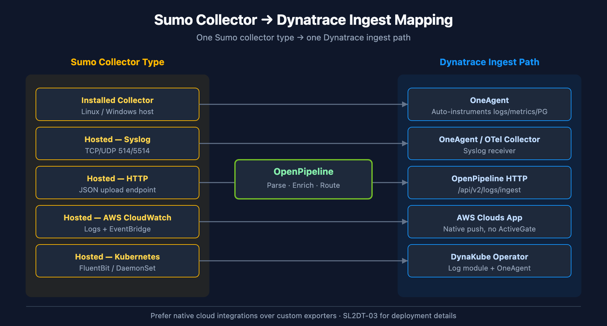

# SL2DT-02: Assessment & Inventory

> **Series:** SL2DT | **Notebook:** 2 of 10 | **Created:** April 2026 | **Last Updated:** 04/21/2026

## Overview

**Goal of this step:** produce a complete inventory of the source Sumo Logic account and a cut-scope decision artifact before any migration work begins. The cut-scope decision is the single biggest cost driver — get it right here and the rest of the migration is proportional to actual business value.

Everything downstream (SL2DT-03 ingest design, SL2DT-04 translation pass, SL2DT-05 monitors, SL2DT-06 dashboards) depends on the inventory and taxonomy maps produced in this notebook.

---

## Table of Contents

1. [What You'll Produce](#outputs)
2. [Prerequisites & Access](#access)
3. [Pull the Sumo Inventory](#inventory)
4. [Pull the Audit Log — Usage-Based Cut Scope](#audit)
5. [Map `_sourceCategory` Taxonomy](#taxonomy)
6. [Inventory Collectors & Ingest Paths](#collectors)
7. [Inventory FERs (Field Extraction Rules)](#fers)
8. [Inventory Roles & Users](#rbac)
9. [Cut-Scope Decision Workshop](#cut)
10. [Step Exit Criteria](#gate)

---

## Prerequisites

| Requirement | Details |
|-------------|---------|
| **Audience** | Migration lead + Sumo admin |
| **Format** | Procedural — produce six artifacts checked into migration repo |
| **Sumo access** | Admin role, access key + access ID generated |
| **Dynatrace access** | Not required yet — SL2DT-03 onward |
| **Prior reading** | SL2DT-01 for strategy and cut-scope framework |

<a id="outputs"></a>
## 1. What You'll Produce

By the end of this step, commit these artifacts:

| Artifact | Format | Purpose |
|----------|--------|---------|
| `inventory/dashboards.json` | JSON | Every dashboard, panels, queries |
| `inventory/monitors.json` | JSON | Every monitor, threshold config, action |
| `inventory/searches.json` | JSON | Saved searches + scheduled searches |
| `inventory/fers.json` | JSON | Field Extraction Rules |
| `inventory/collectors.json` | JSON | Collector + source inventory |
| `inventory/roles.json` + `users.json` | JSON | RBAC model |
| `inventory/audit-usage.csv` | CSV | Usage data — last access per asset |
| `taxonomy-map.md` | Markdown | `_sourceCategory` → bucket/attribute/tag decision |
| `cut-scope.md` | Markdown | Per-asset migrate/retire/cut decision + owner signoff |
| `inventory-report.md` | Markdown | Executive summary — counts, cut-scope %, risk register |

These gate SL2DT-03. Do not proceed without cut-scope signoff.

<a id="access"></a>
## 2. Prerequisites & Access

### Sumo Access Keys

In Sumo Admin → Security → Access Keys, create a pair with admin scope (for inventory + audit log). Do **not** reuse user credentials.

```bash
export SUMO_ACCESS_ID="..."
export SUMO_ACCESS_KEY="..."
export SUMO_REGION="us2"   # or us1, eu, au, jp, in, de, ca, fed
```

Region maps to the API base URL:

| Region | API base |
|--------|----------|
| us1 | `https://api.sumologic.com` |
| us2 | `https://api.us2.sumologic.com` |
| eu | `https://api.eu.sumologic.com` |
| au | `https://api.au.sumologic.com` |
| ... | see Sumo docs for full list |

Auth: `Authorization: Basic <base64(access_id:access_key)>`

### Migration Repo

```bash
mkdir sumo-migration && cd sumo-migration
git init
mkdir inventory
echo "SUMO_ACCESS_ID=" > .env.example
echo "SUMO_ACCESS_KEY=" >> .env.example
echo "SUMO_REGION=us2" >> .env.example
cp .env.example .env  # populate
echo ".env" > .gitignore
```

<a id="inventory"></a>
## 3. Pull the Sumo Inventory

Pull each asset class via the Content API. Save each to `inventory/<type>.json`.

### 3.1 Dashboards

```bash
# List dashboards (paginated)
curl -u "$SUMO_ACCESS_ID:$SUMO_ACCESS_KEY" \
  "https://api.$SUMO_REGION.sumologic.com/api/v2/dashboards?limit=200" \
  > inventory/dashboards-list.json

# For each, fetch full definition (requires dashboard ID)
jq -r '.dashboards[].id' inventory/dashboards-list.json | while read id; do
  curl -u "$SUMO_ACCESS_ID:$SUMO_ACCESS_KEY" \
    "https://api.$SUMO_REGION.sumologic.com/api/v2/dashboards/$id" \
    > "inventory/dashboards/$id.json"
done
```

### 3.2 Monitors

```bash
curl -u "$SUMO_ACCESS_ID:$SUMO_ACCESS_KEY" \
  "https://api.$SUMO_REGION.sumologic.com/api/v1/monitors" \
  > inventory/monitors.json
```

### 3.3 Saved & Scheduled Searches

```bash
# Saved searches live in user/folder content hierarchy
curl -u "$SUMO_ACCESS_ID:$SUMO_ACCESS_KEY" \
  "https://api.$SUMO_REGION.sumologic.com/api/v2/content/folders/personal" \
  > inventory/content-personal.json

# Walk folder tree, save each search. Scheduled searches have a `searchSchedule` field.
```

### 3.4 FERs, Collectors, Partitions, Roles, Users

```bash
curl -u "$SUMO_ACCESS_ID:$SUMO_ACCESS_KEY" \
  "https://api.$SUMO_REGION.sumologic.com/api/v1/extractionRules" \
  > inventory/fers.json

curl -u "$SUMO_ACCESS_ID:$SUMO_ACCESS_KEY" \
  "https://api.$SUMO_REGION.sumologic.com/api/v1/collectors" \
  > inventory/collectors.json

curl -u "$SUMO_ACCESS_ID:$SUMO_ACCESS_KEY" \
  "https://api.$SUMO_REGION.sumologic.com/api/v1/partitions" \
  > inventory/partitions.json

curl -u "$SUMO_ACCESS_ID:$SUMO_ACCESS_KEY" \
  "https://api.$SUMO_REGION.sumologic.com/api/v1/roles" \
  > inventory/roles.json

curl -u "$SUMO_ACCESS_ID:$SUMO_ACCESS_KEY" \
  "https://api.$SUMO_REGION.sumologic.com/api/v1/users" \
  > inventory/users.json
```

### 3.5 Summary Counts

Record these numbers — they drive the wave plan in SL2DT-01:

```bash
echo "Dashboards:  $(jq '.dashboards | length' inventory/dashboards-list.json)"
echo "Monitors:    $(jq '.monitors | length' inventory/monitors.json)"
echo "FERs:        $(jq '.data | length' inventory/fers.json)"
echo "Collectors:  $(jq '.collectors | length' inventory/collectors.json)"
echo "Partitions:  $(jq '.data | length' inventory/partitions.json)"
echo "Roles:       $(jq '.data | length' inventory/roles.json)"
echo "Users:       $(jq '.data | length' inventory/users.json)"
```

<a id="audit"></a>
## 4. Pull the Audit Log — Usage-Based Cut Scope

**The cut-scope decision depends on this data.** Pull the last 90 days of audit events that show dashboard/monitor access.

Sumo stores audit events in a special index. Query via the Search Job API:

```bash
# Create search job
curl -X POST -u "$SUMO_ACCESS_ID:$SUMO_ACCESS_KEY" \
  -H "Content-Type: application/json" \
  "https://api.$SUMO_REGION.sumologic.com/api/v1/search/jobs" \
  -d '{
    "query": "_sourceCategory=\"audit\" (eventName=DashboardViewed OR eventName=MonitorRead)",
    "from": "2026-01-21T00:00:00Z",
    "to":   "2026-04-21T00:00:00Z",
    "timeZone": "UTC"
  }'

# Poll, then download messages. See Sumo API docs for job polling protocol.
```

Export to CSV:

| dashboard_id | dashboard_name | unique_users_90d | last_accessed | access_count_90d |
|--------------|----------------|------------------|---------------|-------------------|
| abc123 | "Prod API Overview" | 12 | 2026-04-20 | 847 |
| def456 | "Old Migration Dash" | 0 | — | 0 |
| ... | ... | ... | ... | ... |

### Classification Rules

Based on last-90-day data:

| Classification | Rule |
|----------------|------|
| **Migrate** | Last accessed ≤ 30d AND unique_users_90d ≥ 2 |
| **Migrate-on-request** | Last accessed 31–90d OR unique_users_90d == 1 |
| **Cut** | Not accessed in 90d+ |
| **Retire** | Team dissolved / owner gone / superseded |

Typical outcome: 20–30% migrate, 10–20% migrate-on-request, 40–60% cut, 5–10% retire. Your mileage will vary — a regulated-industry customer may have compliance constraints requiring 100% audit-trail-preservation.

<a id="taxonomy"></a>
## 5. Map `_sourceCategory` Taxonomy

Pull distinct `_sourceCategory` values and their volumes:

```sumoql
*
| count by _sourceCategory
| sort by _count desc
```

Export to CSV. For each top-100 `_sourceCategory` value, decide:

1. **Bucket mapping** — which Dynatrace Grail bucket does this belong to?
2. **Attribute preservation** — is the `_sourceCategory` value itself queryable post-migration (yes, via OpenPipeline enrichment)?
3. **Retention tier** — what retention period applies?

Output: `taxonomy-map.md`

```markdown
| _sourceCategory Pattern | Target Bucket | Retention | Notes |
|-------------------------|----------------|-----------|-------|
| prod/api/* | custom_logs_prod | 90d | High-volume, regulated |
| prod/web/* | custom_logs_prod | 90d | |
| prod/db/* | custom_logs_prod_db | 180d | Compliance hold |
| preprod/* | custom_logs_preprod | 30d | Low retention |
| dev/* | custom_logs_dev | 7d | Dev-only |
| audit/* | audit_logs | 365d | Compliance |
```

**Decision framework — three strategies:**

| Strategy | Pick when |
|----------|-----------|
| **A — Bucket-primary** | Retention/cost tiers differ per scope; IAM boundaries align with scope |
| **B — Attribute-primary** | Retention uniform; query-time grouping more important than isolation |
| **C — Entity-tag** | `_sourceCategory` tracks host/app ownership (not content type) |

Most customers end up with **A + B**: bucket for coarse isolation, attribute preservation for query-time grouping. See SL2DT-03 for implementation.

<a id="collectors"></a>
## 6. Inventory Collectors & Ingest Paths

Every Sumo Collector needs a Dynatrace ingest equivalent. Classify each:

| Collector Type | Dynatrace Target |
|----------------|------------------|
| Installed (Linux/Windows host) | OneAgent (auto-instruments logs + metrics + processes) |
| Hosted (log upload endpoint) | OpenPipeline HTTP endpoint |
| Hosted (syslog listener) | Dynatrace Syslog ingest (OneAgent or OTel Collector) |
| Hosted (AWS CloudWatch) | Dynatrace AWS Clouds app (native integration) |
| Hosted (Azure EventHub) | Dynatrace Azure cloud integration |
| Hosted (GCP Pub/Sub) | Dynatrace GCP cloud integration |
| Hosted (Kubernetes) | DynaKube + OneAgent + log module |
| Hosted (HTTP source) | OpenPipeline HTTP endpoint or OTel HTTP receiver |

For each collector, document:

- Source format (JSON, plain text, structured)
- Typical volume (MB/day)
- Parse rules applied (FER references)
- Owning team
- Retention policy

**Output:** `inventory/collectors-mapping.md` — one row per collector with target.



<!-- MARKDOWN_TABLE_ALTERNATIVE
| Sumo Collector | DT Ingest Path | Notes |
|----------------|----------------|-------|
| Installed — Host | OneAgent | Auto-instruments |
| Hosted — Syslog | OneAgent / OTel | Syslog receiver |
| Hosted — HTTP | OpenPipeline HTTP | Direct ingest |
| Hosted — AWS | AWS Clouds app | Native |
| Hosted — Azure | Azure integration | Native |
| Hosted — K8s | DynaKube + logs | Operator-managed |
For environments where SVG doesn't render
-->

<a id="fers"></a>
## 7. Inventory FERs (Field Extraction Rules)

FERs are parse rules applied at ingest. Every FER becomes an OpenPipeline processor.

For each FER, record:

- Scope (which `_sourceCategory` pattern does it match)
- Parse expression (Sumo regex syntax)
- Output fields (which fields it extracts)
- Target OpenPipeline pipeline (based on `_sourceCategory` → bucket mapping)

**Output:** `inventory/fers-mapping.md`

```markdown
| FER Name | Scope | Parse Expression | Output Fields | Target DT Pipeline |
|----------|-------|------------------|---------------|---------------------|
| api-parse-req | prod/api/* | `(?<method>\w+) (?<path>\S+) (?<status>\d+)` | method, path, status | logs_prod_pipeline |
| audit-parse | audit/* | ... | user, action, target | audit_pipeline |
```

The translation work happens in SL2DT-03 (OpenPipeline implementation) and SL2DT-04 (DPL pattern conversion from Sumo regex).

<a id="rbac"></a>
## 8. Inventory Roles & Users

Pull Sumo's role inventory. For each role:

- Name + description
- Search filter (`_sourceCategory=prod/*`, etc.) — this maps to bucket filter in DT
- Capabilities (view, manage dashboards, manage monitors, admin) — maps to IAM policy permissions
- Assigned users count

**Output:** `inventory/rbac-mapping.md`

```markdown
| Sumo Role | Search Filter | Capabilities | User Count | Target DT Group | Target DT Policy |
|-----------|---------------|--------------|------------|-----------------|-------------------|
| prod-readers | _sourceCategory=prod/* | Read-only | 82 | g-prod-readers | p-prod-read (bucket: custom_logs_prod) |
| prod-admins | _sourceCategory=prod/* | Full | 6 | g-prod-admins | p-prod-admin |
| app-team-api | _sourceCategory=prod/api/* | Read + dashboard mgmt | 28 | g-app-team-api | p-app-team-api |
```

SSO mapping: if Sumo uses SSO (SAML / OIDC), the same IdP can feed Platform IAM Group assignments. Document SSO config in `inventory/sso-config.md`.

See SL2DT-07 for full IAM translation.

<a id="cut"></a>
## 9. Cut-Scope Decision Workshop

Run a structured workshop with each team owner. Present:

1. Their dashboards/monitors with usage data
2. Cut-scope classification (migrate / migrate-on-request / cut / retire)
3. Required signoff per classification

### Workshop Format

- 90 minutes per team (larger teams may need 2–3 sessions)
- Pre-read: team-specific `cut-scope-{team}.md` with sorted usage table
- In-session: walk through exception list, capture decisions
- Post-session: owner signs committed list

### Decision Capture

```markdown
# Cut Scope — Team: Payments Platform

## Signed off by: Jane Doe (Team Lead) on 2026-04-25

### Migrate (12)
- dashboard_id_1 — "Payments API Overview"
- monitor_id_2 — "Failed Transactions > 100/min"
- ...

### Migrate-on-request (5) — revisit Wave 4
- dashboard_id_7 — "Old QA Dashboard" (owner: "maybe useful, revisit before Wave 4")
- ...

### Cut (34)
- dashboard_id_11 — "Superseded by DataDog POC" (not accessed in 6mo)
- ...

### Retire (2)
- monitor_id_55 — Legacy card network integration (deprecated 2024)
- ...
```

Commit these to the migration repo. This is the audit trail for every decision.

### Aggregate Metrics

Roll up across teams:

| Team | Total Assets | Migrate | Migrate-on-request | Cut | Retire |
|------|--------------|---------|--------------------|-----|--------|
| Payments | 53 | 12 | 5 | 34 | 2 |
| Identity | 41 | 14 | 7 | 18 | 2 |
| ... | ... | ... | ... | ... | ... |
| **Total** | **2,847** | **612** | **241** | **1,732** | **262** |

Present aggregate to the executive sponsor. This is the basis for the migration budget.

<a id="gate"></a>
## 10. Step Exit Criteria

**G2 — Inventory + Cut-Scope Complete**

All must be true:

- [ ] All 6 inventory JSON files written + committed
- [ ] `audit-usage.csv` pulled for last 90 days
- [ ] `taxonomy-map.md` populated with top-100 `_sourceCategory` → target bucket mappings
- [ ] `cut-scope.md` signed off by every team owner
- [ ] Aggregate cut-scope metrics presented to sponsor
- [ ] `inventory-report.md` includes: counts, cut %, risks, timeline implications

If any check fails, do not proceed to SL2DT-03. Fix the gap first.

**Next step:** **SL2DT-03 — Log Ingest Architecture** (bucket design, OneAgent + OTel + OpenPipeline deployment, FER → processor conversion).

---

<sub>*This notebook was AI-generated from community-submitted and publicly available sources. This notebook series is not officially supported by Dynatrace or Sumo Logic. Always verify information against the official [Dynatrace documentation](https://docs.dynatrace.com/docs) and [Sumo Logic documentation](https://help.sumologic.com/docs/).*</sub>
