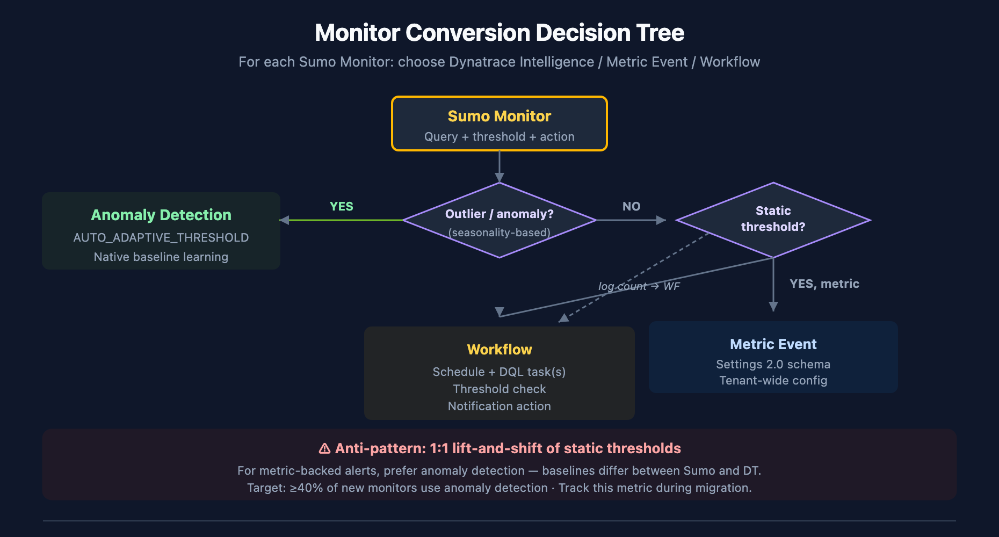

# SL2DT-05: Monitor & Alert Conversion

> **Series:** SL2DT — Sumo Logic to Dynatrace | **Notebook:** 5 of 11 | **Created:** April 2026 | **Last Updated:** 07/20/2026

## Overview

**Goal of this step:** rebuild Sumo Monitors in Dynatrace, choosing the right target for each (Anomaly Detection, Workflow with DQL threshold, or Metric Event). This is the notebook where the biggest fidelity-vs-better-approach decisions happen.

The anti-pattern to avoid: 1:1 static-threshold lift-and-shift. It produces noisy alerts, misses real anomalies, and under-uses Dynatrace's capabilities. The pattern to prefer: Anomaly Detection for metric-backed alerts, Workflows for complex multi-condition logic, and Metric Events for simple static thresholds that genuinely are static.

---

## Table of Contents

1. [What You'll Produce](#outputs)
2. [The Monitor Conversion Decision Framework](#framework)
3. [Anomaly Detection — When & How](#davis)
4. [Metric Events — Simple Static Thresholds](#metric-events)
5. [Workflows — Complex or Multi-Condition Alerts](#workflows)
6. [Rebuilding Notification Actions](#actions)
7. [Handling Rare Alert Classes](#rare)
8. [Tuning & Noise Reduction](#tuning)
9. [Step Exit Criteria](#gate)

---

## Prerequisites

| Requirement | Details |
|-------------|---------|
| **Audience** | Core migration engineers + app-team reviewers |
| **Inputs** | `inventory/monitors.json`, translations from SL2DT-04 |
| **Dynatrace access** | Platform Token with `settings:objects:write`, `automation:workflows:write`, `davis:anomaly-detectors:write` |
| **Prior reading** | SL2DT-04 for query translations; OPLOGS-09 for log-based alert patterns |

<a id="outputs"></a>
## 1. What You'll Produce

| Artifact | Purpose |
|----------|---------|
| `monitors/decision-matrix.csv` | Per-monitor: Dynatrace Intelligence vs Workflow vs Metric Event decision |
| `monitors/configs/` | Terraform + JSON for Dynatrace Intelligence detectors, Workflows, Metric Events |
| `notifications/action-map.md` | Sumo webhook/email → DT notification target map |
| `monitor-rebuild-report.md` | Progress per team |

<a id="framework"></a>
## 2. The Monitor Conversion Decision Framework

For each Sumo monitor, pick one of three targets:

### Decision Rules

| Sumo Monitor Type | Target | Why |
|-------------------|--------|-----|
| Outlier / anomaly / seasonality-based | **anomaly detection** | Native baseline learning, no tuning |
| Static threshold on metric (CPU > 90%) | **Metric Event** | Lightweight, tenant-wide config |
| Static threshold on log count | **Workflow with DQL** | Query runs on schedule, threshold in task condition |
| Missing data alert | **Workflow** | Use `isNull` / `count == 0` checks |
| Multi-condition (X AND Y but not Z) | **Workflow** | Multiple DQL tasks + branching |
| SLO-backed alert | **SLO burn-rate alert** (if Dynatrace SLO) | Native SLO product |



<!-- MARKDOWN_TABLE_ALTERNATIVE
| Input | Output | Rationale |
|-------|--------|-----------|
| Outlier/anomaly monitor | anomaly detection | Native baseline |
| Metric static threshold | Metric Event | Tenant-wide |
| Log count static threshold | Workflow + DQL | Scheduled query |
| Missing data | Workflow | isNull/count check |
| Multi-condition | Workflow | Branching logic |
| SLO-backed | SLO burn-rate | Native product |
For environments where SVG doesn't render
-->

<a id="davis"></a>
## 3. Anomaly Detection — When & How

Dynatrace Intelligence learns the baseline of a metric and alerts when values deviate. Best for:

- Any Sumo outlier monitor (`outlier _count window=N threshold=K`)
- Static thresholds where the "normal" value drifts seasonally (weekly cycle, business hours)
- Static thresholds that fire too often in Sumo (false positives from workload swings)

### Configuration

anomaly detection is configured via the Settings API (`builtin:anomaly-detection.metric-events`) or via the UI. For programmatic setup:

```json
{
  "schemaId": "builtin:anomaly-detection.metric-events",
  "scope": "environment",
  "value": {
    "enabled": true,
    "summary": "API error rate anomaly",
    "queryDefinition": {
      "type": "METRIC_KEY",
      "metricKey": "custom.metric.api_error_rate",
      "aggregation": "AVG",
      "entityFilter": {
        "conditions": [
          {"type": "NAME", "operator": "CONTAINS", "value": "payments"}
        ]
      }
    },
    "modelProperties": {
      "type": "AUTO_ADAPTIVE_THRESHOLD",
      "alertCondition": "ABOVE",
      "alertingOnMissingData": false
    }
  }
}
```

### Sumo outlier → anomaly detection example

**Sumo:**
```
_sourceCategory=prod/api | timeslice 1m | count | outlier _count window=10 threshold=3
```

**Dynatrace Intelligence:**
1. Create a custom metric from the DQL equivalent (via metric extraction in OpenPipeline, or via `makeTimeseries` into an extracted metric).
2. Configure anomaly detection on that metric with `AUTO_ADAPTIVE_THRESHOLD` mode.
3. Attach the Sumo monitor's notification channel to the detected problem.

### Metric Extraction from Logs

If the Sumo monitor was log-count-based, extract a metric first:

```json
{
  "schemaId": "builtin:logmonitoring.log-custom-metric",
  "scope": "environment",
  "value": {
    "key": "custom.metric.api_error_count",
    "enabled": true,
    "query": "dt.source_entity = \"prod/api\" AND loglevel = \"ERROR\"",
    "measure": {"type": "OCCURRENCE"},
    "dimensions": ["dt.entity.host"]
  }
}
```

Then apply anomaly detection to the extracted metric.

### Validation

```dql
// Confirm metric extraction is producing data
timeseries c = avg(custom.metric.api_error_count), from:-1h, by:{dt.entity.host}
| fieldsAdd c_max = arrayMax(c)
| filter c_max > 0

```

<a id="metric-events"></a>
## 4. Metric Events — Simple Static Thresholds

When the threshold truly is static and the underlying metric is well-defined:

- CPU > 90%
- Memory available < 5%
- Disk full
- Certificate expiry < 30 days

Use Metric Events via `builtin:anomaly-detection.metric-events`:

```json
{
  "schemaId": "builtin:anomaly-detection.metric-events",
  "scope": "HOST-12345",
  "value": {
    "enabled": true,
    "summary": "Host CPU > 90%",
    "queryDefinition": {
      "type": "METRIC_KEY",
      "metricKey": "dt.host.cpu.usage",
      "aggregation": "AVG"
    },
    "modelProperties": {
      "type": "STATIC_THRESHOLD",
      "threshold": 90.0,
      "alertCondition": "ABOVE",
      "violatingSamples": 3,
      "samples": 5
    }
  }
}
```

### When NOT to use Metric Events

- Threshold depends on workload (use Dynatrace Intelligence)
- Condition involves multiple metrics (use Workflow)
- Alert requires custom notification payload (use Workflow)

<a id="workflows"></a>
## 5. Workflows — Complex or Multi-Condition Alerts

Workflows are the equivalent of Sumo's more complex monitors. Use when:

- Alert logic needs multiple DQL queries
- Conditional branches required
- Custom notification payload (ServiceNow incident with specific fields, etc.)
- Scheduled evaluation (every N minutes)

### Workflow Structure

```yaml
trigger:
  type: schedule
  cron: "*/5 * * * *"   # every 5 minutes
tasks:
  - name: check_error_rate
    type: dql_execution
    query: |
      fetch logs, from:-5m
      | filter dt.source_entity == "prod/api"
      | summarize total = count(), errors = countIf(contains(content, "ERROR"))
      | fieldsAdd error_pct = 100.0 * toDouble(errors) / toDouble(total)
  - name: check_threshold
    condition: "{{ tasks.check_error_rate.records[0].error_pct }} > 5"
    type: notification_servicenow
    payload:
      incident:
        short_description: "API error rate {{ tasks.check_error_rate.records[0].error_pct }}%"
        assignment_group: "Payments Platform"
        priority: 2
```

### Scheduled Search → Workflow

A Sumo scheduled search (query + schedule + action) maps directly:

| Sumo Scheduled Search Field | Workflow Equivalent |
|------------------------------|---------------------|
| Query | `dql_execution` task |
| Schedule (run every N) | `trigger.schedule.cron` |
| Alert condition | `condition` on notification task |
| Webhook action | Notification task with target |
| Email action | `notification_email` task |

### DQL in Workflow Tasks

The translated DQL from SL2DT-04 goes directly here. Wrap long queries in `|` to preserve formatting:

```yaml
tasks:
  - name: find_slow_transactions
    type: dql_execution
    query: |
      fetch logs, from:-5m
      | filter dt.source_entity == "prod/api"
      | parse content, "LD 'latency=' INT:latency"
      | filter latency > 2000
      | summarize c = count(), by:{http.path}
      | sort c desc
      | limit 20
```

<a id="actions"></a>
## 6. Rebuilding Notification Actions

Every Sumo monitor has one or more actions. Map each to a Dynatrace notification target.

| Sumo Action | Dynatrace Target | Notes |
|-------------|------------------|-------|
| Email | Workflow notification_email task | Same recipient list |
| Webhook → ServiceNow | Workflow notification_servicenow task | Rebuild incident payload |
| Webhook → Slack | Workflow notification_slack task | Rebuild message format |
| Webhook → PagerDuty | Workflow notification_pagerduty task | Rebuild event payload |
| Webhook → custom HTTP | Workflow HTTP task | |
| Mobile push | Workflow + Dynatrace Mobile app | |

### ServiceNow Integration — Specific Patterns

ServiceNow is the most common target and the highest-risk translation (wrong field mapping → misrouted incidents).

**Sumo webhook payload:**
```json
{
  "incident": {
    "short_description": "{{Name}}: {{Description}}",
    "u_affected_service": "{{ClusterName}}",
    "assignment_group": "{{Team}}",
    "priority": "{{Priority}}"
  }
}
```

**Dynatrace Workflow equivalent:**
```yaml
- name: create_servicenow_incident
  type: http
  method: POST
  url: https://{{instance}}.service-now.com/api/now/table/incident
  headers:
    Authorization: Basic {{secrets.servicenow_auth}}
  body:
    short_description: "{{ tasks.check_threshold.name }}: {{ tasks.check_error_rate.records[0].error_pct }}%"
    u_affected_service: "{{ tasks.check_error_rate.records[0].dt.entity.service }}"
    assignment_group: "Payments Platform"
    priority: 2
```

**Verify** with a test incident before flipping production traffic.

<a id="rare"></a>
## 7. Handling Rare Alert Classes

### Missing Data Alerts

Sumo:
```
_sourceCategory=prod/heartbeat | count
| where _count == 0
```

Dynatrace Workflow:
```yaml
tasks:
  - name: check_heartbeat
    type: dql_execution
    query: |
      fetch logs, from:-10m
      | filter dt.source_entity == "prod/heartbeat"
      | summarize c = count()
  - name: alert_if_missing
    condition: "{{ tasks.check_heartbeat.records[0].c }} == 0"
    type: notification_email
    recipients: [oncall@example.com]
```

### Change Detection Alerts

Sumo:
```
_sourceCategory=audit | logcompare timeshift=24h
```

Dynatrace: Change detection or two-fetch comparison workflow. See OPLOGS-08.

### Multi-Metric Correlation

Sumo: two separate monitors with same target; Dynatrace: one Workflow with two DQL tasks + AND condition.

<a id="tuning"></a>
## 8. Tuning & Noise Reduction

Expect more alerts in the first week post-cutover — baselines aren't learned yet, and Workflow thresholds may be too aggressive.

### First-week discipline

1. Monitor alert volume daily. Dashboard the total count of detected problems + Workflow triggers.
2. For every alert, triage: real issue, false positive, or threshold too tight?
3. Adjust thresholds daily until noise drops below Sumo baseline.

### anomaly detection — let it learn

Dynatrace Intelligence needs ~2 weeks of data to build a stable baseline. During week 1–2, expect more sensitivity alerts. Keep them in a separate "tuning" severity class if possible; don't page on-call for them.

### Checking alert volume

```dql
// Alert volume over time — compare Sumo baseline
fetch events, from:-7d
| filter event.kind == "DAVIS_PROBLEM"
| makeTimeseries problem_count = count(), interval:1d

```

### Silence during load tests

Workflow-based monitors should respect maintenance windows. Settings 2.0 schema `builtin:maintenance.general` applies tenant-wide; configure before load tests, CI/CD deployments, or controlled outages.

### Severity mapping

| Sumo Priority | DT Severity | Notification |
|---------------|-------------|--------------|
| Critical | ERROR / Dynatrace Intelligence P1 | PagerDuty + ServiceNow |
| High | Dynatrace Intelligence P2 | ServiceNow |
| Warning | Dynatrace Intelligence P3 | Email |
| Info | (no alert) | Logged only |

<a id="gate"></a>
## 9. Step Exit Criteria

**G5 — Monitors Rebuilt**

- [ ] Every Sumo monitor has a decision logged (Dynatrace Intelligence / Workflow / Metric Event / retire)
- [ ] ≥40% of new monitors use anomaly detection (not static thresholds) — track this metric
- [ ] Top-10 business-critical monitors validated end-to-end (fires on known-bad condition, doesn't fire on normal)
- [ ] Notification integrations (ServiceNow, Slack, PagerDuty) tested with live test incidents
- [ ] First-week alert volume ≤ Sumo baseline
- [ ] App teams trained on monitor rebuild (train-the-trainer — see SL2DT-01)

**Next step:** **SL2DT-06 — Dashboard Conversion** (rebuild dashboards using the translation output).

---

<a id="references"></a>
## 11. References

### Dynatrace alerting and intelligence
- [Anomaly detection (DT docs)](https://docs.dynatrace.com/docs/dynatrace-intelligence/anomaly-detection)
- [Workflows (DT docs)](https://docs.dynatrace.com/docs/analyze-explore-automate/workflows)
- [Notifications and alerting (DT docs)](https://docs.dynatrace.com/docs/analyze-explore-automate/notifications-and-alerting)
- [Problems app (DT docs)](https://docs.dynatrace.com/docs/dynatrace-intelligence/problems-app)
- [Maintenance windows (DT docs)](https://docs.dynatrace.com/docs/analyze-explore-automate/notifications-and-alerting/maintenance-windows)

### Sumo Logic monitor and alert reference (source)
- [Sumo Logic monitors (Sumo Logic docs)](https://help.sumologic.com/docs/alerts/monitors/)

---

<sub>*This notebook was AI-generated from community-submitted and publicly available sources. This notebook series is not officially supported by Dynatrace or Sumo Logic. Always verify information against the official [Dynatrace documentation](https://docs.dynatrace.com/docs) and [Sumo Logic documentation](https://help.sumologic.com/docs/).*</sub>
