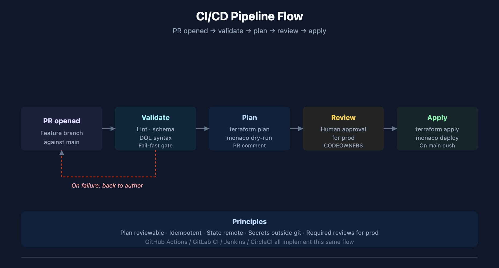

# SL2DT-08: Automation & GitOps

> **Series:** SL2DT — Sumo Logic to Dynatrace | **Notebook:** 8 of 11 | **Created:** April 2026 | **Last Updated:** 07/20/2026

## Overview

**Goal of this step:** automate the promotion path for dashboards, monitors, workflows, IAM, OpenPipeline, and bucket configs. Migration is only sustainable if post-cutover changes go through the same CI/CD discipline — not via UI clickops that drift out of source control.

Automation applies both to the migration itself (programmatically import 8,000 dashboards faster than clicking) and to ongoing operations (every config change is a PR).

---

## Table of Contents

1. [What You'll Produce](#outputs)
2. [Tool Selection — Terraform vs Monaco vs the Future Migration Tool](#tools)
3. [Terraform — Bucket, IAM, Settings 2.0 Config](#terraform)
4. [Monaco — Bulk Config Promotion](#monaco)
5. [CI/CD Pipeline Patterns](#ci)
6. [Automating the Sumo Extract → DT Import Flow](#import-pipeline)
7. [Ansible / CloudFormation / Cloud-Specific Handoffs](#cloud-integration)
8. [Post-Migration: Change Management](#change-mgmt)
9. [Step Exit Criteria](#gate)

---

## Prerequisites

| Requirement | Details |
|-------------|---------|
| **Audience** | Platform engineering, DevOps, SRE |
| **Tools** | Git, Terraform ≥1.6, Monaco ≥2.x, Python 3, cloud CLIs (AWS/GCP/Azure) |
| **Dynatrace access** | Platform Token with broad write scopes; separate service account for CI |
| **Prior reading** | AUTOM-01 (Configuration automation overview), K8S-07 (GitOps for Dynatrace), `Dynatrace-NewRelic` for migration-tool patterns |

<a id="outputs"></a>
## 1. What You'll Produce

| Artifact | Purpose |
|----------|---------|
| `terraform/` | All IaC for buckets, IAM, OpenPipeline, Workflows |
| `monaco/` | Bulk configs (dashboards, monitors, settings) |
| `.github/workflows/` (or equivalent CI) | Pipelines for validate → plan → apply |
| `scripts/extract-and-import/` | Sumo → DT migration pipeline scripts |
| `runbooks/rollback.md` | How to revert a bad config change |

<a id="tools"></a>
## 2. Tool Selection — Terraform vs Monaco vs the Future Migration Tool

| Tool | Use for | Avoid for |
|------|---------|-----------|
| **Terraform** (Dynatrace provider) | Buckets, IAM groups/policies, Settings 2.0 schemas, some Workflows | Bulk dashboards (slow), complex dashboard JSON |
| **Monaco** | Dashboards, monitors, settings in bulk; promotion across environments | IAM (use Terraform) |
| **`Dynatrace-SumoLogic` migration tool** (future — see AGENT-TASKS.md) | Sumo extract + translate + import | Ongoing change management |
| **Direct API (scripts)** | One-offs, custom orchestration, Document API for notebooks | Anything that needs state tracking |
| **Dynatrace UI** | Investigation, exploration — never for config changes post-cutover | Migration execution |

### Principles

- **One tool per concern.** Don't manage the same asset in both Terraform and Monaco.
- **State reviewable.** Every config change goes through PR with `terraform plan` or `monaco deploy --dry-run` output.
- **Idempotency.** Every pipeline must be safe to re-run.

<a id="terraform"></a>
## 3. Terraform — Bucket, IAM, Settings 2.0 Config

### Provider Setup

```hcl
terraform {
  required_providers {
    dynatrace = {
      source  = "dynatrace-oss/dynatrace"
      version = "~> 1.60"
    }
  }
}

provider "dynatrace" {
  dt_env_url     = var.dt_env_url
  dt_platform_token = var.dt_platform_token  # Bearer token
}
```

### Organizing Modules

```
terraform/
├── modules/
│   ├── bucket/             # Grail buckets
│   ├── iam-group-policy/   # Group + policy + binding
│   ├── openpipeline/       # Pipelines + processors
│   └── workflow/           # Workflow configs
├── envs/
│   ├── prod/
│   │   └── main.tf
│   ├── preprod/
│   └── dev/
└── variables.tf
```

### Example — Bucket Module Call

```hcl
module "bucket_prod_logs" {
  source       = "../../modules/bucket"
  name         = "custom_logs_prod"
  display_name = "Production Logs"
  retention    = 90
}

module "iam_prod_readers" {
  source      = "../../modules/iam-group-policy"
  group_name  = "g_prod_readers"
  description = "Read-only prod logs"
  policy_statements = [
    "ALLOW storage:logs:read WHERE storage:bucket-name = \"custom_logs_prod\";"
  ]
}
```

### State Management

Use a remote backend (S3 + DynamoDB lock, or GCS, or Terraform Cloud):

```hcl
terraform {
  backend "s3" {
    bucket         = "tfstate-dynatrace-migration"
    key            = "prod/dynatrace.tfstate"
    region         = "us-east-1"
    dynamodb_table = "tfstate-lock"
  }
}
```

**Never** commit `.tfstate` files to git.

<a id="monaco"></a>
## 4. Monaco — Bulk Config Promotion

Monaco is the right tool for dashboards/monitors in bulk. It excels at multi-tenant promotion (dev → preprod → prod).

### Project Structure

```
monaco/
├── environments.yaml       # Tenant list + auth
├── projects/
│   ├── dashboards/
│   │   ├── config.yaml
│   │   └── definitions/    # One JSON/YAML per dashboard
│   ├── monitors/
│   └── openpipeline/
```

### environments.yaml (non-secret)

```yaml
environmentGroups:
  - name: production
    environments:
      - name: prod
        url:
          type: value
          value: https://<env-id>.apps.dynatrace.com
        auth:
          token:
            type: environment
            name: DT_PROD_TOKEN
  - name: preprod
    environments:
      - name: preprod
        ...
```

### Deploying Dashboards

```bash
monaco deploy -e environments.yaml projects/dashboards --environment-group production --dry-run
monaco deploy -e environments.yaml projects/dashboards --environment-group production
```

### Template Variables

Monaco supports per-environment templating:

```yaml
configs:
  - id: dashboard_payments_api
    type: dashboard
    template: templates/payments-api.json
    parameters:
      tenant_name: "{{ .name }}"
      prod_bucket: "custom_logs_prod"
      env_label: "{{ .environmentName }}"
```

### Migration Use Case — Bulk Dashboard Import

If you have 2,000 translated dashboards, iterating via Terraform's `dynatrace_document` is slow (one API call per resource, sequential apply). Monaco batches and deploys in parallel — typical 5–10x faster for bulk work.

<a id="ci"></a>
## 5. CI/CD Pipeline Patterns

### Typical Pipeline Stages



<!-- MARKDOWN_TABLE_ALTERNATIVE
| Stage | Trigger | What runs | Output |
|-------|---------|-----------|--------|
| 1 PR opened | Developer pushes feature branch | — | PR created |
| 2 Validate | PR event | Lint + schema check + DQL syntax | Pass/fail gate |
| 3 Plan | After validate passes | terraform plan + monaco dry-run | Posted as PR comment |
| 4 Review | Plan posted | Human approval required for prod | CODEOWNERS + required reviews |
| 5 Apply | Push to main | terraform apply + monaco deploy | Deployed to target env |
For environments where SVG doesn't render
-->

### GitHub Actions Example

```yaml
name: dynatrace-config
on:
  pull_request:
    branches: [main]
  push:
    branches: [main]

jobs:
  validate:
    runs-on: ubuntu-latest
    steps:
      - uses: actions/checkout@v4
      - run: python3 scripts/validate-dql.py terraform/
      - run: monaco lint monaco/
      - uses: hashicorp/setup-terraform@v3
      - run: |
          cd terraform/envs/prod
          terraform init -backend=false
          terraform validate

  plan:
    if: github.event_name == 'pull_request'
    needs: validate
    runs-on: ubuntu-latest
    steps:
      - uses: actions/checkout@v4
      - uses: hashicorp/setup-terraform@v3
      - run: |
          cd terraform/envs/prod
          terraform init
          terraform plan -no-color > plan.txt
      - uses: actions/github-script@v7
        with:
          script: |
            const fs = require('fs');
            const plan = fs.readFileSync('terraform/envs/prod/plan.txt','utf8');
            github.rest.issues.createComment({
              issue_number: context.issue.number,
              owner: context.repo.owner, repo: context.repo.repo,
              body: '```\n' + plan + '\n```'
            });

  apply:
    if: github.event_name == 'push'
    needs: validate
    runs-on: ubuntu-latest
    environment: production
    steps:
      - uses: actions/checkout@v4
      - uses: hashicorp/setup-terraform@v3
      - run: |
          cd terraform/envs/prod
          terraform init
          terraform apply -auto-approve
      - run: monaco deploy -e environments.yaml monaco/projects --environment-group production
```

### Secrets Management

Platform Tokens and API keys live in:

- **GitHub Actions:** repository secrets
- **GitLab CI:** protected variables
- **Jenkins:** Credentials plugin
- **CircleCI:** contexts

Never commit tokens. Every `*.env` file goes in `.gitignore`.

<a id="import-pipeline"></a>
## 6. Automating the Sumo Extract → DT Import Flow

For bulk migration work (Waves 3 and 4), scripts automate the extract + translate + import loop. The eventual `Dynatrace-SumoLogic` migration tool (see `docs/AGENT-TASKS.md`) is the destination; until built, scripts.

### Minimal Python Pipeline

```python
#!/usr/bin/env python3
"""Extract Sumo dashboards, translate, import to Dynatrace."""
import os, json, requests, base64
from pathlib import Path

SUMO_AUTH = base64.b64encode(
    f"{os.environ['SUMO_ACCESS_ID']}:{os.environ['SUMO_ACCESS_KEY']}".encode()
).decode()
DT_TOKEN = os.environ['DT_TOKEN']   # dt0s16.XXX
DT_URL   = os.environ['DT_TENANT']
SUMO_URL = f"https://api.{os.environ['SUMO_REGION']}.sumologic.com"

def sumo_get(path):
    r = requests.get(f"{SUMO_URL}{path}",
                     headers={"Authorization": f"Basic {SUMO_AUTH}"})
    r.raise_for_status()
    return r.json()

def dt_post(path, body):
    r = requests.post(f"{DT_URL}{path}", json=body,
                      headers={"Authorization": f"Bearer {DT_TOKEN}"})
    r.raise_for_status()
    return r.json()

def translate_dashboard(sumo_dashboard):
    # Uses sumoql-to-dql skill mapping tables
    # Returns DT notebook/dashboard JSON
    ...

def main():
    out = Path("./translated")
    out.mkdir(exist_ok=True)
    for dash in sumo_get("/api/v2/dashboards")["dashboards"]:
        dt_config = translate_dashboard(sumo_get(f"/api/v2/dashboards/{dash['id']}"))
        (out / f"{dash['id']}.json").write_text(json.dumps(dt_config, indent=2))
        # Dry-run by default; --apply flag pushes to DT
        # dt_post("/platform/document/v1/documents", dt_config)

main()
```

### Preflight Check (before bulk import)

Adopt the **PreflightCheck** pattern from the future migration tool (see `docs/AGENT-TASKS.md` §3) for script-level migrations:

```python
@dataclass
class PreflightCheck:
    name: str
    status: str               # pass / warn / fail
    scopes_min: list[str]
    scopes_recommended: list[str]
    diagnosis: str
    remediation: str

def preflight():
    checks = []
    # Check token prefix determines auth scheme
    prefix = DT_TOKEN[:7]
    if prefix.startswith("dt0s16"):
        auth_scheme = "Bearer"
    elif prefix.startswith("dt0c01"):
        auth_scheme = "Api-Token"
    else:
        checks.append(PreflightCheck(
            "token_prefix", "fail",
            [], [],
            f"Unrecognized token prefix: {prefix}",
            "Generate a Platform Token (prefix dt0s16) or Classic API Token (prefix dt0c01)"
        ))
    # ... more checks
    return checks
```

### Auth Scheme by Token Prefix

Critical pattern — every HTTP call must pick the right header:

| Token Prefix | Scheme |
|--------------|--------|
| `dt0s16.` | `Authorization: Bearer <token>` |
| `dt0s01.` | `Authorization: Bearer <token>` (OAuth) |
| `dt0c01.` | `Authorization: Api-Token <token>` |

Wrong scheme → `401 Unsupported authorization scheme`, even with every scope.

<a id="cloud-integration"></a>
## 7. Ansible / CloudFormation / Cloud-Specific Handoffs

Many customers run existing automation for infrastructure. Integrate rather than replace.

### Ansible (host-based automation)

OneAgent installation via Ansible playbook:

```yaml
- name: Install Dynatrace OneAgent
  hosts: all
  become: true
  tasks:
    - name: Download OneAgent installer
      get_url:
        url: "{{ dt_installer_url }}"
        dest: /tmp/oneagent.sh
        headers:
          Authorization: "Api-Token {{ dt_pass_token }}"
    - name: Install OneAgent
      shell: /bin/sh /tmp/oneagent.sh --set-host-group="{{ dt_host_group }}"
      args: { creates: /opt/dynatrace/oneagent/agent/lib64/liboneagentloader.so }
```

### CloudFormation / AWS

Use the Dynatrace AWS Clouds app (native integration) rather than custom lambdas. Clouds app push path is settled practice — no ActiveGate needed for most AWS metrics.

Terraform for AWS role creation:

```hcl
resource "aws_iam_role" "dynatrace_monitoring" {
  name = "DynatraceMonitoringRole"
  assume_role_policy = jsonencode({
    Version = "2012-10-17"
    Statement = [{
      Effect    = "Allow"
      Principal = { AWS = "arn:aws:iam::509560245411:role/dynatrace-monitoring-role" }
      Action    = "sts:AssumeRole"
      Condition = { StringEquals = { "sts:ExternalId" = var.external_id } }
    }]
  })
}
```

### Azure / GCP

Native cloud integrations via Dynatrace tenant UI or API. Avoid custom exporters unless absolutely needed.

### Decision Matrix

| Source Platform | Ingest Path |
|------------------|-------------|
| On-prem Linux/Windows hosts | OneAgent via Ansible |
| AWS EC2 + services | OneAgent (from host) + AWS Clouds app (for services) |
| AWS Lambda | Dynatrace Lambda extension |
| Azure VM + services | OneAgent + Azure integration |
| GCP GCE + services | OneAgent + GCP integration |
| Kubernetes | DynaKube operator |
| CloudWatch / EventBridge | AWS Clouds app |

<a id="change-mgmt"></a>
## 8. Post-Migration: Change Management

Once Sumo is decommissioned (SL2DT-09), every Dynatrace config change must go through the same pipeline.

### The New Baseline

- All monitors, dashboards, buckets, IAM, OpenPipeline configs in git
- Every change is a PR
- No UI clickops for production changes (UI for exploration only)

### Enforcement

- CI blocks any PR with invalid DQL, schema errors, or bucket misconfig
- Required reviews: 1 engineer + 1 platform-team approver for prod
- Settings 2.0 schema drift detection: weekly automated diff between tenant state and git state

### Drift Detection Workflow

```yaml
# .github/workflows/drift-detect.yml
name: drift-detect
on:
  schedule:
    - cron: "0 6 * * 1"  # Weekly Monday
jobs:
  drift:
    runs-on: ubuntu-latest
    steps:
      - uses: actions/checkout@v4
      - run: terraform plan -detailed-exitcode
      - run: monaco deploy --dry-run --report drift-report.md
      - if: failure()
        uses: actions/github-script@v7
        with:
          script: |
            github.rest.issues.create({
              owner: context.repo.owner, repo: context.repo.repo,
              title: 'Dynatrace config drift detected',
              body: 'See attached diff'
            });
```

<a id="gate"></a>
## 9. Step Exit Criteria

**G8 — Automation Ready**

- [ ] All buckets + IAM + OpenPipeline managed via Terraform
- [ ] Dashboards + monitors managed via Monaco
- [ ] CI pipeline runs on every PR: validate → plan → apply
- [ ] Secrets managed outside git (CI vault, not `.env` in repo)
- [ ] Preflight-check pattern used in all migration scripts
- [ ] Ansible / CloudFormation integration documented per source platform
- [ ] Drift detection scheduled + alerting on failure
- [ ] Rollback runbook in `runbooks/rollback.md`

**Next step:** **SL2DT-09 — Cutover, Validation & Decommission** (parallel run, validation gates, Sumo teardown).

---

<a id="references"></a>
## 11. References

### Dynatrace automation and configuration-as-code
- [Configuration as code (DT docs)](https://docs.dynatrace.com/docs/deliver/configuration-as-code)
- [Terraform configuration (DT docs)](https://docs.dynatrace.com/docs/deliver/configuration-as-code/terraform)
- [Monaco configuration (DT docs)](https://docs.dynatrace.com/docs/deliver/configuration-as-code/monaco)
- [Dynatrace Terraform provider (Terraform Registry)](https://registry.terraform.io/providers/dynatrace-oss/dynatrace/latest/docs)
- [Monaco (Dynatrace GitHub)](https://github.com/dynatrace-oss/dynatrace-monitoring-as-code)
- [API authentication (DT docs)](https://docs.dynatrace.com/docs/shortlink/api-authentication)
- [Platform tokens (DT docs)](https://docs.dynatrace.com/docs/shortlink/platform-tokens)

### Sumo Logic automation (source)
- [Sumo Logic Terraform provider (Terraform Registry)](https://registry.terraform.io/providers/SumoLogic/sumologic/latest/docs)
- [Sumo Logic API (Sumo Logic docs)](https://help.sumologic.com/docs/api/)

---

<sub>*This notebook was AI-generated from community-submitted and publicly available sources. This notebook series is not officially supported by Dynatrace or Sumo Logic. Always verify information against the official [Dynatrace documentation](https://docs.dynatrace.com/docs) and [Sumo Logic documentation](https://help.sumologic.com/docs/).*</sub>
