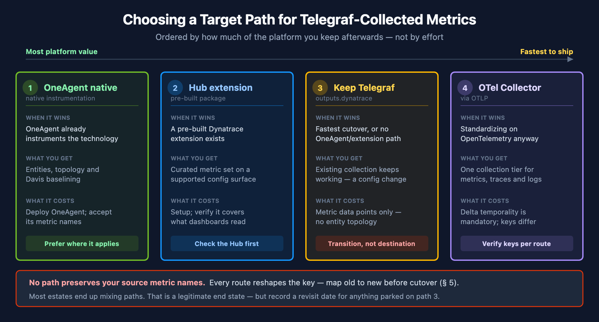

# SL2DT-10: Migrating Telegraf-Collected Metrics

> **Series:** SL2DT — Sumo Logic to Dynatrace | **Notebook:** 10 of 11 | **Created:** July 2026 | **Last Updated:** 07/20/2026

## Overview

**Goal of this step:** bring a Telegraf-collected metric estate across to Dynatrace — inventory it, choose a target ingest path per source, reshape the metric keys, and prove parity during the parallel run.

Steps 03 through 06 cover the **log** path end to end. Metrics are a separate workstream, and a Sumo account whose operational visibility is largely Telegraf-collected metrics has no chapter in that sequence. The metric keys also change shape at the boundary **regardless of which path you choose**, so every metric query, dashboard panel, and monitor threshold needs rewriting.

> **Where this fits — read this as a parallel track, not a post-cutover step.** This notebook is numbered 10 because it was added after the original nine steps, not because metric migration happens last. Run it alongside the log path: inventory with **SL2DT-02**, choose ingest paths alongside **SL2DT-03**, rewrite queries alongside **SL2DT-04**, and rebuild monitors and dashboards alongside **SL2DT-05** and **SL2DT-06**. Deferring it to after cutover means running two cutovers.

---

## Table of Contents

1. [What You'll Produce](#outputs)
2. [Inventory the Metric Estate](#inventory)
3. [Choose the Target Ingest Path](#paths)
4. [Telegraf to Dynatrace — Plugin Mechanics](#mechanics)
5. [Metric-Key Reshaping at the Boundary](#keys)
6. [Parity Validation During the Parallel Run](#parity)
7. [Step Exit Criteria](#gate)
8. [References](#references)

---

## Prerequisites

| Requirement | Details |
|-------------|---------|
| **Audience** | Migration lead + the team that owns the Telegraf configurations |
| **Format** | Procedural — produce four artifacts checked into the migration repo |
| **Sumo access** | Metrics sources readable; Telegraf `.conf` files retrievable from the hosts |
| **Dynatrace access** | Tenant with metric ingest available; for the remote route, a token with `metrics.ingest` scope |
| **Prior reading** | SL2DT-02 (inventory and cut scope), FAQ-11 (how metrics work in Dynatrace), OPIPE-04 (cardinality budgets) |

<a id="outputs"></a>
## 1. What You'll Produce

| Artifact | Format | Purpose |
|----------|--------|---------|
| `inventory/metrics.json` | JSON | Every Sumo metrics source and Telegraf input: measurement, fields, tag keys, volume |
| `metric-key-map.md` | Markdown | Source metric name → Dynatrace metric key, per chosen path |
| `metric-cut-scope.md` | Markdown | Migrate / retire / defer per metric, with owner signoff |
| `parity-report.md` | Markdown | Sumo vs Dynatrace comparison across the parallel window |

These gate the metric half of cutover in **SL2DT-09**. `metric-key-map.md` is the artifact that unblocks query rewriting in **SL2DT-04** — produce it early, because every downstream rewrite depends on it.

<a id="inventory"></a>
## 2. Inventory the Metric Estate

**SL2DT-02 § 6** inventories collectors for the log path. Metric sources need the same treatment, but the questions differ: what matters is not only where the data comes from, but what each series will *cost* and what it will *key on* after the boundary.

### Metric Source Types to Enumerate

| Sumo-side source | What to capture |
|------------------|-----------------|
| Telegraf via Installed Collector | Enabled `[[inputs.*]]` plugins, measurement names, field names, tag keys |
| Hosted metrics source (HTTP) | Sending system, payload format, metric naming scheme |
| StatsD / Graphite source | Metric naming scheme, aggregation interval |
| Prometheus scrape | Scrape targets, job labels, relabeling rules |
| Host metrics from the Installed Collector | Whether OneAgent already covers the same signal — frequently it does |

### Per-Metric Record

For every metric series that survives cut scope, record:

- **Input plugin** and **measurement** name
- **Field names** — each field becomes its own Dynatrace metric key (see § 5)
- **Tag keys** — these become dimensions; count the distinct values per key
- **Cardinality estimate** — distinct tag-value combinations per measurement
- **Volume** — data points per minute
- **Consumers** — which Sumo dashboards, monitors, and scheduled searches read it

> **Cardinality is the cost driver.** A measurement with only a handful of fields but one high-cardinality tag — a container ID, a request ID, a user ID — multiplies into a large number of series. Apply the cardinality budgets from **OPIPE-04** during inventory rather than after ingest; § 5 explains why correcting this later is a break rather than an edit.

> **The cheapest metric is the one you never migrate.** Apply the same usage-based cut scope here that SL2DT-02 applies to dashboards and monitors: a metric that no dashboard or monitor has read in 90 days is a retire candidate, not a migration candidate.

<a id="paths"></a>
## 3. Choose the Target Ingest Path

Four viable targets. They are ordered not by effort but by how much of the platform you still have afterwards.

| Path | When it wins | What you get | What it costs |
|------|--------------|--------------|---------------|
| **1. OneAgent native** | The signal is one OneAgent already instruments — hosts, processes, common runtimes, many databases | Entities and topology, and Davis baselining, without ingesting anything custom | Deploy OneAgent; accept its metric names rather than your own |
| **2. Hub extension** | A pre-built Dynatrace extension exists for the technology | A curated metric set with a supported configuration surface | Extension setup; confirm its metric set covers what your dashboards actually read |
| **3. Keep Telegraf → `outputs.dynatrace`** | You need the fastest cutover, or the source has no OneAgent or extension equivalent | Existing collection keeps working; ingest becomes a config change | Metric data points only — and the keys still change shape (§ 5) |
| **4. OTel Collector → OTLP** | You are standardizing on OpenTelemetry across signals anyway | One collection tier for metrics, traces, and logs | Delta temporality is mandatory (§ 4); naming differs again (§ 5) |



<!-- MARKDOWN_TABLE_ALTERNATIVE
| Path | When it wins | What you get | Caveat |
|------|--------------|--------------|--------|
| 1. OneAgent native | OneAgent already instruments the technology | Entities, topology, Davis baselining | Accept its metric names |
| 2. Hub extension | A pre-built Dynatrace extension exists | Curated metric set, supported config surface | Verify it covers what dashboards read |
| 3. Keep Telegraf (outputs.dynatrace) | Fastest cutover, or no OneAgent/extension path | Existing collection keeps working | Metric data points only — transition state |
| 4. OTel Collector via OTLP | Standardizing on OpenTelemetry | One tier for metrics, traces, logs | Delta temporality mandatory; keys differ |
For environments where SVG doesn't render
-->

### Decide Per Source, Not Per Estate

Most migrations end up mixing paths — OneAgent for the host and runtime signals it already covers, an extension where one exists, and Telegraf for the long tail. That is a legitimate end state, not a failure to converge.

> **Path 3 is a transition state, not a destination — write that down explicitly.** In community practice the most consistent trap is that "keep Telegraf" ships first, works, and is then never revisited. Ingested Telegraf metrics arrive as metric data points carrying dimensions; they do not by themselves produce the entity topology that OneAgent-detected technologies do. Before choosing a metrics-only path for a technology OneAgent could instrument, confirm what topology and baselining you are giving up — and if you choose it anyway, record a revisit date in `metric-cut-scope.md`.

**Related:** **FAQ-14** makes the same argument for SQL Server — caller-side and server-side collection are complements, and a script-only posture (here, a Telegraf-only posture) is a transition rather than an end state.

<a id="mechanics"></a>
## 4. Telegraf to Dynatrace — Plugin Mechanics

The `outputs.dynatrace` plugin ships with Telegraf. There are two endpoint modes, and the choice affects authentication **and** enrichment.

### Endpoint Modes

| Mode | `url` | Token | Automatic enrichment |
|------|-------|-------|----------------------|
| **Local OneAgent** | empty, or `http://127.0.0.1:14499/metrics/ingest` (the default) | None required | Host ID and host name added as dimensions |
| **Remote environment** | `https://{env-id}.live.dynatrace.com/api/v2/metrics/ingest` | `metrics.ingest` scope | None — you supply dimensions yourself |

Telegraf metric ingestion requires **OneAgent 1.201+**, and the default metric ingestion port is **14499**.

```toml
## Local OneAgent endpoint — no API token required
[[outputs.dynatrace]]
  ## Leave empty to use the local OneAgent endpoint
  ## (default: http://127.0.0.1:14499/metrics/ingest)
  url = ""
  prefix = "telegraf"

## Remote environment endpoint
[[outputs.dynatrace]]
  url = "https://{your-environment-id}.live.dynatrace.com/api/v2/metrics/ingest"
  api_token = "dt0c01.*****"   # metrics.ingest scope only
  prefix = "telegraf"
```

### Behaviours That Surprise People

| Behaviour | Detail |
|-----------|--------|
| **Everything is a gauge by default** | "All metrics are reported as gauges, unless they are specified to be delta counters using the `additional_counters` or `additional_counters_patterns` config option." A Telegraf counter you do not list lands as a gauge. |
| **Batching is 1,000 lines per request** | This is a **client-side** batching constant in the metric library the plugin uses — *not* an API ceiling. The ingest API limits the **payload to 1 MB** and states there is no limit on the number of metrics. Do not size your pipeline against 1,000. |
| **`prefix` supplies its own separator** | The plugin documents `prefix` as "prepended to all metric names (will be separated with a `.`)" — you do not add the dot. |

> **`prefix` trailing-dot trap.** The Dynatrace documentation page shows `prefix = "telegraf."` *with* a trailing dot, while the plugin's own sample configuration uses `prefix = "telegraf"` *without* one and states the separator is added automatically. Use the no-dot form, then **verify the resulting keys in your tenant** before building dashboards on them — a doubled dot is easy to ship and awkward to unpick after ingest.

<a id="keys"></a>
## 5. Metric-Key Reshaping at the Boundary

**No path preserves your source metric names.** This is the most disruptive fact in a metric migration, and it is why `metric-key-map.md` gates the query rewrite in SL2DT-04.

### How `outputs.dynatrace` Builds the Key

The plugin composes the Dynatrace metric key from the Telegraf **measurement** and **field**, joined with a dot:

```go
metricName := tm.Name() + "." + field.Key
```

So a Telegraf `apache` input producing a `BusyWorkers` field arrives as:

| Stage | Name |
|-------|------|
| Telegraf measurement + field | `apache` + `BusyWorkers` |
| Dynatrace metric key | `apache.BusyWorkers` |
| With `prefix = "telegraf"` | `telegraf.apache.BusyWorkers` |

Whatever name your Sumo dashboards referenced, compare it against this form and record **both** in `metric-key-map.md`. They will not match, and every panel and monitor threshold reading the old name needs rewriting.

> **Sourcing note:** this composition is verified from the plugin **source**, not its README — the README documents the `prefix` option but never states the `measurement.field` rule. Cited accordingly in § 8.

### Key Syntax Rules That Will Reject Your Data

| Rule | Constraint |
|------|-----------|
| Allowed characters | Lowercase and uppercase letters, numbers, hyphens (`-`), underscores (`_`) |
| Non-Latin letters | Not allowed |
| Leading character | A key cannot start with a number or a hyphen; sections cannot start with a hyphen |
| Length | 3–255 characters |

> **The `dt.` prefix is reserved, and violations are dropped silently.** "Metric data ingested with the `dt.` prefix will be dropped," and dimensions ingested with the `dt.` prefix "are ignored." If your measurement or your configured `prefix` produces a `dt.`-prefixed key, the data never arrives and nothing raises an error. Check this before the parallel run, not during it.

### The OTLP Route Names Differently Again

If you choose path 4, do not assume its keys match path 3. OTLP ingest applies its own transformations: "a metric key may be suffixed automatically depending on the payload (for example, `.count` for counters and `.gauge` for gauges)," and invalid characters "will be replaced with underscores."

> **Verify, don't assume.** The exact key a given Telegraf input produces *through an OpenTelemetry Collector* depends on the receiver in that collector, which sits outside Dynatrace's documentation. Send one representative metric through your chosen route into a non-production tenant and read the actual key back (§ 6) before committing a naming convention to `metric-key-map.md`.

<a id="parity"></a>
## 6. Parity Validation During the Parallel Run

Metric parity is a different test from log parity. You are not diffing record counts — you are confirming that every key in `metric-key-map.md` exists, carries the dimensions you expected, and is populated across the same window Sumo covers.

### Step 1 — Confirm the Keys Arrived Under the Names You Expect

```dql
// List the metric keys that actually landed under your Telegraf prefix.
// Compare against metric-key-map.md: anything missing never arrived, and
// anything unexpected is a naming surprise worth catching before cutover.
metrics
| filter startsWith(metric.key, "telegraf.")
| fields metric.key
| sort metric.key asc
| limit 200
```

### Step 2 — Confirm a Migrated Key Is Actually Populated

Existence is not continuity. For every key a monitor or dashboard depends on, confirm data points arrive across the whole parallel window — not merely from the moment you enabled the output.

```dql
// Replace the metric key with one from metric-key-map.md.
// A flat or gappy result means the Telegraf output is not running everywhere
// you assume it is — check per host before declaring parity.
timeseries datapoints = count(telegraf.apache.BusyWorkers), from:-24h, interval:1h
| fieldsAdd total = arraySum(datapoints)
| fields total
```

### What "Parity" Means for Metrics

| Check | Passing looks like |
|-------|--------------------|
| **Key presence** | Every key in `metric-key-map.md` returns from the query above |
| **Dimension fidelity** | The tag keys inventoried in § 2 are present as dimensions |
| **Continuity** | Data points across the full parallel window, not only since switch-on |
| **Host coverage** | The metric arrives from every host running the input, not a subset |
| **Consumer rewrite** | Every dashboard panel and monitor that read the old name now reads the new key |

Record the outcome in `parity-report.md`. Metric parity failures are usually **coverage** failures — a Telegraf config rolled to some hosts but not all — and those stay invisible if you only check that the key exists.

<a id="gate"></a>
## 7. Step Exit Criteria

Do not include metrics in the SL2DT-09 cutover until every box is checked:

| Checkpoint | Status |
|------------|--------|
| `inventory/metrics.json` complete — every metric source, measurement, field, and tag key | [ ] |
| Cut scope applied — retire candidates identified and signed off by their owners | [ ] |
| Target path chosen per source, with every path-3 choice carrying a revisit date | [ ] |
| `metric-key-map.md` complete — old name → new key for every surviving metric | [ ] |
| No resulting key collides with the reserved `dt.` prefix | [ ] |
| Cardinality estimated against the OPIPE-04 budgets | [ ] |
| Every dependent dashboard panel and monitor threshold rewritten to the new keys | [ ] |
| `parity-report.md` shows key presence, dimension fidelity, continuity, and host coverage | [ ] |
| Rollback understood — Sumo metric collection still running until cutover is declared | [ ] |

---

<a id="references"></a>
## 8. References

### Dynatrace — metric ingestion
- [Send Telegraf metrics to Dynatrace (DT docs)](https://docs.dynatrace.com/docs/ingest-from/extend-dynatrace/extend-metrics/ingestion-methods/telegraf) — requires OneAgent 1.201+; default ingestion port 14499
- [OneAgent metric API (DT docs)](https://docs.dynatrace.com/docs/ingest-from/extend-dynatrace/extend-metrics/ingestion-methods/oneagent-metric-api) — host ID and host name added automatically on the local endpoint
- [Metric ingestion protocol (DT docs)](https://docs.dynatrace.com/docs/ingest-from/extend-dynatrace/extend-metrics/reference/metric-ingestion-protocol) — metric key character, section, and length rules
- [POST ingest metrics (DT docs)](https://docs.dynatrace.com/docs/dynatrace-api/environment-api/metric-v2/post-ingest-metrics) — `metrics.ingest` scope; 1 MB payload limit
- [Metrics limits (DT docs)](https://docs.dynatrace.com/docs/analyze-explore-automate/metrics/limits) — reserved `dt.` prefix; data ingested with it is dropped
- [About OTLP metrics ingest (DT docs)](https://docs.dynatrace.com/docs/ingest-from/opentelemetry/otlp-api/ingest-otlp-metrics/about-metrics-ingest) — delta temporality requirement; automatic key suffixing

### Telegraf — the `outputs.dynatrace` plugin
- [Dynatrace output plugin README (InfluxData GitHub)](https://github.com/influxdata/telegraf/blob/master/plugins/outputs/dynatrace/README.md) — endpoint modes, `prefix`, gauge-by-default behaviour
- [`dynatrace.go` (InfluxData GitHub)](https://github.com/influxdata/telegraf/blob/master/plugins/outputs/dynatrace/dynatrace.go) — the `measurement + "." + field` key composition

---

<sub>*This notebook was AI-generated from community-submitted and publicly available sources. This notebook series is not officially supported by Dynatrace or Sumo Logic. Always verify information against the official [Dynatrace documentation](https://docs.dynatrace.com/docs) and [Sumo Logic documentation](https://help.sumologic.com/docs/).*</sub>
