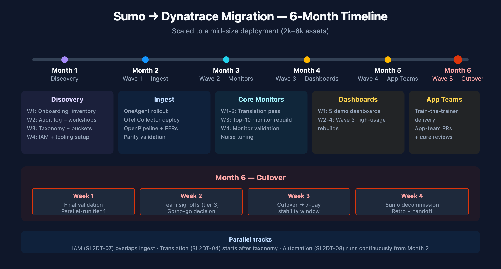

# SL2DT-99: Summary & Runbook Index

> **Series:** SL2DT | **Notebook:** 10 of 10 | **Created:** April 2026 | **Last Updated:** 04/21/2026

## Overview

**Goal of this notebook:** single-page index for the entire SL2DT series. Use as a reference card during migration work, a hand-off document for incoming teams, and a quick-start for future Sumo-to-Dynatrace engagements.

This notebook is intentionally terse. Each section points to the authoritative detail in SL2DT-01 through SL2DT-09.

---

## Table of Contents

1. [Migration Framework Summary](#framework)
2. [Series Index — Which Notebook Does What](#index)
3. [Critical Decisions Checklist](#decisions)
4. [Artifacts Produced Across All Steps](#artifacts)
5. [Failure-Mode Reference](#failures)
6. [Quick Reference — Common DQL Patterns](#quick-dql)
7. [Engagement Timeline Template](#timeline)
8. [Companion Assets](#companions)

---

## Prerequisites

| Requirement | Details |
|-------------|---------|
| **Audience** | Anyone onboarding to a Sumo-to-Dynatrace engagement |
| **Prior reading** | None required — this notebook is the entry point |

<a id="framework"></a>
## 1. Migration Framework Summary

Sumo-to-Dynatrace in 9 steps + summary:

```
01 Overview         → strategy, mental model, anti-patterns
02 Inventory        → audit-log-driven cut scope
03 Ingest           → OneAgent + OTel + OpenPipeline + buckets
04 Translate        → SumoQL → DQL, confidence-scored
05 Monitors         → Dynatrace Intelligence / Workflow / Metric Event decisions
06 Dashboards       → Notebooks (analytical) + Dashboards (operational)
07 Governance       → Platform IAM, bucket-scoped policies
08 Automation       → Terraform + Monaco + CI/CD
09 Cutover          → 3-tier validation, decommission
99 Summary          → this notebook
```

Typical duration: **3–6 months** for a mid-size deployment (100–500 active users, 2k–8k dashboards/monitors). Large enterprises (10k+ assets, multi-tenant) may need 9–12 months.

Target outcomes:

- Sumo contract terminated by deadline
- ≥ 95% monitor + dashboard fidelity
- ≥ 40% new monitors using anomaly detection (not static thresholds)
- Alert noise ≤ Sumo baseline

<a id="index"></a>
## 2. Series Index — Which Notebook Does What

| # | Notebook | When to read | Primary artifacts |
|---|----------|-------------|---------------------|
| 01 | Overview & Migration Strategy | First, always | Strategy doc, risk register |
| 02 | Assessment & Inventory | Before any hands-on work | `inventory/*.json`, `cut-scope.md`, `taxonomy-map.md` |
| 03 | Log Ingest Architecture | Wave 1 | Bucket configs, OpenPipeline pipelines, FER conversions |
| 04 | SumoQL → DQL Translation | Wave 1 / 2 | `translations/all-queries.csv` |
| 05 | Monitor/Alert Conversion | Wave 2 | Dynatrace Intelligence detectors, Workflows, Metric Events |
| 06 | Dashboard Conversion | Wave 3 / 4 | Notebook + Dashboard JSON |
| 07 | User Governance & Access | Wave 1 (do early!) | IAM groups/policies/bindings |
| 08 | Automation & GitOps | Wave 1 ongoing | Terraform + Monaco configs, CI pipelines |
| 09 | Cutover, Validation & Decommission | Wave 5 | Cutover runbook, validation report, retro |
| 99 | Summary (this notebook) | Any time — reference card | — |

<a id="decisions"></a>
## 3. Critical Decisions Checklist

Six decisions shape the entire migration. Make them early, document them in `DECISIONS.md`:

| Decision | Default | When to deviate |
|----------|---------|------------------|
| **`_sourceCategory` strategy** | Mixed: bucket for coarse isolation + attribute for query grouping | Bucket-only if retention tiers dominate; attribute-only if uniform retention |
| **Ingest path per source** | OneAgent for hosts, OTel Collector for cloud/HTTP | Sumo Forwarding if OneAgent can't be deployed |
| **Monitor conversion** | anomaly detection for metric-backed alerts | Static threshold only when truly static |
| **Dashboard target** | Notebooks for analytical, Dashboards for operational | Hybrid for SRE pages |
| **Automation tool split** | Terraform for IAM/buckets/pipelines, Monaco for dashboards/monitors | Single-tool if team mandates |
| **Parallel-run duration** | 2–4 weeks | Longer only with documented cause (rarely a good sign) |

<a id="artifacts"></a>
## 4. Artifacts Produced Across All Steps

Cumulative list. All committed to the migration repo.

| Artifact | Step | Purpose |
|----------|------|---------|
| `inventory/*.json` | SL2DT-02 | Asset inventory |
| `inventory/audit-usage.csv` | SL2DT-02 | Usage data for cut scope |
| `taxonomy-map.md` | SL2DT-02 | `_sourceCategory` → bucket/attribute |
| `cut-scope.md` | SL2DT-02 | Per-asset decision + owner signoff |
| `terraform/buckets.tf` | SL2DT-03 | Bucket configs |
| `openpipeline/*.json` | SL2DT-03 | Pipeline + processor configs |
| `translations/all-queries.csv` | SL2DT-04 | Per-query DQL + confidence |
| `monitors/decision-matrix.csv` | SL2DT-05 | Dynatrace Intelligence/Workflow/Metric-event decision |
| `dashboards/*` | SL2DT-06 | Notebook/Dashboard JSON |
| `iam/groups.tf`, `policies.tf` | SL2DT-07 | IAM as code |
| `.github/workflows/*.yml` | SL2DT-08 | CI pipelines |
| `cutover/runbook.md` | SL2DT-09 | Cutover step-by-step |
| `cutover/validation-report.md` | SL2DT-09 | 3-tier validation results |
| `cutover/post-cutover-retro.md` | SL2DT-09 | Retro after 30-day stable window |

<a id="failures"></a>
## 5. Failure-Mode Reference

When things go wrong, consult this table first:

| Symptom | Root cause category | Fix (notebook) |
|---------|---------------------|----------------|
| App teams recreating static thresholds in DT | Dynatrace Intelligence not explained | SL2DT-05 §3 |
| Bucket writes to wrong bucket | OpenPipeline matcher wrong | SL2DT-03 §4 |
| Queries time out | No `from:` or too wide range | SL2DT-04 §3 Rule 1 |
| Sort/filter on timeseries fails | Array not reduced | SL2DT-04 §3 Rule 3 |
| Parse returns null | DPL syntax wrong | SL2DT-03 §8, sumoql-to-dql skill |
| Users can't see their data | Bucket policy wrong | SL2DT-07 §3 |
| ServiceNow incidents not created | Webhook payload not rebuilt | SL2DT-05 §6 |
| Alert volume exploded | baselines still learning | SL2DT-05 §8 |
| Dashboard blank after migration | Time range or bucket mismatch | SL2DT-06 §3 |
| SSO assigns no permissions | Claim → group mapping wrong | SL2DT-07 §4 |

<a id="quick-dql"></a>
## 6. Quick Reference — Common DQL Patterns

### Count logs per scope

```dql
// 6. Quick Reference — Common DQL Patterns
fetch logs, from:-1h
| summarize c = count(), by:{dt.source_entity}
| sort c desc

```

### Top errors by host

```dql
// Top errors by host
fetch logs, from:-1h
| filter dt.source_entity == "prod/api"
| filter loglevel == "ERROR"
| summarize c = count(), by:{host.name}
| sort c desc
| limit 10

```

### Error rate timeseries

```dql
// Error rate timeseries
fetch logs, from:-1h
| filter dt.source_entity == "prod/api"
| fieldsAdd is_error = if(loglevel == "ERROR", 1, else:0)
| makeTimeseries total = count(), errors = sum(is_error), interval:1m

```

### Latency percentiles

```dql
// Latency percentiles
fetch logs, from:-1h
| filter dt.source_entity == "prod/api"
| parse content, "LD 'latency=' INT:latency"
| summarize p50 = percentile(latency, 50),
            p95 = percentile(latency, 95),
            p99 = percentile(latency, 99),
            by:{http.path}

```

### Recent detected problems

```dql
// Recent detected problems
fetch events, from:-24h
| filter event.kind == "DAVIS_PROBLEM"
| sort timestamp desc
| limit 20
| fields timestamp, event.name, dt.davis.problem.severity, dt.davis.problem.status

```

### Timeseries with array reduction

```dql
// Pattern when you need to filter/sort after makeTimeseries
timeseries avg_cpu = avg(dt.host.cpu.usage), from:-1h, by:{dt.entity.host}
| fieldsAdd max_cpu = arrayMax(avg_cpu)
| filter max_cpu > 80
| sort max_cpu desc

```

### Lookup for enrichment

```dql
// Lookup for enrichment
fetch logs, from:-1h
| filter dt.source_entity == "prod/api"
| summarize c = count(), by:{host.name}
| lookup [fetch dt.entity.host | fieldsAdd hostname = entity.name | fields hostname, `dt.tags.team`],
    sourceField:host.name, lookupField:hostname,
    fields:{`dt.tags.team`}

```

<a id="timeline"></a>
## 7. Engagement Timeline Template

Scaled to a 6-month mid-size migration. Adjust for your scope.



<!-- MARKDOWN_TABLE_ALTERNATIVE
| Month | Focus | Weeks 1-2 | Weeks 3-4 |
|-------|-------|-----------|-----------|
| 1 | Discovery | Onboarding, inventory pull, audit log + workshops | Taxonomy map, buckets, IAM, tooling |
| 2 | Wave 1 Ingest | OneAgent rollout, OTel deploy | OpenPipeline + FERs, parity validation |
| 3 | Wave 2 Core Monitors | Translation pass | Top-10 rebuild, noise tuning |
| 4 | Wave 3 Dashboards | 5 demo dashboards (core team) | Wave 3 high-usage rebuilds |
| 5 | Wave 4 App Teams | Train-the-trainer delivery | App-team PRs + core reviews |
| 6 | Wave 5 Cutover | Final validation, team signoffs | Cutover, decommission, retro |
For environments where SVG doesn't render
-->

### Parallel tracks that can overlap

- IAM (SL2DT-07) runs in parallel with ingest (SL2DT-03)
- Translation (SL2DT-04) can start once taxonomy is mapped, before ingest is complete
- Automation (SL2DT-08) runs continuously from Month 2 onward

<a id="companions"></a>
## 8. Companion Assets

### Skill

- [sumoql-to-dql](../../../../../PROJECTS/VisualCode-AI-Template/SKILLS/sumoql-to-dql/SKILL.md) — translation tables, confidence scoring
  - `references/mapping-tables.md` — complete operator/function/field maps
  - `references/examples.md` — 15 worked translations
  - `references/out-of-scope.md` — features not covered in v1

### Docs

- [SL2DT HISTORY](../docs/HISTORY.md) — development context and decisions
- [SL2DT REFERENCE](../docs/REFERENCE.md) — quick reference, patterns, lessons learned
- [SL2DT AGENT-TASKS](../docs/AGENT-TASKS.md) — brief for building the `Dynatrace-SumoLogic` migration tool

### Parallel series

- [NR2DT](../../nr2dt/) — New Relic → Dynatrace procedural
- [NRLC](../../nrlc/) — New Relic component deep dives
- [S2D](../../s2d/) — Splunk → Dynatrace
- [M2S](../../m2s/) — Managed → SaaS
- [S2S](../../s2s/) — SaaS → SaaS

### Customer-specific applications

- [AMPRZ](../../../solutions/amprz/) — Ameriprise engagement (November 2026 cutover)

### Official documentation

- [Sumo Logic Docs](https://help.sumologic.com/docs/)
- [Dynatrace Docs](https://docs.dynatrace.com/docs/)

---

<sub>*This notebook was AI-generated from community-submitted and publicly available sources. This notebook series is not officially supported by Dynatrace or Sumo Logic. Always verify information against the official [Dynatrace documentation](https://docs.dynatrace.com/docs) and [Sumo Logic documentation](https://help.sumologic.com/docs/).*</sub>
