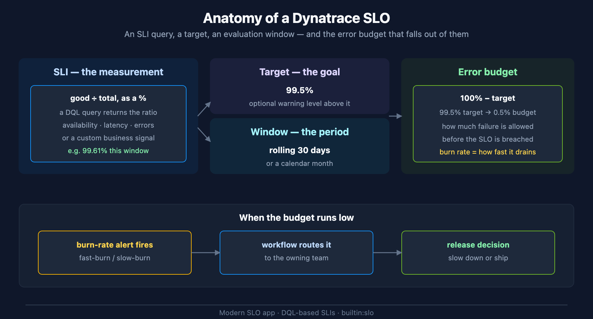

# SLO-01: SLO and SLI Fundamentals

> **Series:** SLO — Service Level Objectives | **Notebook:** 1 of 5 | **Created:** June 2026 | **Last Updated:** 07/01/2026

## Overview

Service Level Objectives turn "is the service healthy?" from a matter of opinion into a measured, agreed number. This notebook defines the three building blocks — **SLI**, **SLO**, **error budget** — explains how Dynatrace models them in the modern SLO app, and helps you choose your first handful of SLOs.

This is the conceptual foundation for the series. SLO-02 builds the SLI queries, SLO-03 covers composition and error budgets in depth, SLO-04 covers alerting, and SLO-05 covers provisioning SLOs as code.

---

## Table of Contents

1. [The Three Building Blocks](#blocks)
2. [Why SLOs Matter](#why)
3. [The Dynatrace SLO Model](#model)
4. [Anatomy of an SLO](#anatomy)
5. [Choosing Your First SLOs](#choosing)
6. [Cross-Series Pointers](#cross)

---

## Prerequisites

| Requirement | Details |
|-------------|---------|
| **Dynatrace Environment** | SaaS Gen3 with Grail and the SLO app |
| **IAM permissions (SLO app itself)** | `slo:slos:read`, `slo:slos:write`, `slo:objective-templates:read` — the gating permissions for the app; a minimal read/write grant is `ALLOW slo:slos:read, slo:objective-templates:read; ALLOW slo:slos:write;` |
| **Data-source permissions** | `storage:metrics:read`, `storage:spans:read`, plus whichever of `storage:logs:read` / `storage:bizevents:read` / `storage:events:read` / `storage:buckets:read` your SLI queries touch; `settings:objects:read/write` to create SLOs |
| **Concepts** | Basic DQL (see the SPANS and DBMON series); familiarity with your service topology |

## 1. The Three Building Blocks

| Term | What it is | Example |
|------|-----------|---------|
| **SLI** — Service Level Indicator | A measured ratio of *good* events to *total* events, expressed as a percentage | 99.61% of requests succeeded |
| **SLO** — Service Level Objective | A target for an SLI over a defined window | availability ≥ 99.5% over 30 days |
| **Error budget** | The allowed shortfall: `100% − target` | 0.5% of requests may fail before the SLO is breached |

An **SLI** answers *how are we doing right now*. An **SLO** sets *how good is good enough*. The **error budget** converts the gap into a spendable quantity — once it is gone, the SLO is breached, and that is the signal teams act on.

A note on SLAs: an **SLA** (Service Level Agreement) is a contract with consequences (credits, penalties). SLOs are your internal targets, and you almost always set them *stricter* than any SLA so you find out before the customer does.

## 2. Why SLOs Matter

- **They translate technical health into business language.** "p95 checkout latency under 1s, 99.9% of the month" is something a product owner can reason about.
- **They give you an error budget.** A budget reframes reliability from "zero errors" (impossible, paralysing) to "errors are fine until the budget runs low" — which then drives concrete decisions: keep shipping, or slow down and harden.
- **They are the highest-signal alert source.** Alerting on *burn rate* against the budget catches both the acute outage and the slow leak, with far less noise than threshold alerts on raw metrics (SLO-04).

## 3. The Dynatrace SLO Model

Dynatrace has two generations of SLO tooling:

| | SLO Classic | Modern SLO app (use this) |
|--|-------------|---------------------------|
| SLI definition | Metric expressions, fixed indicator types | **DQL-based** — any `good ÷ total` query over metrics, spans, logs, or bizevents |
| Backing schema | classic config | `builtin:monitoring.slo` (Settings 2.0) |
| As code | limited | `dynatrace_slo_v2` Terraform resource (metric-based SLIs only — SLO-05 §2) / Monaco (full schema, incl. DQL-based Custom SLOs) |
| Data scope | service metrics | all Grail data types |

New work should use the **modern SLO app** with DQL-based SLIs — it covers every data type and is the path that is actively developed. Dynatrace's own guidance is to still prefer a metric-based SLI over a DQL one where a suitable pre-aggregated metric exists, since metric queries are faster and cheaper to evaluate; use `makeTimeseries` for event/log-derived SLIs where no such metric exists (SLO-02). If you have SLO Classic definitions, Dynatrace publishes an upgrade path.

<!-- MARKDOWN_TABLE_ALTERNATIVE
| Part | Role | Example |
|------|------|---------|
| SLI | the measurement (good÷total %) | 99.61% this window |
| Target | the goal | 99.5% |
| Window | the period | rolling 30 days |
| Error budget | 100% − target | 0.5% |
| Burn rate | how fast the budget drains | drives alerting (SLO-04) |
For environments where SVG doesn't render
-->

## 4. Anatomy of an SLO

Every modern Dynatrace SLO is four decisions:

1. **The SLI query** — a DQL query that returns the good-versus-total ratio. This is the bulk of the work and is covered in SLO-02.
2. **The target** — the percentage you commit to (e.g. `99.5`). Optionally a **warning** level above the target that surfaces "getting close" before an actual breach.
3. **The evaluation window** — *rolling* (e.g. last 30 days, always moving) or *calendar* (this month). Rolling windows give smoother trend signals; calendar windows align to business reporting. SLO-03 covers the trade-off.
4. **What happens on breach** — burn-rate alerting and routing, covered in SLO-04.

The error budget is not a separate decision — it falls out of the target (`100% − target`). The art is in the first three choices.

## 5. Choosing Your First SLOs

The most common failure mode is too many SLOs, none trusted. Start narrow:

- **Pick 2–4 business-critical services** — the user journeys that matter (checkout, login, search), not every microservice.
- **1–2 SLIs per service** — availability plus either latency or error rate. Resist the urge to measure everything.
- **Set achievable targets first.** Measure the current SLI for a week, then set the target slightly below observed performance. A target you breach on day one teaches the team to ignore SLOs.
- **Tighten over time.** SLOs are living guidance — review quarterly, ratchet up as the service matures.

> **Anti-pattern:** copying "99.9%" onto every service because it sounds rigorous. A target must reflect what the service can actually deliver and what its users actually need.

## 6. Cross-Series Pointers

- **SLO-02** — building the SLI queries (availability, latency, error rate, custom).
- **SLO-03** — error budgets, burn rate, composite and weighted SLOs.
- **SLO-04** — burn-rate alerting and routing SLO breaches.
- **SLO-05** — provisioning SLOs as code (`dynatrace_slo_v2`, Monaco).
- **AIOPS-02** — anomaly detection; SLO breaches and anomalies are complementary detection inputs.
- **WFLOW** — routing the problems an SLO breach raises.

> **Sources:** [Service-Level Objectives (DT docs)](https://docs.dynatrace.com/docs/deliver/service-level-objectives), [SLOs for all data types (Dynatrace News)](https://www.dynatrace.com/news/blog/slos-for-all-data-types/).

---

*This notebook was AI-generated from community-submitted and publicly available sources. This notebook series is not officially supported by Dynatrace. Always verify information against official Dynatrace documentation.*
