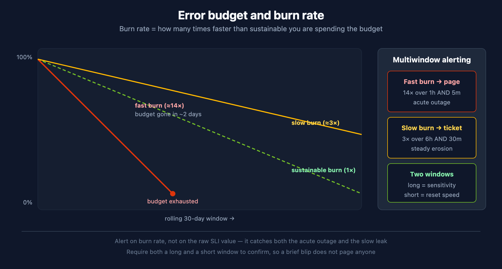

# SLO-04: SLO Alerting

> **Series:** SLO — Service Level Objectives | **Notebook:** 4 of 5 | **Created:** June 2026 | **Last Updated:** 06/16/2026

## Overview

The highest-value alert a platform can send is "you are about to breach an SLO." This notebook covers **burn-rate alerting** — why it beats thresholding the raw SLI, how fast-burn and slow-burn multiwindow alerts work, how Dynatrace surfaces SLO alerts, and how to route them through Workflows without drowning the team in noise.

---

## Table of Contents

1. [Why Burn-Rate, Not Threshold-on-SLI](#why)
2. [Fast-Burn and Slow-Burn](#multiwindow)
3. [Configuring SLO Alerts in Dynatrace](#configuring)
4. [Routing SLO Breaches](#routing)
5. [Avoiding Alert Fatigue](#fatigue)

---

## Prerequisites

| Requirement | Details |
|-------------|---------|
| **Dynatrace Environment** | SaaS Gen3 with the SLO app and AutomationEngine (Workflows) |
| **Permissions** | `settings:objects:read/write`, workflow authoring permissions |
| **Prior reading** | SLO-03 (error budgets and burn rate) |

<a id="why"></a>
## 1. Why Burn-Rate, Not Threshold-on-SLI

The naive approach — alert when the SLI drops below the target — is a bad signal:

- **It fires late on slow leaks.** A rolling-30-day SLI barely moves when a service degrades for an hour, so the alert comes long after the damage.
- **It flaps on momentary dips.** A single bad interval can cross the line and recover, paging someone for nothing.

**Burn rate fixes both.** Because it measures the *rate* of budget consumption over a short window, a sharp degradation produces a high burn rate immediately, while a brief blip does not sustain. You alert on "the budget is draining too fast," which is what you actually care about.



<!-- MARKDOWN_TABLE_ALTERNATIVE
| Signal | Catches acute outage | Catches slow leak | Flaps on blips |
|--------|----------------------|-------------------|----------------|
| Threshold on raw SLI | late | very late | yes |
| Burn rate (multiwindow) | fast | yes | no |
For environments where SVG doesn't render
-->

<a id="multiwindow"></a>
## 2. Fast-Burn and Slow-Burn

The established SRE pattern uses two alert tiers, each requiring **two windows** to agree before firing:

| Tier | Burn rate | Windows (long AND short) | Response |
|------|-----------|--------------------------|----------|
| **Fast burn** | ~14× | 1 hour AND 5 minutes | Page — acute, budget gone in ~2 days |
| **Slow burn** | ~3× | 6 hours AND 30 minutes | Ticket — steady erosion |

The **long window** gives sensitivity (it confirms the burn is real); the **short window** gives fast reset (it stops alerting quickly once the burn stops). Requiring both prevents a momentary spike from paging anyone. The query below evaluates a fast-burn condition; wire it into a detector (Section 3):

```dql
// Fast-burn check: is the 1h burn rate >= 14x against a 99.5% target?
timeseries {
  total = sum(dt.service.request.count),
  failures = sum(dt.service.request.failure_count)
}, from:-1h, interval:5m
| fieldsAdd bad_ratio = failures[] / total[]
| fieldsAdd observed_bad = arrayAvg(bad_ratio)
| fieldsAdd burn_rate = observed_bad / (1.0 - 0.995)
| fieldsAdd fast_burn = if(burn_rate >= 14, 1, else: 0)
| fields burn_rate, fast_burn
```

<a id="configuring"></a>
## 3. Configuring SLO Alerts in Dynatrace

Dynatrace surfaces SLO health as events you can alert on. In practice you have two routes:

- **Built-in SLO alerting** — the SLO definition itself can raise an alert when the error budget / burn rate crosses a configured level. This is the simplest path and keeps the alert tied to the SLO object.
- **A Davis anomaly detector or metric event on the burn-rate query** — when you want the full multiwindow fast/slow-burn logic, evaluate a burn-rate query (Section 2) in the Anomaly Detection app and let it raise a Davis event. See AIOPS-02 §4 for the detector build flow and event template.

Either way the breach becomes a Davis problem/event carrying the SLO context — which is what a workflow routes on.

> In community practice the multiwindow fast/slow-burn pattern is built with detectors on the burn-rate query rather than the built-in single-threshold alert — verify the exact options available in your tenant's SLO app version, as the built-in alerting controls evolve.

<a id="routing"></a>
## 4. Routing SLO Breaches

An SLO breach raises a problem; routing it is the WFLOW series' job, not a separate mechanism:

1. **Problem-trigger workflow** filters for the SLO-breach event (by event properties — name, the owning team/zone you set in the detector's event template).
2. **Route to the owning team's channel** — Slack, Teams, PagerDuty, or an ITSM incident.
3. **Differentiate by tier** — fast-burn → page (PagerDuty / on-call); slow-burn → ticket (Jira / ServiceNow).

This is exactly the routing covered in WFLOW-04. The key dependency is upstream: the burn-rate detector's **event template must carry the team/service metadata** (AIOPS-02 §4) or the workflow has nothing to filter on.

<a id="fatigue"></a>
## 5. Avoiding Alert Fatigue

- **Only page on fast burn.** Slow burn is a ticket, not a 3 a.m. call.
- **Require both windows.** The short window is what stops the alert from re-firing as conditions recover.
- **Set recovery/dealerting deliberately.** Use the detector's `dealertingSamples` (AIOPS-02 §4) so an alert closes cleanly rather than flapping.
- **One SLO breach, one notification.** Let the problem group related signals; do not also alert on the underlying raw metrics or you double-notify.
- **Review what fired.** If an SLO pages and no one acts, the target or the burn thresholds are wrong — tune them.

> <sub>**Sources:** [Service-Level Objectives (DT docs)](https://docs.dynatrace.com/docs/deliver/service-level-objectives), [Site Reliability Engineering — Alerting on SLOs (Google SRE Workbook)](https://sre.google/workbook/alerting-on-slos/). Burn-rate query validated against a live tenant 06/16/2026. **Derived:** the fast/slow-burn window pairs are the standard SRE values, applied to Dynatrace detectors.</sub>

---

<sub>*This notebook was AI-generated from community-submitted and publicly available sources. This notebook series is not officially supported by Dynatrace. Always verify information against official Dynatrace documentation.*</sub>
