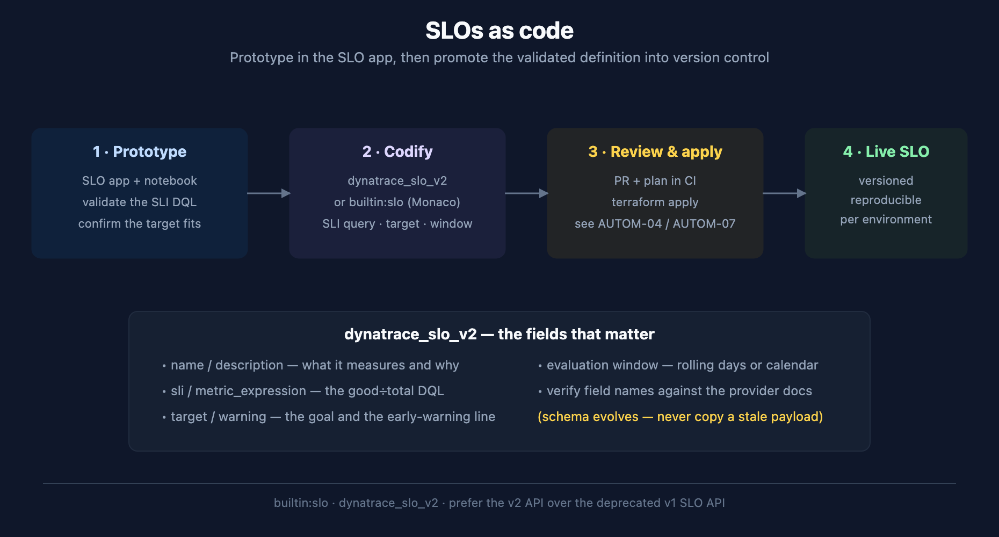

# SLO-05: SLOs as Code

> **Series:** SLO — Service Level Objectives | **Notebook:** 5 of 5 | **Created:** June 2026 | **Last Updated:** 07/01/2026

## Overview

A validated SLO that lives only in the UI is one accidental click from gone, and impossible to reproduce across environments. This notebook covers promoting SLOs into version control: the `builtin:monitoring.slo` schema, the `dynatrace_slo_v2` Terraform resource, the Monaco alternative, and the API path — with a deliberate emphasis on verifying field names at the source rather than copying a payload that may be stale.

---

## Table of Contents

1. [Why Version SLOs](#why)
2. [The Schema and Terraform Resource](#schema)
3. [Terraform Worked Example](#terraform)
4. [Monaco Alternative](#monaco)
5. [API and CI/CD](#api)

---

## Prerequisites

| Requirement | Details |
|-------------|---------|
| **Dynatrace Environment** | SaaS Gen3 with the SLO app |
| **Tooling** | Terraform with the `dynatrace-oss/dynatrace` provider, or Monaco |
| **Auth** | Platform Token or OAuth client per the AUTOM-04 auth-scheme guidance |
| **Prior reading** | SLO-02 (the SLI query you will codify), AUTOM-04 / AUTOM-07 (provider auth, CI/CD) |

<a id="why"></a>
## 1. Why Version SLOs

SLOs are configuration, and configuration that matters belongs in source control:

- **Reproducible across environments** — the same SLO in dev, staging, and prod from one definition.
- **Reviewable** — a target change goes through a PR, not a quiet UI edit.
- **Recoverable** — an accidental deletion is a `terraform apply` away from restored.

The workflow mirrors AIOPS-02's stance on detectors: **prototype in the app, promote to code once it matters.**



<!-- MARKDOWN_TABLE_ALTERNATIVE
| Step | Action |
|------|--------|
| 1 Prototype | Validate the SLI DQL in the SLO app + a notebook |
| 2 Codify | dynatrace_slo_v2 or builtin:slo (Monaco) |
| 3 Review & apply | PR + plan in CI, terraform apply |
| 4 Live SLO | Versioned, reproducible per environment |
For environments where SVG doesn't render
-->

<a id="schema"></a>
## 2. The Schema and Terraform Resource

| Surface | Identifier |
|---------|-----------|
| Settings 2.0 schema | `builtin:monitoring.slo` |
| Terraform resource | `dynatrace_slo_v2` |
| Monaco | `builtin:monitoring.slo` schema via `--settings-schema` |

**A gap to plan around:** the `dynatrace_slo_v2` resource's SLI field (`metric_expression`) takes a **classic metric-selector expression** — e.g. `100*(builtin:service.requestCount.server:splitBy())/(...)` — not the DQL query with an `sli` field that a Custom SLO in the app uses (SLO-01 §3, SLO-02). If your SLI is built from a pre-aggregated metric, this maps over directly, and Dynatrace's own docs recommend metric-based SLOs for performance and cost where a suitable metric exists. If your SLI is genuinely DQL-only — a span-ratio or log/bizevent-derived `sli`, as in SLO-02's latency and custom examples — there is no documented Terraform field for it today; codify those via the export-a-known-good-object path in Section 5 instead of hand-writing HCL.

> **Verify the exact argument names against the provider docs before you write HCL.** The provider schema evolves between releases, and copying a stale payload is precisely how the field-authored alerting document ended up with an SLO API body that would not apply. The example below reflects the resource's documented schema as fetched at source on 07/01/2026 — treat the [resource docs](https://registry.terraform.io/providers/dynatrace-oss/dynatrace/latest/docs/resources/slo_v2) as authoritative going forward, since the schema can still change between provider releases.

```terraform
# dynatrace_slo_v2 — schema verified at the provider registry 07/01/2026
# Metric-based SLI (classic metric-selector syntax) — see the gap callout in Section 2
# regarding DQL-only SLIs, which this resource does not accept directly.
resource "dynatrace_slo_v2" "web_availability_30d" {
  name               = "Web Service Availability - 30d"
  custom_description = "Request success ratio for the critical web service, rolling 30 days"
  enabled            = true
  evaluation_type    = "AGGREGATE"

  # rolling 30-day window
  evaluation_window = "-30d"

  # entitySelector syntax (not a DQL filter) — scopes the SLO to web services
  filter = "type(SERVICE),serviceType(WEB_SERVICE,WEB_REQUEST_SERVICE)"

  # classic metric-selector expression — good / total as a percentage
  metric_expression = "100*(builtin:service.successCount:splitBy())/(builtin:service.requestCount:splitBy())"
  metric_name       = "web_availability_30d"

  target_success = 99.5
  target_warning = 99.9

  # required block — burn-rate visualization + optional fast-burn threshold (SLO-04)
  error_budget_burn_rate {
    burn_rate_visualization_enabled = true
    fast_burn_threshold             = 14
  }
}
```

<a id="terraform"></a>
## 3. Terraform Worked Example — Notes

A few things the example encodes:

- **`target_success` and `target_warning`** are the goal and the early-warning line from SLO-01 §4 (note the argument names — not the shorter `target`/`warning` an earlier draft of this notebook assumed). Warning above target surfaces "getting close" before an actual breach.
- **`metric_expression`** is a classic metric-selector string, not a DQL query — see the Section 2 gap callout. It is the codified form of a good/total ratio built from a pre-aggregated metric, analogous in intent to the SLO-02 DQL SLI but not the same syntax.
- **`filter`** uses entitySelector syntax (`type(SERVICE),serviceType(...)`), not a DQL filter clause and not quoted the way a DQL string literal would be. An unscoped SLO measures the whole environment, which is rarely what you want.
- **`error_budget_burn_rate` is a required block**, not optional — even if you don't need the visualization, the block itself must be present. `fast_burn_threshold` is optional within it and pairs with the SLO-04 burn-rate alerting recipe.
- **State and auth** follow the same rules as every other Dynatrace Terraform resource — see AUTOM-04 for Platform-Token vs classic-token routing and AUTOM-09 for state-backend setup.

<a id="monaco"></a>
## 4. Monaco Alternative

If your shop standardises on Monaco rather than Terraform, the same SLO is a `builtin:monitoring.slo` settings object:

```yaml
configs:
  - id: web-availability-30d
    type:
      settings:
        schema: builtin:monitoring.slo
        scope: environment
    config:
      template: web-availability-30d.json
      skip: false
```

The JSON template carries the SLI, target, warning, and window — and, unlike the Terraform resource, the Settings API payload behind a DQL-based Custom SLO (SLO-01 §3) is a first-class fit here, since Monaco pushes whatever JSON shape the schema accepts rather than mapping through the narrower Terraform resource attributes. As with Terraform, validate the SLI query in a notebook first, then export the working SLO from the app with `monaco download` to capture the exact current JSON shape rather than hand-writing it.

<a id="api"></a>
## 5. API and CI/CD

For direct API automation, use the **current SLO endpoint, not the deprecated v1 SLO API**. Rather than reproduce a request body that may drift, generate it from a working SLO:

1. Create and validate one SLO in the app.
2. Read it back via the API (or `monaco download` / `terraform-provider-dynatrace -export`) to capture the exact current schema.
3. Template that shape for the rest.

This "export a known-good object" approach is the antidote to stale-payload errors, and it is also the path of least resistance for a DQL-only SLI, since the Terraform resource's `metric_expression` field cannot carry one (Section 2). For the full CI/CD pattern — plan on PR, gated apply, three-way validation — see AUTOM-07 (pipelines) and AUTOM-96 (GitHub Actions LAB); the SLO resource slots into exactly the same pipeline as any other Dynatrace config.

> <sub>**Sources:** [Service-Level Objectives (DT docs)](https://docs.dynatrace.com/docs/deliver/service-level-objectives), [dynatrace_slo_v2 resource (Dynatrace provider docs)](https://registry.terraform.io/providers/dynatrace-oss/dynatrace/latest/docs/resources/slo_v2), [Create service-level objectives (DT docs)](https://docs.dynatrace.com/docs/deliver/service-level-objectives/create-slo), [Monaco configuration (DT docs)](https://docs.dynatrace.com/docs/deliver/configuration-as-code/monaco). Terraform schema (`builtin:monitoring.slo`, `evaluation_window`, `target_success`/`target_warning`, required `error_budget_burn_rate` block) verified at the provider registry 07/01/2026. **Derived:** the metric-expression-vs-DQL-sli gap in Section 2 combines the provider's resource schema with the Create-SLO docs' DQL `sli`-field description — neither source states the gap explicitly.</sub>

---

<sub>*This notebook was AI-generated from community-submitted and publicly available sources. This notebook series is not officially supported by Dynatrace. Always verify information against official Dynatrace documentation.*</sub>
