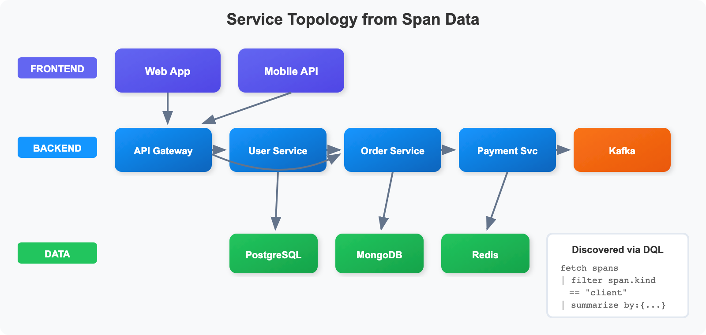
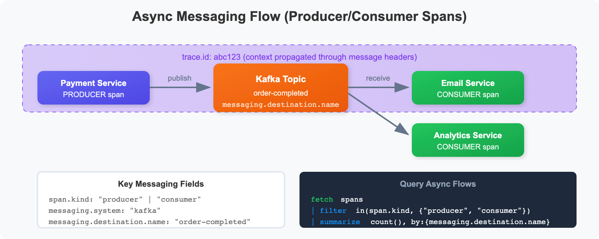
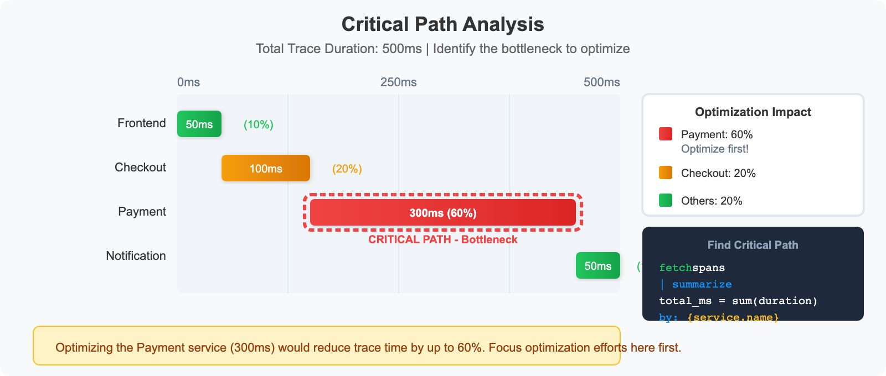

# SPANS-04: Service Dependencies & Flow Analysis

> **Series:** SPANS — Distributed Tracing and Spans | **Notebook:** 4 of 8 | **Created:** December 2025 | **Last Updated:** 04/26/2026

## Mapping Your Distributed System
This notebook teaches you how to use span data to understand service relationships, analyze request flows, and identify critical dependencies in your system.

---

## Table of Contents

1. [Understanding Service Topology](#understanding-service-topology)
2. [Discovering Services](#discovering-services)
3. [Mapping Service Dependencies](#mapping-service-dependencies)
4. [Client-Server Call Patterns](#client-server-call-patterns)
5. [Async Messaging Flows](#async-messaging-flows)
6. [Trace Hierarchy Analysis](#trace-hierarchy-analysis)
7. [Cross-Service Latency Analysis](#cross-service-latency-analysis)
8. [Critical Path Analysis](#critical-path-analysis)

---


## Prerequisites

Before starting this notebook, ensure you have:

- ✅ Completed **SPANS-01** through **SPANS-03**
- ✅ Access to a Dynatrace environment with distributed trace data
- ✅ Understanding of span kinds (server, client, producer, consumer)

### Sprint 1.337 (April 2026): OpenTelemetry service.name Enrichment

When OpenTelemetry-instrumented spans carry the OTel **`service.name`** resource attribute, Dynatrace Service Detection v1 now uses that value to enrich the existing service rather than creating a parallel one. Two visible effects:

- **Smartscape display**: services show as `service.name (detected name)` — for example `checkout-api (com.example.checkout.OrderService)` — keeping both the OTel-canonical name and the auto-detected name visible.
- **Span/metric field**: the value populates a new `dt.service.name` field on spans and metrics, queryable directly:

```dql
fetch spans, from:-1h
| filter isNotNull(dt.service.name)
| summarize span_count = count(), by:{dt.service.name, dt.smartscape.service}
| sort span_count desc
| limit 50
```

This eliminates the historical "two services for one process" pattern when teams add OpenTelemetry SDKs alongside OneAgent for vendor-neutral instrumentation.

### Ktor service technology now recognized

Sprint 1.337 also added **`KTOR_CLIENT`** and **`KTOR_SERVER`** values to the service technology enum across request attributes and extension host availability endpoints. If you have Ktor (Kotlin async HTTP framework) services in your environment, they now appear with explicit Ktor technology in Smartscape, calculated metrics, and request-naming rules — no more `KOTLIN_GENERIC` fallback.

---

<a id="understanding-service-topology"></a>
## 1. Understanding Service Topology
Service topology shows how your services connect and communicate:



<!--MARKDOWN_TABLE_ALTERNATIVE
| Layer | Services | Function |
|-------|----------|----------|
| Frontend | Web App, Mobile API | User-facing entry points |
| Backend | Checkout, Cart, Payment, Inventory | Business logic |
| Data | PostgreSQL, Redis, Kafka | Storage and messaging |
-->

### Key Span Types for Topology

| Span Kind | Role | What It Tells You |
|-----------|------|-------------------|
| `server` | Receives requests | Entry points, inbound traffic |
| `client` | Makes requests | Outbound calls, dependencies |
| `producer` | Sends messages | Async event sources |
| `consumer` | Receives messages | Async event handlers |

---

<a id="discovering-services"></a>
## 2. Discovering Services
First, discover all services generating spans in your environment:

```dql
// List all services with span counts
fetch spans, from:-1h
| summarize {
    span_count = count(),
    operations = countDistinct(span.name)
  }, by: {service.name}
| sort span_count desc
| limit 30
```

```dql
// Service role analysis - understand each service's function
fetch spans, from:-1h
| summarize {
    server_spans = countIf(span.kind == "server"),
    client_spans = countIf(span.kind == "client"),
    internal_spans = countIf(span.kind == "internal"),
    producer_spans = countIf(span.kind == "producer"),
    consumer_spans = countIf(span.kind == "consumer")
  }, by: {service.name}
| sort server_spans desc
| limit 30
```

```dql
// Discover all operations/endpoints per service
fetch spans, from:-1h
| filter span.kind == "server"
| summarize {
    request_count = count(),
    avg_duration_ms = avg(duration) / 1ms
  }, by: {service.name, span.name}
| sort service.name asc, request_count desc
| limit 50
```

---

<a id="mapping-service-dependencies"></a>
## 3. Mapping Service Dependencies
Use CLIENT spans to understand which services call which other services:

### Key Attributes for Dependencies

| Attribute | Description |
|-----------|-------------|
| `peer.service` | Target service name (if instrumented) |
| `server.address` | Target host/address |
| `server.port` | Target port |
| `http.host` | HTTP host header |

```dql
// Map service-to-service calls using CLIENT spans
fetch spans, from:-1h
| filter span.kind == "client"
| summarize {
    call_count = count(),
    avg_latency_ms = avg(duration) / 1ms,
    error_count = countIf(span.status_code == "error")
  }, by: {service.name, span.name}
| fieldsAdd error_rate_pct = (error_count * 100.0) / call_count
| sort call_count desc
| limit 50
```

```dql
// Find services called by other services using peer.service attribute
// peer.service shows the target service name when available
fetch spans, from:-1h
| filter span.kind == "client" and isNotNull(peer.service)
| summarize {
    call_count = count(),
    avg_latency_ms = avg(duration) / 1ms
  }, by: {service.name, peer.service}
| sort call_count desc
| limit 30
```

```dql
// Map dependencies using HTTP host/URL information
fetch spans, from:-1h
| filter span.kind == "client" and isNotNull(server.address)
| summarize {
    call_count = count(),
    avg_latency_ms = avg(duration) / 1ms,
    error_count = countIf(span.status_code == "error")
  }, by: {service.name, server.address}
| fieldsAdd error_rate_pct = (error_count * 100.0) / call_count
| sort call_count desc
| limit 30
```

---

<a id="client-server-call-patterns"></a>
## 4. Client-Server Call Patterns
Analyze the matching CLIENT and SERVER span pairs to understand inter-service communication:

```dql
// Analyze outbound calls from each service
fetch spans, from:-1h
| filter span.kind == "client"
| summarize {
    outbound_calls = count(),
    avg_latency_ms = avg(duration) / 1ms,
    p99_latency_ms = percentile(duration, 99) / 1ms,
    error_count = countIf(span.status_code == "error")
  }, by: {service.name}
| fieldsAdd error_rate_pct = (error_count * 100.0) / outbound_calls
| sort outbound_calls desc
| limit 20
```

```dql
// Analyze inbound requests to each service
fetch spans, from:-1h
| filter span.kind == "server"
| summarize {
    inbound_requests = count(),
    avg_latency_ms = avg(duration) / 1ms,
    p99_latency_ms = percentile(duration, 99) / 1ms,
    error_count = countIf(span.status_code == "error")
  }, by: {service.name}
| fieldsAdd error_rate_pct = (error_count * 100.0) / inbound_requests
| sort inbound_requests desc
| limit 20
```

```dql
// Find services with high outbound/inbound ratio (integration heavy)
fetch spans, from:-1h
| summarize {
    inbound = countIf(span.kind == "server"),
    outbound = countIf(span.kind == "client")
  }, by: {service.name}
| filter inbound > 0
| fieldsAdd outbound_ratio = outbound / inbound
| sort outbound_ratio desc
| limit 20
```

---

<a id="async-messaging-flows"></a>
## 5. Async Messaging Flows
Analyze asynchronous messaging patterns using PRODUCER and CONSUMER spans:



<!--MARKDOWN_TABLE_ALTERNATIVE
| Span Kind | Service | Action | Destination |
|-----------|---------|--------|-------------|
| producer | Payment Service | publish | order-completed |
| consumer | Email Service | receive | order-completed |
| consumer | Analytics Service | receive | order-completed |
-->

### Key Messaging Attributes

| Attribute | Description |
|-----------|-------------|
| `messaging.system` | Kafka, RabbitMQ, etc. |
| `messaging.destination.name` | Topic/queue name |
| `messaging.operation` | publish, receive, etc. |

```dql
// Find message producers (services sending async messages)
fetch spans, from:-1h
| filter span.kind == "producer"
| summarize {
    messages_sent = count(),
    avg_duration_ms = avg(duration) / 1ms,
    error_count = countIf(span.status_code == "error")
  }, by: {service.name, span.name}
| sort messages_sent desc
| limit 20
```

```dql
// Find message consumers (services receiving async messages)
fetch spans, from:-1h
| filter span.kind == "consumer"
| summarize {
    messages_received = count(),
    avg_processing_ms = avg(duration) / 1ms,
    error_count = countIf(span.status_code == "error")
  }, by: {service.name, span.name}
| fieldsAdd error_rate_pct = (error_count * 100.0) / messages_received
| sort messages_received desc
| limit 20
```

```dql
// Analyze messaging system usage (Kafka, RabbitMQ, etc.)
fetch spans, from:-1h
| filter span.kind == "producer" or span.kind == "consumer"
| filter isNotNull(messaging.system)
| summarize {
    message_count = count(),
    producers = countIf(span.kind == "producer"),
    consumers = countIf(span.kind == "consumer"),
    error_count = countIf(span.status_code == "error")
  }, by: {messaging.system, messaging.destination.name}
| sort message_count desc
| limit 20
```

```dql
// Map producer to consumer relationships
fetch spans, from:-1h
| filter span.kind == "producer" or span.kind == "consumer"
| summarize {
    span_count = count()
  }, by: {service.name, span.kind, messaging.destination.name}
| sort messaging.destination.name, span.kind
| limit 30
```

---

<a id="trace-hierarchy-analysis"></a>
## 6. Trace Hierarchy Analysis
Analyze parent-child relationships within traces to understand call depth:

```dql
// Count spans per trace to understand trace complexity
fetch spans, from:-1h
| summarize {
    span_count = count(),
    services_involved = countDistinct(service.name),
    total_duration_ms = sum(duration) / 1ms
  }, by: {trace.id}
| sort span_count desc
| limit 25
```

```dql
// Examine a complete trace hierarchy
// Replace YOUR_TRACE_ID with an actual trace ID from above
fetch spans, from:-1h
// | filter trace.id == "YOUR_TRACE_ID"
| fieldsAdd duration_ms = duration / 1ms
| fields start_time,
         span.id,
         span.parent_id,
         service.name,
         span.name,
         span.kind,
         duration_ms
| sort start_time asc
| limit 100
```

```dql
// Find entry points (root spans) and their downstream services
fetch spans, from:-1h
| filter isNull(span.parent_id)
| summarize {
    entry_count = count(),
    avg_duration_ms = avg(duration) / 1ms
  }, by: {service.name, span.name}
| sort entry_count desc
| limit 20
```

---

<a id="cross-service-latency-analysis"></a>
## 7. Cross-Service Latency Analysis
Identify latency hot spots between services:

```dql
// Latency by service-to-service call
fetch spans, from:-1h
| filter span.kind == "client" and isNotNull(server.address)
| summarize {
    call_count = count(),
    avg_ms = avg(duration) / 1ms,
    p95_ms = percentile(duration, 95) / 1ms,
    p99_ms = percentile(duration, 99) / 1ms
  }, by: {service.name, server.address}
| sort p95_ms desc
| limit 20
```

```dql
// Time spent per service in traces
fetch spans, from:-1h
| summarize {
    total_time_ms = sum(duration) / 1ms,
    span_count = count(),
    avg_per_span_ms = avg(duration) / 1ms
  }, by: {service.name}
| sort total_time_ms desc
| limit 20
```

```dql
// Find slowest dependencies (CLIENT spans)
fetch spans, from:-1h
| filter span.kind == "client"
| filter duration > 500ms
| summarize {
    slow_call_count = count(),
    avg_duration_ms = avg(duration) / 1ms,
    max_duration_ms = max(duration) / 1ms
  }, by: {service.name, span.name}
| sort avg_duration_ms desc
| limit 20
```

---

<a id="critical-path-analysis"></a>
## 8. Critical Path Analysis
Identify the services and operations that contribute most to end-to-end latency:



<!--MARKDOWN_TABLE_ALTERNATIVE
| Service | Duration | % of Total | Priority |
|---------|----------|------------|----------|
| Frontend | 50ms | 10% | Low |
| Checkout | 100ms | 20% | Medium |
| Payment | 300ms | 60% | HIGH - Bottleneck |
| Notification | 50ms | 10% | Low |
-->

```dql
// Find services contributing most to total trace time
fetch spans, from:-1h
| summarize {
    total_self_time_ms = sum(duration) / 1ms,
    span_count = count(),
    avg_duration_ms = avg(duration) / 1ms,
    max_duration_ms = max(duration) / 1ms
  }, by: {service.name}
| sort total_self_time_ms desc
| limit 15
```

```dql
// Find slowest operations across all services
fetch spans, from:-1h
| filter span.kind == "server"
| summarize {
    call_count = count(),
    avg_duration_ms = avg(duration) / 1ms,
    p99_duration_ms = percentile(duration, 99) / 1ms,
    total_time_ms = sum(duration) / 1ms
  }, by: {service.name, span.name}
| filter call_count > 10
| sort p99_duration_ms desc
| limit 20
```

```dql
// Identify high-impact optimization candidates
// (high volume + high latency = most benefit from optimization)
fetch spans, from:-1h
| filter span.kind == "server"
| summarize {
    call_count = count(),
    avg_duration_ms = avg(duration) / 1ms,
    total_time_ms = sum(duration) / 1ms
  }, by: {service.name, span.name}
| filter call_count > 50
| fieldsAdd impact_score = call_count * avg_duration_ms
| sort impact_score desc
| limit 20
```

---

## Summary

In this notebook, you learned:

✅ **Service discovery** - Find all services and their operations  
✅ **Dependency mapping** - Use CLIENT spans with `peer.service` and `server.address`  
✅ **Client-server patterns** - Analyze inbound/outbound call ratios  
✅ **Async messaging** - Track PRODUCER/CONSUMER spans through message queues  
✅ **Trace hierarchy** - Understand span parent-child relationships  
✅ **Cross-service latency** - Find latency hot spots between services  
✅ **Critical path analysis** - Identify bottlenecks for optimization  

---

## Next Steps

Continue to **SPANS-05: Advanced Span Analytics** to learn:
- Time series analysis and trending
- Complex aggregations and calculations
- Building dashboard-ready queries
- Alerting patterns

---

<sub>*This notebook was AI-generated from community-submitted and publicly available sources. This notebook series is not officially supported by Dynatrace. Always verify information against official Dynatrace documentation.*</sub>
