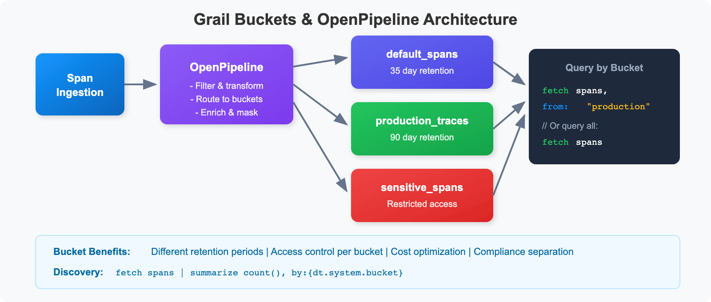
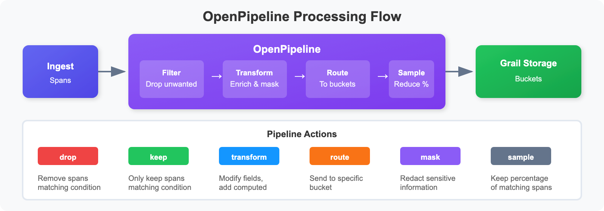
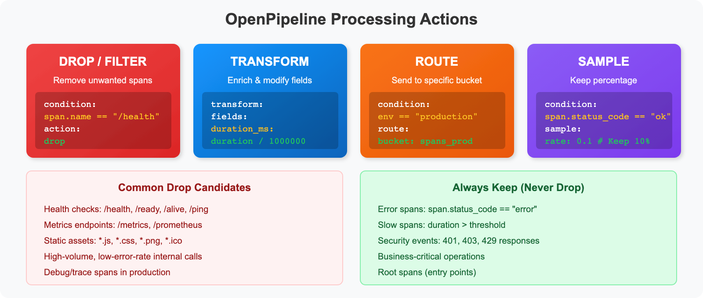
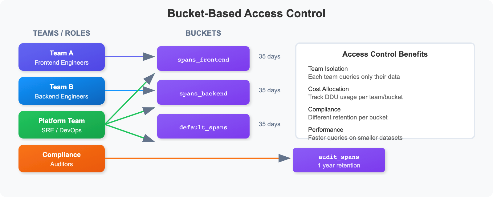

# SPANS-07: Grail Buckets & OpenPipeline

> **Series:** SPANS — Distributed Tracing and Spans | **Notebook:** 7 of 8 | **Created:** December 2025 | **Last Updated:** 04/25/2026

## Data Architecture and Processing for Distributed Traces
This notebook covers Dynatrace Grail's bucket architecture for span storage, OpenPipeline configuration patterns, and data governance strategies.

---

## Table of Contents

1. [Understanding Grail Buckets](#understanding-grail-buckets)
2. [Querying from Specific Buckets](#querying-from-specific-buckets)
3. [Bucket Discovery](#bucket-discovery)
4. [OpenPipeline Concepts](#openpipeline-concepts)
5. [Filtering & Dropping Unwanted Spans](#filtering-dropping-unwanted-spans)
6. [Transforming & Enriching Data](#transforming-enriching-data)
7. [Routing to Different Buckets](#routing-to-different-buckets)
8. [Sampling Strategies](#sampling-strategies)
9. [Measuring Span Traffic per Application](#measuring-span-traffic)
10. [Access Control Patterns](#access-control-patterns)
11. [Best Practices Summary](#best-practices-summary)

---


## Prerequisites

Before starting this notebook, ensure you have:

- ✅ Completed previous SPANS notebooks (01-06)
- ✅ Understanding of Dynatrace Grail architecture
- ✅ Admin access for bucket/pipeline configuration (optional)

### OneAgent Attribute Enrichment (OneAgent 1.331+)

> **Requires:** OneAgent version **1.331** or later

OneAgent can enrich **all telemetry signals** (metrics, spans, logs, events, entities) with custom metadata at the source — before data reaches the Dynatrace platform. This is more efficient than server-side tagging (auto-tags) because enrichment happens on the host and propagates to all Smartscape nodes.

**Primary Fields** (standardized from Semantic Dictionary):
- `dt.security_context` — data governance and access control
- `dt.cost.costcenter` — cost allocation
- `dt.cost.product` — product attribution

**Primary Tags** (custom key-value pairs):
- `primary_tags.environment` — environment identification (production, staging, etc.)
- `primary_tags.team` — team ownership
- `primary_tags.business_unit` — organizational unit

**Configuration:**

```bash
# Set during OneAgent installation
Dynatrace-OneAgent-Linux.sh --set-host-tag="primary_tags.environment=production" --set-host-tag="dt.security_context=confidential"

# Set on existing agents via oneagentctl
oneagentctl --set-host-tag="primary_tags.environment=production"
oneagentctl --set-host-tag="dt.cost.costcenter=12345"

# Per-process via environment variable (overrides host-level)
DT_TAGS="primary_tags.team=platform primary_tags.environment=production"
```

**Benefits over auto-tagging:**
| Aspect | Auto-Tags (Server-Side) | Attribute Enrichment (Agent-Side) |
|--------|------------------------|----------------------------------|
| When applied | After data arrives at platform | At the source, before transmission |
| Scope | Entity tags only | All signals: metrics, spans, logs, events, entities |
| Grail integration | Limited | Full — feeds OpenPipeline routing, bucket assignment, permissions |
| Cost allocation | Not supported | `dt.cost.costcenter`, `dt.cost.product` fields |
| Security context | Not supported | `dt.security_context` for data governance |

> **See:** [Primary Grail fields and tags enrichment through OneAgent](https://docs.dynatrace.com/docs/ingest-from/dynatrace-oneagent/oneagent-attribute-enrichment)

<a id="understanding-grail-buckets"></a>
## 1. Understanding Grail Buckets
Grail stores observability data in **buckets** - logical containers that provide data isolation, retention control, and access management.



<!--MARKDOWN_TABLE_ALTERNATIVE
| Bucket | Retention | Purpose |
|--------|-----------|---------|
| default_spans | 35 days | Standard span storage |
| production_traces | 90 days | Extended retention for prod |
| sensitive_spans | Varies | Restricted access, compliance |
-->

### Why Use Buckets?

| Purpose | Benefit |
|---------|---------|
| Cost Control | Different retention periods per bucket |
| Access Control | Restrict who can query which data |
| Compliance | Separate sensitive data for audit |
| Performance | Query specific buckets for efficiency |
| Team Isolation | Each team queries their own bucket |

> 💡 **Tip:** The default bucket for spans is `default_spans`. Custom buckets are configured via OpenPipeline.

---

<a id="querying-from-specific-buckets"></a>
## 2. Querying from Specific Buckets
Use the `bucket:` parameter to query from specific buckets for improved performance and cost efficiency.

```dql
// Query spans from the default bucket
fetch spans, bucket: {"default_spans"}
| filter span.kind == "server"
| fields start_time, dt.entity.service, span.name, duration
| sort start_time desc
| limit 50
```

```dql
// Query from multiple buckets (if you have custom buckets)
// Replace with your actual bucket names
fetch spans, bucket: {"default_spans"}
| filter span.kind == "server"
| summarize {span_count = count()}, by:{dt.entity.service}
| sort span_count desc
| limit 20
```

---

<a id="bucket-discovery"></a>
## 3. Bucket Discovery
Discover which buckets contain your data and their characteristics.

```dql
// Find out which bucket your spans are stored in
fetch spans, from:-1h
| fieldsAdd bucket = dt.system.bucket
| summarize {span_count = count()}, by:{bucket}
| sort span_count desc
```

```dql
// Analyze span distribution by bucket and service
fetch spans, from:-1h
| fieldsAdd bucket = dt.system.bucket
| summarize {span_count = count()}, by:{bucket, dt.entity.service}
| sort bucket, span_count desc
| limit 50
```

---

<a id="openpipeline-concepts"></a>
## 4. OpenPipeline Concepts
**OpenPipeline** processes incoming telemetry **before** storage. It enables filtering, transformation, routing, and sampling of span data.



<!--MARKDOWN_TABLE_ALTERNATIVE
| Stage | Purpose | Example |
|-------|---------|---------|
| Filter | Drop unwanted spans | Remove health checks |
| Transform | Enrich & modify fields | Add duration_ms |
| Route | Send to buckets | Production → long retention |
| Sample | Keep percentage | 10% of normal traffic |
-->

> ⚠️ **Note:** OpenPipeline configuration is done in the Dynatrace UI under **Settings > OpenPipeline**. This notebook shows how to identify candidates and verify results.

---

<a id="filtering-dropping-unwanted-spans"></a>
## 5. Filtering & Dropping Unwanted Spans


<!--MARKDOWN_TABLE_ALTERNATIVE
| Action | Purpose | Example Config |
|--------|---------|----------------|
| drop | Remove spans | condition: span.name == "/health" |
| transform | Modify fields | duration_ms: duration / 1000000 |
| route | Send to bucket | bucket: spans_prod |
| sample | Keep percentage | rate: 0.1 |
-->

### Candidates for Dropping

1. **Health checks** - `/health`, `/ready`, `/alive` endpoints
2. **Metrics endpoints** - `/metrics`, `/prometheus`
3. **Static assets** - `.js`, `.css`, `.png` requests
4. **Internal noise** - Very frequent internal operations

```dql
// Find health check spans (candidates for dropping)
fetch spans, from:-1h
| filter contains(span.name, "health") or 
        contains(span.name, "ready") or
        contains(span.name, "alive") or
        contains(span.name, "ping")
| summarize {count = count()}, by:{dt.entity.service, span.name}
| sort count desc
```

```dql
// Find static asset requests (often low value)
fetch spans, from:-1h
| filter isNotNull(url.path)
| filter endsWith(url.path, ".js") or 
        endsWith(url.path, ".css") or
        endsWith(url.path, ".png") or
        endsWith(url.path, ".ico")
| summarize {count = count()}, by:{dt.entity.service}
| sort count desc
```

```dql
// Find high-volume, low-value spans
// High volume but almost no errors = candidates for filtering
fetch spans, from:-1h
| summarize {
    count = count(),
    error_count = countIf(span.status_code == "error")
  }, by:{dt.entity.service, span.name}
| fieldsAdd error_rate = (error_count * 100.0) / count
| filter count > 1000 and error_rate < 0.1
| sort count desc
```

### OpenPipeline Example: Drop Health Checks

```yaml
# Configure in Settings > OpenPipeline > Spans
pipelines:
  - name: spans_pipeline
    stages:
      - name: drop_health_checks
        rules:
          - condition: |
              contains(span.name, "health") or
              contains(span.name, "ready") or
              contains(span.name, "alive")
            action: drop
```

---

<a id="transforming-enriching-data"></a>
## 6. Transforming & Enriching Data
Pre-compute fields at ingestion time for faster queries.

### OpenPipeline Example: Add Computed Fields

```yaml
stages:
  - name: add_computed_fields
    rules:
      - transform:
          fields:
            duration_ms: duration / 1000000
            is_slow: duration > 1000000000
```

### OpenPipeline Example: Add Business Context

```yaml
stages:
  - name: add_business_context
    rules:
      - condition: contains(service.name, "checkout")
        transform:
          fields:
            business.domain: "commerce"
            business.criticality: "high"
            
      - condition: contains(service.name, "payment")
        transform:
          fields:
            business.domain: "finance"
            business.criticality: "critical"
```

```dql
// Example: Fields you might want to pre-compute
fetch spans, from:-1h
| fieldsAdd 
    duration_ms = duration / 1000000,
    is_error = span.status_code == "error",
    latency_bucket = if(
        duration < 100ms, "fast",
        else: if(duration < 1s, "normal",
        else: "slow"))
| fields dt.entity.service, span.name, duration_ms, is_error, latency_bucket
| limit 10
```

```dql
// Identify services by domain for enrichment planning
fetch spans, from:-1h
| summarize {count = count()}, by:{dt.entity.service}
| sort count desc
| limit 20
```

---

<a id="routing-to-different-buckets"></a>
## 7. Routing to Different Buckets
Route spans to buckets based on:
- **Retention needs** (short vs. long term)
- **Sensitivity** (PII vs. non-PII)
- **Environment** (prod vs. dev)
- **Cost** (high-value vs. low-value)

### OpenPipeline Example: Route by Environment

```yaml
stages:
  - name: route_by_environment
    rules:
      - condition: deployment.environment == "production"
        route:
          bucket: spans_production_90d
          
      - condition: deployment.environment == "staging"
        route:
          bucket: spans_staging_7d
          
      - condition: true  # Default
        route:
          bucket: spans_default_3d
```

### OpenPipeline Example: Route by Sensitivity

```yaml
stages:
  - name: route_by_sensitivity
    rules:
      - condition: |
          contains(service.name, "payment") or 
          contains(service.name, "auth")
        route:
          bucket: spans_sensitive
          
      - condition: true
        route:
          bucket: spans_default
```

```dql
// Check what environments/namespaces exist for routing planning
fetch spans, from:-1h
| summarize {count = count()}, by:{k8s.namespace.name}
| sort count desc
```

```dql
// Identify sensitive services for routing
fetch spans, from:-1h
| filter contains(span.name, "payment") or
        contains(span.name, "auth") or
        contains(span.name, "login")
| summarize {count = count()}, by:{dt.entity.service, span.name}
| sort count desc
```

---

<a id="sampling-strategies"></a>
## 8. Sampling Strategies
For very high volume services, consider sampling to reduce costs while maintaining visibility.

### OpenPipeline Example: Smart Sampling

```yaml
stages:
  - name: smart_sampling
    rules:
      # Always keep all errors (100%)
      - condition: span.status_code == "error"
        action: keep
        
      # Always keep slow requests (100%)
      - condition: duration > 1000000000
        action: keep
        
      # Sample 10% of normal requests for high-volume service
      - condition: service.name == "high-volume-service"
        sample:
          rate: 0.1
          
      # Sample 50% for other services
      - condition: true
        sample:
          rate: 0.5
```

```dql
// Identify high-volume services for sampling consideration
fetch spans, from:-1h
| summarize {
    total = count(),
    errors = countIf(span.status_code == "error"),
    slow = countIf(duration > 1s)
  }, by:{dt.entity.service}
| fieldsAdd error_rate = (errors * 100.0) / total
| fieldsAdd important = errors + slow
| fieldsAdd droppable = total - errors - slow
| filter total > 10000  // High volume services
| sort total desc
```

```dql
// Calculate potential savings from filtering
fetch spans, from:-1h
| summarize {
    total = count(),
    health_checks = countIf(
        contains(span.name, "health") or 
        contains(span.name, "ready") or
        contains(span.name, "alive")),
    static_assets = countIf(
        endsWith(span.name, ".js") or
        endsWith(span.name, ".css") or
        endsWith(span.name, ".png")),
    errors = countIf(span.status_code == "error"),
    slow = countIf(duration > 1s)
  }
| fieldsAdd droppable = health_checks + static_assets
| fieldsAdd must_keep = errors + slow
| fieldsAdd savings_percent = (droppable * 100.0) / total
```

---

<a id="measuring-span-traffic"></a>
## 9. Measuring Span Traffic per Application

Understanding how much span data each application generates is critical for effective **data partitioning** and **cost allocation**. Every span has a `dt.ingest.size` attribute that records its byte size at ingestion. By extracting a metric from this field in OpenPipeline, you can track span traffic per application over time.

### Step 1: Verify `dt.ingest.size` Exists

First, confirm that spans carry the `dt.ingest.size` attribute:

```dql
// Verify dt.ingest.size is present on spans
fetch spans, from:-1h
| fieldsKeep span.name, dt.ingest.size
| filter isNotNull(dt.ingest.size)
| limit 10
```

### Step 2: Create a Metric Extraction Rule in OpenPipeline

Navigate to **Settings > Process and contextualize > OpenPipeline > Spans** and create a metric extraction rule:

1. Go to the **Pipelines** tab and create a new pipeline (e.g., `General Pipeline`)
2. In the pipeline, click **Metric Extraction** and add a rule:
   - **Metric key:** `span.ingest.size.by.app`
   - **Value field:** `dt.ingest.size`
   - **Dimension:** `primary_tags.app` (or your organization's app dimension)
3. Go to **Dynamic Routing** and create a route that sends all spans to this pipeline
4. Click **Save**

> **Note:** The dimension field (`primary_tags.app`) varies by customer. Use whichever enrichment field identifies applications in your environment.

### Step 3: Query Span Traffic per Application

Once the metric is flowing (allow a few minutes after saving), query it:

```dql
// Span ingest volume per application (after metric extraction is configured)
timeseries span_ingest = sum(span.ingest.size.by.app), from:-24h, by:{primary_tags.app}
| fieldsAdd daily_gb = arraySum(span_ingest) / 1073741824
| sort daily_gb desc
```

> **Why this matters:** Knowing which applications generate the most span traffic helps you make informed decisions about bucket partitioning, retention policies, sampling strategies, and cost attribution. See **ORGNZ-03: Bucket Strategy and Design** for the complete data partitioning best practice.

---

<a id="access-control-patterns"></a>
## 10. Access Control Patterns
Use bucket-based queries to implement access control patterns.



<!--MARKDOWN_TABLE_ALTERNATIVE
| Team/Role | Bucket Access | Retention |
|-----------|---------------|-----------|
| Team A (Frontend) | spans_frontend | 35 days |
| Team B (Backend) | spans_backend | 35 days |
| Platform/SRE | All buckets | 35 days |
| Compliance | audit_spans | 1 year |
-->

> 💡 **Tip:** Bucket permissions are configured in the Dynatrace UI under **Account Management > Identity & Access Management**.

```dql
// Data retention analysis: Span volume by day
fetch spans, from:-1h
| fieldsAdd day = bin(start_time, 1d)
| summarize {span_count = count()}, by:{day}
| sort day desc
| limit 30
```

```dql
// Volume analysis by service (for cost allocation)
fetch spans, from:-1h
| summarize {
    span_count = count(),
    avg_duration_ms = avg(duration) / 1000000
  }, by:{dt.entity.service}
| sort span_count desc
| limit 30
```

---

<a id="best-practices-summary"></a>
## Best Practices Summary
### DO ✅

- Drop health checks and metrics endpoints
- Pre-compute commonly used fields
- Route by environment and sensitivity
- Mask PII before storage
- Sample high-volume, low-value spans

### DON'T ❌

- Drop error spans (you'll need them for RCA)
- Drop slow spans (they indicate problems)
- Over-sample (lose visibility into patterns)
- Forget to test rules before deploying

---

## Summary

In this notebook, you learned:

✅ **Grail bucket architecture** for organizing and isolating data  
✅ **Querying from specific buckets** using the bucket: parameter  
✅ **Bucket discovery** to understand data distribution  
✅ **OpenPipeline concepts** with YAML configuration examples  
✅ **Filtering & dropping** unwanted spans (health checks, static assets)  
✅ **Transforming & enriching** data with computed fields  
✅ **Routing to buckets** by environment and sensitivity  
✅ **Measuring span traffic** per application using OpenPipeline metric extraction  
✅ **Sampling strategies** for high-volume services  
✅ **Access control patterns** using bucket-based isolation  

---

## Next Steps

Continue to **SPANS-08: Cost-Efficient DQL Queries** to learn:
- Optimizing DQL queries for cost efficiency
- Query cost estimation techniques
- Best practices for production queries
- Indexed fields and performance strategies

🆕 **New Addition (March 2026):** For configuring span processing pipelines (filtering, enrichment, sampling-aware metrics), see **OPIPE-02: Span Processing & Enrichment**.

---

<sub>*This notebook was AI-generated from community-submitted and publicly available sources. This notebook series is not officially supported by Dynatrace. Always verify information against official Dynatrace documentation.*</sub>
