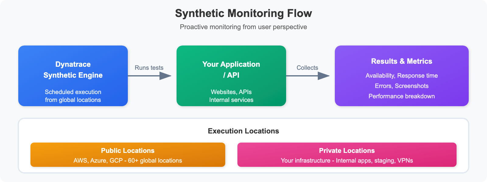

# SYNTH-01: Synthetic Monitoring Fundamentals

> **Series:** SYNTH — Synthetic Monitoring | **Notebook:** 1 of 6 | **Created:** December 2025 | **Last Updated:** 06/09/2026

## Understanding Proactive Availability and Performance Testing
This notebook introduces Dynatrace Synthetic Monitoring, which enables proactive testing of application availability, functionality, and performance from locations around the world.

---

## Table of Contents

1. [What is Synthetic Monitoring?](#what-is-synthetic-monitoring)
2. [Monitor Types](#monitor-types)
3. [Key Concepts](#key-concepts)
4. [Synthetic Data in Grail](#synthetic-data-in-grail)
5. [Your First Synthetic Query](#your-first-synthetic-query)

---


## Prerequisites

- ✅ Access to a Dynatrace environment with Synthetic Monitoring enabled
- ✅ DQL query permissions (viewer role minimum)
- ✅ Basic understanding of web applications and APIs

### Sprint 1.337 (April 2026) Updates

Two sprint-1.337 changes touch synthetic monitoring:

- **OneAgent primary fields/tags at the source** (Latest Dynatrace) — when synthetic monitors are paired with private-location ActiveGates running on monitored hosts (SYNTH-04), the host's primary tags ride on synthetic execution metadata. Useful for cost-attribution dashboards that want to bill synthetic execution by team or product line.
- **Configuration API → Settings v2 + Platform tokens** for new automation. Synthetic monitor management via Terraform/Monaco should target Settings v2 (`builtin:synthetic_test`) — note the v1.88.0 Terraform provider boundary still requires API tokens for synthetic monitors specifically (see AUTOM-04 § Authentication Boundary).

---

<a id="what-is-synthetic-monitoring"></a>
## 1. What is Synthetic Monitoring?
**Synthetic Monitoring** simulates user interactions with your applications from external locations, providing:

- **Proactive Detection**: Find issues before real users encounter them
- **24/7 Availability Testing**: Monitor even when no users are active
- **Global Performance Baseline**: Measure response times from multiple locations
- **SLA Validation**: Verify service level agreements are being met
- **Third-Party Dependency Monitoring**: Test external APIs and services


<!-- MARKDOWN_TABLE_ALTERNATIVE
| Stage | Component | Description |
|-------|-----------|-------------|
| 1 | Synthetic Engine | Executes monitors on schedule |
| 2 | Public Locations | AWS, Azure, GCP worldwide |
| 3 | Private Locations | Your infrastructure (ActiveGate) |
| 4 | Your Application | Target being monitored |
| 5 | Results in Grail | Metrics, availability, performance |
-->

### Synthetic vs Real User Monitoring (RUM)

| Aspect | Synthetic Monitoring | Real User Monitoring |
|--------|---------------------|---------------------|
| Data Source | Simulated transactions | Actual user sessions |
| Coverage | 24/7, consistent | Only when users active |
| Locations | Controlled, specific | Wherever users are |
| Use Case | Baseline, SLA, proactive | Actual experience |
| Cost | Per execution | Per session |

<a id="monitor-types"></a>
## 2. Monitor Types
Dynatrace offers three types of synthetic monitors:

### Browser Monitors (Single-URL and Browser Clickpath)

| Type | Description | Use Case |
|------|-------------|----------|
| **Single-URL** | Load a single page | Homepage availability |
| **Browser Clickpath** | Multi-step user journey | Login flows, checkout |

**Capabilities:**
- Full browser rendering (Chrome)
- JavaScript execution
- Visual validation (screenshots)
- Performance metrics (W3C timing)
- Resource waterfall analysis

### HTTP Monitors

| Type | Description | Use Case |
|------|-------------|----------|
| **Single Request** | One HTTP call | API health check |
| **Multi-step** | Chained requests | API workflow validation |

**Capabilities:**
- Any HTTP method (GET, POST, PUT, DELETE)
- Custom headers and authentication
- Response validation (status, content, JSON)
- SSL certificate monitoring
- Lightweight and fast execution

### Third-Party Monitors

Integration with external synthetic providers:
- Catchpoint
- Pingdom
- Site24x7

<a id="key-concepts"></a>
## 3. Key Concepts
### Execution Locations

| Location Type | Description | Best For |
|---------------|-------------|----------|
| **Public** | Dynatrace-hosted worldwide | External-facing apps |
| **Private** | Your infrastructure | Internal apps, security |

### Execution Frequency

How often the monitor runs:
- **Browser**: 5, 10, 15, 30, 60 minutes
- **HTTP**: 1, 5, 10, 15, 30, 60 minutes

### Outage Detection

Dynatrace detects outages based on:
- Consecutive failures from single location
- Failures from multiple locations simultaneously
- Local outage vs global outage classification

### Key Metrics

Synthetic measurements are surfaced two ways in Grail (see §4): as **metric keys** queried with `timeseries`, and as fields on execution **events** queried with `fetch dt.synthetic.events`. The table maps each concept to both.

| Concept | Metric key (`timeseries`) | Event field (`fetch dt.synthetic.events`) | Monitor Type |
|---------|---------------------------|-------------------------------------------|-------------|
| Availability (%) | `dt.synthetic.http.availability` / `dt.synthetic.browser.availability` | derived from `result.state == "SUCCESS"` | All |
| Total duration | `dt.synthetic.http.duration` / `dt.synthetic.browser.duration` | `result.statistics.duration` | All |
| DNS lookup | `dt.synthetic.http.dns` | `result.statistics.host_name_resolution_time` | HTTP |
| TCP connect | `dt.synthetic.http.tcp_connect_time` | `result.statistics.tcp_connect_time` | HTTP |
| TLS handshake | `dt.synthetic.http.tls_handshake_time` | `result.statistics.tls_handshake_time` | HTTP |
| Time to first byte | `dt.synthetic.http.time_to_first_byte` | `result.statistics.time_to_first_byte` | HTTP |
| Executions (count) | `dt.synthetic.http.executions` / `dt.synthetic.browser.executions` | `count()` over the events | All |

> **Note on units:** the `dt.synthetic.*.duration` *metric* is already expressed in milliseconds. The `result.statistics.*` *event* fields are `duration`-typed (nanoseconds) — divide by `1ms` to get milliseconds, e.g. `result.statistics.duration / 1ms`.

<a id="synthetic-data-in-grail"></a>
## 4. Synthetic Data in Grail

With **Synthetic on Grail**, execution results are stored as **synthetic events** in Grail and are also rolled up into **synthetic metrics**. There are two complementary query paths:

### Path 1 — Execution events (`fetch dt.synthetic.events`)

One record per execution (and per step). This is where per-failure diagnostics, status messages, SSL certificate data, and per-step timings live.

| Data object | Description |
|-------------|-------------|
| `dt.synthetic.events` | Monitor- and step-level execution results (HTTP, browser, multi-protocol) |
| `dt.synthetic.detailed_events` | Detailed per-step records (request-level breakdowns) |

Records are distinguished by `event.type`:

| `event.type` | Monitor | Granularity |
|--------------|---------|-------------|
| `http_monitor_execution` | HTTP | One per execution (carries `result.state`) |
| `http_step_execution` | HTTP | One per request/step |
| `browser_monitor_execution` | Browser | One per execution |
| `browser_step_execution` | Browser | One per clickpath step |
| `multiprotocol_monitor_execution` | Network (ICMP/DNS/TCP) | One per execution |

### Path 2 — Metrics (`timeseries`)

Pre-aggregated series for dashboards and trends — already scaled to milliseconds / percent.

| Metric key | Description |
|------------|-------------|
| `dt.synthetic.http.availability` / `dt.synthetic.browser.availability` | Availability rate (%) |
| `dt.synthetic.http.duration` / `dt.synthetic.browser.duration` | Total duration (ms) |
| `dt.synthetic.http.dns`, `.tcp_connect_time`, `.tls_handshake_time`, `.time_to_first_byte` | HTTP timing breakdown (ms) |
| `dt.synthetic.multi_protocol.executions` | Network monitor execution count |

### Key fields on `dt.synthetic.events`

| Field | Type | Description |
|-------|------|-------------|
| `dt.synthetic.monitor.id` | string | Monitor ID |
| `monitor.name` | string | Monitor display name |
| `step.name` | string | Step display name |
| `dt.entity.http_check` | string | HTTP monitor entity |
| `dt.entity.synthetic_location` | string | Location entity (resolve with `entityName()`) |
| `result.state` | string | `SUCCESS` / `FAIL` (on monitor-execution events) |
| `result.status.message` | string | e.g. `HEALTHY`, `UNKNOWN_HOST` |
| `result.status.code` | long | `0` = success; non-zero = failure |
| `result.statistics.duration` | duration | Total execution time |
| `result.statistics.response_status_code` | long | HTTP response code |

> **Entity tables** (`fetch dt.entity.synthetic_test`, `fetch dt.entity.http_check`, `fetch dt.entity.synthetic_location`) hold monitor and location *definitions* — use them to resolve names and enumerate configured monitors.

<a id="your-first-synthetic-query"></a>
## 5. Your First Synthetic Query
Let's explore synthetic monitoring data in your environment.

```dql
// Discover configured synthetic monitors in your environment
// Entity tables hold monitor definitions (names, IDs)
fetch dt.entity.synthetic_test
| fields id, entity.name
| sort entity.name asc
| limit 50

```

```dql
// Count executions by monitor type (from synthetic events)
// event.type distinguishes HTTP / browser / multi-protocol executions
fetch dt.synthetic.events, from: now() - 24h
| summarize count = count(), by: {event.type}
| sort count desc
```

```dql
// List available synthetic locations
// Note: cloudPlatform, city, countryCode fields are not available on synthetic_location entity
fetch dt.entity.synthetic_location
| fields id, entity.name
| sort entity.name asc
| limit 50


```

```dql
// Recent synthetic execution results (last 24 hours)
// Monitor-level events carry result.state; one row per execution
fetch dt.synthetic.events, from: now() - 24h
| filter endsWith(event.type, "_monitor_execution")
| fields timestamp,
         monitor = monitor.name,
         type = event.type,
         location = entityName(dt.entity.synthetic_location),
         state = result.state,
         status = result.status.message,
         response_ms = result.statistics.duration / 1ms
| sort timestamp desc
| limit 100
```

```dql
// Synthetic availability summary (last 24 hours)
fetch dt.synthetic.events, from: now() - 24h
| filter endsWith(event.type, "_monitor_execution")
| summarize {
    total_executions = count(),
    successful = countIf(result.state == "SUCCESS"),
    failed = countIf(result.state == "FAIL")
  }
| fieldsAdd availability_pct = round((successful * 100.0) / total_executions, decimals: 2)
```

```dql
// Response time by monitor (last 24 hours)
fetch dt.synthetic.events, from: now() - 24h
| filter endsWith(event.type, "_monitor_execution")
| filter isNotNull(result.statistics.duration)
| summarize {
    avg_response_ms = avg(result.statistics.duration / 1ms),
    max_response_ms = max(result.statistics.duration / 1ms),
    executions = count()
  }, by: {monitor.name}
| fieldsAdd avg_response_ms = round(avg_response_ms, decimals: 1)
| fieldsAdd max_response_ms = round(max_response_ms, decimals: 1)
| sort avg_response_ms desc
| limit 20
```

---

## Summary

In this notebook, you learned:

✅ **What Synthetic Monitoring is** and how it differs from RUM  
✅ **Monitor types** - Browser (single-URL, clickpath), HTTP, and network (multi-protocol) monitors  
✅ **Key concepts** - Locations, frequency, outage detection  
✅ **Grail data model** - `fetch dt.synthetic.events` for execution detail and `timeseries dt.synthetic.*` for metrics  
✅ **Basic DQL queries** - Discover monitors, locations, and results with `result.state` / `result.statistics.*`  

---

## Next Steps

Continue to **SYNTH-02: Browser Monitors** to learn how to create and optimize browser-based synthetic tests.

---

## References

- [Synthetic on Grail (DT docs)](https://docs.dynatrace.com/docs/observe/digital-experience/synthetic-on-grail)
- [Synthetic app (DT docs)](https://docs.dynatrace.com/docs/observe/digital-experience/synthetic-on-grail/synthetic-app)
- [Synthetic on Grail metrics (DT docs)](https://docs.dynatrace.com/docs/observe/digital-experience/synthetic-on-grail/synthetic-metrics)
- [Browser monitors (DT docs)](https://docs.dynatrace.com/docs/observe/digital-experience/synthetic-monitoring/browser-monitors)
- [HTTP monitors (DT docs)](https://docs.dynatrace.com/docs/observe/digital-experience/synthetic-monitoring/http-monitors)

---

<sub>*This notebook was AI-generated from community-submitted and publicly available sources. This notebook series is not officially supported by Dynatrace. Always verify information against official Dynatrace documentation.*</sub>
