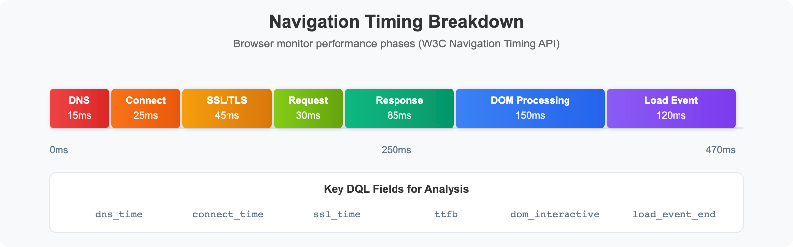

# SYNTH-02: Browser Monitors

> **Series:** SYNTH — Synthetic Monitoring | **Notebook:** 2 of 6 | **Created:** December 2025 | **Last Updated:** 04/25/2026

## Creating and Optimizing Browser-Based Synthetic Tests
This notebook covers browser monitors in Dynatrace, including single-URL monitors, browser clickpaths, and performance analysis using the latest Dynatrace platform capabilities.

---

## Table of Contents

1. [Browser Monitor Types](#browser-monitor-types)
2. [Single-URL Monitors](#single-url-monitors)
3. [Browser Clickpaths](#browser-clickpaths)
4. [Performance Metrics](#performance-metrics)
5. [Validation and Assertions](#validation-and-assertions)
6. [Analyzing Browser Results](#analyzing-browser-results)

---


## Prerequisites

- ✅ Access to a Dynatrace environment with Synthetic Monitoring
- ✅ Completed SYNTH-01 Fundamentals
- ✅ Web application URL to monitor

<a id="browser-monitor-types"></a>
## 1. Browser Monitor Types
### Single-URL Browser Monitor

Loads a single page and captures performance metrics:

| Feature | Description |
|---------|-------------|
| **Execution** | Full Chrome browser render |
| **Metrics** | W3C Navigation Timing, resource timing |
| **Screenshots** | Automatic capture on completion/failure |
| **Validation** | Content validation, element checks |

**Best For:**
- Homepage availability
- Landing page performance
- Single page applications (SPA) initial load

### Browser Clickpath Monitor

Multi-step user journey simulation:

| Feature | Description |
|---------|-------------|
| **Steps** | Multiple pages/actions in sequence |
| **Interactions** | Click, type, select, wait |
| **State** | Cookies maintained within execution (session NOT maintained between executions) |
| **Content Validation** | Validate text/elements exist on page |

> **Note:** Unlike RUM session properties, browser clickpaths do not support extracting data into variables for use across executions. Content validation allows you to verify expected text/elements exist, but you cannot capture dynamic values for reuse.

**Best For:**
- Login flows
- Checkout processes
- Form submissions
- Multi-page workflows

### Configuration Path

**Dynatrace menu → Synthetic → Create synthetic monitor → Create browser monitor**

<a id="single-url-monitors"></a>
## 2. Single-URL Monitors
### Creating a Single-URL Monitor

1. **URL Configuration**
   - Enter the full URL (https://...)
   - Set viewport size (desktop, tablet, mobile)
   - Configure user agent string

2. **Execution Settings**
   - Frequency: 5-60 minutes
   - Locations: Select public or private
   - Timeout: Maximum execution time

3. **Validation Rules**
   - HTTP status code validation
   - Content validation (text, regex)
   - Element presence checks

### Viewport Presets

| Preset | Dimensions | Use Case |
|--------|------------|----------|
| Desktop | 1920x1080 | Standard desktop |
| Laptop | 1366x768 | Common laptop |
| Tablet | 768x1024 | iPad portrait |
| Mobile | 375x667 | iPhone 8 |

```dql
// List all browser monitors
fetch dt.entity.synthetic_test
| filter isNotNull(browserMonitorSubtype)
| fields id, entity.name, isEnabled, browserMonitorSubtype
| sort entity.name asc
| limit 50


```

```dql
// Browser monitor execution results (last 24h)
fetch bizevents, from: now() - 24h
| filter event.provider == "dynatrace.synthetic"
| filter matchesValue(event.type, "*browser*")
| fields timestamp,
         monitor = dt.entity.synthetic_test,
         location = dt.entity.synthetic_location,
         availability = synthetic.availability,
         response_time_ms = toDouble(synthetic.response_time)
| sort timestamp desc
| limit 100
```

<a id="browser-clickpaths"></a>
## 3. Browser Clickpaths
### Creating Clickpath Monitors

#### Option 1: Record with Browser Extension

1. Install Dynatrace Synthetic Recorder (Chrome extension)
2. Start recording session
3. Perform user journey in browser
4. Stop recording and export to Dynatrace

#### Option 2: Manual Script Creation

Define steps programmatically using the script editor.

### Common Actions

| Action | Description | Example |
|--------|-------------|----------|
| `navigate` | Go to URL | Navigate to login page |
| `click` | Click element | Click login button |
| `type` | Enter text | Type username |
| `selectOption` | Select dropdown | Select country |
| `wait` | Wait for condition | Wait for element visible |
| `javascript` | Execute JS | Custom validation |

### Element Selectors

| Selector Type | Example | Best Practice |
|--------------|---------|---------------|
| CSS | `#login-btn` | Preferred - stable |
| XPath | `//button[@id='login']` | Complex structures |
| Link Text | `Login` | Simple links |
| Data Attribute | `[data-testid='login']` | Test automation |

```dql
// Clickpath step performance analysis
fetch bizevents, from: now() - 24h
| filter event.provider == "dynatrace.synthetic"
| filter isNotNull(synthetic.step_name)
| summarize {
    avg_duration_ms = avg(toDouble(synthetic.step_duration)),
    max_duration_ms = max(toDouble(synthetic.step_duration)),
    executions = count()
  }, by: {dt.entity.synthetic_test, synthetic.step_name}
| sort avg_duration_ms desc
| limit 30
```

<a id="performance-metrics"></a>
## 4. Performance Metrics
### W3C Navigation Timing

Browser monitors capture detailed timing metrics based on the W3C Navigation Timing API:


<!-- MARKDOWN_TABLE_ALTERNATIVE
| Phase | Metric | Description |
|-------|--------|-------------|
| DNS | dns | DNS lookup time |
| Connect | tcp | TCP connection time |
| SSL | ssl | SSL/TLS handshake time |
| Request | request | Time sending request |
| Response | ttfb | Time to first byte |
| DOM | dom | DOM processing time |
| Load | load | Full page load complete |
-->

### Key Performance Metrics

| Metric | Description | Good | Needs Work |
|--------|-------------|------|------------|
| **First Contentful Paint** | First content rendered | < 1.8s | > 3.0s |
| **Largest Contentful Paint** | Largest element rendered | < 2.5s | > 4.0s |
| **Time to Interactive** | Page fully interactive | < 3.8s | > 7.3s |
| **Total Blocking Time** | Main thread blocked | < 200ms | > 600ms |
| **Cumulative Layout Shift** | Visual stability | < 0.1 | > 0.25 |

> **Note:** Targets based on Google's Core Web Vitals. Actual acceptable thresholds vary by application type and user expectations. Set baselines based on your own monitoring data.

```dql
// Browser monitor performance breakdown
fetch bizevents, from: now() - 24h
| filter event.provider == "dynatrace.synthetic"
| filter matchesValue(event.type, "*browser*")
| summarize {
    avg_dns_ms = avg(toDouble(synthetic.dns_time)),
    avg_connect_ms = avg(toDouble(synthetic.connect_time)),
    avg_ssl_ms = avg(toDouble(synthetic.ssl_time)),
    avg_ttfb_ms = avg(toDouble(synthetic.time_to_first_byte)),
    avg_load_ms = avg(toDouble(synthetic.response_time)),
    executions = count()
  }, by: {dt.entity.synthetic_test}
| sort avg_load_ms desc
| limit 20
```

```dql
// Performance trend over time
fetch bizevents, from: now() - 7d
| filter event.provider == "dynatrace.synthetic"
| filter matchesValue(event.type, "*browser*")
| makeTimeseries {
    avg_response_time = avg(toDouble(synthetic.response_time)),
    p95_response_time = percentile(toDouble(synthetic.response_time), 95)
  }, interval: 1h
```

<a id="validation-and-assertions"></a>
## 5. Validation and Assertions
### Content Validation

| Validation Type | Description | Example |
|-----------------|-------------|----------|
| **Text Present** | Page contains text | "Welcome" |
| **Text Absent** | Page doesn't contain | "Error" |
| **Regex Match** | Pattern matching | `Order #\d{6}` |
| **Element Exists** | DOM element present | `#success-message` |
| **Element Content** | Element has text | Button says "Submit" |

### HTTP Validation

| Check | Default Behavior | Customization |
|-------|------------------|---------------|
| Status Code | Fails on 4xx/5xx (400-599) | Can configure to ignore specific codes |
| Response Body | Content validation | Text/regex matching |
| Screenshots | Captured on success/failure | Automatic |

> **Note:** Response size validation and header validation are not available as built-in options. Use content validation or JavaScript steps for advanced checks.

### Visual Validation

- Automatic screenshots on success/failure
- Visual comparison (pixel diff)
- Layout validation

```dql
// Failed browser monitor executions
fetch bizevents, from: now() - 24h
| filter event.provider == "dynatrace.synthetic"
| filter matchesValue(event.type, "*browser*")
| filter synthetic.availability == false
| fields timestamp,
         monitor = dt.entity.synthetic_test,
         location = dt.entity.synthetic_location,
         error = synthetic.error_message
| sort timestamp desc
| limit 50
```

<a id="analyzing-browser-results"></a>
## 6. Analyzing Browser Results

```dql
// Browser monitor availability by location
fetch bizevents, from: now() - 24h
| filter event.provider == "dynatrace.synthetic"
| filter matchesValue(event.type, "*browser*")
| summarize {
    total = count(),
    successful = countIf(synthetic.availability == true),
    failed = countIf(synthetic.availability == false)
  }, by: {dt.entity.synthetic_test, dt.entity.synthetic_location}
| fieldsAdd availability_pct = round((successful * 100.0) / total, decimals: 2)
| sort availability_pct asc
| limit 30
```

```dql
// Response time distribution by location
fetch bizevents, from: now() - 24h
| filter event.provider == "dynatrace.synthetic"
| filter matchesValue(event.type, "*browser*")
| filter synthetic.availability == true
| summarize {
    min_ms = min(toDouble(synthetic.response_time)),
    avg_ms = avg(toDouble(synthetic.response_time)),
    p50_ms = percentile(toDouble(synthetic.response_time), 50),
    p95_ms = percentile(toDouble(synthetic.response_time), 95),
    max_ms = max(toDouble(synthetic.response_time)),
    executions = count()
  }, by: {dt.entity.synthetic_location}
| sort avg_ms desc
| limit 20
```

```dql
// Slowest page loads (outliers)
fetch bizevents, from: now() - 24h
| filter event.provider == "dynatrace.synthetic"
| filter matchesValue(event.type, "*browser*")
| filter synthetic.availability == true
| filter toDouble(synthetic.response_time) > 5000  // > 5 seconds
| fields timestamp,
         monitor = dt.entity.synthetic_test,
         location = dt.entity.synthetic_location,
         response_time_ms = toDouble(synthetic.response_time)
| sort response_time_ms desc
| limit 20
```

---

## Summary

In this notebook, you learned:

✅ **Browser monitor types** - Single-URL vs clickpath monitors  
✅ **Creating monitors** - URL configuration, viewports, locations  
✅ **Clickpath automation** - Recording, actions, selectors  
✅ **Performance metrics** - W3C timing, Core Web Vitals  
✅ **Validation** - Content, HTTP, and visual checks  
✅ **Analysis queries** - Availability, response times, failures  

---

## Next Steps

Continue to **SYNTH-03: HTTP Monitors** to learn about lightweight API monitoring.

---

## References

- [Browser Monitors](https://docs.dynatrace.com/docs/platform-modules/digital-experience/synthetic-monitoring/browser-monitors)
- [Browser Clickpaths](https://docs.dynatrace.com/docs/platform-modules/digital-experience/synthetic-monitoring/browser-monitors/browser-clickpaths)
- [Synthetic Recorder](https://docs.dynatrace.com/docs/platform-modules/digital-experience/synthetic-monitoring/browser-monitors/record-browser-clickpath)
- [Performance Metrics](https://docs.dynatrace.com/docs/platform-modules/digital-experience/synthetic-monitoring/analysis-and-alerting/analyze-synthetic-monitors)

---

<sub>*This notebook was AI-generated from community-submitted and publicly available sources. This notebook series is not officially supported by Dynatrace. Always verify information against official Dynatrace documentation.*</sub>
