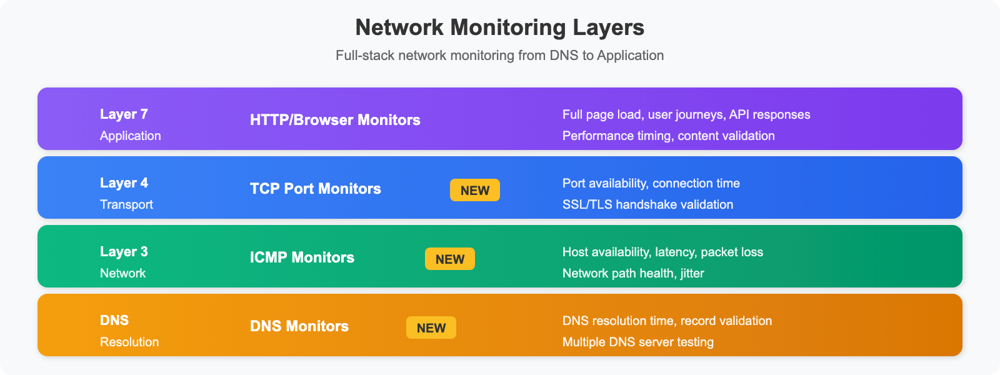

# SYNTH-05: Synthetic Network Monitoring

> **Series:** SYNTH — Synthetic Monitoring | **Notebook:** 5 of 6 | **Created:** December 2025 | **Last Updated:** 06/09/2026

## Network Availability, DNS, and ICMP Monitoring
This notebook covers Dynatrace Synthetic **Network Availability Monitors** (multi-protocol monitors), which test ICMP (ping), DNS, and TCP port reachability.

---


## Table of Contents

1. [ICMP (Ping) Monitors](#icmp-ping-monitors)
2. [DNS Monitors](#dns-monitors)
3. [TCP Port Monitors](#tcp-port-monitors)
4. [Multi-Protocol Monitors](#multi-protocol-monitors)
5. [Use Cases and Patterns](#use-cases-and-patterns)
6. [Analyzing Network Results](#analyzing-network-results)

---

## Prerequisites

- ✅ Access to a Dynatrace environment with Synthetic Monitoring
- ✅ Completed SYNTH-01 through SYNTH-04
- ✅ Private synthetic locations (for internal network monitoring)

> **⚠️ Data model — read first:** ICMP, DNS, and TCP checks are **not** separate monitor types in Grail. They are protocols within a single **network availability monitor** (a *multi-protocol monitor*). In the data model:
> - **Entity:** `dt.entity.multiprotocol_monitor`
> - **Events:** `fetch dt.synthetic.events | filter event.type == "multiprotocol_monitor_execution"`
> - **Metric:** `dt.synthetic.multi_protocol.executions` (execution count, by `dt.entity.multiprotocol_monitor`)
> - **Success/failure:** `result.state` (`SUCCESS`/`FAIL`) / `result.status.code` — same as other monitor types
>
> The **protocol-specific measurement fields** (per-protocol latency, packet loss, resolved IP, DNS resolution time) are not published as stable metric keys and their exact `result.statistics.*` names vary by protocol. Run the discovery query in the next cell against your own tenant to see the fields your multi-protocol monitors actually emit before building latency/packet-loss queries.

<a id="network-monitoring-overview"></a>
## 1. Network Monitoring Overview

### Synthetic Network Availability Monitors

A single **network availability monitor** can verify multiple protocols:

| Protocol | Purpose | Use Case |
|----------|---------|----------|
| **ICMP** | Host reachability | Server availability |
| **DNS** | Name resolution | DNS infrastructure health |
| **TCP** | Port connectivity | Service port availability |

All of these run inside one multi-protocol monitor and land in Grail as `multiprotocol_monitor_execution` events — see the data-model note above.

### Why Network Monitoring?

Network monitors complement application-level monitoring by testing at different layers of the stack:


<!-- MARKDOWN_TABLE_ALTERNATIVE
| Layer | Monitor Type | What It Tests |
|-------|--------------|---------------|
| Layer 7 (Application) | HTTP/Browser | Full application response |
| Layer 4 (Transport) | TCP Port | Service port open |
| Layer 3 (Network) | ICMP/Ping | Host reachable |
| DNS | DNS Monitor | Name resolution works |
-->

### Benefits

- **Root Cause Isolation**: Distinguish network vs application issues
- **Infrastructure Validation**: Verify network paths are operational
- **DNS Health**: Monitor critical DNS infrastructure
- **Low Overhead**: Minimal resource consumption
- **High Frequency**: Run every minute if needed

```python
// DISCOVERY — list your network availability (multi-protocol) monitors,
// then inspect the fields a recent execution emits so you know the exact
// protocol-specific result.statistics.* names available in YOUR tenant.
fetch dt.entity.multiprotocol_monitor
| fields id, entity.name
| sort entity.name asc
| limit 50

// To inspect execution fields, run separately:
// fetch dt.synthetic.events, from: now() - 24h
// | filter event.type == "multiprotocol_monitor_execution"
// | limit 5
```

<a id="icmp-ping-monitors"></a>
## 2. ICMP (Ping) Monitors
### What ICMP Monitors Test

| Metric | Description |
|--------|-------------|
| **Reachability** | Host responds to ping |
| **Latency** | Round-trip time (RTT) |
| **Packet Loss** | Percentage of lost packets |
| **Jitter** | Latency variation |

### Configuration Options

| Setting | Description | Typical Value |
|---------|-------------|---------------|
| **Target** | IP address or hostname | `192.168.1.1` or `server.example.com` |
| **Packet Count** | Pings per execution | 3-10 |
| **Timeout** | Wait time per packet | 5 seconds |
| **Frequency** | Execution interval | 1-60 minutes |

### Creating an ICMP Monitor

**Dynatrace menu → Synthetic → Create synthetic monitor → Create network availability monitor → ICMP**

### Metrics Captured


<!-- MARKDOWN_TABLE_ALTERNATIVE
| Metric | Value | Status |
|--------|-------|--------|
| Ping 1 | 45ms | ✓ |
| Ping 2 | 52ms | ✓ |
| Ping 3 | 48ms | ✓ |
| **Availability** | 100% | Healthy |
| **Avg Latency** | 48.3ms | |
| **Min Latency** | 45ms | |
| **Max Latency** | 52ms | |
| **Jitter** | 3.5ms | |
| **Packet Loss** | 0% | |
-->

```dql
// Network monitor execution results (last 24h) — multi-protocol events
// Covers ICMP/DNS/TCP checks; result.state reflects overall execution success
fetch dt.synthetic.events, from: now() - 24h
| filter event.type == "multiprotocol_monitor_execution"
| fields timestamp,
         monitor = monitor.name,
         location = entityName(dt.entity.synthetic_location),
         state = result.state,
         status = result.status.message,
         duration_ms = result.statistics.duration / 1ms
| sort timestamp desc
| limit 100
```

```dql
// Latency / duration statistics by network monitor (successful executions)
// duration is the execution time; for protocol-specific latency (e.g. ICMP RTT,
// packet loss) add the field name found via the discovery query above.
fetch dt.synthetic.events, from: now() - 24h
| filter event.type == "multiprotocol_monitor_execution"
| filter result.state == "SUCCESS"
| summarize {
    avg_ms = avg(result.statistics.duration / 1ms),
    min_ms = min(result.statistics.duration / 1ms),
    max_ms = max(result.statistics.duration / 1ms),
    p95_ms = percentile(result.statistics.duration / 1ms, 95),
    executions = count()
  }, by: {monitor.name}
| sort avg_ms desc
| limit 20
```

<a id="dns-monitors"></a>
## 3. DNS Monitors
### What DNS Monitors Test

| Check | Description |
|-------|-------------|
| **Resolution** | Hostname resolves to IP |
| **Response Time** | DNS query duration |
| **Expected IP** | Resolves to correct address |
| **Record Type** | A, AAAA, CNAME, MX, etc. |

### Configuration Options

| Setting | Description | Example |
|---------|-------------|----------|
| **Hostname** | Domain to resolve | `api.example.com` |
| **DNS Server** | Specific resolver (optional) | `8.8.8.8` |
| **Record Type** | DNS record type | A, AAAA, CNAME |
| **Expected IP** | Validation (optional) | `10.0.0.50` |
| **Timeout** | Query timeout | 10 seconds |

### DNS Record Types

| Type | Purpose | Example |
|------|---------|----------|
| `A` | IPv4 address | 192.168.1.1 |
| `AAAA` | IPv6 address | 2001:db8::1 |
| `CNAME` | Canonical name | www → app.example.com |
| `MX` | Mail exchanger | mail.example.com |
| `TXT` | Text records | SPF, DKIM |
| `NS` | Name servers | ns1.example.com |

```dql
// Network monitor execution volume by monitor (metric path)
// Scope to your DNS-checking monitors by filtering dt.entity.multiprotocol_monitor
timeseries executions = sum(dt.synthetic.multi_protocol.executions),
    from: now() - 24h, interval: 1h, by: {dt.entity.multiprotocol_monitor}
```

```dql
// Network monitor availability by monitor and location (events path)
fetch dt.synthetic.events, from: now() - 24h
| filter event.type == "multiprotocol_monitor_execution"
| summarize {
    total = count(),
    successful = countIf(result.state == "SUCCESS")
  }, by: {monitor.name, dt.entity.synthetic_location}
| fieldsAdd availability_pct = round((successful * 100.0) / total, decimals: 2)
| fieldsAdd location = entityName(dt.entity.synthetic_location)
| sort availability_pct asc
| limit 30
```

<a id="tcp-port-monitors"></a>
## 4. TCP Port Monitors
### What TCP Monitors Test

| Check | Description |
|-------|-------------|
| **Port Open** | TCP connection succeeds |
| **Connect Time** | Time to establish connection |
| **SSL Handshake** | TLS negotiation (if applicable) |

### Common Ports to Monitor

| Port | Service | Use Case |
|------|---------|----------|
| 22 | SSH | Server management access |
| 80 | HTTP | Web server (plain) |
| 443 | HTTPS | Web server (secure) |
| 3306 | MySQL | Database connectivity |
| 5432 | PostgreSQL | Database connectivity |
| 6379 | Redis | Cache connectivity |
| 9200 | Elasticsearch | Search connectivity |
| 27017 | MongoDB | Database connectivity |

### Configuration

| Setting | Description | Example |
|---------|-------------|----------|
| **Host** | Target server | `db.example.com` |
| **Port** | TCP port number | `5432` |
| **Timeout** | Connection timeout | 10 seconds |
| **TLS** | Enable TLS check | true/false |

```dql
// Network monitor availability summary by monitor (events path)
fetch dt.synthetic.events, from: now() - 24h
| filter event.type == "multiprotocol_monitor_execution"
| summarize {
    total = count(),
    successful = countIf(result.state == "SUCCESS"),
    failed = countIf(result.state == "FAIL")
  }, by: {monitor.name}
| fieldsAdd availability_pct = round((successful * 100.0) / total, decimals: 2)
| sort availability_pct asc
| limit 20
```

```dql
// Network monitor execution-volume trend (metric path, last 7 days)
timeseries executions = sum(dt.synthetic.multi_protocol.executions),
    from: now() - 7d, interval: 1h
```

<a id="multi-protocol-monitors"></a>
## 5. Multi-Protocol Monitors
### Combining Network Checks

Create comprehensive monitoring by combining multiple protocol checks:

```
Multi-Protocol Monitor Example:

Target: db.example.com

Step 1: DNS Resolution
    ├── Query: db.example.com
    └── Expected: 10.0.1.50

Step 2: ICMP Ping
    ├── Target: 10.0.1.50
    └── Check: Host reachable

Step 3: TCP Port Check
    ├── Target: 10.0.1.50:5432
    └── Check: PostgreSQL port open
```

### Monitoring Strategy by Layer

| Layer | Monitor Type | Purpose |
|-------|--------------|----------|
| DNS | DNS Monitor | Name resolution works |
| Network | ICMP Monitor | Host reachable |
| Transport | TCP Monitor | Service port open |
| Application | HTTP Monitor | Service responding |

<a id="use-cases-and-patterns"></a>
## 6. Use Cases and Patterns
### Infrastructure Monitoring

| Component | Monitor Type | Target |
|-----------|--------------|--------|
| Load Balancer | TCP/443 | VIP address |
| Database Cluster | TCP/5432 | Each node |
| Cache Layer | TCP/6379 | Redis instances |
| Message Queue | TCP/5672 | RabbitMQ nodes |

### DNS Infrastructure

| Scenario | Configuration |
|----------|---------------|
| Primary DNS | Query internal DNS server |
| Secondary DNS | Query backup DNS server |
| External DNS | Query public resolvers |
| Record validation | Verify expected IP |

### Multi-Region Connectivity


<!-- MARKDOWN_TABLE_ALTERNATIVE
| Source | Protocol | Destination | Purpose |
|--------|----------|-------------|---------|
| Region A | ICMP | Region B | Network reachability |
| Region A | DNS | Region B | DNS resolution |
| Region A | TCP/443 | Region B | HTTPS health check |
-->

```dql
// All synthetic monitor types summary (HTTP / browser / network)
fetch dt.synthetic.events, from: now() - 24h
| filter endsWith(event.type, "_monitor_execution")
| summarize {
    total_executions = count(),
    successful = countIf(result.state == "SUCCESS"),
    failed = countIf(result.state == "FAIL")
  }, by: {event.type}
| fieldsAdd availability_pct = round((successful * 100.0) / total_executions, decimals: 2)
| sort total_executions desc
```

<a id="analyzing-network-results"></a>
## 7. Analyzing Network Results

```dql
// Network monitor availability over time (last 7 days)
fetch dt.synthetic.events, from: now() - 7d
| filter event.type == "multiprotocol_monitor_execution"
| makeTimeseries {
    success_count = countIf(result.state == "SUCCESS"),
    total_count = count()
  }, interval: 1h, by: {monitor.name}
| fieldsAdd availability_pct = success_count[] * 100.0 / total_count[]
```

```dql
// Duration trend for network monitors (last 24h)
fetch dt.synthetic.events, from: now() - 24h
| filter event.type == "multiprotocol_monitor_execution"
| filter result.state == "SUCCESS"
| makeTimeseries {
    avg_ms = avg(result.statistics.duration / 1ms),
    p95_ms = percentile(result.statistics.duration / 1ms, 95)
  }, interval: 15m
```

```dql
// Failed network checks with details
fetch dt.synthetic.events, from: now() - 24h
| filter event.type == "multiprotocol_monitor_execution"
| filter result.state == "FAIL"
| fields timestamp,
         monitor = monitor.name,
         location = entityName(dt.entity.synthetic_location),
         status = result.status.message,
         detail = result.status.details
| sort timestamp desc
| limit 50
```

```dql
// Network health score by monitor
fetch dt.synthetic.events, from: now() - 24h
| filter event.type == "multiprotocol_monitor_execution"
| summarize {
    total = count(),
    successful = countIf(result.state == "SUCCESS"),
    avg_ms = avg(result.statistics.duration / 1ms)
  }, by: {monitor.name}
| fieldsAdd availability_pct = round((successful * 100.0) / total, decimals: 2)
| fieldsAdd avg_ms = round(avg_ms, decimals: 1)
| fieldsAdd health_status = if(availability_pct >= 99.9, "HEALTHY",
                            else: if(availability_pct >= 99.0, "DEGRADED",
                            else: "CRITICAL"))
| sort availability_pct asc
| limit 30
```

---

## Summary

In this notebook, you learned:

✅ **Network availability monitors** - ICMP, DNS, and TCP within one multi-protocol monitor  
✅ **The data model** - `event.type == "multiprotocol_monitor_execution"` on `dt.synthetic.events`; entity `dt.entity.multiprotocol_monitor`; metric `dt.synthetic.multi_protocol.executions`  
✅ **Discovery first** - confirm protocol-specific `result.statistics.*` fields in your own tenant  
✅ **Multi-protocol patterns** - Comprehensive infrastructure monitoring  
✅ **Analysis queries** - Availability, duration, executions, failures, health score  

---

## Next Steps

Continue to **SYNTH-06: Analytics & Alerting** to learn about dashboards, SLOs, and alerting strategies.

---

## References

- [Network availability monitoring (DT docs)](https://docs.dynatrace.com/docs/observe/digital-experience/synthetic-monitoring/network-availability-monitors/network-availability-monitoring)
- [NAM monitor metrics in Synthetic on Grail (DT docs)](https://docs.dynatrace.com/docs/observe/digital-experience/synthetic-on-grail/synthetic-metrics/nam-monitor-metrics-latest)
- [Synthetic on Grail (DT docs)](https://docs.dynatrace.com/docs/observe/digital-experience/synthetic-on-grail)
- [Synthetic app (DT docs)](https://docs.dynatrace.com/docs/observe/digital-experience/synthetic-on-grail/synthetic-app)

---

<sub>*This notebook was AI-generated from community-submitted and publicly available sources. This notebook series is not officially supported by Dynatrace. Always verify information against official Dynatrace documentation.*</sub>
